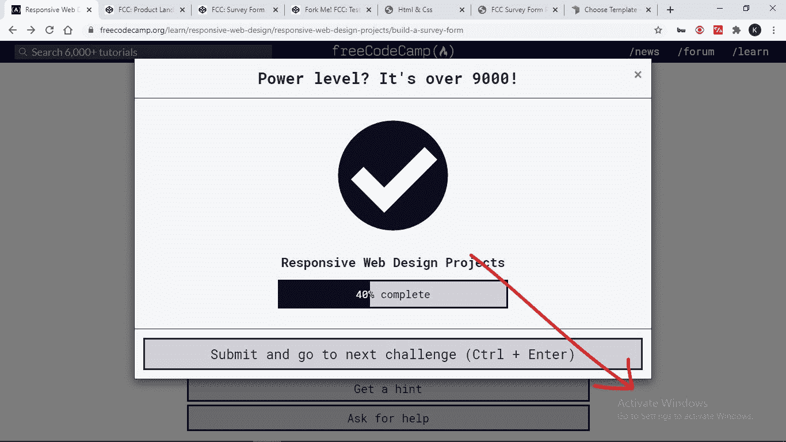
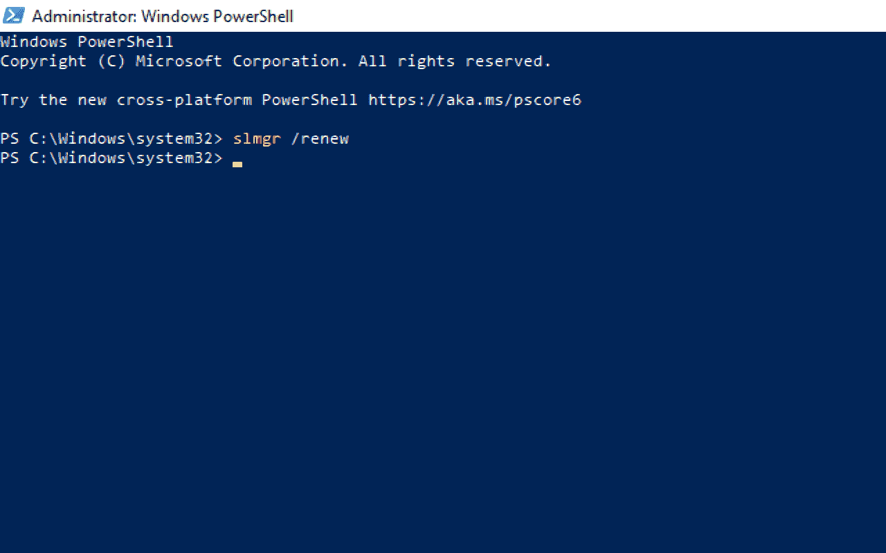
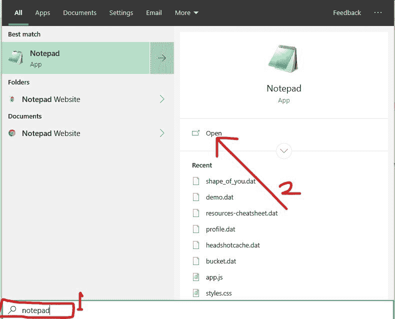
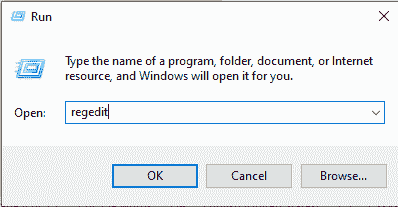

# 如何去除激活 Windows 水印[Windows 10 PC 激活消息删除]

> 原文：<https://www.freecodecamp.org/news/how-to-get-rid-of-the-activate-windows-watermark-windows-10-pc-activation-message-removal/>

如果你是一个 Windows 用户，你可能已经看到了“激活 Windows”的消息，它显示在所有其他东西上，包括你的光标。我猜他们给了它一个无穷大的 z 指数。

当您使用许可证无效或过期的 Windows 操作系统时，会显示此消息。这使您无法个性化您的桌面或获取 Windows Defender(现在为 Windows Security)的更新。您也将无法安装 Microsoft Office。

如果是这种情况，您可以删除水印，因为它可能会对视觉层次产生负面影响，并且如果您正在截图或记录您的桌面，可能会很尴尬。

这发生在我使用 freeCodeCamp 进行第一轮 100DaysOfCode 的时候。

在这篇文章中，我将向你展示 4 种方法可以消除你的 Windows 10 电脑上的激活 Windows 水印。

一些调整只是删除了消息，但没有删除潜在的问题，所以你应该注意最后一个，它会删除消息并激活你的窗口。

## 目录

*   [如何用 PowerShell 去掉激活 Windows 水印](#howtogetridoftheactivatewindowswatermarkwithpowershell)
*   [如何用记事本去掉激活 Windows 水印](#howtogetridoftheactivatewindowswatermarkwithnotepad)
*   [如何使用注册表去掉激活 Windows 水印](#howtogetridoftheactivatewindowswatermarkbyusingtheregistry)
*   [如何使用产品密钥消除激活 Windows 水印](#howtogetridoftheactivatewindowswatermarkwithaproductkey)
*   [结论](#conclusion)

## 如何用 PowerShell 去掉激活 Windows 水印

PowerShell 使您能够通过脚本直接与 Windows 操作系统进行交互。

您可以执行一个 PowerShell 脚本，最终消除激活 Windows 消息。

**要执行脚本，请遵循以下步骤。**

**第一步**:按键盘上的`WIN` (Windows logo 键)+ `S`。

**第二步**:搜索“powershell”。您必须以管理员身份执行脚本，因此单击右侧的“以管理员身份运行”。

**第三步**:输入“slmgr /renew”(不带引号)，点击`ENTER`。

第四步:重启电脑。

如果您为了激活 Windows 而对第三方应用进行了多次调整，此修复可能不适合您。如果对你不起作用，试试下一个。

## 如何用记事本去掉激活 Windows 水印

简单的记事本看起来对每个人来说，你可以用它来消除激活 Windows 水印。事实上，这种方式是最受欢迎的摆脱消息的方式之一。

您可以使用记事本通过下面的简单步骤删除该消息。

**第一步**:点击键盘上的`WIN`按钮，搜索记事本。单击右侧的打开或记事本搜索结果来启动应用程序。

第二步:确保你正在处理一个新的、未归档的文件。粘贴以下脚本:

`@echo off taskkill /F /IM explorer.exe explorer.exe exit`

**第三步**:点击菜单中的文件，选择“另存为”。

**第四步:**将文件命名为“Activation.bat”，格式选择“所有文件”。然后将文件保存到您想要的任何位置。

**第五步**:找到文件并点击右键，然后选择“运行为录取”。

该脚本将被快速执行并刷新您的计算机。

第六步:重启电脑。

## 如何使用注册表消除激活 Windows 水印

Windows 10 注册表允许您进行对您的计算机有重大影响的更深入的更改。

您可以通过在注册表中进行不太复杂的修改来消除激活 Windows 水印，如下所示。

**步骤 1** :右键点击开始，选择运行。

**第二步**:在运行对话框中输入“regedit”(不带引号)，点击`ENTER`。

**第三步**:展开 HKEY _ 当前 _ 用户，控制面板，然后点击桌面。

**第四步**:定位 PaintDesktopVersion，双击。

**第五步**:将数值从 1 改为 0，点击确定。

第六步:重启电脑。

## 如何用产品密钥消除激活 Windows 水印

最好的方法来摆脱激活窗口水印是做什么的消息说-激活窗口。

您可以使用必须从 Microsoft 购买的产品密钥来激活 Windows。

以下步骤将帮助您使用产品密钥激活 Windows:

**步骤 1** :点击开始，选择设置。

**步骤 2** :从菜单块中选择更新和安全。

**步骤 3** :切换到左侧的激活选项卡，点击更改产品密钥。

**步骤 4** :输入您的 24 位字母数字产品密钥，然后单击下一步。

只要产品密钥正确，Windows 就会被激活。

## 结论

我希望这些消除激活 Windows 水印的方法能帮到你。

如果你觉得这篇文章有帮助，一定要分享给你的朋友和家人。

感谢您的阅读。