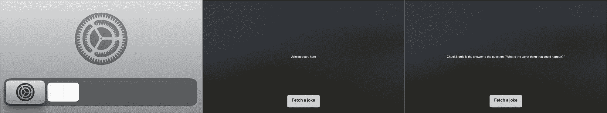
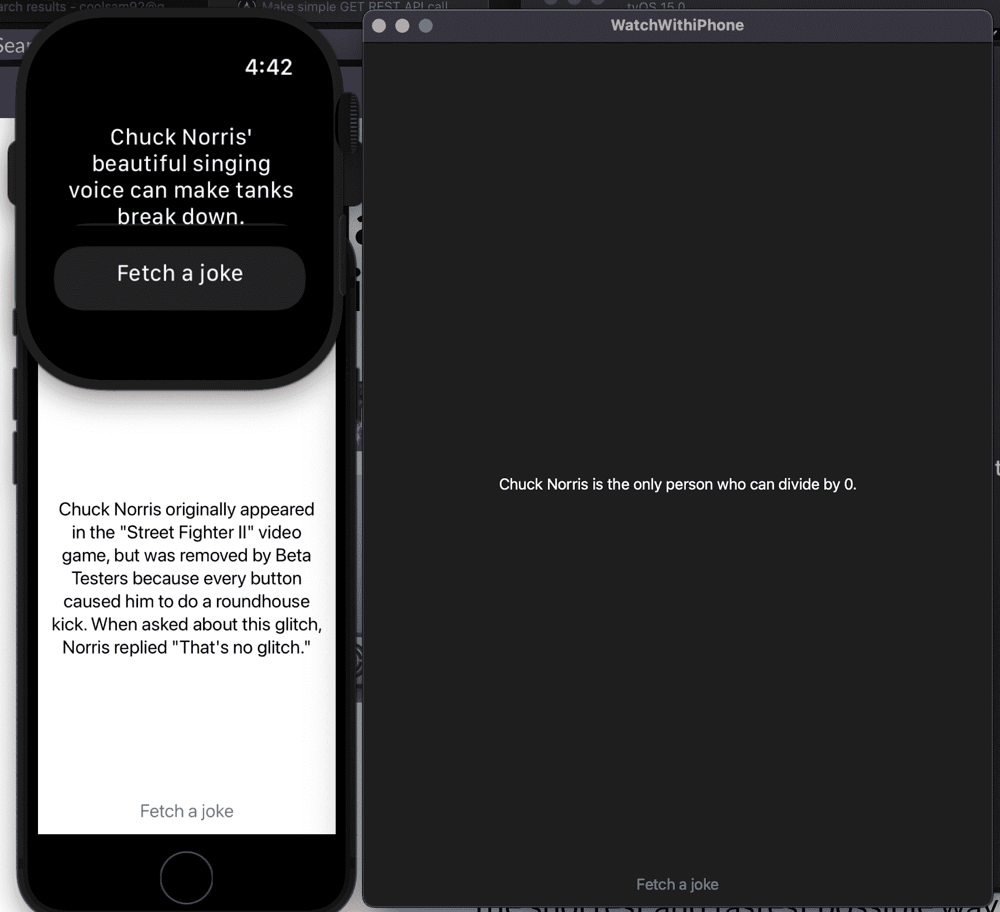

# 如何在 SwiftUI 中进行简单的异步 GET REST API 调用

> 原文：<https://www.freecodecamp.org/news/make-rest-api-call-in-swiftui-in-2-minutes/>

在这篇初学者教程中，您将学习使用 SwiftUI 进行 API 调用的基础知识，并以流行的 Internet Chuck Norris 数据库(ICNDB)为例。它将使用 Swift 和 SwiftUI 快速轻松地显示一个笑话。

您将看到跨平台框架 SwiftUI 如何让我们在 iOS、iPadOS、macOS、watchOS、App Clips 和 tvOS 上使用完全相同的代码，否则这是不可能的。

除此之外，您还将使用 Swift 5.5 中引入的 [async-await](https://developer.apple.com/documentation/swift/swift_standard_library/concurrency/updating_an_app_to_use_swift_concurrency) ，它适用于较新的操作系统，包括运行 iOS > v15.0 的 iPhones。这确实简化了我们在不冻结 UI 线程的情况下，通过点击按钮异步进行数据网络调用的工作。

我将首先分享您需要进行的代码更改。然后在接下来的部分，我将分享对代码的简要分析，这样初学者也可以理解发生了什么。



tvOS app running the code displays a button that retrieves the joke on click

## 如何在 Swift 和 SwiftUI 中进行 API 调用

首先，你需要一台 Mac 来安装 Xcode。安装完成后，打开 Xcode 并创建一个新项目。然后为 iOS、macOS、tvOS 或 watchOS 选择“应用程序”。

### 内容视图

只需更新您现有的 ContentView SwiftUI 文件来添加一个按钮，并使用 *State* 变量来刷新笑话从 ICNDB API 返回时显示的文本:

```
import Foundation
import SwiftUI
struct ContentView: View {
    @State private var joke: String = ""
    var body: some View {
        Text(joke)
        Button {
            Task {
                let (data, _) = try await URLSession.shared.data(from: URL(string:"https://api.chucknorris.io/jokes/random")!)
                let decodedResponse = try? JSONDecoder().decode(Joke.self, from: data)
                joke = decodedResponse?.value ?? ""
            }
        } label: {
            Text("Fetch Joke")
        }
    }
}
struct ContentView_Previews: PreviewProvider {
    static var previews: some View {
        ContentView()
    }
}
struct Joke: Codable {
    let value: String
}
```

### 拿个笑话来！

如果您按“构建/播放”,应用程序将在您在上面选择的任何平台上构建:



Screenshots of watchOS, macOS, and iOS apps running the same exact code

## 代码分析

如果你去随机笑话网址，你会注意到数据是 JSON 格式的。您可以复制它，并使用 JSON Linter 查看它的结构，以确定 Joke 对象需要什么属性。

基于此，您确定上面的代码。您使用可编码协议(又名接口)从 JSON 数据对象转换到实际的 Swift 类或结构，并为您想要存储的数据(在我们的例子中是值)创建属性。

JSONDecoder 帮助我们使用 Codable 对象解析 JSON 字符串。这与平台无关，因为启动应用程序时加载的页面具有相同的名称 *ContentView* 而与平台无关。

### 应用程序剪辑

[App Clips](https://developer.apple.com/app-clips/) 是苹果使用“App Clip Code”使用原生应用功能的最新方式，无需从 App Store 下载整个应用。

应用程序剪辑的工作方式与 iOS 应用程序类似，唯一的区别是您不需要创建新的应用程序剪辑项目。当现有的 iOS 应用程序在 Xcode 中打开时，您只需通过进入文件->新建->目标->iOS->应用程序剪辑，将应用程序剪辑作为目标添加到现有的 iOS 应用程序中。

如果你想知道 iPhone/iPad [的小部件](https://support.apple.com/en-us/HT207122)，那么它们是没有动画的。所以按钮点击只会打开相应的 app，无法通过外部 API 独立更新文本。

## 结论

在本文中，您学习了如何以最简单的方式从 SwiftUI 进行 RESTful GET API 调用！

如果你有任何问题，请随时联系我。我用另一篇文章解决了这个问题，我想进一步简化它。因此，要了解更多细节和使代码更复杂的方法，请查看那篇文章:

[async/await in SwiftUIConvert a SwiftUI app to use the new Swift concurrency and find out what’s going on beneath the shiny surface.Audrey Tamraywenderlich.com](https://www.raywenderlich.com/25013447-async-await-in-swiftui)