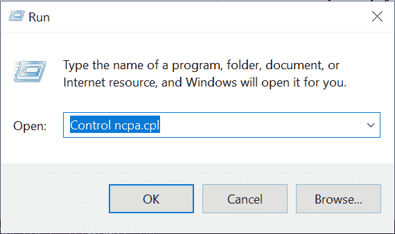
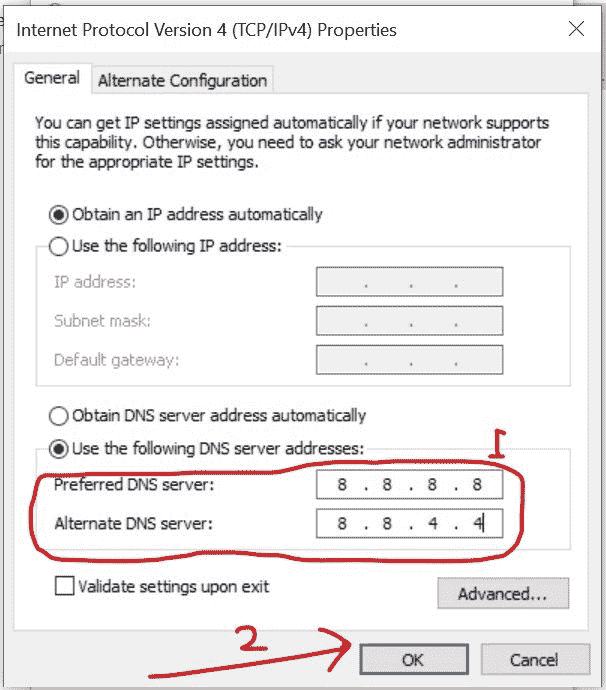
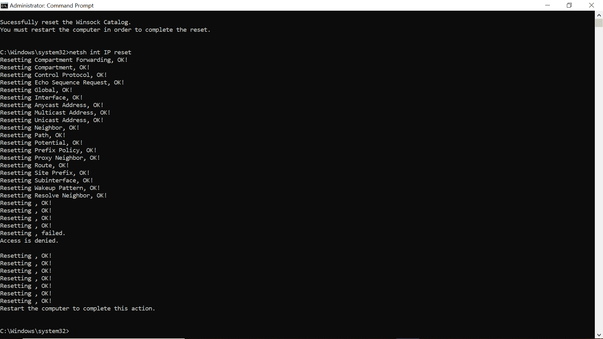

# RTC 连接不协调–如何修复服务器错误

> 原文：<https://www.freecodecamp.org/news/rtc-connecting-discord-how-to-fix-the-server-error/>

Discord 是一款即时通讯应用，可以通过语音、视频和文本进行交流。它有基于 web 的表单、桌面应用程序和移动应用程序。

但有时，当你试图建立一个语音通话连接，你会得到一个错误，说“RTC 连接不和谐”。这条消息会一直显示，没有任何有意义的进展。

那么这个错误意味着什么呢？

Discord 使用实时聊天协议(RTC)来运行并发通信。因此，如果您遇到“RTC 连接不和谐”的问题，这是一个网络问题。

在本文中，我将向您展示可以对网络配置进行的 5 项更改，以解决 RTC 连接不协调的问题。3 个修复涉及到你的电脑网络设置，而剩下的 2 个正好发生在你的 Discord 应用程序中。

## 如何通过更新网络驱动程序来修复 RTC 连接不协调

如果您的设备依赖过时的网络适配器驱动程序进行互联网连接，可能会对您的互联网体验产生负面影响，也可能导致此问题。

因此，更新您的网络驱动程序可以解决这个问题。

下面的步骤将带您了解如何更新网络适配器驱动程序。

**第一步**:点击开始(Windows logo)，搜索“设备管理器”。点击`ENTER`打开第一个搜索结果——总是设备管理器。你也可以点击“设备管理器”搜索结果。

**步骤 2** :展开“网络适配器”

**第三步**:找到正在使用的适配器，点击右键，选择“更新驱动”。

**第四步**:选择“自动搜索驱动程序”。

Windows 现在将在 internet 上搜索更新的驱动程序并为您安装。

## 如何通过更换域名服务器来修复 RTC 连接不和谐

您的 ISP(互联网服务提供商)会为您分配一个域名服务器(DNS)。域名服务器通过向浏览器键入地址(URL)而不是一些不可读的数字来访问网站。

将此 DNS 更改为广泛使用的 DNS，如 Google 或 Cloudflare 的 DNS，可以帮助您解决 RTC 连接不协调的问题。

要将您的 DNS 更改为 Google 的，请遵循以下步骤。

**步骤 1:** 右键单击开始，选择“运行”打开运行对话框。

**第二步**:输入`“Control ncpa.cpl”`(不带引号)，点击`ENTER`。这将打开您的网络连接设备。

**第三步**:右键点击当前网络，选择“属性”。

**第四步**:寻找互联网协议版本 4 (TCP/IPv4)，双击。

**步骤 5** :点击“使用以下 DNS 服务器地址”单选按钮，并输入以下值:

*   首选 DNS 服务器的 8.8.8.8
*   备用 DNS 服务器的 8.8.4.4

**第六步**:点击确定。

使用下一个修复程序完成安装。

## 如何通过在命令行中清除您的计算机网络缓存来修复 RTC 连接不协调

如果你使用的是基于网络的不和谐，这个补丁可以为你工作。

你可以在你的浏览器上清除你的网络缓存，但更有效的方法是在你的 Windows 10 电脑上的命令行中清除它。

以下步骤向您展示了如何做到这一点。

**第一步**:点击键盘上的`WIN` (Windows logo)键，搜索“cmd”。

你必须以管理员身份使用命令提示符，所以你应该选择右边的“以管理员身份运行”，而不是直接点击`ENTER`来打开它。

**步骤 2** :依次输入并执行以下命令:

*   `ipconfig /release`
*   `ipconfig /flushdns`
*   `ipconfig /renew`

第三步:重启电脑。

## 如何通过禁用 QoS 来修复 RTC 连接不协调

Discord 的 QoS(服务质量)通知您的路由器，正在传输的数据单元具有高优先级。这可能会使您的路由器行为不当，并导致 RTC 连接不和谐的问题。

因此，如果您启用了 QoS，禁用它可能会解决这个问题。

**按照以下步骤禁用不一致时的 QoS**。

**第一步**:启动 Discord，然后点击左下角的设置。

**第二步**:在左侧面板选择语音和视频。

**第 3 步**:向下滚动到 QoS 部分并禁用它。

**第四步**:重启 Discord app。

## 如何通过改变不协调的音频子系统来修复 RTC 连接不协调

不一致的是，传统音频子系统一直被认为是最好的，因为与标准和实验音频子系统相比，它的质量最高。

将您的音频子系统更改为 Legacy 可以让您建立高质量的音频-这最终可以解决 RTC 连接不和谐的问题。

**这些步骤将带您了解如何将您的音频子系统更改为传统的**。

**第一步**:打开 Discord，点击左下角的设置。

**第二步**:选择语音和视频。

**步骤 3** :向下滚动到音频子系统下拉菜单，选择“Legacy”。

**第四步**:重启不和。

## 结论

本文向您展示了如何修复在尝试使用 Discord 的音频通话功能时可能遇到的 RTC 连接不和谐问题。

除了本文中介绍的解决方案，您还可以尝试其他小的修复，例如:

*   重启设备–计算机和路由器
*   仔细检查互联网连接
*   使用 VPN

非常感谢你阅读这篇文章。如果你觉得有帮助，分享给你的朋友和亲人。