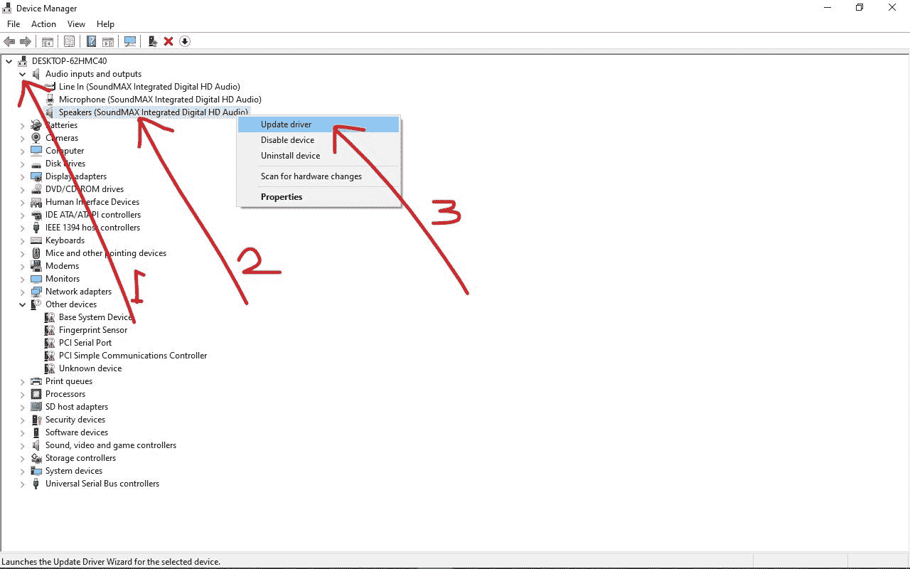
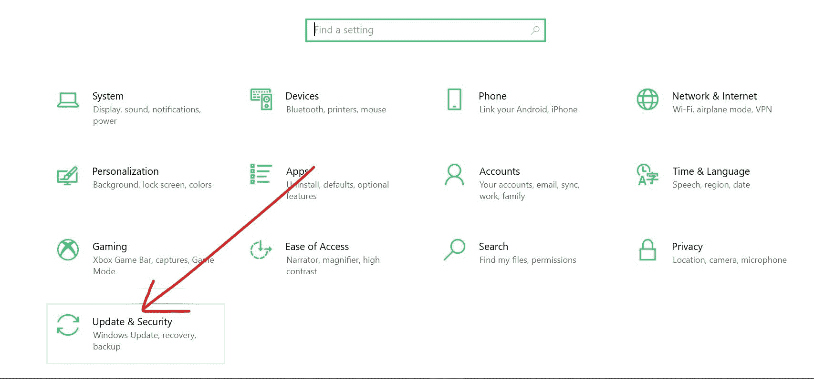
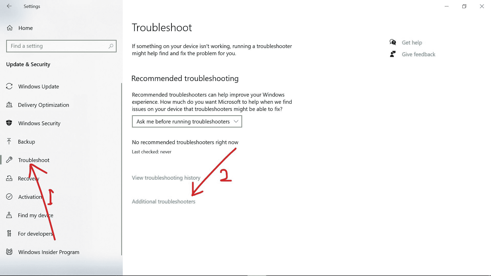
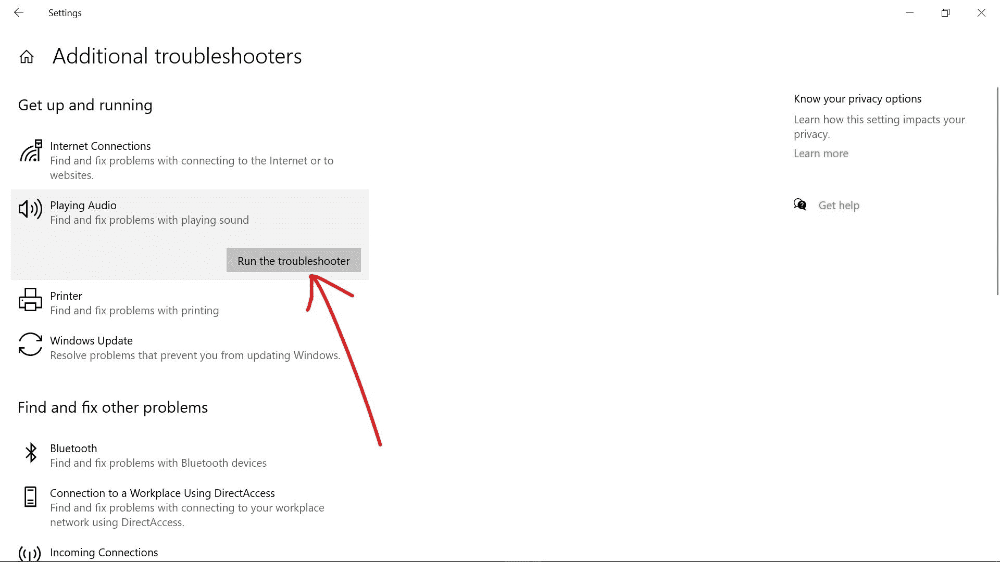
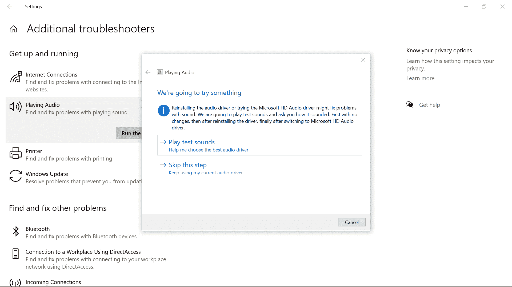
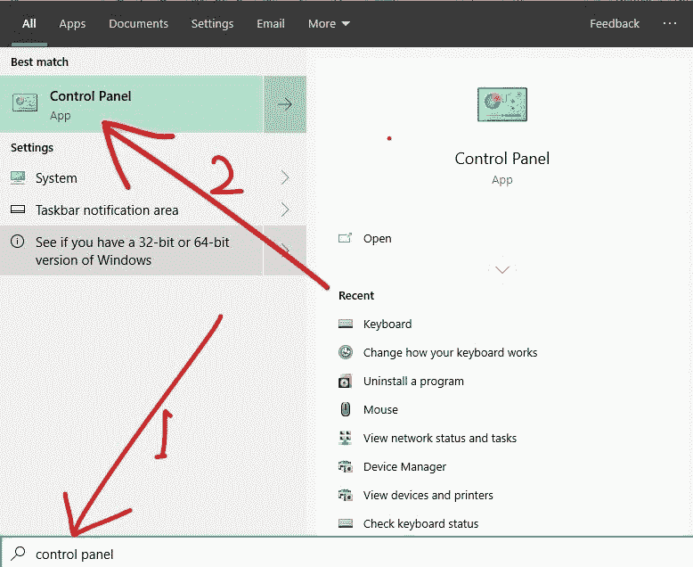

# 耳机插孔在 Windows 10 中不工作-如何在 PC 上修复耳机

> 原文：<https://www.freecodecamp.org/news/headphone-jack-not-working-in-windows-10-how-to-fix-headphones-on-pc/>

一般来说，一个耳机插孔和一副耳机可以改善电脑的声音。你会听得更清楚，而不会打扰你周围的人。

但有时，设置它们是困难的。或者他们可能完全停止工作。这可能是由于过时的驱动程序，甚至是物理损坏。

在本指南中，我将带您了解在 Windows 10 PC 上修复耳机插孔的三种方法。

## 如何通过更新音频驱动程序来修复耳机插孔不工作

当任何硬件设备停止工作时，我的第一个建议是更新它的驱动程序。

更新您的 Windows 10 操作系统可以为您安装必要的驱动程序，但这并不总是发生。

**您可以通过以下步骤更新 Windows 10 上的音频驱动程序**

**步骤 1** :右键点击开始，选择设备管理器

**第二步**:扩展音频输入和输出

**第三步**:右击你的音频设备，选择更新驱动

**步骤 4** :选择“自动搜索更新的驱动软件”

将为您的音频设备安装最新的驱动程序。

## 如何通过运行音频故障诊断程序来修复耳机插孔不工作

当任何硬件或外部设备不工作时，运行适当的故障诊断程序可以使其再次工作。

请注意，您的计算机必须连接到互联网才能获得故障排除建议。

**在 Windows 10 上，你可以按照下面的步骤运行音频故障诊断程序**

**第一步**:按`WIN` (Windows logo 键)+ I 启动设置

**第二步**:从菜单平铺
中选择更新和安全

**步骤 3** :切换到左侧的故障排除选项卡

**第四步**:点击【附加疑难解答链接】

**步骤 5** :选择“播放音频”，点击“运行故障诊断程序”

**第六步**:选择您想要为
T3 运行故障诊断的音频设备

您的电脑将扫描连接的音频设备并给出建议。当您应用这些建议时，您应该会看到如下所示的屏幕:

## 如何通过启用您的音频设备来修复耳机插孔不工作

有时，插入的耳机插孔可能会给您带来问题，因为它没有启用。

**您可以通过以下步骤启用您的音频设备并将其设置为默认设置:**

**第一步**:按键盘上的 `WIN`键，搜索“控制面板”。点击`ENTER`打开第一个搜索结果，总是控制面板。

第二步:确保你正在查看大图标

**第三步**:选择声音

**步骤 4** :如果你没有看到你的耳机插孔列表，右击播放标签的任意位置，勾选“显示禁用的设备”。

**步骤 5** :右键点击不工作的耳机插孔，选择启用

**第 6 步**:设为默认按钮现在可用。选择它以将耳机插孔设定为默认音频设备。

**第七步**:点击确定，重启电脑。

## 结论

这篇文章向你介绍了耳机插孔在 Windows 10 上不工作的三个简洁的修复方法。

一些人报告说，他们的音频问题在插上耳机重启电脑后得到了解决。但是本文中讨论的解决方案对您来说应该足够了。

感谢您阅读这篇文章。如果你觉得有帮助，请分享给你的朋友和家人。