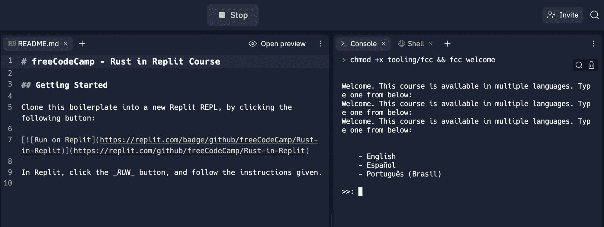

# 学习 Rust 编程课程 Replit 上的交互式 Rust 语言教程

> 原文：<https://www.freecodecamp.org/news/rust-in-replit/>

Rust 连续六年被 [Stack Overflow](https://insights.stackoverflow.com/survey/2021#technology-most-loved-dreaded-and-wanted) 评选为最受喜爱的编程语言。

因此，如果你准备学习这种流行的编程语言，本课程将向你介绍 Rust，这样你就可以开始在你的项目中使用它。

通过使用 [Replit](https://replit.com) 交互式编程环境，您将完全在浏览器中工作。freeCodeCamp 与 Replit 合作，使这一课程成为可能。

[https://www.youtube.com/embed/MsocPEZBd-M?feature=oembed](https://www.youtube.com/embed/MsocPEZBd-M?feature=oembed)

在 [freeCodeCamp YouTube 频道](https://youtu.be/MsocPEZBd-M)上也有这个课程的视频版本。

为了从本课程中获得最大收益，您应该至少具备一门其他编程语言的中级知识。如果你是编程新手，你应该尝试一下 [freeCodeCamp 的互动课程](https://www.freecodecamp.org/learn/)，然后再回来上这门课。

为了帮助您了解 Rust，我们将创建两个项目:

1.  命令行的计算器
2.  一个命令行工具，它获取两幅图像并组合它们的像素

## 目录

以下是我们将在本课程中涉及的部分和主题。你可以点击下面的目录跳到特定的部分，或者你可以从头到尾看一遍。

*   [生锈概述](#rust-overview)
*   [如何在 Replit 中使用 Rust](#how-to-use-rust-in-replit)
*   [铁锈基础知识](#basics-of-rust)
    *   [Rust 中的变量](#variables-in-rust)
    *   [Rust 中的函数](#functions-in-rust)
    *   [生锈的琴弦和薄片](#strings-and-slices-in-rust)
    *   [`char`打在铁锈上](#the-char-type-in-rust)
    *   [锈中的数字类型](#number-types-in-rust)
    *   [生锈的结构](#structs-in-rust)
    *   [铁锈中的枚举](#enums-in-rust)
    *   [宏在生锈](#macros-in-rust)
    *   [生锈的所有权](#ownership-in-rust)
*   [项目#1 -在 Rust 中构建 CLI 计算器](#project-1-build-a-cli-calculator-in-rust)
    *   [项目成果](#project-outcome)
    *   CLI 计算器项目方法
        *   [步骤 1 -创建一个新项目](#step-1-create-a-new-project)
        *   [第二步——理解语法](#step-2-understand-the-syntax)
        *   [步骤 3 -运行项目](#step-3-run-the-project)
        *   [步骤 4 -命令行参数](#step-4-command-line-arguments)
        *   [步骤 5 -将字符串解析成数字](#step-5-parse-strings-into-numbers)
        *   [步骤 6 -执行基本算术运算](#step-6-perform-basic-arithmetic-operations)
        *   [步骤 7 -格式化输出](#step-7-format-the-output)
        *   [第八步——把所有东西放在一起](#step-8-bring-it-all-together)
*   [项目#2 -在 Rust 中构建一个图像组合器](#project-2-build-an-image-combiner-in-rust)
    *   [项目成果](#project-outcome-1)
    *   [图像组合器项目方法](#image-combiner-project-methodology)
        *   [步骤 1 -创建一个新项目](#step-1-create-a-new-project-1)
        *   [步骤 2 -为参数添加新模块](#step-2-add-a-new-module-for-args)
        *   [步骤 3 -导入并使用`args`模块](#step-3-import-and-use-the-args-module)
        *   [步骤 4 -添加外部板条箱](#step-4-add-an-external-crate)
        *   [步骤 5 -读取图像文件](#step-5-read-an-image-file)
        *   [第 6 步-用`Result`](#step-6-handle-errors-with-result) 处理错误
        *   [步骤 7 -调整图像大小以匹配](#step-7-resize-the-images-to-match)
        *   [步骤 8 -创建浮动图像](#step-8-create-a-floating-image)
        *   [步骤 9 -创建组合图像数据](#step-9-create-the-combined-image-data)
        *   [步骤 10 -将组合数据附加到浮动图像上](#step-10-attach-the-combined-data-to-the-floating-image)
        *   [步骤 11 -将图像写入文件](#step-11-write-the-image-to-a-file)
        *   [第 12 步——把所有东西放在一起](#step-12-bring-it-all-together)
*   [结论](#conclusion)

## 生锈概述

Rust 是一种*系统级*编程语言。

> “[Rust]处理内存管理、数据表示和并发性的底层细节。”
> 
> ”...该语言旨在自然地引导您编写可靠的代码，在速度和内存使用方面都很高效。”([来源:Rust docs](https://doc.rust-lang.org/book/foreword.html) )

Rust 生态系统中的主要工具是:

*   rustc——编译器将你的 Rust 代码编译成二进制(机器可读代码)
*   Rust up–安装和更新 Rust 的命令行实用程序
*   cargo–Rust build 系统和包装管理器

## 如何在 Replit 中使用 Rust

在本课程中，您将使用[这个 GitHub 库](https://github.com/freeCodeCamp/Rust-In-Replit/)作为样板。

首先，单击以下链接从样板文件创建一个新的 REPL:

[](https://replit.com/github/freeCodeCamp/Rust-in-Replit)

然后在从 GitHub modal 导入中，打开语言下拉菜单并选择 Bash:


然后点击右下角的 Import from GitHub 按钮，将样板代码导入到 Replit 中。

最后，要开始课程，请单击屏幕顶部的 Run 按钮，并按照右侧控制台中的说明进行操作:



## 铁锈基础知识

### Rust 中的变量

您可以使用`let`、`const`或`static`关键字来声明变量:

```
let my_variable = 0;
const MY_CONSTANT: u8 = 0;
static MY_STATIC: u8 = 0; 
```

默认情况下，所有变量都是不可变的。您可以使用`mut`关键字使变量可变:

```
let mut my_mutable_variable = 0; 
```

Rust 约定依赖于以下套管约定:

| 目标 | 套 |
| --- | --- |
| 变量 | 蛇 _ 案例 |
| 功能 | 蛇 _ 案例 |
| 文件 | 蛇 _ 案例 |
| 常数 | 尖叫 _ 蛇 _ 案例 |
| 静力学 | 尖叫 _ 蛇 _ 案例 |
| 类型 | 帕斯卡尔·凯斯 |
| 特征 | 帕斯卡尔·凯斯 |
| 枚举 | 帕斯卡尔·凯斯 |

因为 Rust 是静态类型的，所以您需要显式类型化变量——除非变量是用`let`声明的，并且类型可以被推断出来。

### Rust 中的函数

使用关键字`fn`声明函数:

```
fn main() {
  // This is a code comment
} 
```

函数使用`return`关键字返回，需要显式指定函数的返回类型，除非返回类型是空元组`()`:

```
fn main() -> () { // Unnecessary return type
  my_func();
}

fn my_func() -> u8 {
  return 0;
} 
```

函数还会返回缺少分号的表达式:

```
fn my_func() -> u8 {
  0
} 
```

使用`:`语法键入函数参数:

```
fn main() {
  let _unused_variable = my_func(10);
}

fn my_func(x: u8) -> i32 {
  x as i32
} 
```

变量名前的下划线是表示变量未被使用的约定。如果类型转换有效，`as`关键字断言表达式的类型。

### 生锈的弦和片

初学者 *Rustacians* 的一个常见困惑点是`String`结构和`str`类型之间的区别。

```
let my_str: &str = "Hello, world!";

let my_string: String = String::from("Hello, world!"); 
```

在上面的例子中，`my_str`是对一个*字符串文字*的引用，`my_string`是一个`String`结构的实例。

两者的一个重要区别是`my_str`是堆栈存储的，而`my_string`是堆分配的。这意味着`my_str`的值不能改变，它的大小是固定的，而`my_string`在编译时可以有一个未知的大小。

*字符串文字*也被称为*字符串片段*。这是因为`&str`指的是字符串的一部分。通常，数组和字符串是这样相似的:

```
let my_string = String::from("The quick brown fox");
let my_str: &str = &my_string[4..9]; // "quick"

let my_arr: [usize; 5] = [1, 2, 3, 4, 5];
let my_arr_slice: &[usize] = &my_arr[0..3]; // [1, 2, 3] 
```

`[T; n]`符号用于创建类型为`T`的`n`元素的数组。

### `char`输入铁锈

一个`char`是一个 USV (unicode 标量值)，它用 Unicode 表示，值类似于`U+221E`—‘∞’的 Unicode。你可以把`char`的集合或数组看作一个字符串:

```
let my_str: &str = "Hello, world!";

let collection_of_chars: &str = my_str.chars().as_str(); 
```

### Rust 中的数字类型

Rust 中有许多类型的数字:

*   无符号整数:`u8`、`u16`、`u32`、`u64`、`u128`
*   有符号整数:`i8`、`i16`、`i32`、`i64`、`i128`
*   浮点数:`f32`，`f64`

无符号整数只表示正整数。

有符号整数表示正整数和负整数。

而浮点数只表示正负分数。

### 生锈的结构

*结构*是一种自定义数据类型，用于对相关数据进行分组。您已经在[字符串和切片](#strings-and-slices-in-rust)部分遇到了一个结构:

```
struct String {
  vec: Vec<u8>,
} 
```

`String`结构由一个`vec`字段组成，它是`u8`的一个`Vec`。`Vec`是一个动态调整大小的数组。

然后通过给字段赋值来声明结构的实例:

```
struct MyStruct {
  field_1: u8,
}

let my_struct = MyStruct { field_1: 0, }; 
```

以前，`String`结构和它的`from`函数一起使用，从`&str`创建一个`String`。这是可能的，因为`from`功能是为`String`实现的:

```
impl String {
  fn from(s: &str) -> Self {
    String {
      vec: Vec::from(s.as_bytes()),
    }
  }
} 
```

您使用`Self`关键字来代替结构的类型。

struts 还可以采用其他变体:

```
struct MyUnitStruct;
struct MyTupleStruct(u8, u8); 
```

### 锈中的枚举

与其他语言类似，枚举对于充当类型和值非常有用。

```
enum MyErrors {
  BrainTooTired,
  TimeOfDay(String)
  CoffeeCupEmpty,
}

fn work() -> Result<(), MyErrors> { // Result is also an enum
  if state == "missing semi-colon" {
    Err(MyErrors::BrainTooTired)
  } else if state == "06:00" {
    Err(MyErrors::TImeOfDay("It's too early to work".to_string()))
  } else if state == "22:00" {
    Err(MyErrors::TimeOfDay("It's too late to work".to_string()))
  } else if state == "empty" {
    Err(MyErrors::CoffeeCupEmpty)
  } else {
    Ok(())
  }
} 
```

### Rust 中的宏

宏类似于函数，但是你可以把它看作是一段编写其他代码的代码。现在，要记住函数和宏之间的主要区别是:

*   使用一个键(`!`)调用宏
*   宏可以接受可变数量的参数，而 Rust 中的函数不能

最常见的宏之一是`println!`宏，它打印到控制台:

```
let my_str = "Hello, world!";
println!("{}", my_str); 
```

使用`{}`语法将变量插入到字符串中。

另一个常见的宏是`panic!`。*恐慌*是 Rust 的‘出错’方式。明智的做法是将 Rust 中的恐慌视为一个处理不当的错误。宏接受一个字符串文字，并对该消息感到恐慌。

```
let am_i_an_error = true;

if (am_i_an_error) {
  panic!("There was an error");
} 
```

```
$ cargo run
   Compiling fcc-rust-in-replit v0.1.0 (/home/runner/Rust-in-Replit)
    Finished dev [unoptimized + debuginfo] target(s) in 1.66s
     Running `target/debug/calculator`
thread 'main' panicked at 'There was an error', src/main.rs
note: run with `RUST_BACKTRACE=1` environment variable to display a backtrace 
```

### 生锈的所有权

Rust 中的一个重要概念是*所有权*。有三个主要的所有权规则:

*   Rust 中的每个值都有一个变量，称为它的*所有者*。
*   一次只能有一个所有者。
*   当所有者超出范围时，该值将被丢弃。
    ( [来源:锈书](https://doc.rust-lang.org/book/ch04-01-what-is-ownership.html?highlight=heap#ownership-rules))

这就是 Rust 没有典型的垃圾收集器，同时也不需要程序员显式管理内存的方法。下面是所有权的一个例子:

```
fn main() { // first_string is not declared yet -> has no value
  let first_string = String::from("freeCodeCamp"); // first_string is now owner of the value "freeCodeCamp"
  let second_string = first_string; // second_string takes ownership of the value "freeCodeCamp"

  println!("Hello, {}!", first_string); // first_string is NOT valid, because the value was moved to second_string
} 
```

由于`println!`宏试图引用一个无效变量，这段代码无法编译。为了解决这个问题，可以将`second_string`赋值为对`first_string`的引用，而不是将`first_string`的值移入`second_string`:

```
fn main() {
  let first_string: String = String::from("freeCodeCamp");
  let second_string: &String = &first_string; // first_string is still the owner of the value "freeCodeCamp"

  println!("Hello, {}!", first_string);
} 
```

符号(`&`)表示该值是一个引用。也就是说，`second_string`不再拥有`"freeCodeCamp"`的所有权，而是指向内存中与`first_string`相同的点。

## 项目# 1–在 Rust 中构建一个 CLI 计算器

### 项目成果

在这个项目结束时，你将能够使用命令行对数字进行基本的算术运算。

预期输入和输出的示例如下:

```
$ calculator 1 + 1
$ 1 + 1 = 2

$ calculator 138 / 4
$ 138 / 4 = 34.5 
```

### CLI 计算器项目方法

#### 步骤 1–创建新项目

使用 Cargo 创建一个名为`calculator`的新项目:

```
$ cargo new calculator 
```

这将创建一个名为`calculator`的新目录，将其初始化为 Git 存储库，并为您的项目添加有用的样板文件。

样板文件包括:

*   `Cargo.toml`–Cargo 用来管理项目元数据的清单文件
*   `src/`–项目代码所在的目录
*   `src/main.rs`–Cargo 用作您的应用程序入口点的默认文件

#### 步骤 2-理解语法

`calculator/Cargo.toml`文件包含以下内容:

```
[package]
name = "calculator"
version = "0.1.0"
edition = "2018"

# See more keys and their definitions at https://doc.rust-lang.org/cargo/reference/manifest.html

[dependencies] 
```

`[package]`表示项目的元数据。

标题表示你的项目所依赖的箱子。*板条箱就像外部图书馆。*

`calculator/src/main.rs`文件包含以下内容:

```
fn main() {
  println!("Hello, world!");
} 
```

这个文件包含一个句柄为`main`的函数声明。默认情况下，每当运行可执行文件时，rustc 首先调用`main`函数。

`println!`是打印到控制台的内置宏。

#### 步骤 3–运行项目

您可以使用 Cargo 来运行项目代码:

```
# Within the calculator/ directory
$ cargo run
   Compiling fcc-rust-in-replit v0.1.0 (/home/runner/Rust-in-Replit-1)
    Finished dev [unoptimized + debuginfo] target(s) in 0.80s
     Running `target/debug/calculator`
Hello, world! 
```

或者，您可以使用 rustc 编译您的项目，然后您可以运行二进制文件:

```
# Within the calculator/ directory
$ rustc src/main.rs
$ ./main
Hello, world! 
```

#### 步骤 4–命令行参数

Rust 标准库带有一个`env`模块，该模块允许在调用程序时访问传递的命令行参数。

从`env`模块导出的必要内容是`args`函数和`Args`结构。`args`函数返回`Args`结构的一个实例，并通过以下方式导入文件范围:

```
use std::env::{args, Args}; 
```

为了了解`Args`结构的样子，将`args`变量打印到控制台:

```
fn main() {
  let args: Args = args();
  println!("{:?}", args);
} 
```

```
$ cargo run -- fCC
   Compiling calculator v0.1.0 (/home/runner/Rust-in-Replit/calculator)
    Finished dev [unoptimized + debuginfo] target(s) in 1.71s
     Running `target/debug/calculator`
Args { inner: ["target/debug/toto", "fCC"] } 
```

上面显示了`Args`结构包含一个名为`inner`的`field`，它由编译后的二进制文件的位置和传递给程序的命令行参数组成。

要访问参数值，可以对`args`变量使用`nth`方法。`nth`方法接受一个`index`参数，并返回包装在`Option`中的该索引处的值。所以，这个值需要解包。

```
fn main() {
  let mut args: Args = args();

  let first: String = args.nth(1).unwrap();
} 
```

`args`变量需要声明为 mutable，因为`nth`方法 mutable 遍历元素，并删除被访问的元素。

```
fn main() {
  let mut args: Args = args();

  // The first argument is the location of the compiled binary, so skip it
  let first: String = args.nth(1).unwrap();
  // After accessing the second argument, the iterator's next element becomes the first
  let operator: String = args.nth(0).unwrap();
  let second: String = args.nth(0).unwrap();

  println!("{} {} {}", first, operator, second);
} 
```

```
$ cargo run -- 1 + 1
   Compiling calculator v0.1.0 (/home/runner/Rust-in-Replit/calculator)
    Finished dev [unoptimized + debuginfo] target(s) in 1.71s
     Running `target/debug/calculator`
1 + 1 
```

#### 步骤 5–将字符串解析成数字

`first`和`second`变量是字符串，您需要将它们解析成数字。`String`结构实现了`parse`方法，该方法接受类型注释，并返回包含解析值的`Result`。

```
use std::env::{args, Args};

fn main() {
  let mut args: Args = args();

  let first: String = args.nth(1).unwrap();
  let operator: String = args.nth(0).unwrap();
  let second: String = args.nth(0).unwrap();

  let first_number = first.parse::<f32>().unwrap();
  let second_number = second.parse::<f32>().unwrap();

  println!("{} {} {}", first_number, operator, second_number);
} 
```

上面的`parse`方法使用 *turbofish* 语法来指定试图将字符串解析成的类型。

#### 步骤 6–执行基本的算术运算

Rust 使用标准运算符进行加、减、乘、除运算。

为了处理这些操作，您定义了一个名为`operate`的函数，它将接受三个参数:运算符作为`char`，两个数字作为`f32` s。该函数还应该返回一个表示操作结果的`f32`。

```
fn operate(operator: char, first_number: f32, second_number: f32) -> f32 {
  match operator {
    '+' => first_number + second_number,
    '-' => first_number - second_number,
    '/' => first_number / second_number,
    '*' | 'X' | 'x' => first_number * second_number,
    _ => panic!("Invalid operator used."),
  }
} 
```

`match`表达式的工作方式类似于其他语言中的`switch`语句。这个`match`表达式接受一个值和一个*臂列表*。每个*臂*都是一个图案和块。模式是要匹配的值，块是模式匹配时要执行的代码。`_`模式是一个通配符，类似于一个`else`子句。

乘法臂包括`OR`比较，以允许处理`X`和`x`的情况。

现在，要用`operator`调用`operate`，你需要先把它转换成一个`char`。您可以使用`String`结构上的`chars`方法来实现这一点，该方法返回字符串中字符的迭代器。然后，第一个字符被展开:

```
fn main() {
  let mut args: Args = args();

  let first: String = args.nth(1).unwrap();
  let operator: char = args.nth(0).unwrap().chars().next().unwrap();
  let second: String = args.nth(0).unwrap();

  let first_number = first.parse::<f32>().unwrap();
  let second_number = second.parse::<f32>().unwrap();
  let result = operate(operator, first_number, second_number);

  println!("{} {} {}", first_number, operator, second_number);
} 
```

`operate`的返回存储在`result`变量中。

#### 步骤 7–格式化输出

为了得到想要的输出，需要格式化`first_number`、`second_number`、`operator`和`result`变量。您可以使用`format!`宏从一个格式字符串和一个参数列表中创建一个`String`:

```
fn output(first_number: f32, operator: char, second_number: f32, result: f32) -> String {
  format!(
    "{} {} {} = {}",
    first_number, operator, second_number, result
  )
} 
```

#### 第八步——把所有的东西放在一起

```
use std::env::{args, Args};

fn main() {
  let mut args: Args = args();

  let first: String = args.nth(1).unwrap();
  let operator: char = args.nth(0).unwrap().chars().next().unwrap();
  let second: String = args.nth(0).unwrap();

  let first_number = first.parse::<f32>().unwrap();
  let second_number = second.parse::<f32>().unwrap();
  let result = operate(operator, first_number, second_number);

  println!("{}", output(first_number, operator, second_number, result));
}

fn output(first_number: f32, operator: char, second_number: f32, result: f32) -> String {
  format!(
    "{} {} {} = {}",
    first_number, operator, second_number, result
  )
}

fn operate(operator: char, first_number: f32, second_number: f32) -> f32 {
  match operator {
    '+' => first_number + second_number,
    '-' => first_number - second_number,
    '/' => first_number / second_number,
    '*' | 'X' | 'x' => first_number * second_number,
    _ => panic!("Invalid operator used."),
  }
} 
```

要将代码构建为可执行的二进制文件，请运行以下命令:

```
$ cargo build --release
   Compiling calculator v0.1.0 (/home/runner/Rust-in-Replit/calculator)
    Finished release [optimized] target(s) in 3.26s 
```

`--release`标志告诉 Cargo 在发布模式下构建二进制文件。这将减小二进制文件的大小，还将删除任何调试信息。

二进制文件构建在`target/release`目录中。要运行二进制文件并测试您的应用程序，请运行以下命令:

```
$ target/release/calculator 1 + 1
1 + 1 = 2 
```

## 项目 2——在 Rust 中构建一个图像组合器

### 项目成果

在本项目结束时，您将能够使用命令行组合两个图像。

以下是预期输入的示例:

```
$ combiner ./image1.png ./image2.png ./output.png 
```

关于输出的例子，只需看看本文中的第一幅图☝️

### 图像组合器项目方法

#### 步骤 1 -创建新项目

使用 Cargo 创建一个名为`combiner`的新项目:

```
$ cargo new combiner 
```

#### 步骤 2 -为参数添加新模块

为了防止`main.rs`文件变得太大，在`src`目录中创建一个名为`args.rs`的新文件。

在`args.rs`中，创建一个名为`get_nth_arg`的函数，它接受一个`usize`、`n`，并返回一个`String`。然后，从`std::env`模块中，调用`args`函数，并链接`nth`方法以获得第`n`个参数，展开该值:

```
fn get_nth_arg(n: usize) -> String {
  std::env::args().nth(n).unwrap()
} 
```

定义一个名为`Args`的公共结构，它由三个类型为`String`的公共字段组成:`image_1`、`image_2`和`output`:

```
pub struct Args {
  pub image_1: String,
  pub image_2: String,
  pub output: String,
} 
```

用关键字`pub`将结构及其字段声明为 public，这样就可以从文件`args.rs`外部访问它们。

最后，您可以使用`get_nth_arg`函数在`new`函数中创建一个新的`Args`结构:

```
impl Args {
  pub fn new() -> Self {
    Args {
      image_1: get_nth_arg(1),
      image_2: get_nth_arg(2),
      output: get_nth_arg(3),
    }
  }
} 
```

总之，`args.rs`文件看起来像这样:

```
pub struct Args {
  pub image_1: String,
  pub image_2: String,
  pub output: String,
}

impl Args {
  pub fn new() -> Self {
    Args {
      image_1: get_nth_arg(1),
      image_2: get_nth_arg(2),
      output: get_nth_arg(3),
    }
  }
}

fn get_nth_arg(n: usize) -> String {
  std::env::args().nth(n).unwrap()
} 
```

#### 步骤 3–导入并使用`args`模块

在`main.rs`内，需要将`args.rs`文件声明为一个模块。然后，要使用`Args`结构，您需要导入它:

```
mod args;
use args::Args;

fn main() {
  let args = Args::new();
  println!("{:?}", args);
} 
```

但是测试代码揭示了一个错误:

```
$ cargo run -- arg1 arg2 arg3
   Compiling combiner v0.1.0 (/home/runner/Rust-in-Replit/combiner)
error[E0277]: `args::Args` doesn't implement `Debug`
  --> src/main.rs:12:20
   |
12 |   println!("{:?}", args);
   |                    ^^^^ `args::Args` cannot be formatted using `{:?}`
   |
   = help: the trait `Debug` is not implemented for `args::Args`
   = note: add `#[derive(Debug)]` or manually implement `Debug`
   = note: required by `std::fmt::Debug::fmt`
   = note: this error originates in a macro (in Nightly builds, run with -Z macro-backtrace for more info)

error: aborting due to previous error

For more information about this error, try `rustc --explain E0277`.
error: could not compile `combiner`

To learn more, run the command again with --verbose. 
```

类似于如何为结构实现函数，特征也可以为结构实现。然而，`Debug`特征是特殊的，因为它可以使用属性来实现:

```
#[derive(Debug)]
pub struct Args {
  pub image_1: String,
  pub image_2: String,
  pub output: String,
} 
```

对于`Args`结构来说，`Debug`特征已经被*派生为*。这意味着`Debug`特征是为该结构自动实现的，无需您手动实现🚀。

现在，运行代码是可行的:

```
$ cargo run -- arg1 arg2 arg3
    Finished dev [unoptimized + debuginfo] target(s) in 0.01s
     Running `target/debug/combiner arg1 arg2 arg3`
Args { image_1: "arg1", image_2: "arg2", output: "arg3" } 
```

#### 步骤 4–添加外部板条箱

就像其他语言有库或包一样，Rust 也有箱子。为了编码和解码图像，您可以使用`image`机箱。

将版本为 `0.23.14`的`image`箱添加到`Cargo.toml`文件中；

```
[package]
name = "combiner"
version = "0.1.0"
edition = "2018"

# See more keys and their definitions at https://doc.rust-lang.org/cargo/reference/manifest.html

[dependencies]
image = "0.23.14" 
```

现在，当下一次调用`cargo run`时，货物将取出并安装`image`板条箱。

#### 步骤 5-读取图像文件

`image`机箱带有一个`io`模块，包括一个`Reader`结构。这个结构实现了一个`open`函数，它获取一个图像文件的路径，并返回一个包含*阅读器*的`Result`。您可以格式化并解码该阅读器，以产生图像格式(例如 PNG、JGP 等)和图像数据。

创建一个名为`find_image_from_path`的函数，从一个`path`参数打开图像文件:

```
fn find_image_from_path(path: String) -> (DynamicImage, ImageFormat) {
  let image_reader: Reader<BufReader<File>> = Reader::open(path).unwrap();
  let image_format: ImageFormat = image_reader.format().unwrap();
  let image: DynamicImage = image_reader.decode().unwrap();
  (image, image_format)
} 
```

`image`和`image_format`变量作为一个元组返回。

在文件顶部包含必要的导入:

```
use image::{ io::Reader, DynamicImage, ImageFormat };

fn main() {
  // ...
  let (image_1, image_1_format) = find_image_from_path(args.image_1);
  let (image_2, image_2_format) = find_image_from_path(args.image_2);
} 
```

在`main`中，返回的元组可以被析构为每个图像路径的两个新变量。

#### 第 6 步–用`Result`处理错误

能够处理出现的错误是很重要的。例如，您可能会遇到这样一种情况，两种不同格式的图像被作为参数组合在一起。

处理这种错误的语义方法是返回一个`Result`，它可以由一个`Ok`或一个`Err`组成。

```
fn main() -> Result<(), ImageDataErrors> {
  let args = Args::new();
  println!("{:?}", args);

  let (image_1, image_1_format) = find_image_from_path(args.image_1);
  let (image_2, image_2_format) = find_image_from_path(args.image_2);

  if image_1_format != image_2_format {
    return Err(ImageDataErrors::DifferentImageFormats);
  }
  Ok(())
} 
```

如果两种图像格式不相等，`main`函数返回一个包含带有单位变量`DifferentImageFormats`的枚举的`Err`。否则，它返回一个带有空元组的`Ok`。

枚举被定义为:

```
enum ImageDataErrors {
  DifferentImageFormats,
} 
```

#### 步骤 7-调整图像大小以匹配

为了使合并图像更容易，您可以调整最大图像的大小以匹配最小图像。

首先，您可以使用`dimensions`方法找到最小的图像，该方法以元组的形式返回图像的宽度和高度。可以比较这些元组，并返回最小的元组:

```
fn get_smallest_dimensions(dim_1: (u32, u32), dim_2: (u32, u32)) -> (u32, u32) {
  let pix_1 = dim_1.0 * dim_1.1;
  let pix_2 = dim_2.0 * dim_2.1;
  return if pix_1 < pix_2 { dim_1 } else { dim_2 };
} 
```

使用从零开始的索引中的点标记来访问元组值。

如果`image_2`是最小的图像，那么`image_1`需要调整大小以匹配最小的尺寸。否则，`image_2`需要调整大小。

```
fn standardise_size(image_1: DynamicImage, image_2: DynamicImage) -> (DynamicImage, DynamicImage) {
  let (width, height) = get_smallest_dimensions(image_1.dimensions(), image_2.dimensions());
  println!("width: {}, height: {}\n", width, height);

  if image_2.dimensions() == (width, height) {
    (image_1.resize_exact(width, height, Triangle), image_2)
  } else {
    (image_1, image_2.resize_exact(width, height, Triangle))
  }
} 
```

在`DynamicImage`结构上实现的`resize_exact`方法可变地借用图像，并使用`width`、`height`和`FilterType`参数来调整图像的大小。

使用`standardise_size`函数的返回，您可以重新声明`image_1`和`image_2`变量:

```
use image::{ io::Reader, DynamicImage, ImageFormat, imageops::FilterType::Triangle };

fn main() -> Result<(), ImageDataErrors> {
  // ...
  let (image_1, image_2) = standardise_size(image_1, image_2);
  Ok(())
} 
```

#### 步骤 8–创建浮动图像

若要处理输出，请创建一个临时结构来保存输出图像的元数据。

定义一个名为`FloatingImage`的结构来保存图像的`width`、`height`和`data`，以及输出文件的`name`:

```
struct FloatingImage {
  width: u32,
  height: u32,
  data: Vec<u8>,
  name: String,
} 
```

接下来，为`FloatingImage`实现一个`new`函数，该函数获取输出图像的`width`、`height`和`name`的值:

```
impl FloatingImage {
  fn new(width: u32, height: u32, name: String) -> Self {
    let buffer_capacity = 3_655_744;
    let buffer: Vec<u8> = Vec::with_capacity(buffer_capacity);
    FloatingImage {
      width,
      height,
      data: buffer,
      name,
    }
  }
} 
```

因为您还没有为图像创建数据，所以创建一个容量为 3，655，744 (956 x 956 x 4)的`Vec` of `u8` s 形式的缓冲区。`<number>_<number>`语法是 Rust 的易读编号，它将数字分成组或三位数。

使用`image_1`变量的`width`和`height`值来创建`FloatingImage`的实例，并使用存储在`args`中的第三个参数来设置`FloatingImage`的名称:

```
fn main() -> Result<(), ImageDataErrors> {
  // ...
  let mut output = FloatingImage::new(image_1.width(), image_1.height(), args.output);
  Ok(())
} 
```

将`output`变量声明为可变的，以便以后可以修改`data`字段。

#### 步骤 9–创建组合图像数据

为了处理这些图像，你需要把它们转换成 RGBA 像素的矢量。像素被存储为`u8` s，因为它们的值在 0 到 255 之间。

`DynamicImage` struct 实现了`to_rgba8`方法，该方法返回包含`Vec<u8>`的`ImageBuffer`,`ImageBuffer`实现了`into_vec`方法，该方法返回`Vec<u8>`:

```
fn combine_images(image_1: DynamicImage, image_2: DynamicImage) -> Vec<u8> {
  let vec_1 = image_1.to_rgba8().into_vec();
  let vec_2 = image_2.to_rgba8().into_vec();

  alternate_pixels(vec_1, vec_2)
} 
```

接下来，`vec_1`和`vec_2`变量被传递给`alternate_pixels`函数，该函数通过交替两个图像的 RGBA 像素组来返回组合图像数据:

```
fn alternate_pixels(vec_1: Vec<u8>, vec_2: Vec<u8>) -> Vec<u8> {
  // A Vec<u8> is created with the same length as vec_1
  let mut combined_data = vec![0u8; vec_1.len()];

  let mut i = 0;
  while i < vec_1.len() {
    if i % 8 == 0 {
      combined_data.splice(i..=i + 3, set_rgba(&vec_1, i, i + 3));
    } else {
      combined_data.splice(i..=i + 3, set_rgba(&vec_2, i, i + 3));
    }
    i += 4;
  }

  combined_data
} 
```

`set_rgba`函数引用一个`Vec<u8>`，并返回在给定索引开始和结束的`Vec<u8>`的 RGBA 像素集:

```
fn set_rgba(vec: &Vec<u8>, start: usize, end: usize) -> Vec<u8> {
  let mut rgba = Vec::new();
  for i in start..=end {
    let val = match vec.get(i) {
      Some(d) => *d,
      None => panic!("Index out of bounds"),
    };
    rgba.push(val);
  }
  rgba
} 
```

`..=`语法是 Rust 的范围语法，它允许范围包含最终值。变量前的`*`符号是 Rust 的解引用操作符，允许访问变量的值。

然后，将`combine_images`的返回赋值给`combined_data`变量:

```
fn main() -> Result<(), ImageDataErrors> {
  // ...
  let combined_data = combine_images(image_1, image_2);
  Ok(())
} 
```

#### 步骤 10–将组合数据附加到浮动图像上

为了将`combined_data`的数据设置到`output`图像中，在`FloatingImage`上定义了一个方法，将`output`的`data`字段设置为`combined_data`的值。

到目前为止，您只在结构上实现了函数。方法以类似的方式定义，但是它们将结构的实例作为第一个参数:

```
struct MyStruct {
  name: String,
}
impl MyStruct {
  fn change_name(&mut self, new_name: &str) {
    self.name = new_name.to_string();
  }
}

let mut my_struct = MyStruct { name: String::from("Shaun") };
// my_struct.name == "Shaun"
my_struct.change_name("Tom");
// my_struct.name == "Tom" 
```

由于您需要更改实例`FloatingImage`的值，方法`set_data`将对实例的可变引用作为其第一个参数。

```
impl FloatingImage {
  // ...
  fn set_data(&mut self, data: Vec<u8>) -> Result<(), ImageDataErrors> {
    // If the previously assigned buffer is too small to hold the new data
    if data.len() > self.data.capacity() {
      return Err(ImageDataErrors::BufferTooSmall);
    }
    self.data = data;
    Ok(())
  }
} 
```

需要扩展枚举以包括新的单元变量`BufferTooSmall`:

```
enum ImageDataErrors {
  // ...
  BufferTooSmall,
} 
```

*注意:*该方法仍然只用一个参数调用:

```
fn main() -> Result<(), ImageDataErrors> {
  // ...
  output.set_data(combined_data)?;
  Ok(())
} 
```

表达式末尾的`?`语法是处理函数调用结果的一种快捷方式。如果函数调用返回错误，*错误传播*操作符将从函数调用返回错误。

#### 步骤 11–将图像写入文件

最后，将新图像保存到文件中。`image`机箱有一个`save_buffer_with_format`功能，其形式如下:

```
fn save_buffer_with_format(
    path: AsRef<Path>,
    buf: &[u8],
    width: u32,
    height: u32,
    color: image::ColorType,
    format: image::ImageFormat
  ) -> image::ImageResult<()>; 
```

鉴于`AsRef`是为`String`实现的，您可以为`path`使用一个类型为`String`的参数。

```
fn main() -> Result<(), ImageDataErrors> {
  // ...
  image::save_buffer_with_format(
    output.name,
    &output.data,
    output.width,
    output.height,
    image::ColorType::Rgba8,
    image_1_format,
  )
  .unwrap();
  Ok(())
} 
```

#### 第 12 步——把所有的东西放在一起

下面是最终的代码:

```
mod args;

use args::Args;
use image::{
  imageops::FilterType::Triangle, io::Reader, DynamicImage, GenericImageView, ImageFormat,
};

fn main() -> Result<(), ImageDataErrors> {
  let args = Args::new();
  println!("{:?}", args);

  let (image_1, image_1_format) = find_image_from_path(args.image_1);
  let (image_2, image_2_format) = find_image_from_path(args.image_2);

  if image_1_format != image_2_format {
    return Err(ImageDataErrors::DifferentImageFormats);
  }

  let (image_1, image_2) = standardise_size(image_1, image_2);
  let mut output = FloatingImage::new(image_1.width(), image_1.height(), args.output);

  let combined_data = combine_images(image_1, image_2);

  output.set_data(combined_data)?;

  image::save_buffer_with_format(
    output.name,
    &output.data,
    output.width,
    output.height,
    image::ColorType::Rgba8,
    image_1_format,
  )
  .unwrap();
  Ok(())
}

enum ImageDataErrors {
  BufferTooSmall,
  DifferentImageFormats,
}

struct FloatingImage {
  width: u32,
  height: u32,
  data: Vec<u8>,
  name: String,
}

impl FloatingImage {
  fn new(width: u32, height: u32, name: String) -> Self {
    let buffer_capacity = 3_655_744;
    let buffer: Vec<u8> = Vec::with_capacity(buffer_capacity);
    FloatingImage {
      width,
      height,
      data: buffer,
      name,
    }
  }
  fn set_data(&mut self, data: Vec<u8>) -> Result<(), ImageDataErrors> {
    if data.len() > self.data.capacity() {
      return Err(ImageDataErrors::BufferTooSmall);
    }
    self.data = data;
    Ok(())
  }
}

fn find_image_from_path(path: String) -> (DynamicImage, ImageFormat) {
  let image_reader = Reader::open(path).unwrap();
  let image_format = image_reader.format().unwrap();
  let image = image_reader.decode().unwrap();
  (image, image_format)
}

fn standardise_size(image_1: DynamicImage, image_2: DynamicImage) -> (DynamicImage, DynamicImage) {
  let (width, height) = get_smallest_dimensions(image_1.dimensions(), image_2.dimensions());
  println!("width: {}, height: {}\n", width, height);
  if image_2.dimensions() == (width, height) {
    (image_1.resize_exact(width, height, Triangle), image_2)
  } else {
    (image_1, image_2.resize_exact(width, height, Triangle))
  }
}

fn get_smallest_dimensions(dim_1: (u32, u32), dim_2: (u32, u32)) -> (u32, u32) {
  let pix_1 = dim_1.0 * dim_1.1;
  let pix_2 = dim_2.0 * dim_2.1;
  return if pix_1 < pix_2 { dim_1 } else { dim_2 };
}

fn combine_images(image_1: DynamicImage, image_2: DynamicImage) -> Vec<u8> {
  let vec_1 = image_1.to_rgba8().into_vec();
  let vec_2 = image_2.to_rgba8().into_vec();

  alternate_pixels(vec_1, vec_2)
}

fn alternate_pixels(vec_1: Vec<u8>, vec_2: Vec<u8>) -> Vec<u8> {
  let mut combined_data = vec![0u8; vec_1.len()];

  let mut i = 0;
  while i < vec_1.len() {
    if i % 8 == 0 {
      combined_data.splice(i..=i + 3, set_rgba(&vec_1, i, i + 3));
    } else {
      combined_data.splice(i..=i + 3, set_rgba(&vec_2, i, i + 3));
    }
    i += 4;
  }

  combined_data
}

fn set_rgba(vec: &Vec<u8>, start: usize, end: usize) -> Vec<u8> {
  let mut rgba = Vec::new();
  for i in start..=end {
    let val = match vec.get(i) {
      Some(d) => *d,
      None => panic!("Index out of bounds"),
    };
    rgba.push(val);
  }
  rgba
} 
```

构建二进制文件:

```
$ cargo build --release 
```

使用 [`freeCodeCamp/Rust-In-Replit`](https://github.com/freeCodeCamp/Rust-In-Replit) 中的图像创建组合图像:

```
$ ./target/release/combiner images/pro.png images/fcc_glyph.png images/output.png 
```

下面是`images/output.png`中的结果:


## 结论

至此，你已经了解了铁锈的基本知识。

还有很多东西要学。因此，观看这个空间的更多内容😉。