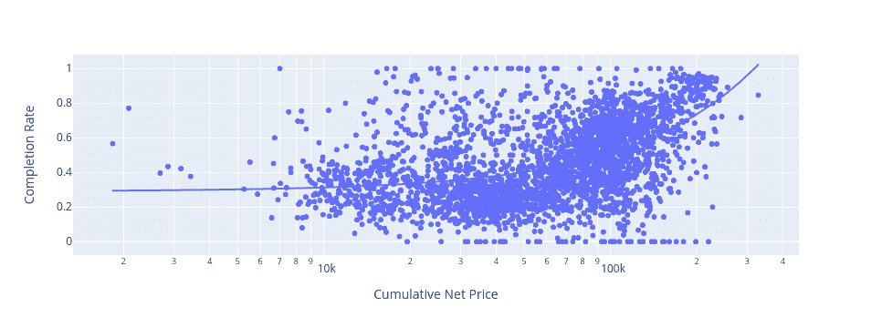
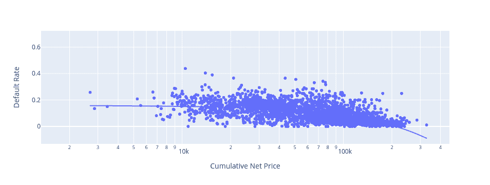
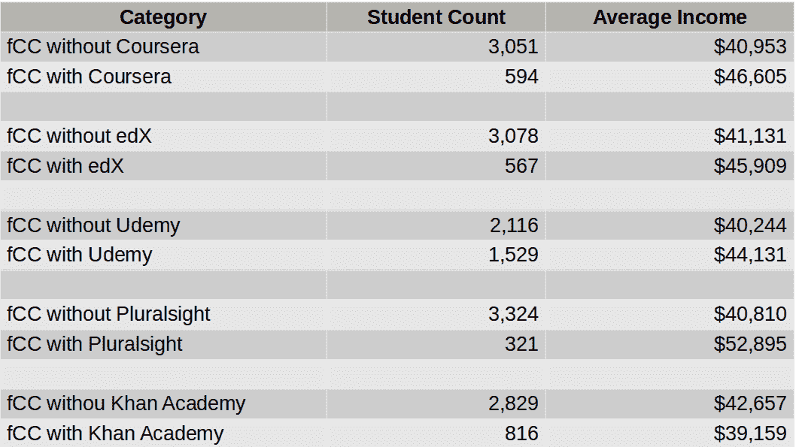

# 软件开发培训的类型——IT 职业培训工具功效的数据分析

> 原文：<https://www.freecodecamp.org/news/types-of-software-development-training/>

如何为你的职业生涯进行训练是你将做出的最重要的决定之一。但是很难缩小软件开发或 it 职业的选择范围。

医学很简单:挑个医学院，申请。

但是编程呢？

*   当你毕业时，你在四年计算机科学学位中学到的东西会过时吗？
*   一所大学的成绩比另一所好吗？
*   密集(昂贵)的训练营真的有用吗？
*   有没有可能利用免费的在线资源自学所有你需要的东西？

项目费用从免费到几十万美元不等。他们可以让你在几个月内进出，或者拖上十年或更长时间。

同时，你一生的收入也会有很大的不同。

仅仅跟随你所有朋友正在做的事情或者“每个人都说”已经足够好是不够的。你需要一些数据。

在这个分析中，我将向您介绍几个超级有用的数据工具，它们旨在帮助您评估单个机构和广泛的职业培训类别。

首先是美国政府的[中学后价值委员会的数据工具](https://equity.postsecondaryvalue.org/datatool)。你可以从[这个页面](https://equity.postsecondaryvalue.org/datatool/compare)下载完整的数据集。第二个数据集来自 freeCodeCamp 自己的 2018 年开发者调查——其数据在[公开](https://www.kaggle.com/freecodecamp/freecodecamp-2018-new-coder-survey-of-30k-devs)。

不幸的是，出于纯粹的实际原因，我在本文中使用的数据都是基于美国的。我知道你们很多人不在美国生活和工作。(我自己是加拿大人。)但这些都是我的限制。

然而，我们在这里讨论的大多数基本原则都是通用的。你自己的国家可能有自己的一套类似的资源，可以让你快速了解你所在地区的独特之处。

你可以在我的[30 天自学数据分析课程](https://stories.thedataproject.net/)中找到我在分析中使用的几乎所有工具。所以就这样了。

我应该指出，你在这里看到的所有见解都是基于数字，而且是不完整的数字。这些见解很有趣，我相信也很有帮助。但不能保证它们客观上是正确的。数据分析有其局限性。它的目标是忠实地表现真实世界，但数字可能会很棘手。

## 中学后价值委员会

从[中学后价值网站](https://equity.postsecondaryvalue.org/datatool/compare)上丰富的公开可用数据中，有三个指标让我们感兴趣:

1.  T-零(T0)阈值
2.  完成率
3.  贷款违约率

综上所述，我们可以很好地了解四年制大学和个别院校的总体预期结果。

设计用来描述学士学位的真实成本。也就是说，除了学生时期不全职工作的机会成本之外，学费和其他相关费用的估计净累积成本。

他们使用大学所在州高中毕业生的收入中值来计算。换句话说，如果你没有上过大学，你可以期望得到的收入。

### 如何计算 T-Zero (T0)阈值

举例来说，假设一个四年制学士项目的累计总成本是 20 万美元，但平均每个学生可以获得 8 万美元的佩尔助学金和奖学金。

因此，该学位的累计净总成本为 120，000 美元。为了得到 T0，这个数字被摊销(传播)十年，给我们一个 12，000 美元的年值。

然后我们加上该州高中毕业生的年收入中值——假设是 3 万美元。嗯，12，000 美元+30，000 美元得出我们每年的 T0 值为 42，000 美元。

为了让你的大学投资物有所值，你应该做好准备，在你开始学习后的十年内，你的收入至少超过 42，000 美元。如果一所大学的大部分学生收入明显低于 T0，那么你应该关注他们课程的质量和价值。

### 什么是学位完成率？

学位完成率是在“预期完成时间”的 150%内进入大学并获得学士学位的学生的百分比。

对于一个期望在四年内获得学士学位的学校来说，150%是六年。毕业率不考虑转出和毕业于不同机构的学生。

一个 80%的学生毕业的学校，很可能是在正确的轨道上。但是一个 20%完成率的学院肯定是做错了。

### 什么是贷款违约率？

贷款违约率是学校学生最终无法偿还学生贷款的百分比。学生违约率高的学校可能没有做足够的努力来确保他们的财务成功。

有趣的是，我发现项目成本和完成率之间，以及项目成本和贷款违约率之间有明显的相关性。但这不是我所期望的相关性。

看一下这个散点图，其中 x 轴代表拼贴画的平均累计净价，y 轴代表完成率。OLS 的趋势线显然是随着成本上升。这意味着成本越高，学生越有可能坚持到底。

There's a clear positive correlation between cumulative net price of colleges and the rates by which students complete their programs

同样，下一张图显示，随着项目成本上升，学生贷款违约率下降:

Student loan default rates drop as program costs rise

我想我们可以说，赌注越高，人们越认真地对待挑战。

### 如何知道一个学校好不好

在看任何一所学校之前，你真的需要了解整个行业的情况。所有被调查的 5877 所大学相对于 T0 的收入中值为 13909 美元。

这意味着，在就读于该系统中所有美国大学的学生中，有一半人的收入比他们最初的门槛高出 13909 美元。

与此同时，75%的学生收入低于 T0 时的 22，595 美元。

(请注意，这些数字并不十分准确——它们实际上是从单个*中值*得出的*平均值*——但它们足够接近了。)

所有 5，877 所大学的平均毕业率为 54.8%。这意味着超过 45%的美国大学入学学生无法毕业。这实际上是一个惊人的数字。这表明很大一部分学生没有获得学位就放弃了(或由于某种原因没有完成学业)。

但是那几万块钱和几年的工作呢？全没了。事实上，美国普通大学中有 11%的学生最终会拖欠教育贷款。

这是怎么回事？一方面，许多学校似乎接受对大学的挑战毫无准备的学生。毕竟，大学每招收一名新生就能赚很多钱。在其他情况下，学校可能只是没有教好他们的学生。

想象一下，如果你经营的企业对一种产品收取数千美元的费用，而这种产品有 45%的时间会发生故障，并导致 11%的客户陷入财务破产。你认为你会长期经营那家公司吗？

数据浏览器让你在系统中搜索任何大学。查看你所在地区的学校，特别注意收入中值(一个代表该校学生最初入学后十年实际收入的数字)和 T0 之间的关系。

如果 T0 更高，这意味着大多数学生实际上在教育上赔钱。

## 2018 年 freeCodeCamp 新编码器调查

尽管它仍然是行业状况的最佳代表，但这些三年前的数据已经不再年轻了。所以让我们开始吧。

首先，做一些一般性的观察。1643 名美国 freeCodeCamp 的受访者报告说，他们有未偿还的学生债务，平均持有 36171 美元。这与教育数据中心报告的最新数据(2021 年 11 月)39351 美元非常接近。我认为这表明 freeCodeCamp 的数据很大程度上代表了真实世界的情况。

### 大学毕业生收入多少？

那些学生的投资换来了什么？所有 3645 名美国受访者的平均年收入为 41874 美元。

接受过贸易、技术或职业培训的 137 人收入稍低:39897 美元。

拥有学士学位(任何领域)的 1399 人的收入为 45818 美元。

139 人获得了专业学位(MBA、MD、JD 等)。)平均 71151 美元。

如果你所参加的项目有很大的机会获得最终覆盖并超过你所有成本的回报，那么积累 36k 美元的学生债务是有意义的。如果你自己的研究没有让你在这一点上如此自信，那么你应该探索更便宜的替代品。

### 编码训练营值得吗？

说到编码，那些更便宜的选择之一是近年来出现的许多密集训练营之一。

训练营的课程长度往往是以月而不是年来衡量的，因此它们显然需要较少的投资。但是它们并不便宜。许多训练营的学费将高达 10，000 美元或更多，而且，因为它们通常是全日制的。当你注册的时候，你需要食物和住宿的钱。

训练营的经历能转化为更高的收入吗？3411 名美国受访者从未参加过训练营并报告了他们前一年的收入，他们的平均收入为 42018 美元。

令人惊讶的是，234 名*参加过*训练营的受访者报告收入仅为 39771 美元。此外，102 名从未上过大学的训练营学生平均负债 22，941 美元。

现在我不会声称这个数字是整个训练营世界的真实和绝对的代表。当然有很多人在训练营中表现出色。但是 234 不是一个微不足道的数字。这是需要记住的事情。

另一方面，freeCodeCamp 是为忙碌的成人学习者设计的。因此，学习资源要求学习者比传统学校做更多的跑腿工作。

课程由全面的视频和文本内容、交互式编码环境以及项目和挑战组成。露营者可以在世界各地的学习小组中找到支持。

freeCodeCamp 甚至提供广泛的工作面试准备。当然，这一切都可以在您舒适的家中免费获得。

然而，除了训练营，还有另一类技术学习资源:在线课件。

### 网络课程管用吗？来自数据分析的见解

一些在线学习资源(如 Khan Academy，当然还有 freeCodeCamp)是免费的。

其他的，像四年制大学附属的 Coursera 或 edX，在课程结束时提供证书是收费的，但是他们的内容通常是免费的。

而像 Pluralsight 这样的平台提供的内容，可以通过包月的方式获取。所有这些选择的费用都比大学或训练营便宜得多。

那么，在增加收入方面，这些资源与大学和训练营相比如何呢？下图展示了来自 freeCodeCamp 调查的一些数据。

fCC stands for freeCodeCamp.org. freeCodeCamp paired with Pluralsight yielded the highest average income, followed by Coursera and EdX.

如你所见，594 名学生将 Coursera 内容添加到他们的教育组合中，收入增加了约 6000 美元。567 名 edX 学生享受了近 5000 美元的额外收入。同样使用 Udemy 的 1529 名 freeCodeCamp 学生额外获得了近 4k 美元。令人费解的是，你因为使用可汗学院的资源而*损失了* $3.5k。

但是那些复数视线数字呢？现在，我应该坦白承认[我是 Pluralsight](http://pluralsight.pxf.io/c/1191769/424552/7490?subId1=solving&u=https%3A%2F%2Fapp.pluralsight.com%2Fprofile%2Fauthor%2Fdavid-clinton) 的内容作者，所以我在这场比赛中有一匹马。但不容忽视的事实是，Pluralsight 比只访问免费代码营的用户平均收入高出 12k 美元。这是一个高达 24%的增幅。

同样，所有这些数字都只是统计假设。它们不是对你实际经历的可靠预测，也不会对每个人都适用。

但是这些工具可以帮助你更有效地思考你应该如何规划你的教育。利用它们，在你现在可以承受的范围内，对你的计划和希望进行一些思考...十年后。但也要试着超越招聘宣传，去发现真正的潜在价值。

现在轮到你了。