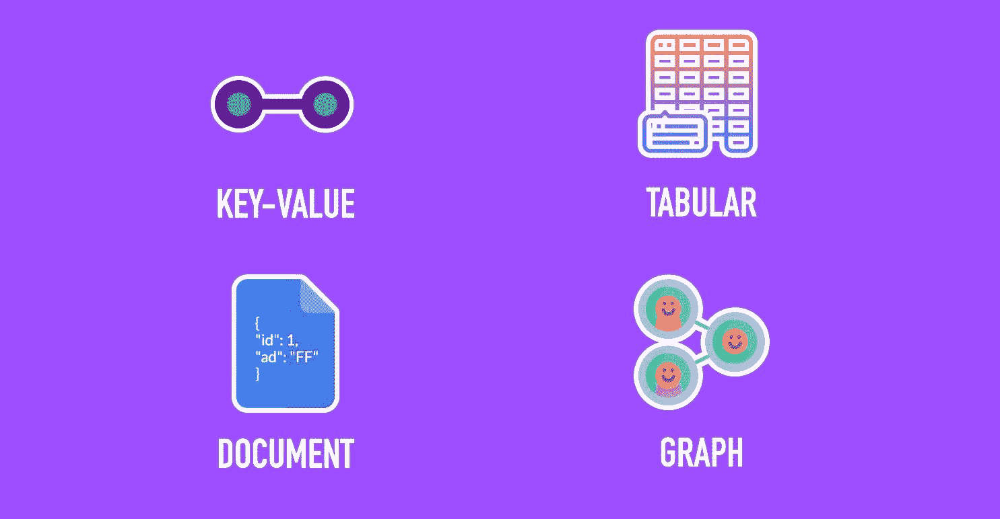
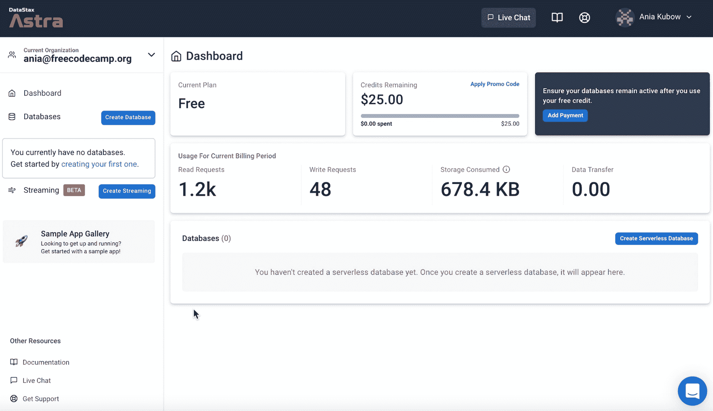

# 在这个 3 小时的课程中了解 NoSQL 数据库

> 原文：<https://www.freecodecamp.org/news/learn-nosql-in-3-hours/>

NoSQL 数据库有时看起来令人困惑和不知所措，部分原因是它们的灵活性。

这就是为什么我们制作了一个 3 小时的视频课程来帮助您准确理解什么是 NoSQL 数据库，以及可供您使用的不同类型。

到本课程结束时，您将已经基于 4 种主要类型构建了 4 个数据库，并且您将通过构建项目来实践您的学习。

但首先，让我们从基础开始。

## 什么是 NoSQL？

所以你需要知道的第一件事是 NoSQL 是数据库管理的一种方法。

它被认为是超级灵活的，因为它允许各种数据模型，如“键值”、“文档”、“宽列或表格”和“图形”格式。

这些是我们将在**视频课程**中密切关注的 4 个，以及多模型数据库的新兴趋势。

随着对 4 种 NoSQL 数据库类型的深入研究，我们将把每一次学习作为解释、示例和练习——因此也是 3e——以便完全掌握我们正在讨论的主题。

## 数据库是如何工作的？

数据库有多层。第一层是一个接口，或者换句话说，是一个可视化平台，在这里你可以访问数据并与之交互。在这里，您可以找到格式、语言和传输。

在本视频课程中，我们将使用的界面称为 Datastax Astra 数据库管理系统。在这里，我们将为示例和练习部分创建所有 4 种数据库类型。

DataStax Astra DB 是一个基于 Apache Cassandra 的自动伸缩数据库即服务，旨在简化云原生应用程序开发。

因为它是建立在 Apache Cassandra 之上的，所以在本课程中，你会看到我们几次使用 Cassandra 查询语言，或 CQL。CQL 提供了一个接近 SQL 的模型，在这个意义上，数据是放在包含列的表中的。这些语言是我们与数据库中的数据进行交互的方式。

数据库的下一层是执行层。这是我们解析来自接口的输入查询的地方。它还被用作分析器和调度器。

最后是存储层，在这里进行数据索引。

使用 Datastax Astra 将允许我们为本教程创建所有 4 种类型的数据库，所以我不必为每个部分注册单独的数据库管理系统。但是你不一定要用。有几十种可供选择，所以你可以随意挑选。

## 我们开始吧！

现在，您已经知道了我们将要学习的 NoSQL 数据库类型，以及数据库是如何工作的，让我们开始详细了解每一种类型。

以下是本课程将涉及的主题:

*   什么是 NoSQL？
*   为什么用 NoSQL？
*   SQL 与 NoSQL
*   如何建立我们的数据库
*   表格类型
*   文件类型
*   键值类型
*   图类型
*   多型号类型说明
*   项目–如何使用文档 API
*   项目–如何使用 GraphQL API
*   接下来去哪里

观看以下课程或 freeCodeCamp.org YouTube 频道上的[(3 小时观看)。](https://www.youtube.com/watch?v=xh4gy1lbL2k)

[https://www.youtube.com/embed/xh4gy1lbL2k?feature=oembed](https://www.youtube.com/embed/xh4gy1lbL2k?feature=oembed)

在 Youtube 上关注我，了解更多关于软件开发的视频:

[Code with Ania KubówHello everyone. This channel is run by Ania Kubow. In this channel, I will be teaching you JavaScript,React, HTML, CSS, React-native, Node.js and so much more! A little bit about me:My background is in the financial markets, where I worked as a derivates broker our of University. After starting m…YouTube](https://www.youtube.com/channel/UC5DNytAJ6_FISueUfzZCVsw)