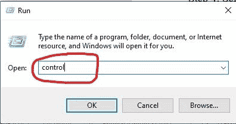

# 电脑无法识别耳机–Windows 10 电脑耳机教程

> 原文：<https://www.freecodecamp.org/news/computer-not-recognizing-headphones-windows-10-pc-headphone-tutorial/>

如果您插上耳机听自己喜欢的音乐、看电影或做其他事情时，电脑无法识别耳机，该怎么办？真令人沮丧。

在 Windows 10 电脑中，你的电脑无法识别你的耳机是一个相当常见的问题。

这可能是由损坏或过期的驱动程序、有故障的 USB 端口(如果您的耳机使用 USB)、连接错误(例如蓝牙)或耳机本身的问题引起的。

在本指南中，我将带您了解在 Windows 10 电脑中解决这一问题的 4 种不同方法。

## 如果您的电脑无法识别耳机，首先应该尝试什么

如果您的耳机使用蓝牙，您应该确定电脑上的蓝牙已启用。

有些电脑有蓝牙电源指示灯，所以请确定它们是开着的。

如果耳机通过 USB 连接到您的计算机，并且您收到此错误，请尝试另一个 USB 驱动器或另一台计算机。

如果耳机在一台计算机上工作正常，而在另一台计算机上不能工作，本文剩余部分讨论的解决方案适合您。

## 如何通过更新电脑的音频驱动程序来修复耳机错误

**步骤 1** :右键点击开始，选择“设备管理器”。

**第二步**:展开音频输入输出，右键点击你的音频设备，选择“更新驱动”。

**第三步**:选择“自动搜索更新的驱动软件”。

**步骤 4** :让你的电脑在互联网上搜索驱动更新。它会自动为您安装。

## 如何通过将耳机设置为默认音频输出设备来修复耳机错误

**第一步**:按键盘上的`WIN` (Windows logo 键)，搜索“控制面板”。然后点击`ENTER`打开第一个搜索结果——通常是控制面板。

**第二步**:将控制面板视图改为右上角的大图标，然后点击“声音”。

**第三步**:如果你的耳机没有出现在播放标签下的列表中，右击并选择“显示禁用的设备”。然后从音频设备列表中单击您的耳机名称。

**第四步**:确保你的耳机被用作默认设备。如果没有，选择点击它，并选择“设置默认”。

## 如何通过关闭音频增强来修复耳机错误

**步骤 1** :右键点击开始，选择“运行”。

**第二步**:输入“控制”，点击`ENTER`。

这是打开控制面板的另一种方式。

**第三步**:确保将视图模式改为右上角的大图标。

**第四步**:选择声音。

**第五步**:右击耳机，选择“属性”。

**第六步**:点击增强选项卡，取消勾选“禁用所有音效”。

**第七步**:点击“应用”，然后点击“确定”。

这种解决方案有效的原因是，在您的电脑上启用音频增强功能会干扰耳机的功能-从长远来看，这可能会阻止它们正常工作。

我希望本指南中解释的修复方法有助于让您的耳机再次工作。

非常感谢你的阅读，祝你玩得愉快。