# 如何在 Word 中创建可自定义的目录

> 原文：<https://www.freecodecamp.org/news/how-to-create-customizable-table-of-contents-in-microsoft-word/>

在 Microsoft Word 中制作一个好看又实用的目录是很棘手的。

您可能经常会遇到这样的文档，它的目录很乱，导航窗格带有指向缺失标题的链接，样式不统一，章节结构不良。

对于较小的文档来说，这不是一个大问题，但是对于一个文件中的数百页来说，这会破坏用户体验，并且使得从一个部分导航到另一个部分很痛苦。更不用说整个文件中不一致的风格会打乱标题的整体层次结构。

那么，如何用非常个性化的标题和编号来构建一个可定制的结构化目录呢？您将在本指南中了解如何操作。

## 如何在 Microsoft Word 中创建目录

### 如何在 Word 中定义编号样式

我们首先要做的是定义一个新的列表样式，为我们的标题创建一个个性化的编号。转到**主页**选项卡> **段落**部分，点击多级列表按钮。选择**定义新的列表样式**。

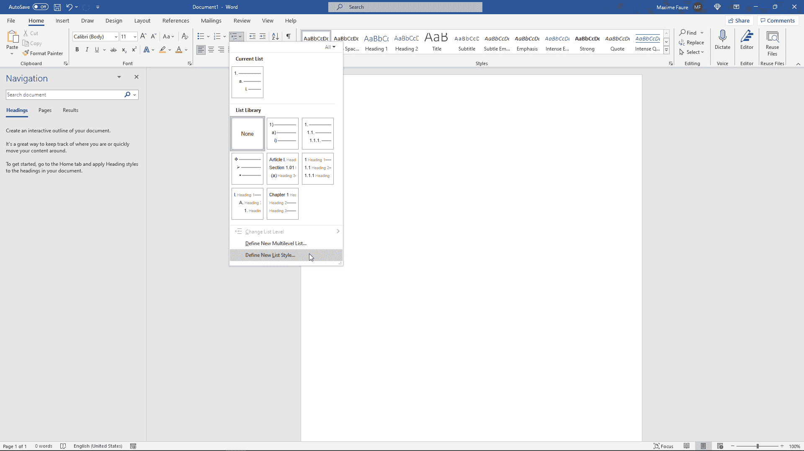

这将打开**定义新列表样式**窗口，我们将使用该窗口定制标题的编号样式和格式。

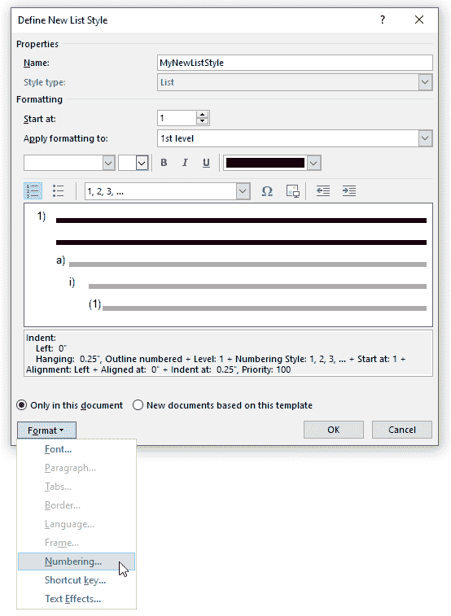

给你的样式起个你想要的名字(这里是 MyNewListStyle)，然后点击**格式**按钮> **编号...**这将打开**修改多级列表**窗口。

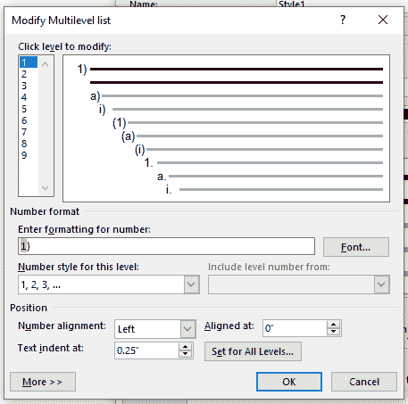

我们将只定义编号(“1”)，“a”)，在这一级不会应用任何格式或样式。稍后我们将定义和应用字体样式和格式。

让我们用下面的数字来表示我们的标题“1”,"1.1","1.1.1","2."、“2.1”、“2.2”等等。

首先在**输入数字**字段中用点字符替换括号字符。这会将 1 级编号格式更改为“1”。

然后，我们将通过点击**点击级别修改**列表中的数字 2 来定义第二级编号。

点击相关的下拉菜单，更改该关卡的**数字样式，然后选择 **1，2，3，...**您应该会得到这样的结果:**

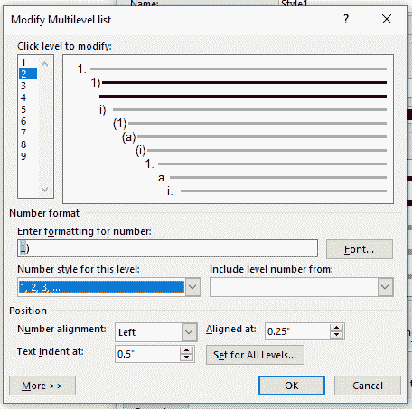

删除**输入数字**字段中的括号字符，并在“1”前加一个点。你应该有“. 1”。

现在，我如何在级别 2 获得编号样式 1.1？相当简单！将鼠标放在**输入数字**字段的“. 1”前。然后从下拉菜单中打开**包含级别号，选择**一级**。**

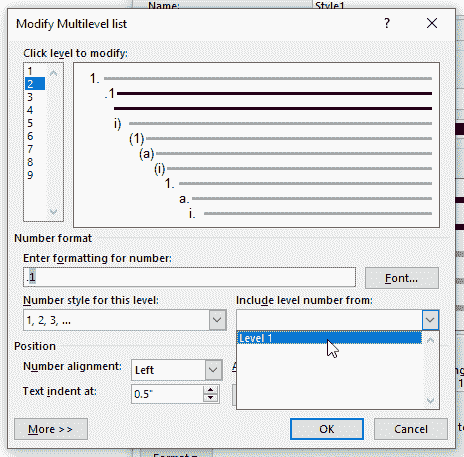

这将在级别 2 的编号之前插入级别 1 的编号。您应该会得到这样的结果:

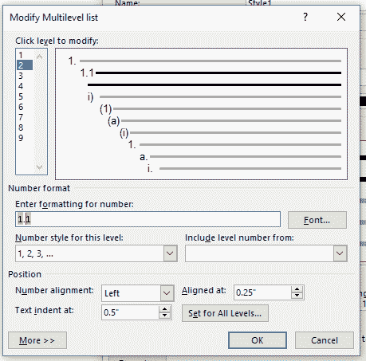

在此字段中手动插入编号会产生静态编号，这些编号不会链接到文档中的任何动态编号。这些数字不会在**输入数字**字段中以灰色突出显示。

让我们对级别 3 重复相同的步骤。在**点击级别修改**列表中选择级别 **3** 。在下拉菜单中选择本级的正确**号码样式。删除不需要的字符，并在“1”前添加一个点。**

然后将鼠标放在**输入数字**字段中的“. 1”之前，从下拉菜单中打开**包括级别数字，并选择**级别 2** 。在**输入数字**字段的格式的第 2 级“1”前添加一个点。然后从**中打开**包括级别号，选择**级别 1** 。您应该会得到这样的结果:**

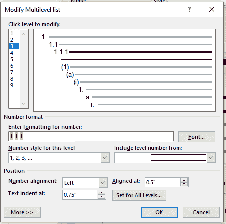

您可以通过点击**更多> >** 然后点击**数字后面的**来修改数字后面的空格字符，并选择您想要的。在这里，我将为我的所有关卡使用**标签字符**。

点击 **OK** 按钮，编号部分设置完毕！您不必再次执行这些步骤，因为您定义的样式可以从一个 Word 文档应用到另一个文档。我们稍后会详细讨论这一点。

点击**主页**选项卡的**段落**部分的**多级列表**按钮，你的列表样式应该可用。

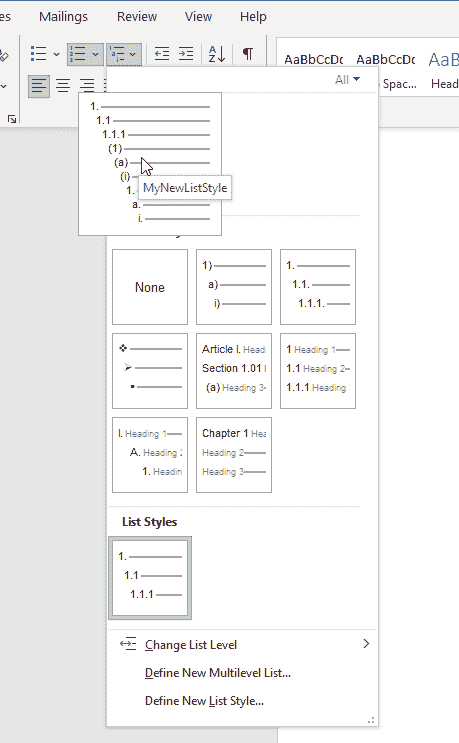

我们现在将定义我们的标题样式。

### 如何在 Word 中定义标题样式

在**主页**选项卡和**风格**部分下，点击不同风格旁边的向下箭头。

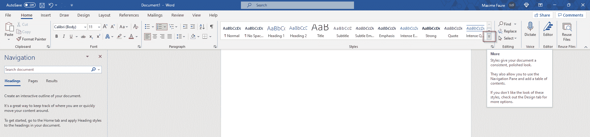

然后点击**创建样式**。

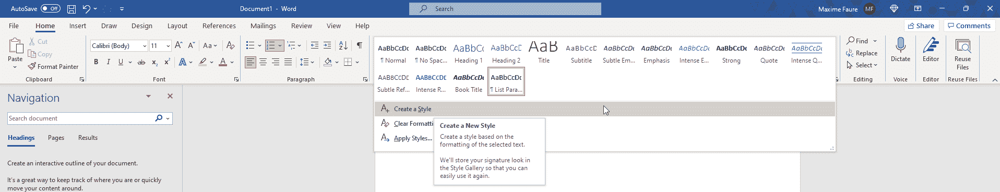

为您的新样式命名。最好在你要申请这个头衔的地方写上级别编号，这样更容易理解你的头衔等级。我将把我的命名为 NewStyle1，作为 level 1。然后点击**修改**。

如果你点击 **OK** 太快，不要担心——你可以在风格部分找到你的风格并随时修改。右键点击**修改即可编辑...**

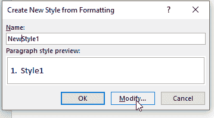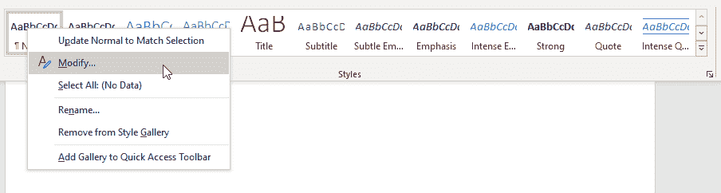

我们将对标题样式应用格式。

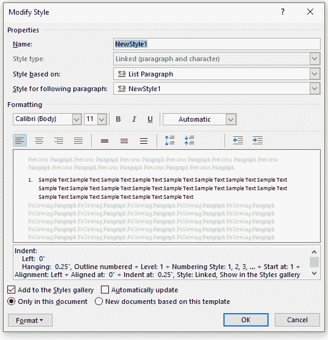

首先打开基于下拉菜单的**样式，选择第一级的**标题 1** 。这是 Word 理解标题层次结构级别的重要一步。您将把这个步骤应用到每个级别(2 级样式的标题 2，3 级样式的标题 3...).**

然后打开下一段的**样式，选择普通。这将阻止任何格式自动应用于您键入的后续文本行。**

打开**格式**菜单，打开**编号...**菜单。确保没有选择，然后点击**确定**。这将防止我们之前定义的编号之间的任何冲突。

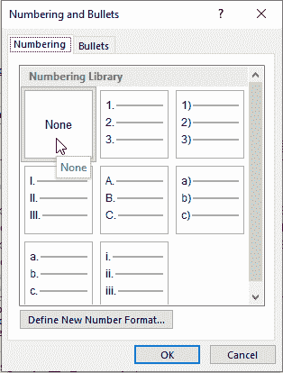

然后，您可以选择所需的任何字体格式。这是我选的:

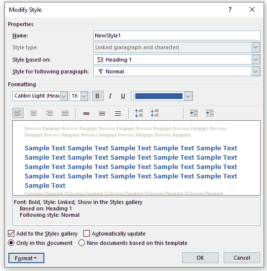

让我们按照相同的步骤为 level 2 和 level 3 创建一个样式。确保每次都将编号设置为**无**。这是我为第二级准备的:

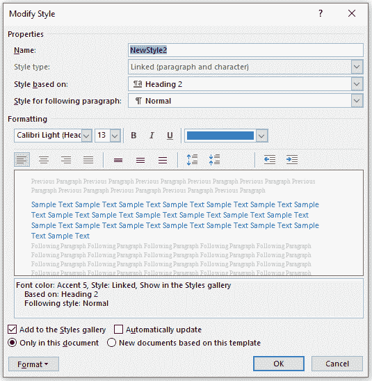

第三级:

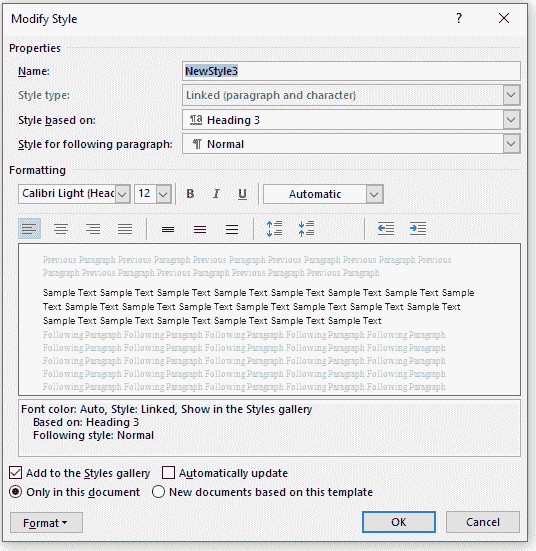

我们现在要将标题样式与编号样式联系起来。

进入**首页**页签、**段**段、**多级列表**。然后右击我们在第一部分中创建的编号列表样式，并点击**修改**。

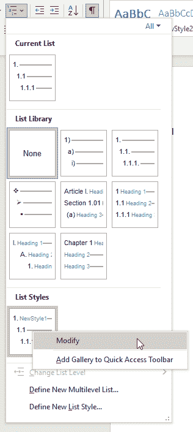

点击**格式，打开编号窗口。**选择 1 级，并在**链接级别到样式**下拉菜单中选择您为 1 级标题创建的 1 级样式。你应该知道这个:

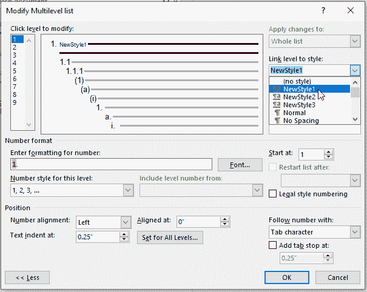

对级别 2 和级别 3 重复这些步骤。

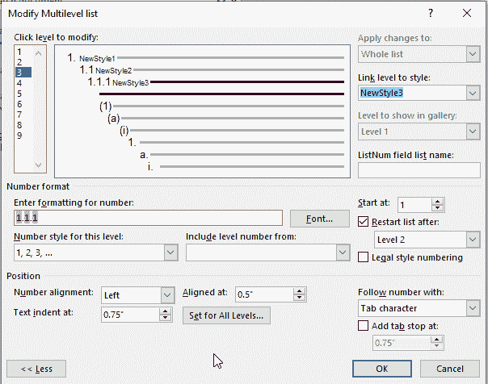

然后单击确定。

### 如何应用您的新标题样式

现在让我们尝试应用我们的新标题样式。在文档中键入标题 1，不应用任何格式。

如果您已经应用了一种格式，您可以通过点击段落并在**样式**部分应用**普通**样式来移除它。这有助于删除您可能找到的任何不需要的格式或样式。

现在，单击标题 1 文本，然后单击您为级别 1 新创建的样式。这将把你的 1 级风格应用到整个段落。

如果你进入**视图**选项卡，你可以检查**导航窗格**并看到“1。标题 1”只是作为一个可选标题出现在左侧导航面板上，让您可以快速找到它。

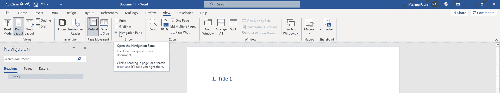

让我们也试试其他的标题风格。键入不带格式的文本，将鼠标放在相关段落中，然后单击新创建的样式来应用它们。您应该得到这样的结果:

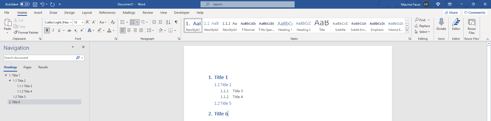

正如您在左侧面板中看到的，我所有的头衔都以统一编号的结构化方式出现。您可以折叠或展开它们来更快地导航。在这个面板的顶部还有一个搜索引擎。

您现在可以通过进入**引用**选项卡> **目录** > **自动表 1 来插入结构化目录。**您现在应该有这样的东西:

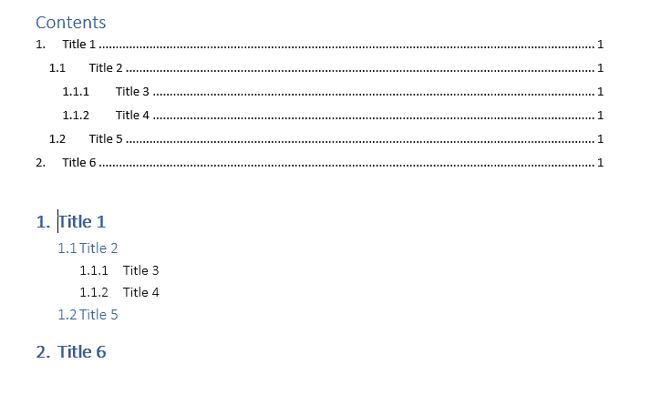

您可以通过单击**目录** > **自定义目录** >减少**显示级别**数字> **确定**来自定义此目录，以便只显示特定级别的标题。

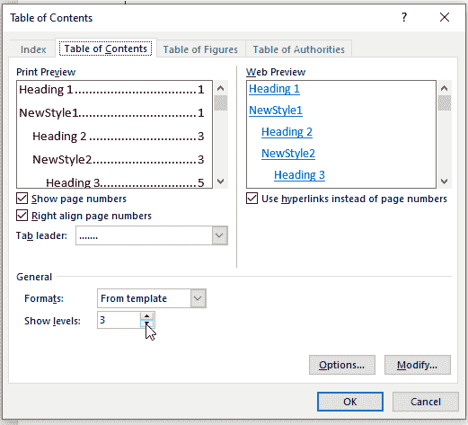

### 如何在 Word 中保留您的样式

目前，这些标题样式仅在这个 Word 文件中可用。我们将在每次打开 Word 时提供它们，并让它们可以传递给其他人。

在 Word 中打开“开发人员”选项卡。如果你看不到它显示点击**文件** > **选项** > **自定义功能区** >检查**开发者**右边面板> **OK** 。

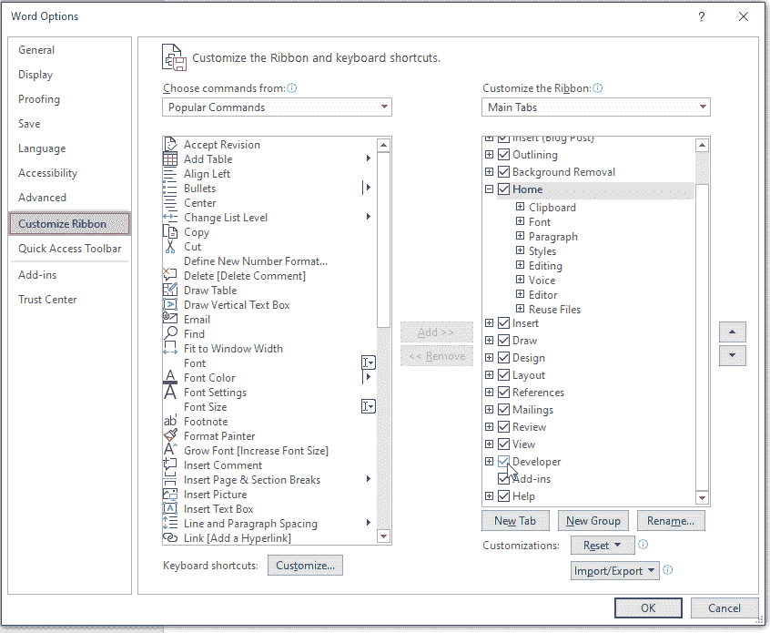

一旦你进入**开发者**标签，进入**文档模板** > **组织者**。

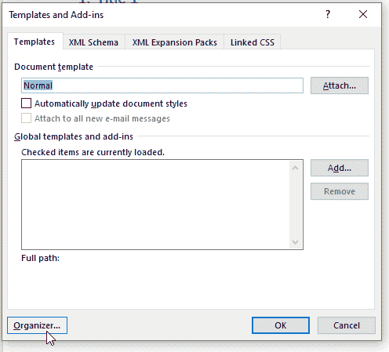

在左侧面板(在我的文档 1 中)中，您可以看到该文件中可用的样式。右侧面板中是 Normal.dotm 中可用的样式，它允许您存储每次打开 Word 时可用的样式。

让我们选择所有新创建的样式，然后点击**复制- >** 。您应该得到这样的结果:

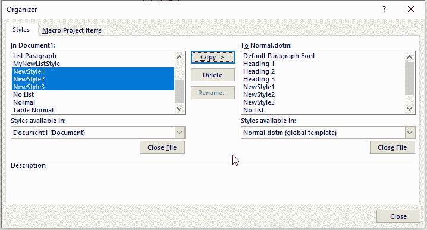

现在，如果您打开另一个文件，您的样式将直接出现在样式部分。如果您想要在群组之间传递样式并协调文件的结构和格式，这将非常有用。

### 就是这样！

瞧啊。现在，您可以使用可定制的标题样式和可靠的导航面板来构建结构化的 Word 文档。