# ReactJS 项目——建立一个瑞克和莫蒂的角色维基

> 原文：<https://www.freecodecamp.org/news/react-js-project-build-a-rick-and-morty-character-wiki/>

今天我们将通过建立一个瑞克和莫蒂的角色维基来练习我们的反应技巧。

这是我们今天要建造的:

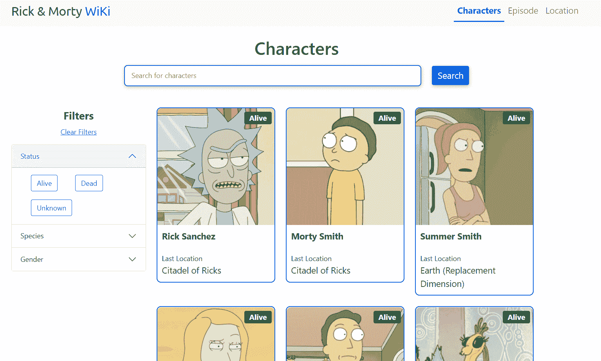

这里有一个[该项目的现场演示]👇
[https://react-projects-psi.vercel.app/](https://react-projects-psi.vercel.app/)。

这里是 GitHub 库。

在构建这个项目时，我们将涉及的主题有:

*   React 挂钩(使用状态，使用效果)
*   反应组分
*   获取 API
*   引导-用于造型
*   页码
*   搜索栏
*   数据过滤
*   动态路由

## 如果你喜欢，你也可以在 YouTube 上观看这个教程:

[https://www.youtube.com/embed/35QCQnohLg8?feature=oembed](https://www.youtube.com/embed/35QCQnohLg8?feature=oembed)

## 项目的特点

让我们来看一个演示，展示我们将在本文的整个过程中构建的所有特性。

这个项目充满了很酷的特性，因此您可以从本教程中获得最大收益，并真正擅长编写 ReactJS 代码。

### 搜索栏

我们将建立这个很酷的搜索栏，这样我们就可以搜索我们最喜欢的角色。

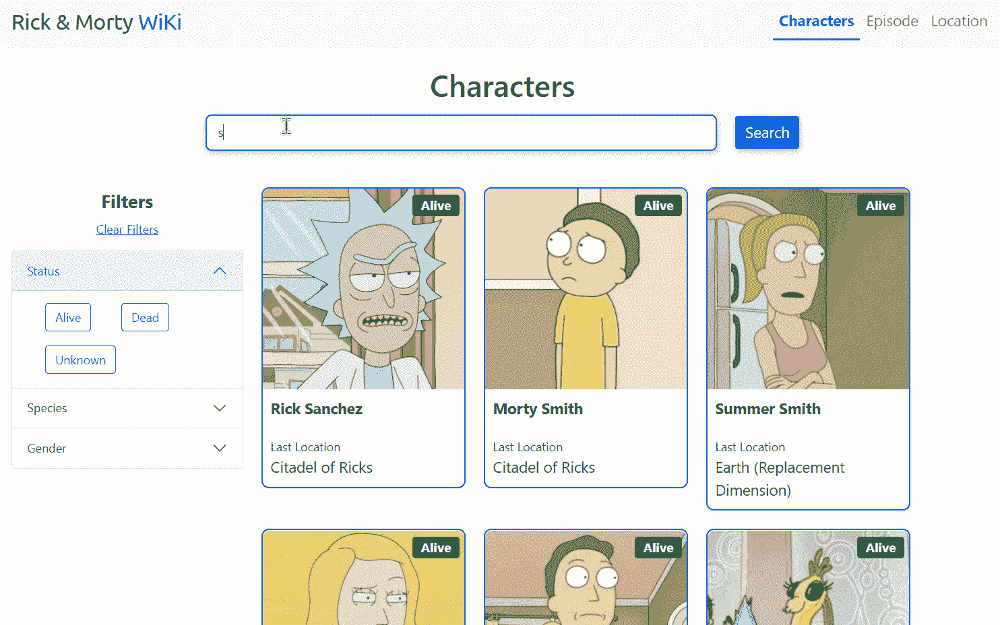

### 页码

总共有 800 多个字符。为了显示和管理所有这些字符，我们将实现一个分页系统，每个页面将显示 20 个字符。

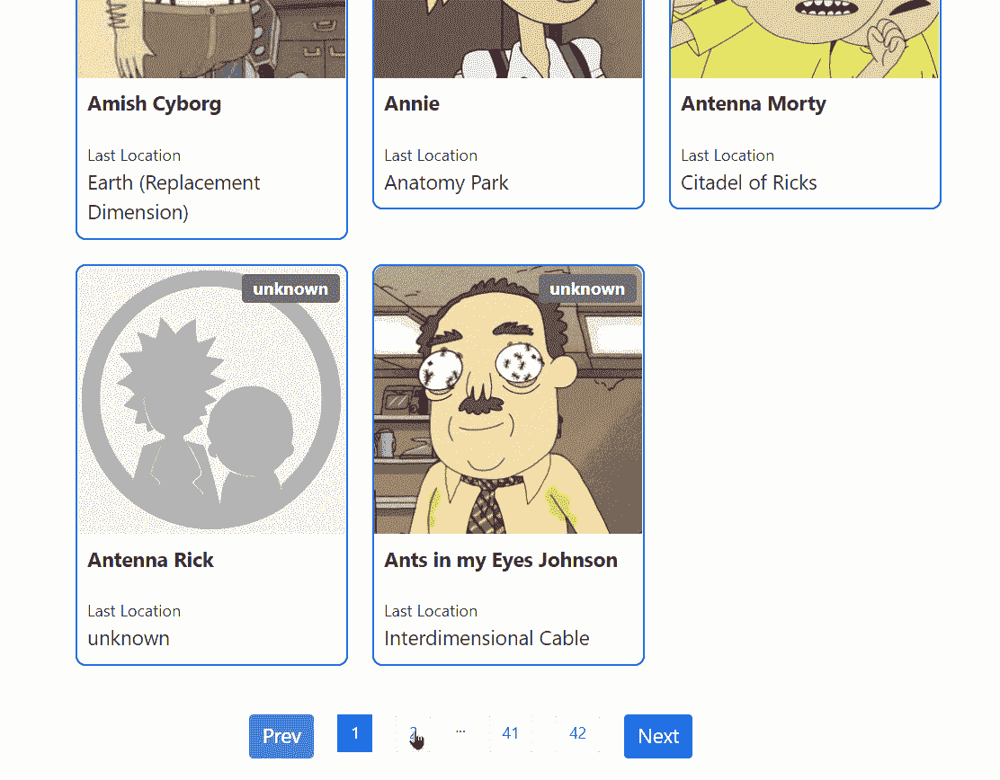

### 过滤

API 中有很多标签。使用它们，我们可以过滤我们的数据，搜索我们真正需要的东西。这是演示:

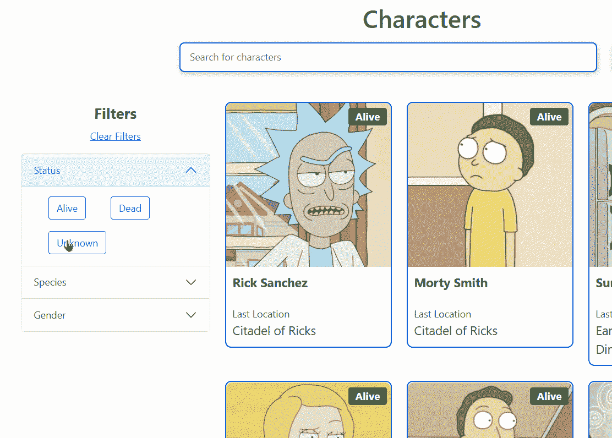

### 按指定路线发送

我们将实现这个组件来改变我们的页面并创建一个导航栏。我们将使用名为`react-router-dom`的库来完成这项工作。

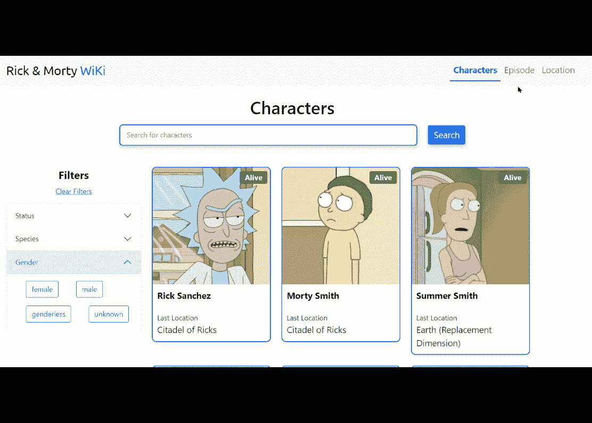

### 动态路由

使用`react-router-dom`，我们还将添加动态路由，这样当我们点击一个角色时，我们可以了解更多关于它的信息。

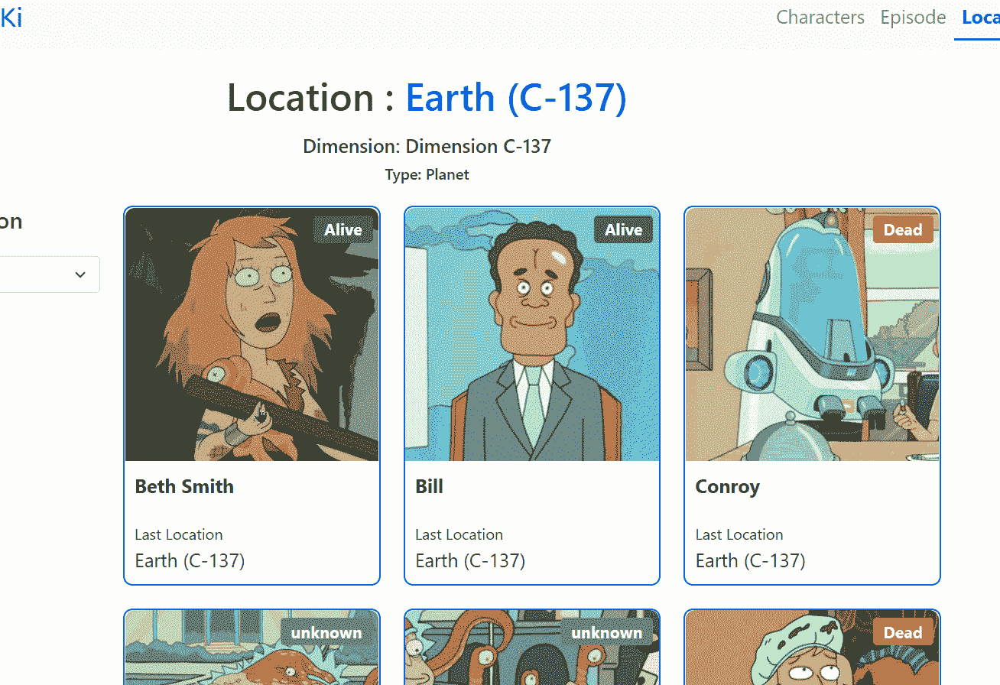

# 目录

*   设置
*   文件夹结构
*   数据提取
*   字符卡
*   搜索栏
*   反应-分页
*   过滤
*   反应路由器
*   插曲
*   位置
*   动态页面

# 项目设置


在开始项目之前，按照以下步骤进行设置:

*   创建一个名为“react-wiki”的文件夹
*   在 VS 代码中打开该文件夹
*   打开您的终端，逐一运行以下命令:👇

```
npx create-react-app .

npm install bootstrap

npm install @popperjs/core --save

npm install sass

npm install react-router-dom

npm install react-paginate --save

npm start 
```

为了让您的开发体验更容易，请下载这些 VS 代码扩展:

*   ES7 React/Redux/graph QL/React-本机代码片段
*   埃斯林特

# 文件夹结构


我们将整个项目分为 5 个部分:

*   卡片
*   页码
*   搜索
*   过滤器
*   导航条

在“src”文件夹中创建一个名为“components”的文件夹，并创建如下 5 个文件夹:👇

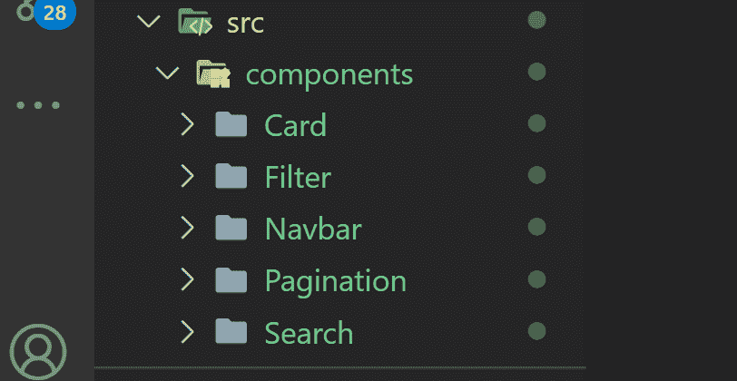

然后，根据组件的名称创建这些文件。👇

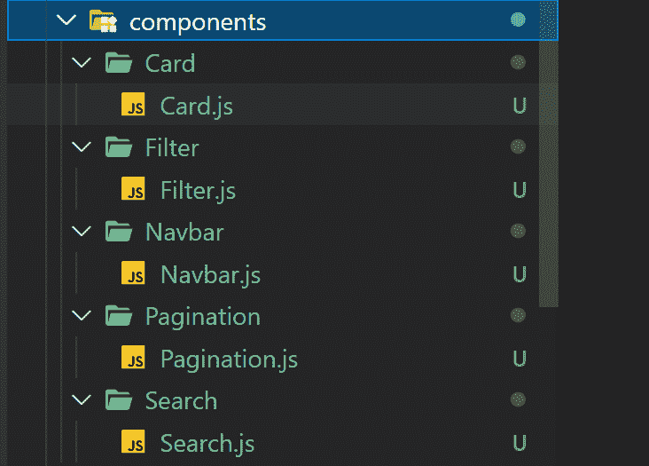

### App.js

你需要做的其他一些改变:

*   删除`App.css`文件中的所有内容
*   在`App.js`的顶部导入 React 钩子和引导程序

```
import "bootstrap/dist/css/bootstrap.min.css";
import "bootstrap/dist/js/bootstrap";
import React, { useState, useEffect } from "react"; 
```

接下来，从组件中导入所有模块:

```
import Search from "./components/Search/Search";
import Card from "./components/Card/Card";
import Pagination from "./components/Pagination/Pagination";
import Filter from "./components/Filter/Filter";
import Navbar from "./components/Navbar/Navbar"; 
```

在`return statement`中，删除所有内容并添加以下代码:👇

```
<div className="App">
  <h1 className="text-center mb-3">Characters</h1>
  <div className="container">
  <div className="row">
    Filter component will be placed here
    <div className="col-lg-8 col-12">
      <div className="row">
        Card component will be placed here
      </div>
    </div>
  </div>
  </div>
</div> 
```

### index.css

添加这些默认样式:👇

```
@import url('https://fonts.googleapis.com/css2?family=Ubuntu:wght@300;400;500;700&display=swap');

body {
  margin: 0;
  -webkit-font-smoothing: antialiased;
  -moz-osx-font-smoothing: grayscale;
}

.ubuntu {
  font-family: "Ubuntu" !important;
}

code {
  font-family: source-code-pro, Menlo, Monaco, Consolas, "Courier New",
    monospace;
} 
```

这是目前为止的结果:

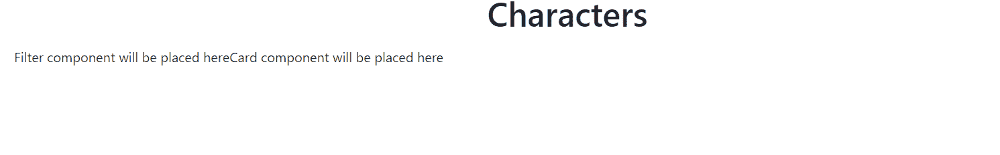

恭喜你！我们已经完成了设置过程。所以现在让我们开始编码。


# 如何从 API 获取数据

为了从我们的 API 获取数据，我们将使用[Rick 和 morty characters API](https://rickandmortyapi.com/) 。我们需要添加一些东西。

### App.js👇

```
 let api = `https://rickandmortyapi.com/api/character/?page=1` 
```

**注意:**不要在 URL 周围使用引号或双引号，使用反斜线(`like this`)代替。☝

为了从这个 API 获取数据，我们将像这样使用我们的`useEffects`钩子:👇

```
 useEffect(() => { }, [api]); 
```

我们正在编写`useEffect`钩子，并将手表放在`api`上。这意味着，万一`api`变量发生变化，我们要加载新的数据。我们继续。👇

```
useEffect(() => {
  (async function () {
    let data = await fetch(api).then((res) => res.json());
    console.log(data);
  })();
}, [api]); 
```

我们使用异步函数获取原始数据，然后将其转换为 JSON 格式。让我们检查一下控制台，看看到目前为止我们有什么:👇

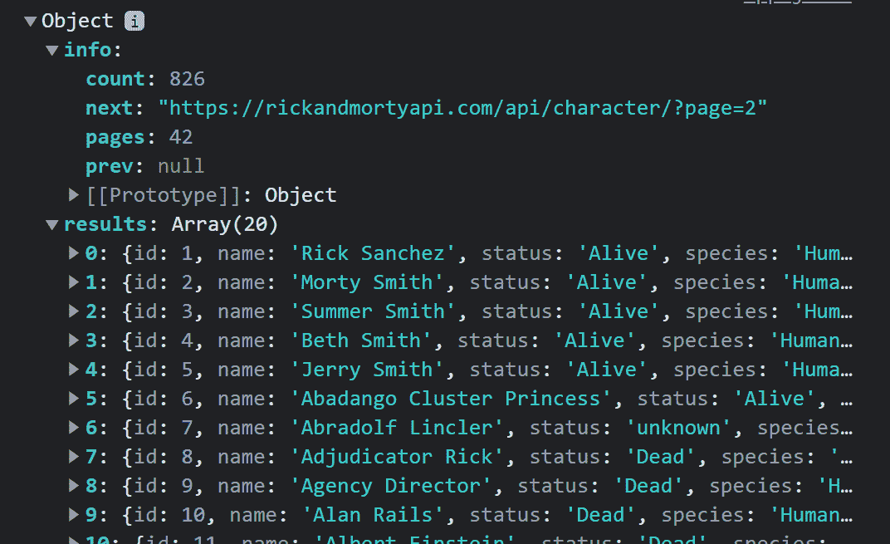

想自己测试一下吗？将 API 中的页码改为 2，您会在控制台中发现新数据:👇

```
let api = `https://rickandmortyapi.com/api/character/?page=1` 
```

让我们使用`useState`钩子，而不是将数据存储在控制台中。这将把数据存储在一个变量中，每当 useEffect 钩子获取新数据时，我们将有一个功能键来改变变量数据。👇

```
let [fetchedData, updateFetchedData] = useState([]);
let { info, results } = fetchedData; 
```

此外，我们正在从`fetchedData`变量中析构`info and results`,以使我们的生活更容易。👆

`fetchedData`变量将存储我们从 api 获得的数据。我们将使用`updateFetchedData`函数随时修改数据。

让我们改变我们的使用效果挂钩:👇

```
useEffect(() => {
  (async function () {
    let data = await fetch(api).then((res) => res.json());
    updateFetchedData(data);
  })();
}, [api]); 
```

# 如何制作人物卡片

让我们开始建立我们的角色卡。👇

首先，通过替换写有 `Card component will be placed here`的文本来导入卡组件。然后，将获取的数据从我们的`App.js`组件传递到我们的`Card component`，如下所示:👇

```
<Card results={results} /> 
```

### Card.js

现在，首先析构我们从`App.js`组件获得的数据。👇

```
const Card = ({ results }) => {} 
```

然后创建一个名为`display`的变量。这能装下我们所有的卡。与此同时，我们将创建一个`if` `else`语句来检查我们从 API 获得的数据是否为空。👇

```
const Card = ({ results }) => {
  let display;

  if (results) {}
  else{
    display = "No Characters Found :/";
  }

  return <>{display}</>;
} 
```

现在，我们将把我们的`results`映射到我们的 cards 组件，它会自动为我们创建卡片。但是首先，我们需要销毁从我们的 API 得到的数据。👇

```
if (results) {
  display = results.map((x) => {
  let { id, image, name, status, location } = x;

    return (
      <div
        key={id}
        className="col-lg-4 col-md-6 col-sm-6 col-12 mb-4 position-relative text-dark"
      >
      </div>
  );
});
} 
```

创建一个名为`Card.module.scss`的文件，并添加以下代码:👇

```
$radius: 10px;
.card {
  border: 2px solid #0b5ed7;
  border-radius: $radius;
}
.content {
  padding: 10px;
}
.img {
  border-radius: $radius $radius 0 0;
}
.badge {
  top: 10px; right: 20px;
  font-size: 17px;
} 
```

同样，将它导入到`Card.js`组件中:👇

```
import styles from "./Card.module.scss"; 
```

现在，是时候创建我们的卡片模板，并将数据放入各自的位置。👇

```
<div
  className={`${styles.card} d-flex flex-column justify-content-center`}
>
  
  <div className={`${styles.content}`}>
    <div className="fs-5 fw-bold mb-4">{name}</div>
    <div className="">
      <div className="fs-6 fw-normal">Last Location</div>
      <div className="fs-5">{location.name}</div>
    </div>
  </div>
</div> 
```

到目前为止的结果如下:👇

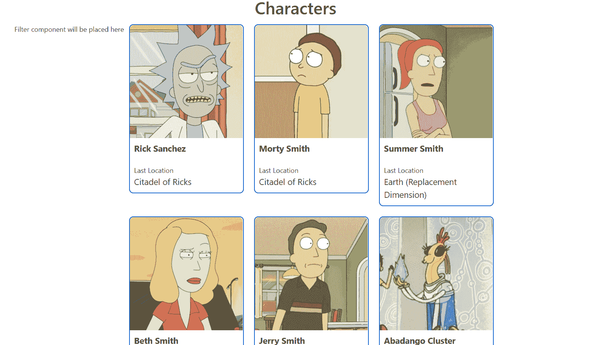

最后，我们要用这个代码👇要让用户知道角色是死了、活着还是未知:

```
{
(() => {
  if (status === "Dead") {
    return (
      <div className={`${styles.badge} position-absolute badge bg-danger`}>
        {status}
      </div>
    );
  } else if (status === "Alive") {
    return (
      <div className={`${styles.badge} position-absolute badge bg-success`}>
        {status}
      </div>
    );
  } else {
    return (
      <div
        className={`${styles.badge} position-absolute badge bg-secondary`}
      >
        {status}
      </div>
    );
  }
})()} 
```

目前的结果是:👇


# 如何建立搜索栏

这是我们的搜索栏组件的演示视频:👇


现在，让我们建立我们的角色搜索栏。但是首先，我们需要创建两个`useState`钩子来挂住我们的`search keywords`和`current page number`。👇

### App.js

```
let [pageNumber, updatePageNumber] = useState(1);
let [search, setSearch] = useState(""); 
```

然后，我们需要用变量更新我们的 API。这意味着每当我们的 API 改变时，我们的 useEffect 钩子将从我们的数据库中获取新的数据。👇

```
let api = `https://rickandmortyapi.com/api/character/?page=${pageNumber}&name=${search}`; 
```

现在，我们将在 return 语句中导入搜索栏组件。与此同时，我们要在组件内部传递新创建的状态变量。👇

```
 <h1 className="text-center mb-3">Characters</h1>
  <Search setSearch={setSearch} updatePageNumber={updatePageNumber} /> 
```

创建一个名为`Search.module.scss`的文件来保存这个特定模块的样式。然后，进行以下调整:👇

### 搜索.模块. scss

```
.input {
  width: 40%; border-radius: 8px;
  border: 2px solid #0b5ed7;
  box-shadow: 1px 3px 9px rgba($color: #000000, $alpha: 0.25);
  padding: 10px 15px;
  &:focus { outline: none; }
}
.btn {
  box-shadow: 1px 3px 9px rgba($color: #000000, $alpha: 0.25);
}
@media (max-width: 576px) {
  .input { width: 80%; }
} 
```

### 搜索. js

首先，我们需要销毁我们的道具。然后，我们将创建一个名为`searchBtn`的函数来阻止我们的应用程序的默认行为，就像这样:👇

```
import React from "react";
import styles from "./Search.module.scss";

const Search = ({ setSearch, updatePageNumber }) => {
  let searchBtn = (e) => {
    e.preventDefault();
  };
}; 
```

然后，让我们在返回语句中写入。首先，让我们编写表单标签来保存我们的输入和按钮标签。👇

```
return (
  <form
    className={`${styles.search} d-flex flex-sm-row flex-column align-items-center justify-content-center gap-4 mb-5`}
  >
  </form>
); 
```

然后，我们在表单标签中创建按钮和输入标签。👇

```
<input
  onChange={(e) => {
    updatePageNumber(1);
    setSearch(e.target.value);
  }}
  placeholder="Search for characters"
  className={styles.input}
  type="text"
/>
<button
  onClick={searchBtn}
  className={`${styles.btn} btn btn-primary fs-5`}
>
  Search
</button> 
```

目前的结果是:👇


# 如何用 React-paginate 设置分页

下面是我们的 React-paginate 组件的演示:👇


我们将使用[这个包对我们的数据](https://www.npmjs.com/package/react-paginate)进行分页。所以，让我们从最底部导入它:👇

### App.js

```
<Pagination
  info={info}
  pageNumber={pageNumber}
  updatePageNumber={updatePageNumber}
/> 
```

### Pagination.js

在这里，我们要销毁我们的道具，然后用一些 JSX 风格来写:👇

```
import React, { useState, useEffect } from "react";
import ReactPaginate from "react-paginate";

const Pagination = ({ pageNumber, info, updatePageNumber }) => {} 
```

在 return 语句中，我们将 JSX 的样式写成这样:👇

```
return (
<>
<style jsx>
{`
  a {
    color: white; text-decoration: none;
  }
  @media (max-width: 768px) {
    .pagination {font-size: 12px}

    .next,
    .prev {display: none}
  }
  @media (max-width: 768px) {
    .pagination {font-size: 14px}
  }
`}
</style>
</>
); 
```

现在，创建这个函数来处理页面更改函数:👇

```
let pageChange = (data) => {
  updatePageNumber(data.selected + 1);
}; 
```

为了使我们的分页组件具有响应性，我们需要编写这个小组件:

```
const [width, setWidth] = useState(window.innerWidth);
const updateDimensions = () => {
  setWidth(window.innerWidth);
};
useEffect(() => {
  window.addEventListener("resize", updateDimensions);
  return () => window.removeEventListener("resize", updateDimensions);
}, []); 
```

好了各位，太棒了！现在我们将使用 react-paginate 包。

首先，让我们使用 react-paginate 的内置属性来样式化基本元素:👇

```
<ReactPaginate
  className="pagination justify-content-center my-4 gap-4"
  nextLabel="Next"
  previousLabel="Prev"
  previousClassName="btn btn-primary fs-5 prev"
  nextClassName="btn btn-primary fs-5 next"
  activeClassName="active"
  pageClassName="page-item"
  pageLinkClassName="page-link"
/> 
```

这里是主要的调料:我们将为我们的组件添加功能，以便它正常工作。👇

```
<ReactPaginate
  forcePage={pageNumber === 1 ? 0 : pageNumber - 1}
  marginPagesDisplayed={width < 576 ? 1 : 2}
  pageRangeDisplayed={width < 576 ? 1 : 2}
  pageCount={info?.pages}
  onPageChange={pageChange}
  //.... other props here
/> 
```

目前的结果是:👇


# 如何制作过滤器组件

这是我们的过滤器组件的演示:👇


我们需要做的第一件事是创建一个文件夹结构来存放我们将要使用的所有小组件。在`Filter`文件夹中创建这些组件:👇

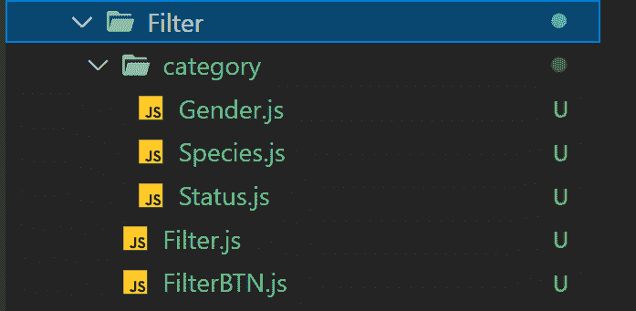

### App.js

现在，创建这些 useState 挂钩来存储我们的状态、性别和物种。

```
let [status, updateStatus] = useState("");
let [gender, updateGender] = useState("");
let [species, updateSpecies] = useState(""); 
```

同样，我们需要根据我们的使用状态钩子变量修改我们的`api`变量。👇

```
 let api = `https://rickandmortyapi.com/api/character/?page=${pageNumber}&name=${search}&status=${status}&gender=${gender}&species=${species}`; 
```

现在，我们将把我们的`filter`组件导入到我们的应用程序中，在那里编写`Filter component will be placed here`。此外，传递所有这些必需的道具:👇

```
<Filter
  pageNumber={pageNumber}
  status={status}
  updateStatus={updateStatus}
  updateGender={updateGender}
  updateSpecies={updateSpecies}
  updatePageNumber={updatePageNumber}
/> 
```

### 过滤器. js

让我们在过滤器组件中进行这些更改，这样我们就可以获得想要的结果。首先，像这样导入我们所有的类别组件:👇

```
import React from "react";
import Gender from "./category/Gender";
import Species from "./category/Species";
import Status from "./category/Status"; 
```

然后，析构传递的道具，放置一个包含一个`clear button`的`accordion`:

```
const Filter = ({
  pageNumber, updatePageNumber,
  updateStatus, updateGender,
  updateSpecies,
}) => {

return (
<div className="col-lg-3 col-12 mb-5">
  <div className="text-center fw-bold fs-4 mb-2">Filters</div>
  <div
    style={{ cursor: "pointer" }} onClick={clear}
    className="text-primary text-decoration-underline text-center mb-3"
  > Clear Filters </div>
  <div className="accordion" id="accordionExample">
    {/* Category components will be placed here */}
  </div>
</div>
);
}; 
```

创建此函数，以便我们可以清除过滤器并刷新页面:👇

```
let clear = () => {
  updateStatus("");
  updateGender("");
  updateSpecies("");
  updatePageNumber(1);
  window.location.reload(false);
}; 
```

到目前为止的结果如下:👇

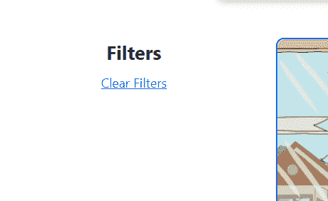

### FilterBTN.js

首先，让我们创建这些过滤器按钮。我们还将销毁所需的道具。👇

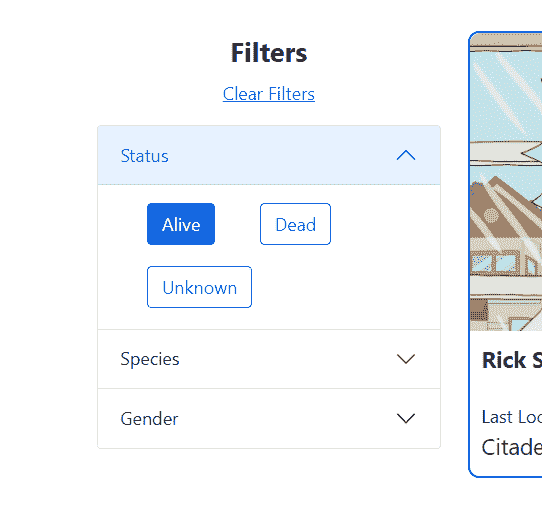

```
const FilterBTN = ({ input, task, updatePageNumber, index, name }) => {
return (
<div>
  <style jsx>
    {`
      .x:checked + label {
        background-color: #0b5ed7;
        color: white }
      input[type="radio"] { display: none; }
    `}
  </style>
</div>
);
}; 
```

现在，我们将带有标签的主输入组件放在`style jsx`下面:👇

```
<div className="form-check">
  <input
    className="form-check-input x" type="radio"
    name={name} id={`${name}-${index}`}
  />
  <label
    onClick={(x) => {
      task(input); updatePageNumber(1);
    }}
    className="btn btn-outline-primary"
    for={`${name}-${index}`}
  > {input} </label>
</div> 
```

### 状态. js


在 Status.js 中编写以下起始代码:

```
import FilterBTN from "../FilterBTN";

const Status = ({ updateStatus, updatePageNumber }) => {
  let status = ["Alive", "Dead", "Unknown"];
  return (
    <div className="accordion-item">
      <h2 className="accordion-header" id="headingOne">
        <button
          className="accordion-button" type="button"
          data-bs-toggle="collapse" data-bs-target="#collapseOne"
          aria-expanded="true" aria-controls="collapseOne"
        > Status </button>
      </h2>
    </div>
  );
}; 
```

然后，让我们通过映射数据数组来创建状态按钮。👇

在结束标签下面，把这些放进去👇这将帮助我们自动映射数据并制作我们的状态按钮:

```
<div
  id="collapseOne" className="accordion-collapse collapse show"
  aria-labelledby="headingOne" data-bs-parent="#accordionExample"
>
<div className="accordion-body d-flex flex-wrap gap-3">
  {status.map((item, index) => (
    <FilterBTN
      key={index}
      index={index}
      name="status"
      task={updateStatus}
      updatePageNumber={updatePageNumber}
      input={item}
    />
  ))}
</div>
</div> 
```

#### 在 Filter.js 中测试的时间

在 Filter.js 中写下这几行，检查组件是否工作:👇

```
<Status
  updatePageNumber={updatePageNumber}
  updateStatus={updateStatus}
/> 
```

目前的结果是:👇

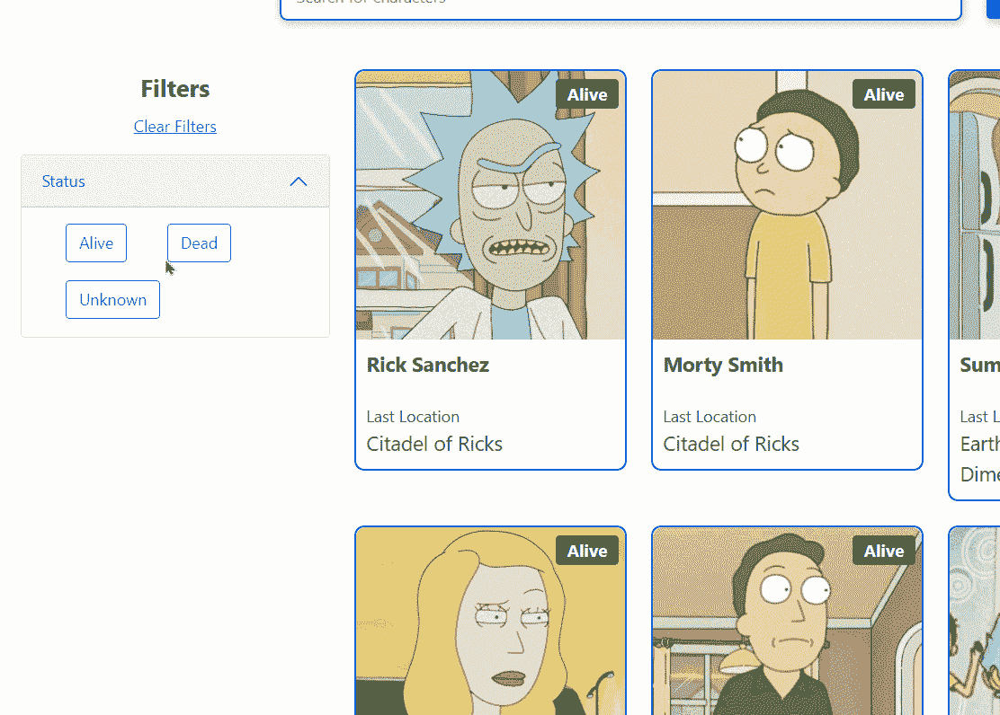

### Species.js

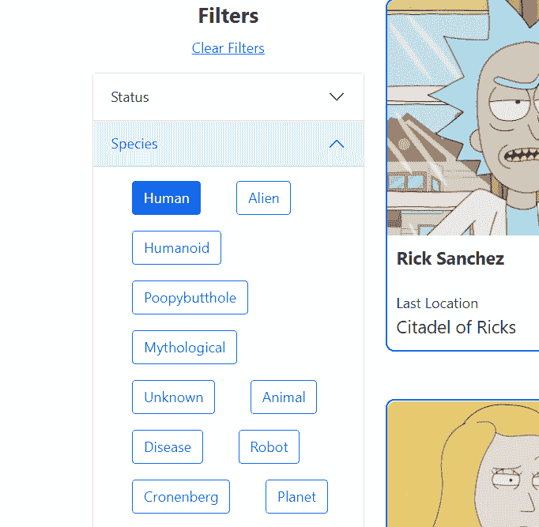

将这些起始代码写在 Species.js 中:

```
import FilterBTN from "../FilterBTN";

const Species = ({ updateSpecies, updatePageNumber }) => {
return (
<div className="accordion-item ">
  <h2 className="accordion-header" id="headingTwo">
    <button
      className="accordion-button collapsed" type="button"
      data-bs-toggle="collapse" data-bs-target="#collapseTwo"
      aria-expanded="false" aria-controls="collapseTwo"
    > Species </button>
  </h2>
</div>
)} 
```

现在，创建一个数组来保存所有可能的物种数据:👇

```
 let species = [
    "Human", "Alien", "Humanoid",
    "Poopybutthole", "Mythological", "Unknown",
    "Animal", "Disease","Robot","Cronenberg","Planet",
  ]; 
```

然后，让我们通过映射数组数据来创建物种按钮，如下所示:👇

```
<div
    id="collapseTwo" className="accordion-collapse collapse"
    aria-labelledby="headingTwo"
    data-bs-parent="#accordionExample"
  >
  <div className="accordion-body d-flex flex-wrap gap-3">
    {species.map((item, index) => {
      return (
        <FilterBTN
          name="species" index={index} key={index}
          updatePageNumber={updatePageNumber}
          task={updateSpecies} input={item}
        />
      );
    })}
  </div>
</div> 
```

#### 在 Filter.js 中测试的时间

在 Filter.js 中写下这几行，检查组件是否工作:👇

```
<Species
  updatePageNumber={updatePageNumber}
  updateSpecies={updateSpecies}
/> 
```

目前的结果是:👇

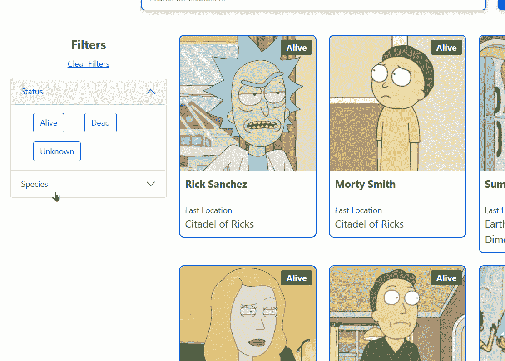

### Gender.js

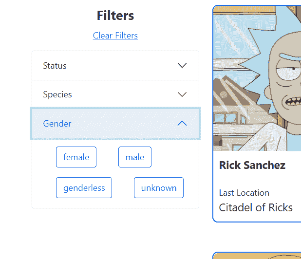

编写以下起始代码:👇

```
import FilterBTN from "../FilterBTN";

const Gender = ({ updateGender, updatePageNumber }) => {
let genders = ["female", "male", "genderless", "unknown"];
return (
  <div className="accordion-item">
    <h2 className="accordion-header" id="headingThree">
      <button
        className="accordion-button collapsed" type="button"
        data-bs-toggle="collapse" data-bs-target="#collapseThree"
        aria-expanded="false" aria-controls="collapseThree"
      > Gender </button>
    </h2>
  </div>
);
}; 
```

在最后一个`h2`标签下面，将这段代码放入👇这将帮助我们自动绘制数据并制作我们的性别按钮:

```
<div id="collapseThree" className="accordion-collapse collapse"
  aria-labelledby="headingThree" data-bs-parent="#accordionExample"
>
<div className="accordion-body d-flex flex-wrap gap-3">
  {genders.map((items, index) => {
    return (
      <FilterBTN
        name="gender" index={index} key={index}
        updatePageNumber={updatePageNumber}
        task={updateGender} input={items}
      />
      );
    })}
  </div>
</div> 
```

#### 在 Filter.js 中测试的时间

在 Filter.js 中写下这几行，检查组件是否工作:👇

```
<Gender
  updatePageNumber={updatePageNumber}
  updateGender={updateGender}
/> 
```

目前的结果是:👇


# 如何设置 React 路由器

这是我们导航组件的演示:👇


开始编码吧！

首先，在`src`文件夹中创建一个名为`Pages`的文件夹。它将容纳两个文件- `Episodes.js`和`Location.js`。大概是这样的:👇

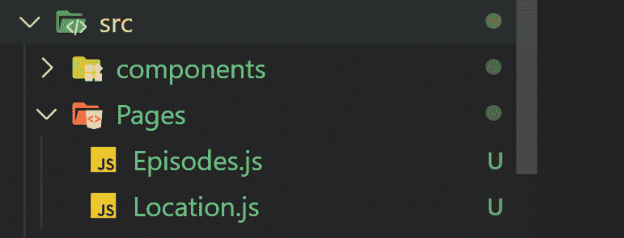

### App.js

在`App.js`中导入新创建的 pages 组件:👇

```
import Episodes from "./Pages/Episodes";
import Location from "./Pages/Location"; 
```

为了声明路由器并定义各种文件路径，我们需要在`App.js`中导入`react-router-dom`，包括它的核心组件。👇

```
import { BrowserRouter as Router, Routes, Route } from "react-router-dom"; 
```

现在，在 App.js 文件中创建一个名为`Home`的新功能组件。然后，从`App`组件上剪下所有东西，放入`Home`组件中:👇

```
const Home = () => {
  // Everything you've written so far
} 
```

在您的`App`组件函数中，创建一个新的`Router`组件，并将其放入`Navbar`组件中。👇

```
function App() {
  return (
    <Router>
      <div className="App">
        <Navbar />
      </div>
    </Router>
  );
} 
```

现在，我们需要定义我们所有的路线。记住，`Routes`是`Route`的集合，`Route`是实际的文件路径。

每条路线都需要两件事情:应用程序将实际到达的`path`和将被加载的`element`。👇

```
<Routes>
  <Route path="/" element={<Home />} />

  <Route path="/episodes" element={<Episodes />} />

  <Route path="/location" element={<Location />} />
</Routes> 
```

### Navbar.js

到目前为止一切顺利！现在，让我们制作导航条组件。首先，从`react-router-dom`导入 2 个组件。然后，编写这个包含品牌名称的引导父类来保存我们的 navbar 页面组件:👇

```
import { NavLink, Link } from "react-router-dom";

const Navbar = () => {
return (
  <nav className="navbar navbar-expand-lg navbar-light bg-light mb-4">
    <div className="container">
      <Link to="/" className="navbar-brand fs-3 ubuntu">
        Rick & Morty <span className="text-primary">WiKi</span>
      </Link>
      <style jsx>{`
        button[aria-expanded="false"] > .close {
          display: none;
        }
        button[aria-expanded="true"] > .open {
          display: none;
        }
      `}</style>
    </div>
  </nav>
);
}; 
```

编写此代码以生成我们的响应汉堡菜单:👇

```
<button
  className="navbar-toggler border-0"
  type="button"
  data-bs-toggle="collapse"
  data-bs-target="#navbarNavAltMarkup"
  aria-controls="navbarNavAltMarkup"
  aria-expanded="false"
  aria-label="Toggle navigation"
>
  <span class="fas fa-bars open text-dark"></span>
  <span class="fas fa-times close text-dark"></span>
</button> 
```

编写这段代码来生成我们可点击的导航栏链接。请注意，我们使用“react-router-dom”中的<navlink>组件链接到我们页面的组件 URL:👇</navlink>

```
<div
  className="collapse navbar-collapse justify-content-end"
  id="navbarNavAltMarkup"
> <div className="navbar-nav fs-5">
    <NavLink to="/" className="nav-link">
      Characters
    </NavLink>
    <NavLink to="/episodes" className="nav-link">
      Episode
    </NavLink>
    <NavLink
      activeClassName="active" className="nav-link"
      to="/location" >Location</NavLink>
  </div>
</div> 
```

### App.css

此外，如果你想让导航栏看起来更漂亮，让你的用户确切地知道他们当前在哪个页面，就写这些样式:👇

```
.active {
  color: #0b5ed7 !important;
  font-weight: bold;
  border-bottom: 3px solid #0b5ed7;
} 
```

然后，在`Navbar.js`中，像这样导入样式:👇

```
import "../../App.css"; 
```

目前的结果是:👇


# 插曲

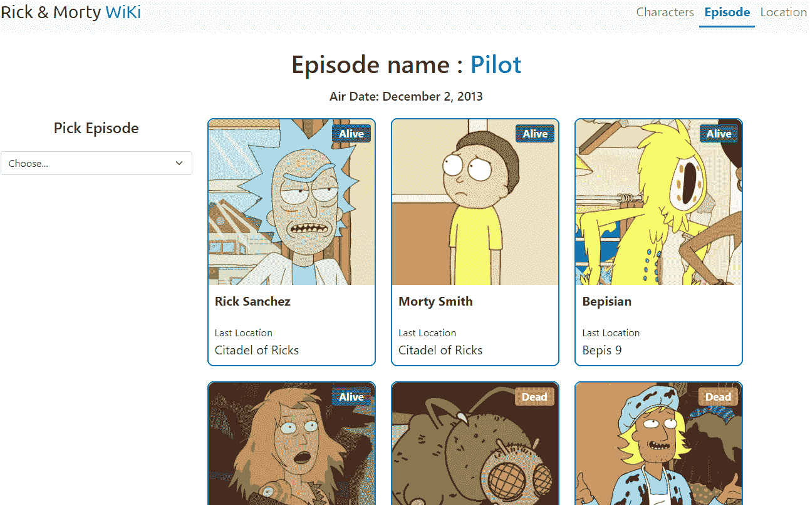

为了创建这个页面，我们需要 2 个组件:第一个是已经构建好的`card component`，第二个是`Input Group`组件，通过它我们可以更改我们的剧集编号。

### InputGroup.js

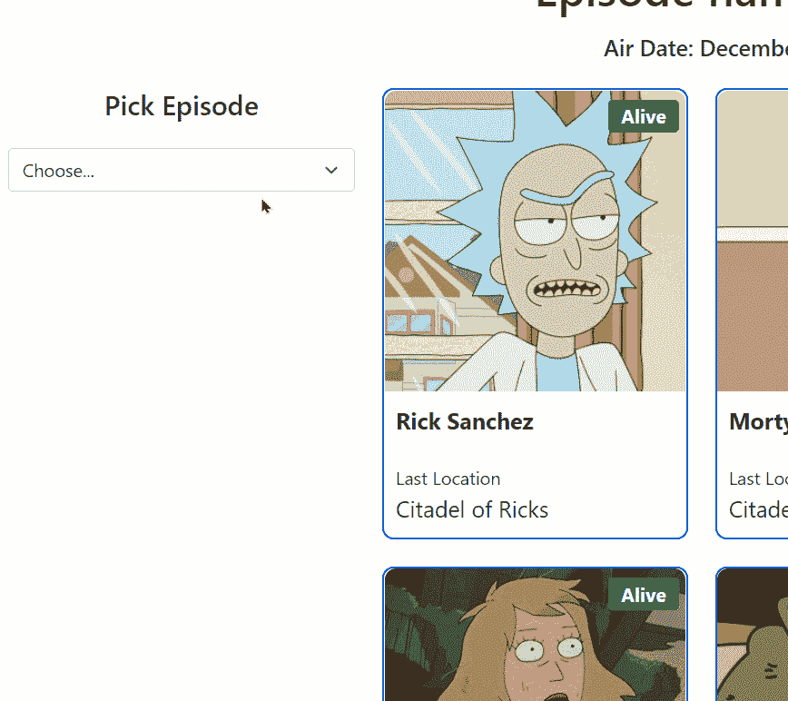

我们的输入组仅在`Episodes` & `Location`组件中可用，这样我们可以更改剧集编号和位置来搜索角色。开始吧！👇

在`Filter`文件夹的`category`文件夹中，创建一个名为`InputGroup.js`的新文件，并编写包含道具解构系统的启动代码:👇

```
const InputGroup = ({ name, changeID, total }) => {
return <div className="input-group mb-3">
  <select
  onChange={(e) => changeID(e.target.value)}
  className="form-select"
  id={name}
  ></select>
</div>
}; 
```

然后，让我们创建输入组选项。在您的`select`标签中编写以下代码:👇

```
<option value="1">Choose...</option>
{[...Array(total).keys()].map((x, index) => {
  return (
    <option value={x + 1}>
      {name} - {x + 1}
    </option>
  );
})} 
```

### 剧集. js

在该文件中，导入以下组件:👇

```
import React, { useEffect, useState } from "react";
import Card from "../components/Card/Card";
import InputGroup from "../components/Filter/category/InputGroup"; 
```

现在，创建这些状态，以便我们可以保存和更改关键信息，从我们的`api`获取数据:👇

```
const Episodes = () => {
  let [results, setResults] = React.useState([]);
  let [info, setInfo] = useState([]);
  let { air_date, episode, name } = info;
  let [id, setID] = useState(1);

let api = `https://rickandmortyapi.com/api/episode/${id}`;
} 
```

编写以下代码从我们的 API 获取数据:👇

```
useEffect(() => {
  (async function () {
    let data = await fetch(api).then((res) => res.json());
    setInfo(data);

    let a = await Promise.all(
      data.characters.map((x) => {
        return fetch(x).then((res) => res.json());
      })
    );
    setResults(a);
  })();
}, [api]); 
```

现在，让我们编写代码在屏幕上呈现结果。首先，让我们像这样显示剧集名称和播出日期:👇

```
return (
<div className="container">
  <div className="row mb-3">
    <h1 className="text-center mb-3">
      Episode name :{" "}
      <span className="text-primary">{name === "" ? "Unknown" : name}</span>
    </h1>
    <h5 className="text-center">
      Air Date: {air_date === "" ? "Unknown" : air_date}
    </h5>
  </div>
</div>
); 
```

到目前为止的结果如下:👇

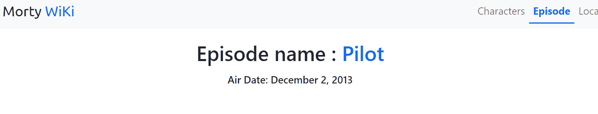

现在，让我们显示字符卡和输入组:👇

```
<div className="row">
  <div className="col-lg-3 col-12 mb-4">
    <h4 className="text-center mb-4">Pick Episode</h4>
    <InputGroup name="Episode" changeID={setID} total={51} />
  </div>
  <div className="col-lg-8 col-12">
    <div className="row">
      <Card results={results} />
    </div>
  </div>
</div> 
```

目前的结果是:👇


# 位置

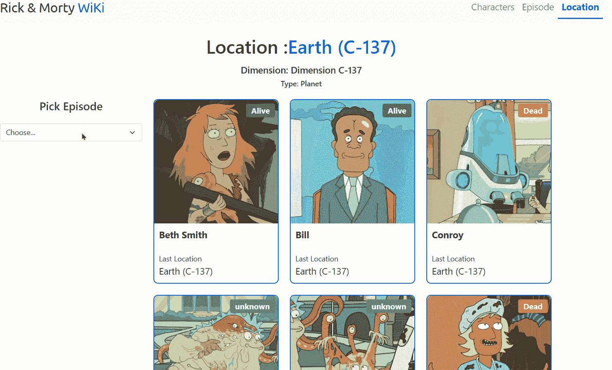

制作这个组件类似于制作`episodes`页面。首先，复制`episodes`页面上的所有内容，并做一些修改:👇

```
 let [results, setResults] = useState([]);
  let [info, setInfo] = useState([]);
  let { dimension, type, name } = info;
  let [number, setNumber] = useState(1);

  let api = `https://rickandmortyapi.com/api/location/${number}`; 
```

现在只改变`useEffect`钩子中的一个关键字，从`characters`到`residents`，就像这样:👇

```
useEffect(() => {
      // Other codes are here
      data.residents.map((x) => {
      })
    // Other codes are here
}, [api]); 
```

在 return 语句中，进行以下更改:👇

```
return (
<h1 className="text-center mb-3">
  Location :
  <span className="text-primary">
    {name === "" ? "Unknown" : name}
  </span>
</h1>
<h5 className="text-center">
  Dimension: {dimension === "" ? "Unknown" : dimension}
</h5>
<h6 className="text-center">Type: {type === "" ? "Unknown" : type}</h6>
); 
```

最后，对我们的`InputGroup`组件进行这些更改:👇

```
<InputGroup name="Location" changeID={setNumber} total={126} /> 
```

目前为止的结果👇


# 动态页面

这是我们项目的最后一步。我们的主要目标是当我们点击卡片时，了解更多关于特定人物的信息。我们将使用`react-router-dom`的动态模块系统——类似这样:👇


### CardDetails.js

为了实现我们的目标，我们需要创建一个单独的组件来显示角色的更多细节。我们将在`Card`文件夹中创建一个名为`CardDetails.js`的新文件。

首先，让我们导入基本组件:

```
import React, { useState, useEffect } from "react";
import { useParams } from "react-router-dom"; 
```

然后，我们需要存储我们的`api`并使用一些`useState`钩子。我们将使用`useParams`钩子从 URL 获取 id:👇

```
const CardDetails = () => {
let { id } = useParams();
let [fetchedData, updateFetchedData] = useState([]);
let { name, location, origin, gender, image, status, species } = fetchedData;

let api = `https://rickandmortyapi.com/api/character/${id}`;
} 
```

我们将使用这个 useEffect 钩子从我们的 API 获取数据:👇

```
useEffect(() => {
  (async function () {
    let data = await fetch(api).then((res) => res.json());
    updateFetchedData(data);
  })();
}, [api]); 
```

现在，让我们编写这段代码，它将输出我们角色的名字和图像:👇

```
return (
<div className="container d-flex justify-content-center mb-5">
  <div className="d-flex flex-column gap-3">
    <h1 className="text-center">{name}</h1>
    
  </div>
</div>
) 
```

现在，如果您想显示每个角色的当前状态，请编写以下代码:👇

```
{(() => {
if (status === "Dead") {
  return <div className="badge bg-danger fs-5">{status}</div>;
} else if (status === "Alive") {
  return <div className=" badge bg-success fs-5">{status}</div>;
} else {
  return <div className="badge bg-secondary fs-5">{status}</div>;
}
})()} 
```

接下来，编写这段代码来显示角色的所有信息:👇

```
<div className="content">
  <div className="">
    <span className="fw-bold">Gender : </span>
    {gender}
  </div>
  <div className="">
    <span className="fw-bold">Location: </span>
    {location?.name}
  </div>
  <div className="">
    <span className="fw-bold">Origin: </span>
    {origin?.name}
  </div>
  <div className="">
    <span className="fw-bold">Species: </span>
    {species}
  </div>
</div> 
```

### App.js

接下来，我们需要定义路径，以便动态路由器组件能够正常工作。首先，导入并添加以下代码:👇

```
import CardDetails from "./components/Card/CardDetails";
// other codes are here

<Routes>
  <Route path="/:id" element={<CardDetails />} />
  <Route path="/episodes/:id" element={<CardDetails />} />
  <Route path="/location/:id" element={<CardDetails />} />
</Routes> 
```

现在，向下滚动你的 App.js，做这个小小的修改👇以便它指向主页:

```
<Card page="/" results={results} /> 
```

### Card.js

转到您的卡组件，进行以下更改:👇

*   首先，解构新道具，从`react-router-dom`导入`Link`

```
import { Link } from "react-router-dom";

const Card = ({ page, results }) => {} 
```

*   接下来，将 return 语句中的所有内容包装在一个链接标记中:

```
<Link
  style={{ textDecoration: "none" }}
  to={`${page}${id}`}
  key={id}
  className="col-lg-4 col-md-6 col-sm-6 col-12 mb-4 position-relative text-dark"
>
{/* Other codes are here */}
</Link> 
```

### 剧集. js

在这个文件中，只需调整这一行代码:👇

```
<Card page="/episodes/" results={results} /> 
```

### Location.js

就像在 Episodes.js 里面一样，只需要调整一下这一行小字:👇

```
<Card page="/location/" results={results} /> 
```

结果是:✨✨✨


# 结论


恭喜你读到最后！现在，您可以轻松高效地使用 React JS 和 Bootstrap 来处理项目。

您还学习了如何从 API 获取数据并映射结果。不仅如此，你还有一个项目要展示给你当地的招聘人员。

这是你的阅读到最后的奖章，❤️

## 建议和批评得到了❤️的高度赞赏


*   [LinkedIn/ JoyShaheb](https://www.linkedin.com/in/joyshaheb/)
*   [YouTube / JoyShaheb](https://www.youtube.com/c/joyshaheb)
*   [推特/ JoyShaheb](https://twitter.com/JoyShaheb)
*   [Instagram / JoyShaheb](https://www.instagram.com/joyshaheb/)