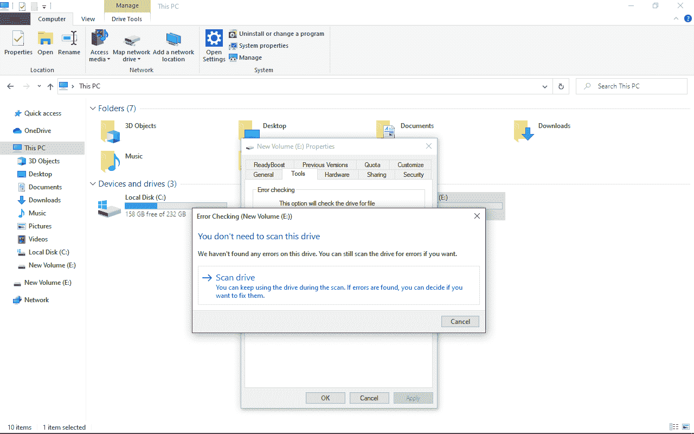
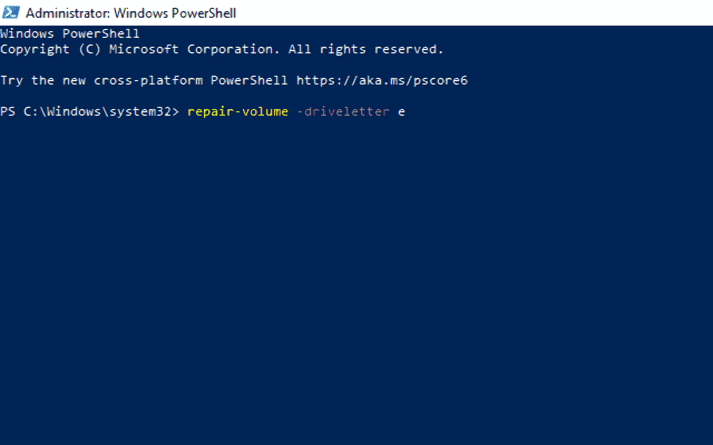
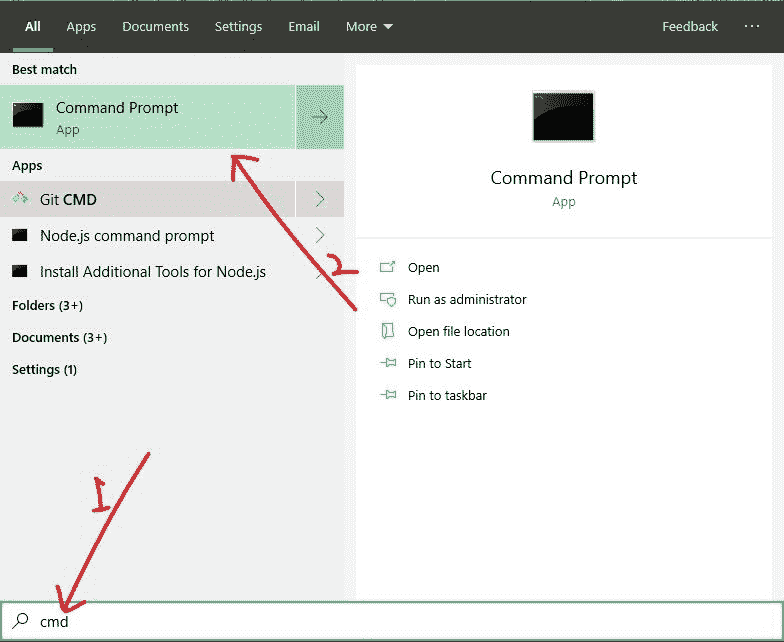
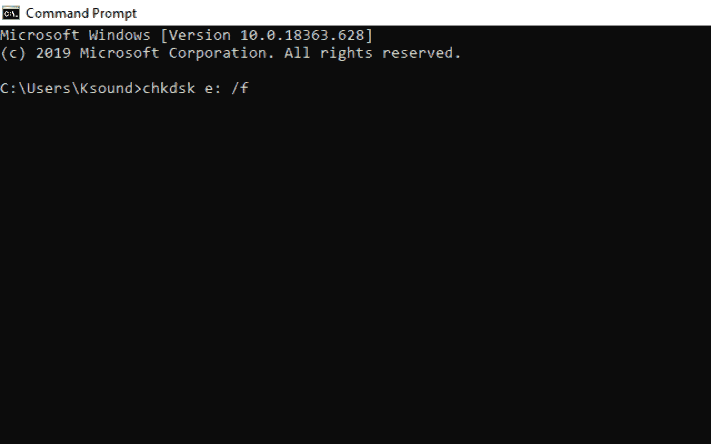

# 扫描和修复硬盘–如何修复卡住的 Windows 10 PC 硬盘

> 原文：<https://www.freecodecamp.org/news/scanning-and-repairing-drive-how-to-fix-stuck-windows-10-pc-hard-drive/>

如果你有一台 Windows 10 PC，你可能偶尔会看到臭名昭著的“扫描和修复驱动器”消息。c 盘、硬盘和任何其它外部驱动器都可能出现此错误。

这种扫描和修复可能需要几个小时，甚至花费你一整天的时间(我自己可以证明)。它通常是由不正确的关机导致的，如强制关机、断电、突然取出电池、配置不当的驱动程序、恶意软件或其他病毒攻击。

在本指南中，我将向你展示 3 种方法来修复在 Windows 10 上无法扫描和修复的驱动器。第一种解决方案在正常模式下工作——如果你能启动电脑的话——而第二种和第三种需要将电脑引导至安全模式。

## 如何使用 Windows 错误检查工具修复卡住的扫描和修复驱动器

**第一步**:启动你的 Windows 10 文件浏览器，点击“这台电脑”。

**第二步**:右键点击 Windows 正在扫描修复的硬盘，选择属性。硬盘可能是 F、E 或您设置的任何驱动器号。

**步骤 3** :点击工具选项卡，选择“错误检查”下的“检查”。

**第四步**:如果硬盘出现错误，系统会提示您修复硬盘。

如果硬盘上没有错误，您可以决定不扫描它。

## 如何使用 Windows PowerShell 修复卡住的扫描和修复驱动器

要使用此解决方案，您需要在安全模式下启动 Windows 10 电脑。

**按照以下步骤在安全模式下启动电脑**:

**第一步**:在电脑的登录界面上，按住`SHIFT`，选择电源，然后重启。

**步骤 2** :在“选择一个选项”画面中选择“故障排除”。

**第三步**:选择“高级选项”。

**第四步**:选择“启动设置”。

**第五步**:点击“重启”。

**第六步**:当电脑重启后，按`4`或`F4`键，最终将电脑引导至安全模式。

要修复无法使用 PowerShell 进行扫描和修复的驱动器，请按照以下步骤操作:

**第一步**:点击开始，搜索“powershell”。

**第二步**:你需要以管理员身份运行 Powershell，所以在右边选择“以管理员身份运行”。

**第三步**:输入命令`repair-volume -driveletter x`，在键盘上敲击`ENTER`。确保用您的硬盘盘符替换“x”。

第四步:重启电脑。

## 如何使用命令提示符修复卡住的扫描和修复驱动器

**步骤 1** :在安全模式下启动电脑。请参考上面的最后一个修复方法，了解如何做到这一点。

**第二步**:点击开始，搜索“cmd”，然后点击`ENTER`。

**第三步**:输入命令`chkdsk x: /f`，点击`ENTER`。用你的硬盘盘符替换 x。

第四步:重启电脑。

## 最后的话

在这个详细的指南中，你学习了如何修复一个被扫描和修复卡住的硬盘。

本文中讨论的修复也适用于任何其他驱动器，包括 c。

作为解决此问题的最后一招，您可以备份数据并恢复计算机。

感谢您的阅读。