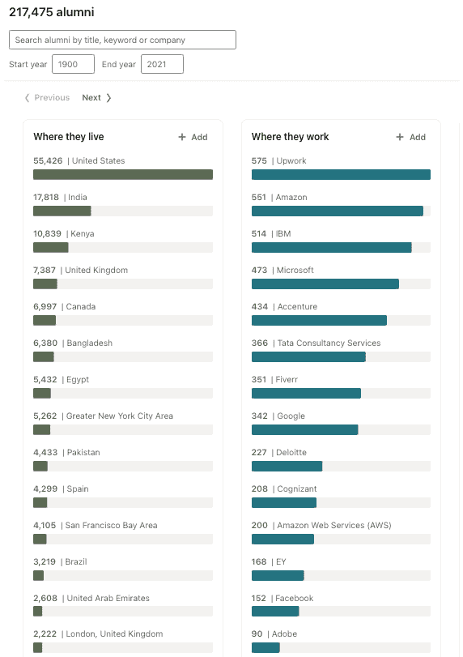

# 开发者在 2021 年花了 21 亿分钟(4000 年)使用 freeCodeCamp 其他年终事实

> 原文：<https://www.freecodecamp.org/news/freecodecamp-2021-review-budget-usage-statistics/>

2021 年对于全球免费代码营社区来说是重要的一年。在这篇文章中，我将分享我们今年达到的一些里程碑。

但是首先，让我们来看看一些衡量标准，以了解 freeCodeCamp 社区目前的运营规模。

## freeCodeCamp 2021 统计数据

2021 年，freeCodeCamp 整个运营预算只有 754030 美元。

凭借这一微薄的预算，我们的非营利组织能够提供超过 21 亿分钟的教学时间——相当于全世界人民 4000 年的学习时间。


A table showing growth of freeCodeCamp.org community over the past 7 years (exact data in table below)

以下是他们未完成的荣耀中的确切数字:

```
+-------+------------------+-----------------+---------------+
| Year  | freeCodeCamp.org | YouTube Channel | Yearly Total  |
+-------+------------------+-----------------+---------------+
| 2015  |       37,367,085 |         246,639 |    37,613,724 |
| 2016  |      189,054,404 |       1,449,703 |   190,504,107 |
| 2017  |      307,802,640 |       8,331,843 |   316,134,483 |
| 2018  |      401,473,441 |      92,197,551 |   493,670,992 |
| 2019  |      347,393,464 |     474,000,000 |   821,393,464 |
| 2020  |      508,054,160 |     764,332,218 | 1,272,386,378 |
| 2021  |      907,059,417 |   1,217,082,060 | 2,124,141,477 |
+-------+------------------+-----------------+---------------+
| Total |    2,698,204,611 |   2,557,640,014 | 5,255,844,625 |
+-------+------------------+-----------------+---------------+
```

今年，freeCodeCamp 社区的各个方面都得到了发展——论坛、课程、出版物和 YouTube 频道。自 2016 年以来，我们的使用量平均每年增长 60%。

我们在 7 年前首次推出了 freeCodeCamp.org，现在已经提供了超过 50 亿分钟的指令。


The closet office in my San Francisco Bay Area area apartment where I coded the first lines of the freeCodeCamp open source codebase back in October 2014\. Update: I now have an entire room to work in. With a window.

在我们目前的运营效率水平下， **[你捐赠给 freeCodeCamp](https://www.freecodecamp.org/news/how-to-donate-to-free-code-camp/) 的每一美元都为世界各地的人们提供了近 50 个小时的学习时间。**

从某种角度来看，我遇到过一些在科技公司工作的个人开发者，他们仅仅通过工作每年就能赚到超过 75 万美元。我们用它来运营一个全球性的非营利组织。

(顺便感谢每月捐款 5 美元支持 freeCodeCamp 的 7398 位好心人。如果你还没有捐款，这里有一些方法可以让你加入这些令人敬畏的支持者。)

## freeCodeCamp 营员获得开发者工作的统计数据

2021 年是漫长的一年，但也是充满希望的一年。许多国家设法从全球疫情中脱颖而出。freeCodeCamp 社区中的许多人将他们的空闲时间投入到学习新技能并最终为自己建立新的职业生涯中。

从事软件开发工作的 freeCodeCamp 校友人数大幅增长。

截至 2021 年 12 月，我们有超过 217，000 人[自称是校友](https://www.linkedin.com/school/free-code-camp/)(在他们的 LinkedIn 个人资料中列出至少一个认证)。



LinkedIn's breakdown of where freeCodeCamp alumni live and which companies they work for. Note that both Upwork and Fiverr are freelancing platforms, indicating these alumni probably run their own development consultancy. Large accounting firms are also well-represented here, along with major tech companies.

当他们开始使用 freeCodeCamp 时，许多人已经是开发人员了。但其中至少有 40，000 人在获得 freeCodeCamp 认证后获得了他们的第一份技术工作。

关于这一点，如果你正在阅读这篇文章，并且还没有将你的 freeCodeCamp 认证添加到你的 LinkedIn 个人资料中，我们在你的认证下面添加了一个按钮，你可以点击它来这样做。


You can click the "Add this certification to my LinkedIn profile" button below your certifications.

## 全球免费代码营社区的四大支柱

从 2016 年开始，freeCodeCamp 社区出现了 4 个主要支柱。freeCodeCamp 社区有许多方面，但这些是主要的方面。2021 年，这四款手机的使用量都有显著增长。

## 支柱 1:2021 年，freeCodeCamp 核心课程的使用率增长了 44%


The 10 verified certifications you can earn if you can power through our lengthy, no-nonsense curriculum.

freeCodeCamp 有一个 3000 小时，10 个认证长的软件工程课程。我们正在积极努力扩大它。

今年，我们发布了一项关系数据库认证，您可以在计算机的代码编辑器中直接完成这项认证。这将教会你关键的 Linux、Git、SQL 和 Postgres 概念和命令行输入。我们将很快在 freeCodeCamp.org 浏览器中提供这一功能。现在，您可以使用 Docker 安装整个认证及其所有项目。

我们在新的数据科学课程扩展方面也取得了重大进展，这将为 freeCodeCamp 的核心课程增加 11 项新的认证。

在接下来的几个月里，当它们准备好了，我们将开始一个接一个地把它们推向生产。您可以[阅读有关课程扩展的信息，并查看规划文档，看看我们将在这里涵盖哪些内容](https://www.freecodecamp.org/news/building-a-data-science-curriculum-with-advanced-math-and-machine-learning/)。

> 嘿各位，我们成功了！🎊freeCodeCamp 数据科学承诺活动超出了我们的目标。募集总额:306，667 美元
> 
> 感谢所有的 2，519 位捐助者。感谢 [@darrellsilver](https://twitter.com/darrellsilver?ref_src=twsrc%5Etfw) 捐赠的 15 万美元。https://t.co/kClO5ND4lg[pic.twitter.com/bD9mffFjsO](https://t.co/bD9mffFjsO)
> 
> — Quincy Larson (@ossia) [July 15, 2021](https://twitter.com/ossia/status/1415658657950232580?ref_src=twsrc%5Etfw)