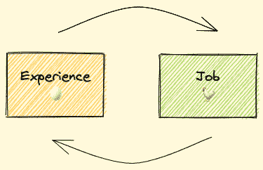

# 面向新开发人员的编程项目——构建什么来获得编码经验

> 原文：<https://www.freecodecamp.org/news/programming-projects-for-new-developers/>

如果你是一个新的开发者，你可能对“体验悖论”很熟悉。

它描述了我们许多人在试图获得第一份开发人员工作时经历的令人沮丧的循环:

要找工作，需要“工作经验”。但是要获得“工作经验”，你需要一份工作...！

Job requires experience => requires job => requires experience

当然，公司喜欢雇佣更有经验的开发人员是有原因的。但同样真实的是，没有经验的候选人可能更有动力，可能更适合公司文化，等等。

在本文中，我不会探讨新开发人员可以绕过这一悖论的所有不同方法(增加你的在线存在、在聚会上交谈、与人力资源经理联系，等等)。

相反，我在这里要谈的是我认为初学者应该采取的避免悖论的主要方法:获得真正的经验。

## 如何在工作前获得发展经验

为了获得真正的编码体验(不仅仅是编码——我们稍后会谈到),你应该积极地去编码。有道理，对吧？

作为一名导师，我经常被问到，开发人员为了实践和展示他们的技能，应该研究和创造的最好的项目想法是什么。

虽然这不是一个直接的答案，但我会说**项目想法本身并不是最重要的事情**。‌‌

‌There 有很多关于项目的想法。是的，就复杂性、技能展示和技术的真实性而言，有些比其他的更好。我的观点是，你不一定要选择最令人瞠目结舌的项目。

相反，我建议创造一个你或你认识的人会真正使用的产品。

### 为什么开发一个你会使用的产品很重要？

创建投资组合项目的目标之一是向公司证明你可以像在你的项目中一样开发他们的产品。‌‌

我说的不仅仅是最终产品，还包括辩论、设计决策和你做出的选择。所有这些都是开发人员每天要做的事情，也是公司对你的期望。

你的项目和他们的产品之间的每一个差距都是一个未知的变量，这是他们雇佣你时不得不承担的风险。你的目标是让他们知道风险越小越好。‌‌

假设，如果你的项目和他们的产品一模一样，他们会当场雇用你。当然，‌‌This 不是这种情况，但我的观点是你的项目应该尽可能多地展示真实项目的方方面面。你向他们展示你能做的每一件事——你确认的每一项技能——都会降低他们雇佣你的风险。

当我说项目的“方面”时，我指的是每个产品需要的系统组件、层次和技能。‌

如果我们谈论的是基于网络的产品，这些特性可能是技术性的，比如用于 UI /服务器、认证、通信、第三方集成等的框架和库。您还可以展示您在诸如架构、系统设计、干净代码、可读代码、可扩展解决方案等主题方面的工程知识。‌‌

有了这样的理解，我们就可以同意，最好是建立一个比你原先想象的更大更复杂的项目。

建设大型复杂项目会带来一些挑战。这其实也是我在这个帖子里想说的话题。

## 如何成功地构建一个大型复杂的项目

‌When:你在做一个项目，你最大的敌人不是你的技术知识水平(你可以提高它)，你的信心(你可以提高它)，或者缺乏资源(有很多)。‌‌

最大的敌人是你自己，或者更准确地说是你的动力。很多时候，包括我自己在内的开发人员开始一个充满兴奋的新项目，但在过程中失去了动力，并放弃了项目。

### 为什么动力会消退？

让我们后退一步，记住激励是如何起作用的。作为一个**奖励系统**的骄傲拥有者，我们被“编程”为通过给我们好的感觉来帮助我们完成目标的事情(“奖励”)。

行动和奖励之间的“联系”越紧密，我们再做一次的机会就越大。这就是我们的身体和思想如何“指导”我们去做正确的事情。‌‌

想想你为了获得情感回报而做的事情:制作有趣的视频以获得 Ticktock 上的赞，在 StackOverflow 上回答问题以建立你的声誉，或者努力工作以资助你一直梦想的假期。

我们的动机受到奖励制度的强烈影响。

> 动机是奖金数额和获得奖金所需时间的函数。

但是如果奖励不是立竿见影的呢？如果去领奖的路程很长怎么办？行动和奖励之间的联系变弱了，然后动机也变弱了。

### 如何在项目工作中保持动力

一个解决办法是扩大奖金——但这并不总是可能的。很多时候，奖是给的。‌‌另一个解决方案是将奖品“分割”成小块，这样我们就可以一路赢得东西。

> 例如，一年 10 万美元=一天约 274 美元。

因此，为了保持我们强大的动力，我们应该让自己更经常地赢得胜利，即使是小的胜利。我们应该经常得到奖励，以保持高昂的动机，否则，它就会下降。

你知道“Flappy Bird”吗？这是一个游戏，你需要不断打“空间”(奖励)，以防止鸟(动机)下降。

Screenshot taken from [https://flappybird.io/](https://www.freecodecamp.org/news/p/e7d96cd3-e869-406b-9957-e1dec350eacb/Screenshot%20taken%20from%20https://flappybird.io/)

你的项目也是如此。当一个项目帮助你实现一个目标(找到一份工作)或让你感到一种积极的感觉，如自豪(你赢得了挑战)，你就获得了奖励。或者你从帮助你关心的人中获得满足感，或者当有人在 Twitter 上提到你时，你感到受宠若惊。

在所有这些情况下，你都得到了回报。‌‌:但是偶尔有好的感觉是不够的。为了保持动力，你应该经常感受它。

现在我们可以理解为什么项目的确切类型并不那么重要。因为它不一定经常回报你。

以下是一些可以经常获得奖励的项目示例:

*   一个被许多用户使用并得到良好反馈的产品。**奖励**:喜欢，下载/访问次数，等等。
*   一个好的产品(比如一个非盈利组织)。**奖励**:你每天早上对着镜子里的笑脸，做着好事。
*   改善你生活的产品。**奖励**:你的生活质量不断提升。

什么，一个能帮你找到工作的产品？它应该给你好的感觉，对不对？‌‌

嗯，这很棘手。你还记得那个等式吗:“动机是奖金数额和获得奖金所需时间的函数”？‌‌:被录用的奖金当然很高，但是时间呢？时间不详。因此，随着时间的推移，“行动和奖励之间的联系变得越来越弱，motivation"‌‌.也是如此

虽然做一个得到良好反馈的项目经常会让你感觉良好，但一个仅仅为了找工作而做的毫无意义的项目却不会(当然，除非你被录用了)。

### 如何建立一个你实际使用的项目

通常前两种类型的项目——一种有大量用户，另一种有很好的理由——对于初学者来说更难获得。这可能需要一些时间来达到这样一个点。‌‌

这就给我们留下了第三种类型——“改善你生活的产品”。‌‌The:这类项目的好处在于，它通常只是从改善你的生活开始的。然后，在这个过程中，您会发现更多您需要的特性，并在过程中添加它们。使用你制造的好产品当然会给你带来回报，所以你的动力仍然很高。

随着你添加越来越多的功能，应用程序变得越来越复杂。现在你不能到处扔零件。你必须对结构、设计和建筑做出计划和决定。您必须决定采用哪些工具和库。

你的每一个想法和每一个决定都涵盖了我上面提到的“方面列表”中的一些方面(也就是说，公司希望看到你拥有的技能)。如果你做对了，公司雇佣你的时候就会降低风险。

事实上，根据我的经验，技术面试的一个主要部分是“以前的经验”对话。在这段对话中，面试官会问你以前的经历，重点是你做过的决定，处理过的挑战，以及你对产品的技术了解程度。

你在这一部分要谈的越多，你表现出色并给面试官留下深刻印象的机会就越大。

好了，回到你的大项目。有一天你开始想“这个应用太棒了。如果我从使用它中获得了真正的价值，也许其他人也会这样做”。所以你出版了它。现在，人们可以找到并使用你的应用，谁知道呢，也许他们甚至会喜欢它。

他们中的一些人会非常喜欢它，以至于他们会公开留下好的反馈。人群中有人力资源经理。他们使用你的应用，他们阅读反馈，偶然地，他们需要一个新的开发者——一个快乐的巧合！

‌See 发生了什么事？你创建了这个应用程序来改善你的生活，然后:

*   这对其他人有好处，❤️，然后
*   你得到了很好的反馈👏然后
*   你得到了面试机会💻

这是一个三赢的局面。

这个想法的好处是，即使最终没有得到工作机会，它也能帮到你。也许其他人甚至不会使用你的应用程序——但是，嘿，它仍然改善了你的生活和你的编码技能，这使你更接近一份工作。额外的好处只是额外的。

### 这里有什么风险？

当你读到这里的时候，你可能会想“为什么我要为自己创造一个产品？我需要的每个产品都已经做好了。我不可能做得更好”。

首先，你(还)不是创业公司。如果你要开发一个已经开发好的产品，没有什么不好的事情会发生。

第二，你可能有一些关于如何改进你使用的产品的好主意。也许有些功能是你想添加的，有些是可以删除的，等等。

举个例子:我一直在使用一款购物清单应用。这是一个很棒的应用程序，可以在所有家庭设备之间同步列表，允许你设置类别，保留历史记录以便更容易地重新添加产品，并且可以在手机和桌面上打开。非常方便。

我真的很喜欢使用它，但是一路上我觉得它并不适合我。一些功能丢失了，比如无法上传产品照片。我也不能设置紧急程度，如果是共享列表，我也看不到谁添加了每个产品。另外，历史视图显示的是已经添加到列表中的产品，所以很容易混淆。

我很确定这听起来很熟悉，至少对于你正在使用的应用程序来说是这样。所以，带着你的想法，试着去实现它们。

## 结论

那么问题是什么？作为一个新的开发者，你应该做什么类型的项目？

做一个你或你认识的人会喜欢使用并觉得有用的产品。

我怎么知道这有用？嗯，这正是我十年前得到第一份工作时所做的。我自己的一些成功项目也是这样开始的。

哦，关于购物清单应用程序？是的，我自己做了一个。这是一个渐进式网络应用程序，具有我提到的所有功能，甚至更多。非常欢迎您在 [my Github](https://github.com/moshfeu/) 上查看它和我的其他开源项目。

感谢阅读！祝您的开发者之旅好运。