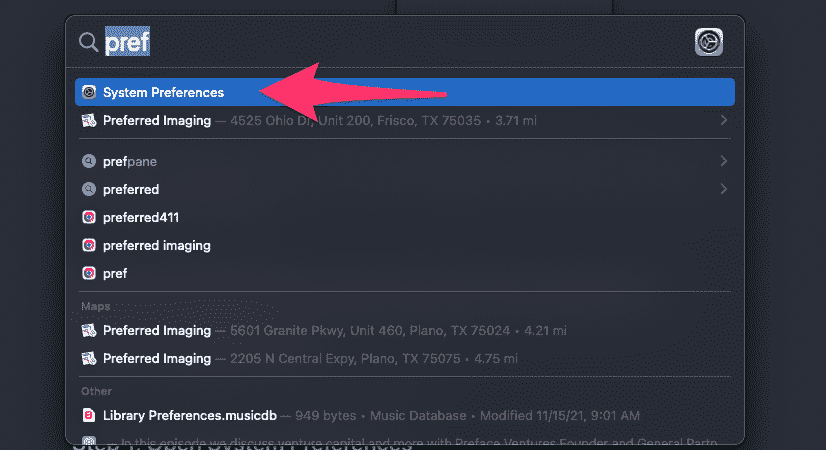
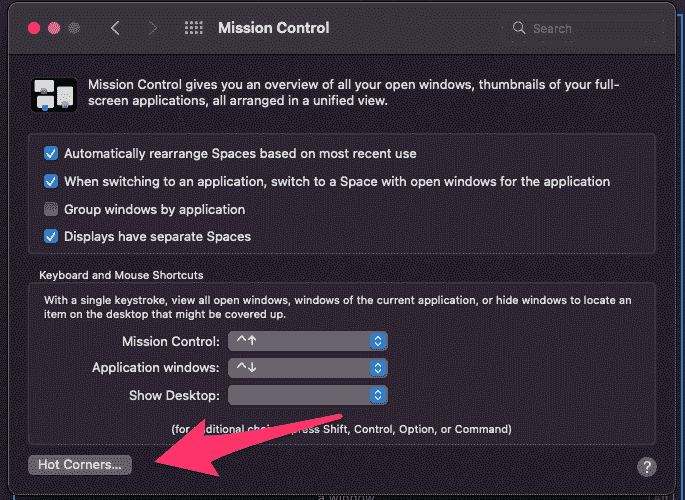
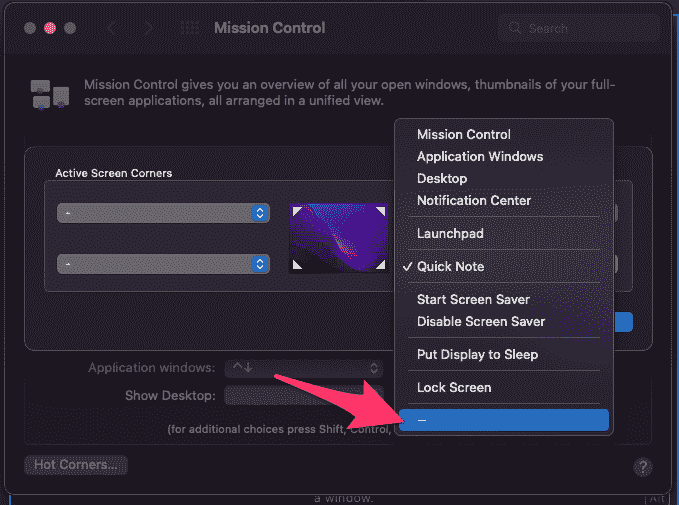

# 如何关闭快速笔记和热门角落[为 MacOS Monterey 解决]

> 原文：<https://www.freecodecamp.org/news/turn-off-quick-note-mac-monterey/>

我最近更新到了 MacOS Monterey(版本 12.0)。有时候像苹果这样的软件公司会添加我不喜欢的功能，然后默认启用。这就是新的 Quick Note 热角所发生的情况。

当您将光标移动到屏幕的右下角时，快速笔记功能看起来是这样的:

The New Quick Note feature in the lower right hand screen of MacOS Monterey

我喜欢 MacOS Monterey 的许多功能，但我不喜欢当我移动鼠标时这些功能如此频繁地弹出。所以我关闭了它。你也可以这样做，而且只需要几秒钟。

## 如何在 MacOS Monterey 中禁用新的快速笔记功能

首先，导航到你的 MacOS 偏好设置。

### 步骤 1:打开“系统偏好设置”

最快的方法是按下 **Command + Space** 打开 Spotlight。

然后输入“pref ”,你应该会看到一个系统偏好选项。

MacOS Spotlight is a helpful way to open up applications quickly. You can open it by pressing Command + Space

### 步骤 2:打开 Mission Control 偏好设置

Click the Mission Control icon pointed to above

### 第三步:点击“热门角落…”按钮

The Hot Corners button is in the lower left-hand corner

### 步骤 4:禁用快速笔记热点手势

您现在可以禁用快速注释热点。如果你愿意，你可以把这个热点分配给其他东西。我个人觉得这些热门角落与其说有用，不如说让人分心，所以把这四个都关掉。

请记住:你可以用热点角落做的任何事情，都可以用 MacOS 内置的 Spotlight 功能来完成。

Click the drop down for the lower-right hand corner and set it to "–" which means nothing will happen when you move your cursor to the lower right hand corner of your screen.

### 步骤 5:点击 OK 按钮，关闭 Mission Control

恭喜你。您已经禁用了快速笔记热点。应该不会再弹出来了。

我希望这有所帮助。祝你度过愉快而富有成效的一天。