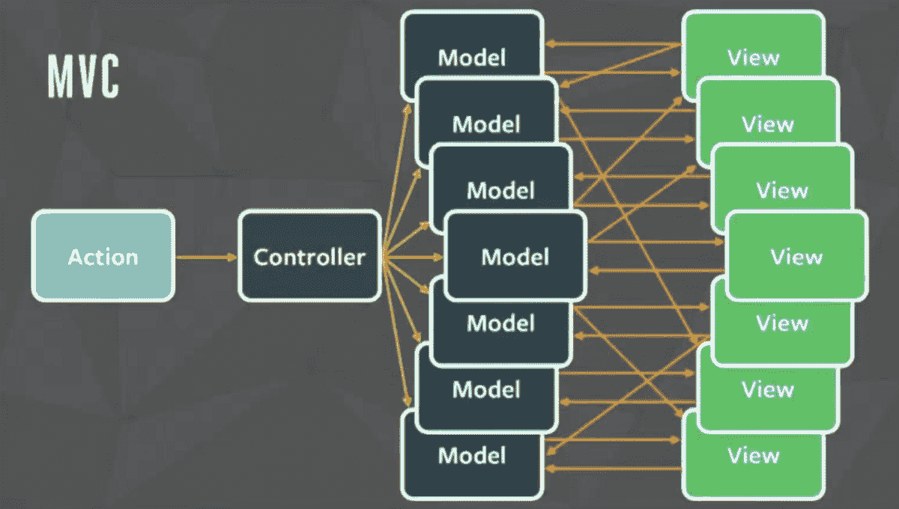
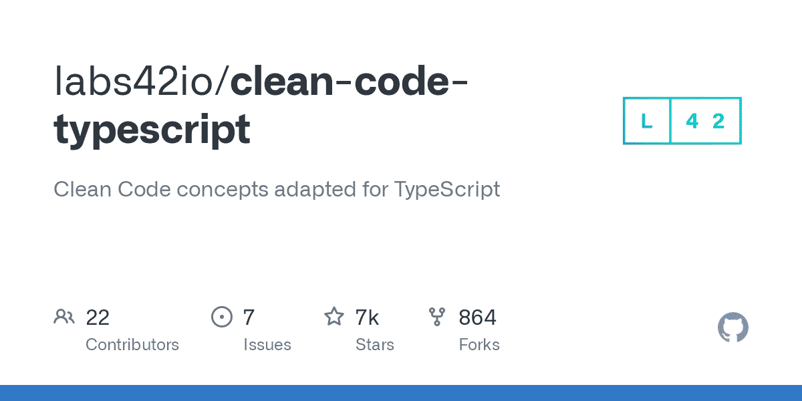
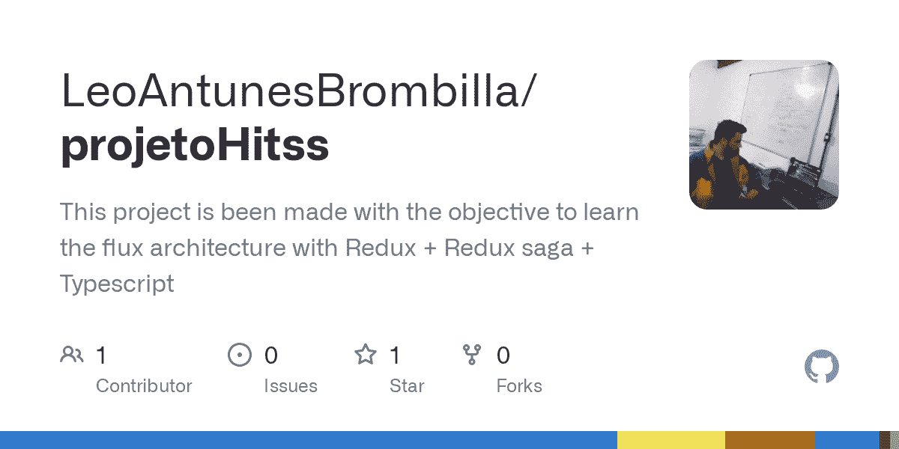

# 我得到了我的第一份开发工作——这是我迄今为止学到的东西

> 原文：<https://www.freecodecamp.org/news/what-ive-learned-at-my-first-developer-job/>

在本文中，我将与您分享我作为初级全栈开发人员在第一份编程工作中所学到的东西。

自从 2021 年 7 月开始我的开发者生涯以来，我一直在不断地学习。我将分享一些我的经验，这样你也可以学习。

在我的公司，我在一个有很多用户的服务上从前端到后端处理端到端的任务

好吧，这里是我从这次经历中学到的技巧和窍门。

## 技术

在我工作的头几个月，我学到了很多技术技能(有些人可能称之为“硬技能”)。以下是亮点:

### 架构和设计模式

首先让我大开眼界的是我在工作中接触到的建筑。当我们在做小项目时，我们很少考虑架构——这没关系，因为我们才刚刚开始。

但是关于最常用的架构模式还有很多要学的(比如[微服务](https://www.freecodecamp.org/news/microservices-architecture-for-humans/)、 [MVC 模式](https://www.freecodecamp.org/news/the-model-view-controller-pattern-mvc-architecture-and-frameworks-explained/)、[无服务器架构](https://www.freecodecamp.org/news/how-to-get-started-with-serverless-architecture/)...不胜枚举)。

我最近了解到的一个非常酷的模式是存储库模式。这种模式有助于将应用程序与数据分离开来。

那么为什么这是有帮助的呢？因为它让您可以轻松地更改数据库技术。看看下面的例子，看看它是如何工作的:

```
import {takeLatest, put, call, select} from 'redux-saga/effects';

import {authError, signIn, signOut, signUpSuccess} from '../actions';

import {
  signInWithEmailPasswordFirebase,
  signOutFirebase,
  signUpWithEmailPasswordFirebase,
} from '../repository';

import {
  AuthAction,
  AuthSignInInput,
  AuthSignUpInput,
  AuthTypes,
} from '../types';

import * as authSelectors from '../selectors/index';

export function* requestSignInEmailPasswordSaga(
  props: AuthAction<AuthSignInInput>,
): any {
  const email = props.payload.email;
  const password = props.payload.password;

  try {
    if (email && password) {
      const userCredentials = yield call(
        signInWithEmailPasswordFirebase,
        email,
        password,
      );

      yield put(signIn(userCredentials._user));
    }
  } catch (err: any) {
    yield put(authError('cannot sign In'));
  }
}

export function* requestSignOutSaga(): any {
  try {
    const isLogged = yield select(authSelectors.isLogged);

    if (isLogged) {
      yield call(signOutFirebase);
    }
    yield put(signOut());
  } catch {
    yield put(signOut());
  }
}

export function* requestSignUpEmailPasswordSaga(
  props: AuthAction<AuthSignUpInput>,
): any {
  const email = props.payload.email;
  const password = props.payload.password;

  try {
    if (email && password) {
      yield call(signUpWithEmailPasswordFirebase, email, password);
    }

    yield put(signUpSuccess());
  } catch (err) {
    yield put(authError('cannot sign Up'));
  }
}

export default [
  takeLatest(
    AuthTypes.REQUEST_SIGNIN_EMAIL_PASSWORD,
    requestSignInEmailPasswordSaga,
  ),
  takeLatest(AuthTypes.REQUEST_SIGNOUT, requestSignOutSaga),
  takeLatest(
    AuthTypes.REQUEST_SIGNUP_EMAIL_PASSWORD,
    requestSignUpEmailPasswordSaga,
  ),
];
```

在我的传奇中，我调用了一些服务，但是我没有在内部直接调用。如您所见，我是从存储库呼叫的:

```
import {firebase} from '@react-native-firebase/auth';

export const signUpWithEmailPasswordFirebase = async (
  email: string,
  password: string,
) => {
  return firebase
    .auth()
    .createUserWithEmailAndPassword(email, password)
    .then(user => console.log(user + 'signed Up'))
    .catch(err => {
      throw new Error(err);
    });
};

export const signOutFirebase = () => {
  firebase.auth().signOut();
};

export const signInWithEmailPasswordFirebase = async (
  email: string,
  password: string,
) => {
  return firebase
    .auth()
    .signInWithEmailAndPassword(email, password)
    .then(user => user.user)
    .catch(err => {
      throw new Error(err);
    });
};
```

我的存储库正在处理与 Firebase 服务的所有联系，该服务将我的用户拉过来。如果我决定出于任何原因改变 Firebase，我只需要改变这个文件，我的传奇就会安然无恙。

另一方面，如果我决定在代码的另一部分使用任何 Firebase 服务，我可以直接从存储库中调用服务，而不需要经过其他地方。从长远来看，这种关注点的分离非常有帮助。

如果你想了解更多，这里是整个项目的链接:

[GitHub - LeoAntunesBrombilla/waterPlant: A water reminder app for your plantsA water reminder app for your plants. Contribute to LeoAntunesBrombilla/waterPlant development by creating an account on GitHub.LeoAntunesBrombillaGitHub](https://github.com/LeoAntunesBrombilla/waterPlant)

本文可以帮助您更多地了解这种模式:

[Patterns — Generic Repository with Typescript and Node.jsIf you work with Node.js/Javascript and you have many replicated codes for different data models or create CRUDs (Create, Read, Update and Delete) at all times, then this post is for you! Working…Erick WendelMedium](https://medium.com/@erickwendel/generic-repository-with-typescript-and-node-js-731c10a1b98e)

### 全局状态管理

当我在做我的 React 项目时，我不知道全局状态管理和 Flux 架构。但是我明白了知道这件事是很重要的。你可以在这个通量架构的介绍中读到更多关于它的 **[。](https://www.freecodecamp.org/news/an-introduction-to-the-flux-architectural-pattern-674ea74775c9/)**

Redux 将帮助你实现这个架构，但是许多其他的库可以帮助你处理 Flux 架构——比如 Mobx。如果你想了解 Redux 的大概意思，在这里阅读！您可以尝试学习其中一个库，并在它的基础上构建一个项目。

几年前脸书的问题就是一个例子。这个问题在下面的文章中有更好的解释:

[What is Flux Architecture? Why Facebook used it? and the Comparison with MVC architecture.Flux is an architectural pattern proposed by Facebook for building SPAs(Single Page Applications). It is not any framework, it is just the architecture or the pattern to make client-side web…Vinayak GroverMedium](https://medium.com/@grover.vinayak0611/what-is-flux-architecture-why-facebook-used-it-and-the-comparison-with-mvc-architecture-49c01ed5d2e1)

### 干净的代码

交付干净易读的代码非常重要。所以如果你能做到这一点，那么你就领先了。

有很多存储库展示了每种语言的最佳实践，因此您可以搜索您的存储库，并尝试编写这样的代码。

这里有一个简单但重要的例子。不要使用这个:

```
const a = "Leonardo"
```

什么是`a`？作者的名字？一个住在巴西的人的名字？你不知道，因为除了创建这个变量的人之外，没有人知道这个变量的上下文是什么。一段时间后，即使是写它的人也不会知道。

所以，不如这样做:

```
const freeCodeCampColaborator = "Leonardo"
```

现在即使我不写任何评论，你也知道来龙去脉了。例如，当你在一个拥有超过 1000 个文件的大型 monorepo 中时，搜索这样的内容要容易得多。

在下面的报告中，您可以看到更多 JavaScript 良好实践和干净代码的示例:

[GitHub - ryanmcdermott/clean-code-javascript: Clean Code concepts adapted for JavaScript:bathtub: Clean Code concepts adapted for JavaScript - GitHub - ryanmcdermott/clean-code-javascript: Clean Code concepts adapted for JavaScriptryanmcdermottGitHub](https://github.com/ryanmcdermott/clean-code-javascript)

并在此查看 TypeScript:

[GitHub - labs42io/clean-code-typescript: Clean Code concepts adapted for TypeScriptClean Code concepts adapted for TypeScript. Contribute to labs42io/clean-code-typescript development by creating an account on GitHub.labs42ioGitHub](https://github.com/labs42io/clean-code-typescript)

### 这些技能都是怎么学的？

我通过构建项目和向同事寻求反馈来学习这些技能。但是我建议，即使你没有任何同事，你也应该阅读一些好的教程，然后尝试在其中构建项目。

确保使用你正在尝试学习的技术。如果你只是阅读，而不是构建，你就不会完全掌握它们。

如果你需要一个关于如何做的更一般的想法，我有一个关于这个方法的项目:

[GitHub - LeoAntunesBrombilla/projetoHitss: This project is been made with the objective to learn the flux architecture with Redux + Redux saga + TypescriptThis project is been made with the objective to learn the flux architecture with Redux + Redux saga + Typescript - GitHub - LeoAntunesBrombilla/projetoHitss: This project is been made with the ob...LeoAntunesBrombillaGitHub](https://github.com/LeoAntunesBrombilla/projetoHitss)

## 非技术技能

### 积极主动

如果你在远程工作，通常很难表现出你的主动性和工作效率。如果你是第一次从事开发工作，像我一样，要求做一些事情可能听起来很可怕——但是当你能够完成时，这是非常值得的。

即使你不能完成或者不理解任务，也要寻求帮助。这很正常，也非常有用。

这里有一个很好的例子:假设你刚刚完成了一项任务，现在你必须等待代码审查或其他事情。与此同时，你可以向其他人提供帮助，与开发人员以外的人交谈以了解更多业务方面的知识，并记录你在第一个任务中遇到的一些环境困难，以便其他人也可以从中学习。

### 学习如何寻求帮助

作为开发人员，你将学到的技能之一是如何提出更好的问题。在我成为程序员之前，我学习数学，在做我的学士论文时，我学会了如何向我的导师提好问题。

这是我的一个主要建议:尽量缩小你的问题范围。

如果你带着这样的问题:“我不知道反应本地，你能帮助我吗？”你能期待什么样的回答？如果你什么都不知道，可以从谷歌搜索开始，找到一些相关的资源。

然后你可以问懂技术的同事，“嘿，我正在努力学习 React Native，发现了这些材料——你有什么建议吗？他们好吗？”

作为另一个例子，让我们假设您被分配了一个任务来使一个 div 居中。过了一段时间后，你无法做到这一点，你想请别人来帮助你。不要这样问:

“嘿，我试图将这个 div 居中，但是我做不到——这是怎么做到的？”

相反，这样问:

“嘿，为了使这个 div 居中，我尝试过这种方法，但因为这个方法不起作用，然后我又尝试了这个方法....诸如此类，所以...你有更好的办法吗？”

在问一个好问题的道路上，有时你会找到你的答案。笼统和抽象的问题不太好，因为它们让你看起来像是在放弃，甚至在尝试之前就寻求帮助。如果你试了，还是不知道答案，那就去尝试吧——寻求帮助。随着你获得更多的经验，你会更善于提问。

### 保持有条理

如果你不是观念型的，就记下你一天都做了什么。创建一个系统来记住会议或愚蠢的事情，如果你把它们留在记忆中，你可能会忘记。

如果有人让你做一些简单的事情，比如把对一项任务的描述从这个改成这个，而你却忘记了，因为你已经忙得不可开交了。

因此，拥有一个有条理的笔记系统并坚持下去不仅重要。这将向你的团队和老板展示，没有人全天候监视你，你也能完成工作。

托马斯·弗兰克的 YouTube 频道有很多有用的技巧，可以让你保持条理，把事情做好。

[https://www.youtube.com/embed/ODXV-fb_c-I?feature=oembed](https://www.youtube.com/embed/ODXV-fb_c-I?feature=oembed)

## 结论

当你开始你的第一份开发工作时，你会学到很多不仅仅是与代码相关的东西——所以要敞开心扉。学会谷歌求助！

就是这样！希望我的经验对你有帮助，编码愉快:)

如果你想联系我，你可以在 [LinkedIn](https://www.linkedin.com/in/leonardo-brombilla/) 上找到我。