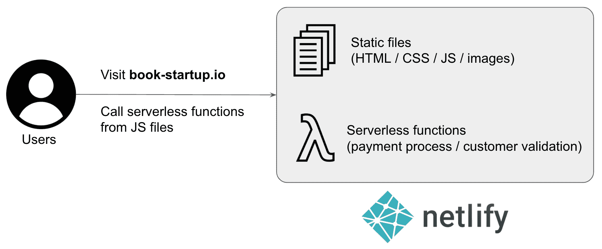
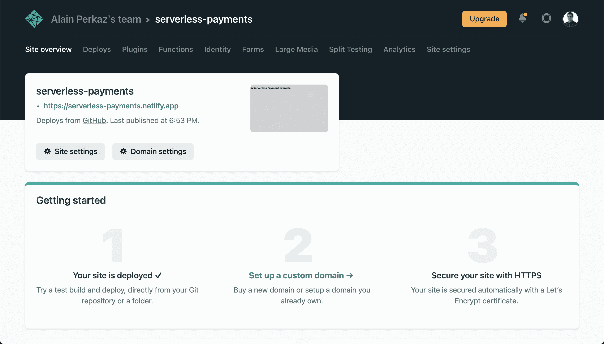
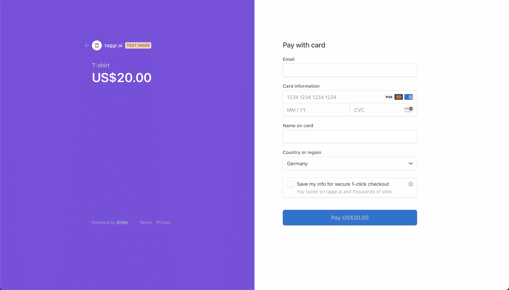

# 如何使用 Netlify 和 Stripe 设置无服务器在线支付

> 原文：<https://www.freecodecamp.org/news/serverless-online-payments/>

许多年轻的创业公司采取的第一步是建立一个静态网页，也许是电子邮件简讯，以帮助他们建立一个观众群。

随着时间的推移，MVP 的进展越来越快，如何处理支付的问题最终会浮出水面。

从一次性支付到 SaaS 订阅，支持在线支付可能令人生畏且耗时。这篇文章将向您介绍一种使用 Stripe 处理在线支付的简单方法，除了静态网页之外，不需要任何额外的基础设施。

你不需要定制的后端来存储支付信息，也不需要 cron 作业来发送发票，也不需要在单独的数据库中跟踪客户。如果你是一个单一的创始人或早期阶段的创业公司，想要验证这个想法，而不是创建一个定制的解决方案，这是完美的。

听起来不错？让我们开始吧！🤿

## 项目的高级概述

出于本文的考虑，我们将定义一个早期启动用例，其中这种无服务器在线支付设置将带来最大的价值(低成本和快速实现)。

假设我们的创业想法是自助出版一本书。由于这本书正在定稿，我们想开放这本书的终身访问作为预售。

我们需要一种方法来处理终身访问这本书的付款。为此，我们需要一个支付处理器，也许还需要一种方法来运行一些远离客户端的逻辑(例如，利用支付处理器的 API)。

### 支付处理器

有大量的支付处理器可用，每一个都有不同的条款、对支付方式的支持和公共 API。对于我们的无服务器在线支付处理器，我们将使用 [Stripe](https://stripe.com/) 。我选择使用 Stripe 有两个原因:

首先，Stripe 是业界领先的支付处理器，具有出色的 API。他们的 API 被广泛地文档化，并且他们为许多语言(包括 JS)提供集成 SDK。设置它是完全免费的，你只需为每笔交易支付一小笔佣金。

其次，Stripe 提供 Stripe Checkout，这是一款免费产品，专为提高转化率和支持各种支付选项而打造。它集成起来非常简单，而且有一个很棒的 UI。

### 服务器呢？

明确地说，一旦用户输入支付数据，Stripe 需要一些服务器端代码来生成会话。开发人员可以使用该会话来执行与支付相关的操作(而不会暴露敏感的支付细节)。

在你真的对我失望之前，让我澄清一下，我们不需要建立一个专用的服务器😅。这可能看起来有点矛盾，但是 Stripe 要求一些交互代码处于类似于环境的服务器- **(无服务器计算来拯救！).**

幸运的是，现在是 2021 年，有相当多的选项可以按需执行服务器端代码。大多数云提供商都提供这种功能(AWS lambdas、Google Cloud 云函数、Azure 函数……你能想到的都有)。

由于我们的初创公司已经有了一个网页，我们将使用[网络功能](https://www.netlify.com/products/functions/)。它将允许我们几乎不需要额外的配置就可以运行服务器端代码，并且它可以很好地处理现有的 web 页面静态数据。

将静态 web 资产与按需无服务器功能相结合的范例是 [JAM Stack](https://jamstack.org/) 的一部分(我们将在另一篇文章中讨论)。请继续阅读如何设置无服务器支付的详细说明。



High-level schema of the solution

# 逐步项目设置

很好，现在你已经对问题空间和我们将用来构建解决方案的工具有了清晰的了解，让我们来构建它。🛠

完整的代码示例可在[https://github.com/aperkaz/serverless-payments](https://github.com/aperkaz/serverless-payments)获得。

### 如何设置网络生活

首先，创建一个 [Netlify](https://www.netlify.com/) 账户(如果你还没有的话)。免费层足以满足中等程度的使用，因此无需担心。

Netlify 通过连接到 Github / Gitlab / Bitbucket 中的 Git repo，为我们的网页和无服务器功能的自动部署提供 CI/CD。因此，让我们用您的网站资产在其中一个提供商处创建一个回购。

接下来，安装 [Netlify CLI](https://cli.netlify.com/getting-started/) 。它会问你一些问题，并请求访问你的 Netlify 和 Git repo 提供者(在我的例子中是 GitHub)。


*Installing the CLI with* `npm install netlify-cli -g`

此时，我们可以推送到存储库的`main` / `master`分支，Netlify 会自动部署。你可以在控制台运行`netlify open`打开 Netlify 的管理面板，访问部署的 URL。



很好，自动部署准备就绪，现在让我们设置条带。💸

### 如何设置条纹

在 Stripe 中创建一个帐户，验证电子邮件，然后登录。然后，[生成一组 API 密钥](https://stripe.com/docs/keys)(秘密密钥和可公开密钥)。

您必须小心使用这些密钥，并且永远不要在代码中提交密钥。因为我们将在服务器端代码中需要它，所以我们将它作为一个[环境变量](https://www.netlify.com/blog/2021/07/12/managing-environment-variables-from-your-terminal-with-netlify-cli/)保存。

```
# Create a new env variable in Netlify
netlify env:set STRIPE_SECRET "sk_****"

# We can access it on our server-side JS code by:
process.env.STRIPE_SECRET
```

出于本教程的考虑，我们将使用[示例 API 键](https://stripe.com/docs/payments/accept-a-payment?integration=checkout#set-up-stripe)，但也可以随意使用您自己的键。如果您使用您的密钥，您将需要添加产品和价格([文档](https://support.stripe.com/questions/how-to-create-products-and-prices))。

### 如何添加无服务器功能

抓紧了，我们快到了！我们只需要服务器端代码来创建条带检出会话并完成我们的演示。

首先，为了让我们的功能可以从[https://serverless-payments.netlify.app/api/stripe](https://serverless-payments.netlify.app/api/stripe)访问，我们需要添加一些配置。让我们从在 repo 的根目录下创建`netlify.toml`文件开始。

```
[build]
  command = "# no build command"
  functions = "netlify/functions"
  publish = "."

[[redirects]]
  from = '/api/*'
  to = '/.netlify/functions/:splat'
  status = 200
```

然后，我们可以添加会话创建者功能。这里解释[。](https://stripe.com/docs/payments/accept-a-payment?integration=checkout#set-up-stripe)

```
// netlify/function/stripe.js

const stripe = require("stripe")(process.env.STRIPE_SECRET);

exports.handler = async (event, context) => {
  const session = await stripe.checkout.sessions.create({
    payment_method_types: ["card"],
    line_items: [
      {
        price_data: {
          currency: "usd",
          product_data: {
            name: "T-shirt",
          },
          unit_amount: 2000,
        },
        quantity: 1,
      },
    ],
    mode: "payment",
    success_url: "https://serverless-payments.netlify.app/success",
    cancel_url: "https://serverless-payments.netlify.app/cancel",
  });
  return {
    statusCode: 200,
    body: JSON.stringify({
      id: session.id,
    }),
  };
};
```

现在我们可以用`fetch("/api/stripe")`从 JS 主体调用无服务器函数。它将根据负载进行扩展，您只需为调用付费。那么它将在每次推送到`main`时被部署。太棒了。🍬

为了简洁起见，我跳过了 HTML 文件中处理条带检出回调的剩余代码。代码可在[这里](https://github.com/aperkaz/serverless-payments)获得。

完整的例子可以在[https://server less-payments . net lify . app](https://serverless-payments.netlify.app/)上找到。您可以使用`4242 4242 4242 4242`作为信用卡号来测试成功的支付流程。



Stripe Checkout in all its glory, accessible from [our page](https://serverless-payments.netlify.app)

## 结论

在线支付对许多在线业务来说至关重要，但通常是仓促实施或过度设计。上面介绍的解决方案适用于单页面应用程序，因此您可能还不需要一个成熟的服务器来处理支付。🙂

我希望这篇文章能够帮助您轻松地将支付处理添加到现有的 web 页面中。快速销售您的产品，让客户满意！