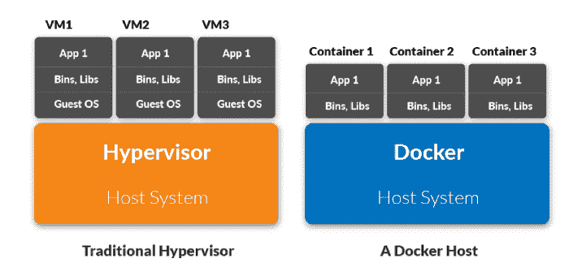

# 为什么你应该现在就开始使用 Docker

> 原文：<https://www.freecodecamp.org/news/why-you-should-start-using-docker-now/>

大约一年前，我正准备发布 [Caer](https://github.com/jasmcaus/caer) ，这是一个 Python 语言的计算机视觉库，将在 PyPi 上公开。但首先，我决定把它寄给一个在阿尔伯塔省的朋友，让他修改一下。

几天后，我发现他仍在试图弄清楚如何让它在他的机器上工作。

几十个小时后，我终于找到了原因——Caer 实现了其他 Python 包的早期版本中的代码，而这些代码在它们的新版本中是不可用的。

所以尽管安装了这些包，我的朋友还是不能运行 Caer。

像这样的问题并不是 Python 包特有的。当将本地构建的代码移植到产品中时，您可能会遇到类似的情况，并且由于不同的操作系统而无法正常工作。

但是，如果有一种方法可以缓解这个可移植性的问题呢？

> 嗯，有——码头工人！

在我们谈论 Docker 之前，你需要理解一个*容器背后的直觉。*

## 什么是容器？

容器是一个完整的运行时环境:一个应用程序及其运行所需的所有依赖项、库、二进制文件和配置文件都打包到一个包中。


Photo by [Victoire Joncheray](https://unsplash.com/@victoire_jonch?utm_source=ghost&utm_medium=referral&utm_campaign=api-credit) / [Unsplash](https://unsplash.com/?utm_source=ghost&utm_medium=referral&utm_campaign=api-credit)

*容器化*抽象出操作系统分布、应用程序依赖性和底层基础设施的差异。

## 容器类似于虚拟机，但要小得多

对于虚拟化，这些容器被称为*虚拟机。*除了应用程序，还包括操作系统。运行三台虚拟机的服务器上可能运行三种不同的操作系统。

想象一下这会变得多么庞大。

相比之下，你可以用 Docker 让同一台服务器运行 3 个容器化的应用程序，它们都运行相同的操作系统。共享的操作系统部分是*只读的*，而容器有一个挂载(一种访问容器的方式)用于写入。

虚拟机的大小可能有几千兆字节，而容器的大小可能只有几兆字节。

## 容器的魔力

当应用被容器化时，只有*操作系统*被虚拟化，而不是硬件(虚拟机就是这种情况)。虚拟操作系统不是配置硬件，而是配置给应用程序，使您能够运行多个应用程序并随心所欲地设置资源限制。



[Source](https://containerjournal.com/topics/container-ecosystems/kubernetes-vs-docker-a-primer/): Container Journal

## 如何使用 Docker

Docker 是一个容器化工具，开发人员使用它来为他们的应用程序构建隔离的、可复制的环境。

它有一个快速的开发过程，易于使用，在本地机器、开发、暂存和生产服务器上工作是一样的，并且它是非常可伸缩的。

事实上，Docker 推动了应用程序容器化的转变，并且毫无疑问是当今市场上最强大的玩家。

#### 如何安装 Docker

*   Windows 或 MacOS:安装 [Docker 桌面](https://www.docker.com/get-started)
*   Linux:安装[坞站](https://docs.docker.com/compose/install/)和[复合坞站](https://docs.docker.com/compose/install/)

如果你在 Linux 上，你需要以 root 用户的身份运行你的命令，或者将用户添加到 Docker 组:

```
sudo usermod -aG docker $(thatsme)
```

## 如何创建 Dockerfile 文件

在 Python 中，要将应用程序容器化，需要将其打包成 Docker 映像。要生成一个 docker 文件，您需要定义一个 docker 文件。这个文件名就是简单的 **DOCKERFILE** (没有扩展名)。

```
# Defining a base image (Python 3 in our case)
FROM python:3# Adding a Python script to be run

ADD hello_world_script.py /

# If our script uses the Caer package, we'll have to pip install it:RUN pip install caer

# To execute the Python script:
CMD [ "python", "./hello_world_script.py" ]
```

*   指示 Docker 应用程序基于什么样的图像(我知道有点拗口)
*   `RUN`执行任何附加命令(如 pip 安装)
*   `CMD`加载图像时执行命令

在这个演示中，我使用了`caer`包，您可以用一个简单的`pip install caer`来安装它。

假设，我们的`hello_world_script.py`脚本如下所示:

```
# Taken from the Caer Github repo
# https://github.com/jasmcaus/caer

import caer

print(caer.__version__)

img = caer.imread('./img1.png')

print(img.shape) # image shape
print(img) # image tensor 
```

要从 Dockerfile 文件构建映像，继续运行以下命令:

```
docker build -t caer-readimg .
```

一旦构建了映像，您就可以将它作为容器运行。

您还会注意到一个“caer-readimg”图像(您可以通过运行`docker images`命令查看所有 Docker 图像)。

要运行这个映像，

```
docker run caer-readimg
```

## 如何删除 Docker 图像

```
# The image_id can be found when you run `docker images`

docker rmi <image_id>
```

## 如何删除 Docker 容器

```
# Retrieve the container ID:
docker ps -a 

# Deleting the container
docker rm <container_id>
```

# 包扎

Docker 入门就是这么简单。当然，如果您的应用程序像上面讨论的代码一样简单，您可能不需要构建 Docker 映像——但是如果您与多人一起处理同一个项目，这是有意义的。

请务必在 Twitter 上[关注我，了解未来文章的更新。快乐学习！](http://twitter.com/jasmcaus)