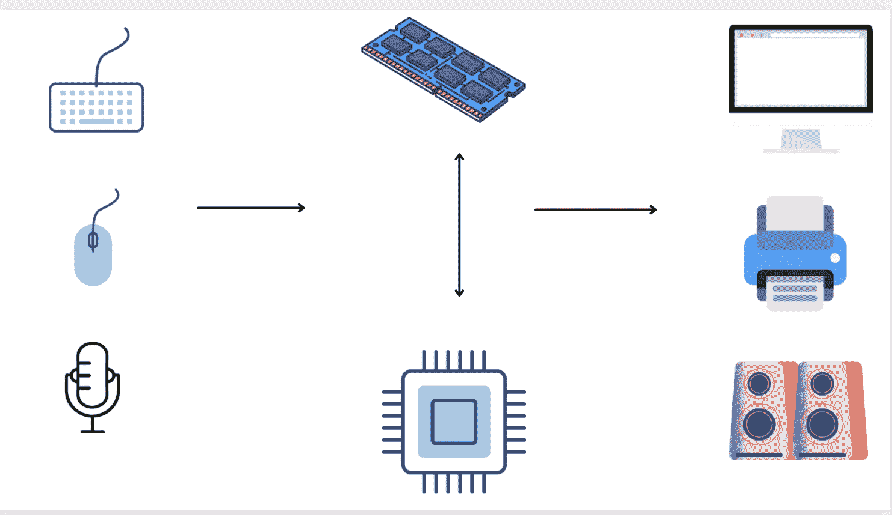

# 什么是 CPU？含义、定义和 CPU 代表什么

> 原文：<https://www.freecodecamp.org/news/what-is-cpu-meaning-definition-and-what-cpu-stands-for/>

每一台计算设备都有一个 CPU。

你可能听说过这个技术术语，但它到底是什么？什么是 CPU，它是如何工作的？

在这篇对初学者友好的文章中，你将了解到 CPU 实际上是什么的基础知识，我将概述它是如何工作的。

## 什么是 CPU，你在计算机的什么地方可以找到它？

CPU 是中央处理器的缩写。它也被称为处理器或微处理器。

它是任何数字计算系统中最重要的硬件之一——如果不是最重要的话。

在 CPU 内部有数千个微小的晶体管 T1，它们是控制电流通过集成电路的微小开关。

你会发现 CPU 位于电脑的*主板*上。

电脑主板是电脑内部的主要电路板。它的工作是将所有硬件组件连接在一起。

CPU 通常被称为所有数字系统的大脑和心脏，负责完成所有工作。它执行计算机做的每一个动作并执行程序。

### 什么是计算机程序，它们存放在哪里？

CPU 做的每件事都有一个程序。

你有一个能让你使用网络浏览器或文字处理器的程序。你有一个可以在计算器上进行数学运算，或者让你在键盘上输入字母和字符。还有一些程序可以管理用鼠标点击和选择元素，以及按下笔记本电脑的触摸板。

不管它是什么，都有一个适用于所有计算机活动的程序。

程序是一组指令，需要按顺序、逻辑顺序执行，并精确地一步一步执行。

它们是由程序员用人类可读的语言——一种编程语言——编写的。

计算机不直接理解编程语言，所以需要翻译成更容易理解的形式。

这种形式被称为机器语言或二进制。

二进制是一个以*为基数的两个*的数字系统。它只由两个数字组成:0 和 1。

这反映了晶体管只有两种可能的状态来控制电流的衰减和流动——它们要么导通(1 ),要么截止(0)。

所以，在引擎盖下，程序是以比特序列的形式存储的。比特是二进制数字(1 和 0 的序列)的另一个名称。

无论是 HDD(硬盘驱动器)还是 SSD(固态驱动器),程序都被永久和长期地存储在存储设备中。

这些是非易失性存储器，这意味着它们即使在断电时也能存储数据。

当一个程序启动、运行并正在使用时，它的所有数据都存储在主存储器或 ram(随机存取存储器)中。

这种类型的内存是易失性的，当电源关闭时，所有数据都会丢失。

## CPU 是做什么的？

简而言之，CPU 负责处理逻辑和数学运算，并执行给它的指令。

它每秒可以执行数百万条指令，但一次只能执行一条指令。

它首先接收某种类型的输入，通常来自输入设备(如监视器显示屏、键盘、鼠标或麦克风)或来自应用程序/系统软件程序(如您的 web 浏览器或操作系统)。

那么 CPU 负责四项任务:

1.  **从存储器中获取**指令，以便知道如何处理输入，并知道其接收的特定输入数据的相应指令。具体来说，它查找相应指令的地址，并将请求转发到 RAM。CPU 和 RAM 经常一起工作。这也称为从内存中读取*。*
2.  **解码**或者把指令翻译成 CPU 能理解的形式，就是机器语言(二进制)。
3.  **执行**并执行给定的指令。
4.  **将**执行的结果存储回存储器，以备以后需要时检索。这也被称为*对*内存的写入。

最后，还有某种输出，比如将一些东西打印到屏幕上。

上述过程被称为**获取-执行**周期，每秒钟发生数百万次。

## 中央处理器的主要部分

现在你知道了 CPU 对计算机上发生的每一个操作所执行的基本任务，CPU 的哪些部分帮助完成这些工作？

以下是其中的一些重要组件:

*   **CU** (控制单元的简称)。它调节输入和输出的流量。它是从主存储器中获取和检索指令，然后解码它们的部分。
*   **ALU** (算法逻辑单元的简称)。所有处理都在这里进行。这里是所有数学计算发生的地方，例如加法、减法、乘法和除法，以及所有用于决策的逻辑操作，例如比较数据。
*   **寄存器**。一个极快的存储位置。在取-执行周期中当前正在处理的数据和指令存储在那里，供处理器快速访问。

## 什么是 CPU 核心？

前面您已经了解到，CPU 通常一次只能执行一个动作。

它一次执行一条指令，并在物理内核的帮助下执行。

本质上，核心就是 CPU 本身，是主 CPU 芯片内部的一个独立设备。这意味着它一次只能做一件事。

然而，现代计算机有能力在主芯片内支持一个以上的核心。

CPU 拥有的内核越多，计算能力就越强，可以同时运行和完成的任务就越多，这使得 CPU 成为一个串行多任务处理器。

例如，有双核 CPU，这意味着在同一个芯片上有两个 CPU，可以同时运行两条指令。

四核 CPU 意味着同一芯片上有四个 CPU，六核 CPU 意味着有六个核心，依此类推。

### 什么是超线程？

现代 CPU 还支持一种叫做超线程的技术。

其工作原理是，单个物理核心表现为多个物理核心，使操作系统认为有比实际更多的核心。这反过来使计算机认为它拥有比实际更多的能量。

因此，除了上一节中提到的物理内核之外，还有这些虚拟内核，也称为线程。

它们不是真正的物理核心，但看起来是。

物理内核和虚拟内核的结合使得程序的执行速度更快，并给予 CPU 更多的计算能力。

## 结论

感谢阅读并坚持到最后！希望您现在对 CPU 是什么、它们做什么以及它们为什么如此重要有了更好的理解。

如果你想了解更多的计算机基础知识，看看这本介绍计算机基本部件的指南。

快乐学习！