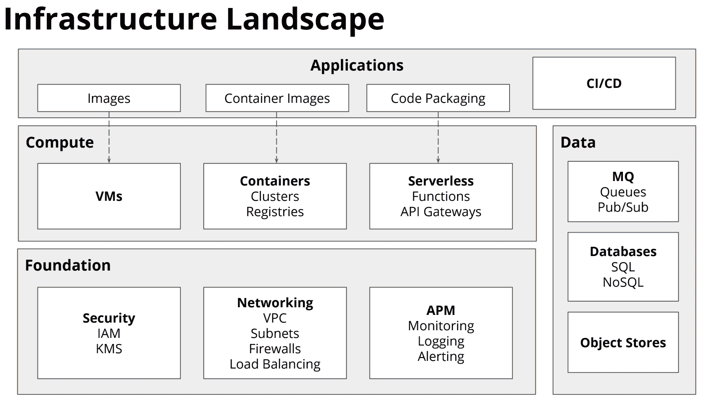
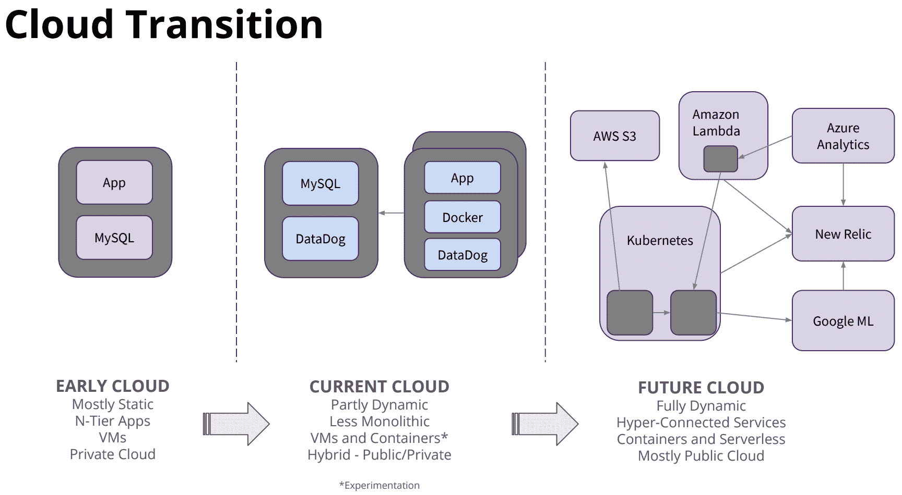
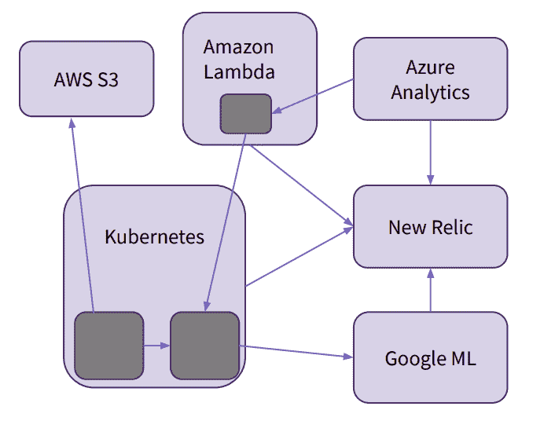

# 什么是作为代码的基础设施？(教程)

> 原文：<https://www.freecodecamp.org/news/what-is-infrastructure-as-code/>

什么是基础设施即代码？

在本文中，您将了解到所有关于代码基础设施的知识。我将从一般概念的概述开始，然后我将通过三个不同的实验向您展示如何将基础设施实现为代码。实验室使用 Python 和 AWS，但这些概念也适用于其他编程语言和云提供商。

还有这篇文章的视频版本。你可以在 freeCodeCamp.org YouTube 频道观看[视频(1 小时观看)。](https://youtu.be/EtEb40LE5zQ)

[https://www.youtube.com/embed/EtEb40LE5zQ?feature=oembed](https://www.youtube.com/embed/EtEb40LE5zQ?feature=oembed)

让我们从谈论什么是代码基础设施开始。简单地说，它是将您的基础设施设置为代码。

我所说的基础设施是指将软件部署到云环境中所需的所有不同的东西。这可能意味着虚拟机、容器或无服务器功能。



基础设施也意味着你需要建立所有其他的基础设施来使其成功。这可以是安全性，如 IAM 和 KMS，也可以是网络，还可以是一些监控和日志记录功能。

您还可以使用代码来配置和设置数据存储。这些是您的应用程序存储和管理数据所需的东西。

基础架构领域的最后一块是应用程序本身，以及将我们构建的应用程序纳入基础架构。

所有这些不同的基础设施都可以使用代码来建立。

自动化基础架构变得越来越重要，因为应用程序每天可以部署到生产中多达一百次。你不希望必须手动操作。

此外，根据负载自动调配或取消调配基础架构也很有帮助。

代码基础设施就是寻找一种方法，用代码来描述我们的基础设施需要做什么。



多年来，人们在其组织内使用云基础架构的方式发生了转变。

第一波，相对简单。基础设施相当静态。它通常是您刚刚通过 SSH 访问的单个虚拟机。

在第二次浪潮中，情况变得更加复杂。有了更多的容器，人们开始使用供应工具来指定应用程序的行为。人们使用 Docker 和 DataDog。

现代云基础设施增加了更多的复杂性。它使用容器、无服务器和更多的托管服务作为应用程序的一部分。现在，人们如何建设基础设施涉及到更多不同的方面。

作为代码的基础设施正在成为人们构建和交付应用程序的一个更重要的部分，因为作为代码的基础设施描述了这些图中所有不同边缘之间的粘合。



Modern Infrastructure

现代基础设施的图表可能看起来比以前的更复杂，但实际上更容易维护。一个关键的好处是，图中的深灰色方块是您拥有的唯一代码部分。这部分比以前做事情的方式要小。因此，与过去相比，操作负担减轻了很多。

有了基础设施作为代码，你就把一些操作负担交给了 AWS、Azure、Kubernetes 或其他一些系统。现在的焦点是由云提供商管理的不同服务之间的粘合。

在如何管理现代云中的一切方面，基础设施代码扮演着越来越重要的角色。

这里有三种主要的方法可以用来管理所有的资源:

*   **手动**:在控制台中点击创建/修改资源。
*   **特设自动化**:创建/修改资源的 CLI 命令或脚本。
*   **基础设施代码** :
    ○ **供应**:声明性地创建/修改资源。
    ○ **配置**:更改现有资源的配置后状态。

作为代码的基础设施让我们能够写下我们希望我们的基础设施是什么状态。稍后我将向您展示如何做这些事情。

## 将基础设施写成代码

将基础设施作为代码的一种方法是使用 JSON。这里有一个例子:

```
{
  "AWSTemplateFormatVersion": "2010-09-09",
  "Resources": {
    "EC2Instance": {
      "Type": "AWS::EC2::Instance",
      "Properties": {
        "InstanceType": "t2.micro",
        "SecurityGroups": [
          {
            "Ref": "InstanceSecurityGroup"
          }
        ],
        "ImageId": "ami-0080e4c5bc078760e"
      }
    },
    "InstanceSecurityGroup": {
      "Type": "AWS::EC2::SecurityGroup",
      "Properties": {
        "GroupDescription": "Enable HTTP over port 80",
        "SecurityGroupIngress": [
          {
            "IpProtocol": "tcp",
            "FromPort": "80",
            "ToPort": "80",
            "CidrIp": "0.0.0.0/0"
          }
        ]
      }
    }
  }
}
```

以上是告诉 AWS 你想拥有什么资源的方法。

另一种方法是使用领域特定语言(DSL)。这是特定于您正在使用的工具或云提供商的自定义方法。这里有一个例子:

```
provider aws {
    region = "eu-central-1"
}
resource "aws_security_group"
"web_sg" {
    description = "Enable HTTP over port 80"
    ingress {
        protocol = "tcp"
        from_port = 80
        to_port = 80
        cidr_blocks = ["0.0.0.0/0"]
    }
}
resource "aws_instance"
"web" {
    ami = "ami-0080e4c5bc078760e"
    instance_type = "t2.micro"
    security_groups = ["$(aws_security_group.web_sg.id)"]
}
```

使用代码定义基础设施的另一种方式是使用众所周知的编程语言。例如，Pulumi 可用于使用 TypeScript、JavaScript、Python、Go 和. NET 编写基础设施代码。

下面是一个使用 TypeScript 的例子(稍后我们将使用 Python)。

```
import * as aws from "@pulumi/aws";
let group = new aws.ec2.SecurityGroup("web-sg", {
    description: "Enable HTTP over port 80",
    ingress: [{
        protocol: "tcp",
        fromPort: 80,
        toPort: 80,
        cidrBlocks: ["0.0.0.0/0"]
    }, ],
});
for (let az in aws.getAvailabilityZones().names) {
    let server = new aws.ec2.Instance(`web-${az}`, {
        instanceType: "t2.micro",
        securityGroups: [group.id],
        ami: "ami-0080e4c5bc078760e",
        availabilityZone: az,
    });
}
```

使用代码可以做一些其他方法做不到的事情。在上面的例子中，有一个`for`循环为每个可用性区域创建实例。代码提供了使用循环、条件、类、包等等的能力。使用流行的编程语言也允许使用公共的 ide、linters 和测试框架。

## 实验室

有一些不同的服务允许你使用流行的语言来创建代码形式的基础设施。在本文中，我们将使用 Pulumi。

这篇文章(和视频课程)是由 Pulumi 资助完成的。

Pulumi 是一个开源基础设施，作为创建、部署和管理云基础设施的代码工具。除了现代架构(包括容器、Kubernetes 集群和无服务器功能)之外，Pulumi 还可以与虚拟机、网络和数据库等传统基础设施协同工作。Pulumi 支持数十个公共、私有和混合云服务提供商。

我们将使用 Python 并部署在 AWS 上，尽管它可以用其他编程语言和云提供商来完成。

# 实验 1:使用 S3 存储桶调配基础架构

我们将从一个简单的例子开始。这将展示使用非常简单的资源使用 Pulumi 的端到端体验。

在第一个示例中，我们将执行以下操作:

*   创建新项目
*   配置 AWS
*   供应基础设施
*   更新基础设施
*   使您的堆栈可配置
*   创建第二个堆栈
*   摧毁你的基础设施

我们将使用一个 S3 桶，然后用一组简单的资源完成整个生命周期。然后在未来的例子中，你将学习如何实现更复杂的东西。

使用 Pulumi，基础设施被组织成项目。每个项目都是一个单独的程序，当运行时，它会声明 Pulumi 需要管理的基础设施。

在我们开始第一个实验之前，确保安装了 Pulumi。安装方式因操作系统而异。

如果你有 MacsOS 和[家酿](https://brew.sh/)，你可以使用命令`brew install pulumi`。

如果你有 Windows 和 [Chocolatey](https://chocolatey.org/) ，你可以使用命令`choco install pulumi`。

[这一页将告诉你安装 Pulumi](https://www.pulumi.com/docs/get-started/install/) 的其他方法。

### 自动警报系统

对于这个例子，我们使用 AWS。您必须确保您有一个 AWS 帐户，并设置和验证 CLI。([还有一种方法](https://www.pulumi.com/docs/intro/cloud-providers/aws/setup/)不使用 CLI。)

你可以在这里注册一个免费的 AWS 账户:[https://aws.amazon.com/free/](https://aws.amazon.com/free/)

在此了解如何为您的操作系统安装 AWS CLI:[https://docs . AWS . Amazon . com/CLI/latest/user guide/install-CLI v2 . html](https://docs.aws.amazon.com/cli/latest/userguide/install-cliv2.html)

对于 MacOS，您可以使用以下命令:

```
curl "https://awscli.amazonaws.com/AWSCLIV2.pkg" -o "AWSCLIV2.pkg"
sudo installer -pkg AWSCLIV2.pkg -target /
```

对于 Windows，有一些额外的步骤，你应该[按照这里的说明](https://docs.aws.amazon.com/cli/latest/userguide/install-cliv2-windows.html)操作。

接下来，您需要从 AWS 获得访问密钥 ID 和秘密访问密钥。[按照亚马逊的指示去拿这些](https://docs.aws.amazon.com/cli/latest/userguide/cli-configure-quickstart.html#cli-configure-quickstart-creds)。

现在在命令行中运行以下命令:

`aws configure`

出现提示时，输入您的访问密钥 ID 和秘密访问密钥。您可以将“默认片段名称”和“默认输出格式”保留为无。

### 步骤 1:创建一个目录

每个 Pulumi 项目都位于自己的目录中。现在创建一个，然后换上它:

`mkdir iac-lab1 cd iac-lab1`

### 步骤 2:初始化您的项目

Pulumi 项目只是一个包含一些文件的目录。你可以手工创建一个新的。然而,`pulumi new`命令自动完成了这个过程:

`pulumi new python -y`

如果这是您第一次使用 Pulumi，将会引导您输入访问代码或登录。要获取访问代码，请前往[https://app.pulumi.com/account/tokens](https://app.pulumi.com/account/tokens)

这个命令创建了我们需要的所有文件，初始化了一个名为`dev`(我们项目的一个实例)的新堆栈。我们现在需要安装我们的依赖项，作为我们的`virtualenv`的一部分。

### 步骤 3:设置虚拟环境

我们现在需要创建一个虚拟环境并安装所需的 Python 包。用于创建和管理虚拟环境的 Python 模块称为 [`venv`](https://docs.python.org/3/library/venv.html#module-venv) 。运行以下命令:

```
python3 -m venv venv
source venv/bin/activate
pip3 install -r requirements.txt
```

### 步骤 4:检查你的新项目

我们的项目由多个文件组成:

*   **`__main__.py`** :你程序的主入口点文件
*   **`requirements.txt`** :您项目的 pip 依赖信息
*   **`Pulumi.yaml`** :您项目的元数据，包含名称和语言

如果您查看`__main__.py`文件，您会注意到一行代码:

`import pulumi`

### 配置 AWS

现在您有了一个基本项目，让我们为它配置 AWS 支持。

### 步骤 5:安装 AWS 包

运行以下命令安装 AWS 软件包:

`pip3 install pulumi-aws`

### 步骤 6:导入 AWS 包

现在已经安装了 AWS 包，在`__main__.py`中添加下面一行来导入它:

`import pulumi_aws as aws`

### 步骤 7:配置 AWS 区域

通过在命令行上运行以下命令，配置要部署到的 AWS 区域。

`pulumi config set aws:region us-east-1`

如果愿意，您可以选择不同的 AWS 区域。([可用区域列表见此表](https://docs.aws.amazon.com/AWSEC2/latest/UserGuide/using-regions-availability-zones.html#concepts-available-regions)。)

### 可选步骤:配置 AWS 配置文件

如果您使用替代的 AWS 配置文件，您可以通过以下两种方式之一告诉 Pulumi 使用哪一种:

*   使用环境变量:`export AWS_PROFILE=<profile name>`
*   使用配置:`pulumi config set aws:profile <profile name>`

### 供应基础设施

现在您已经有了一个配置为使用 AWS 的项目，您将在其中创建一些基本的基础设施。我们将从一个简单的 S3 桶开始。

### 步骤 8:声明一个新的存储桶

将以下内容添加到您的`__main__.py`文件中:

`bucket = aws.s3.Bucket("my-bucket")`

因此，完整的文件应该如下所示:

```
import pulumi
import pulumi_aws as aws

bucket = aws.s3.Bucket("my-bucket")
```

### 第九步:预览你的修改

现在预览您的更改:

```
pulumi up 
```

此命令评估您的程序，确定要进行的资源更新，并向您显示这些更改的概要:

```
Previewing update (dev)

View Live: https://app.pulumi.com/beaucarnes/iac-lab1/dev/previews/827f9488-cc23-441f-946a-9852090ab0e3

     Type                 Name          Plan
 +   pulumi:pulumi:Stack  iac-lab1-dev  create
 +   └─ aws:s3:Bucket     my-bucket     create

Resources:
    + 2 to create

Do you want to perform this update?  [Use arrows to move, enter to select, type to filter]
  yes
> no
  details
```

这是一个摘要视图。选择`details`查看全套属性:

```
+ pulumi:pulumi:Stack: (create)
    [urn=urn:pulumi:dev::iac-lab1::pulumi:pulumi:Stack::iac-lab1-dev]
    + aws:s3/bucket:Bucket: (create)
        [urn=urn:pulumi:dev::iac-lab1::aws:s3/bucket:Bucket::my-bucket]
        [provider=urn:pulumi:dev::iac-lab1::pulumi:providers:aws::default_4_22_1::04da6b54-80e4-46f7-96ec-b56ff0331ba9]
        acl         : "private"
        bucket      : "my-bucket-185b4e1"
        forceDestroy: false

Do you want to perform this update?  [Use arrows to move, enter to select, type to filter]
  yes
> no
  details
```

堆栈资源是一种合成资源，程序创建的所有资源都是它的父资源。

### 步骤 10:部署您的更改

现在我们已经看到了所有的变化，让我们来部署它们。选择`yes`:

```
Updating (dev)

View Live: https://app.pulumi.com/beaucarnes/iac-lab1/dev/updates/1

     Type                 Name          Status
 +   pulumi:pulumi:Stack  iac-lab1-dev  created
 +   └─ aws:s3:Bucket     my-bucket     created

Resources:
    + 2 created

Duration: 5s
```

现在，我们的 AWS 帐户中已经创建了我们的 S3 存储桶。如果您在 AWS 网站上查看您的存储桶，您会看到新的存储桶。如果您转到输出中显示的 URL，您将被带到 [Pulumi 控制台](https://www.pulumi.com/docs/intro/console/)，它记录了您的部署历史。

### 步骤 11:导出您的新存储桶名称

要检查您的新铲斗，您需要它的物理 AWS 名称。Pulumi 记录了一个逻辑名称`my-bucket`，但是产生的 AWS 名称将会不同。

程序可以导出变量，这些变量将显示在 CLI 中，并为每个部署进行记录。将此行添加到`__main__.py`的末尾，导出您的存储桶名称:

`pulumi.export('bucket_name', bucket.bucket)`

现在，使用以下工具部署更改:

`pulumi up`

您现在会注意到输出中的一个新的`Outputs`部分显示了 bucket 的名称:

```
Outputs:
  + bucket_name: "my-bucket-25cb812"
```

您可以选择“是”来执行更新。

### 第 12 步:检查你的新铲斗

您可以通过运行`pulumi stack output`看到所有的输出。

结果应该是这样的:

```
Current stack outputs (1):
    OUTPUT       VALUE
    bucket_name  my-bucket-25cb812
```

然后您可以运行`aws` CLI 来列出这个新 bucket 中的对象(使用上面的命令获得 bucket 名称):

```
aws s3 ls $(pulumi stack output bucket_name) 
```

目前该命令不会产生任何结果，因为存储桶仍然是空的。

### 更新您的基础设施

我们刚刚看到了如何从头开始创建新的基础架构。接下来，我们来做一些更新:

1.  向您的存储桶添加一个对象。
2.  将您的存储桶中的内容作为网站提供。
3.  以编程方式创建基础结构。

这演示了作为代码工具的声明性基础结构不仅可以用于初始供应，还可以用于对现有资源的后续更改。

### 步骤 13:将一个对象添加到您的桶中

创建一个目录`site/`并添加一个新的`index.html`文件，内容如下:

```
<html>
    <body>
        <h1>Hello everybody!</h1>
    </body>
</html>
```

现在更新您的`__main__.py`文件，使其看起来像这样:

```
import pulumi
import pulumi_aws as aws
import os

bucket = aws.s3.Bucket("my-bucket")

filepath = os.path.join("site", "index.html")
obj = aws.s3.BucketObject("index.html",
    bucket=bucket.bucket,
    source=pulumi.FileAsset(filepath)
)

pulumi.export('bucket_name', bucket.bucket)
```

部署更改:

`pulumi up`

这将为您提供预览，选择`yes`将应用更改:

```
Previewing update (dev)

View Live: https://app.pulumi.com/beaucarnes/iac-lab1/dev/previews/35a07205-2889-403c-b01d-0342eb01ed85

     Type                    Name          Plan
     pulumi:pulumi:Stack     iac-lab1-dev
 +   └─ aws:s3:BucketObject  index.html    create

Resources:
    + 1 to create
    2 unchanged

Do you want to perform this update?  [Use arrows to move, enter to select, type to filter]
  yes
> no
  details
```

添加一个资源，两个现有资源保持不变。作为代码，这是基础设施的一个关键属性——此类工具决定了从一个变更到下一个变更更新基础设施所需的最小变更集。

现在，再次列出你的桶里的东西:

`aws s3 ls $(pulumi stack output bucket_name)`

您会注意到已经添加了`index.html`文件:

```
2019-10-22 16:50:54        68 index.html 
```

### 第 14 步:从你的桶中提供内容作为一个网站

要将 bucket 中的内容作为网站提供，您需要更新一些属性。

首先，您的 bucket 需要一个将默认索引文档设置为`index.html`的网站属性。这可以通过用以下内容更新`__main__.py`文件来实现:

```
bucket = aws.s3.Bucket("my-bucket",
    website={
        "index_document": "index.html"
})
```

接下来，您的`index.html`对象将需要两个更改:一个是`public-read`的 ACL(访问控制列表),这样它就可以通过互联网匿名访问；一个是内容类型，这样它就可以作为 HTML 使用。您还需要导出生成的 bucket 的端点 URL，以便我们可以轻松地访问它。

综合所有内容，该文件现在应该如下所示:

```
import pulumi
import pulumi_aws as aws
import os
import mimetypes

bucket = aws.s3.Bucket("my-bucket",
    website={
        "index_document": "index.html"
})

filepath = os.path.join("site", "index.html")
mime_type, _ = mimetypes.guess_type(filepath)
obj = aws.s3.BucketObject("index.html",
        bucket=bucket.bucket,
        source=pulumi.FileAsset(filepath),
        acl="public-read",
        content_type=mime_type
)

pulumi.export('bucket_name', bucket.bucket)
pulumi.export('bucket_endpoint', pulumi.Output.concat("http://", bucket.website_endpoint))
```

现在部署更改:

`pulumi up`

预览将如下所示:

```
Previewing update (dev)

View Live: https://app.pulumi.com/beaucarnes/iac-lab1/dev/previews/50730def-0493-4667-83b8-fcedc4408f3a

     Type                    Name          Plan       Info
     pulumi:pulumi:Stack     iac-lab1-dev
 ~   ├─ aws:s3:Bucket        my-bucket     update     [diff: +website]
 ~   └─ aws:s3:BucketObject  index.html    update     [diff: ~acl,contentType]

Outputs:
  + bucket_endpoint: output<string>

Resources:
    ~ 2 to update
    1 unchanged

Do you want to perform this update?  [Use arrows to move, enter to select, type to filter]
  yes
> no
  details
```

在预览时选择`details`这次有更多的信息:

```
 pulumi:pulumi:Stack: (same)
    [urn=urn:pulumi:dev::iac-lab1::pulumi:pulumi:Stack::iac-lab1-dev]
    ~ aws:s3/bucket:Bucket: (update)
        [id=my-bucket-25cb812]
        [urn=urn:pulumi:dev::iac-lab1::aws:s3/bucket:Bucket::my-bucket]
        [provider=urn:pulumi:dev::iac-lab1::pulumi:providers:aws::default_4_22_1::032fffef-7448-4be3-97d2-3198f149eb39]
      + website: {
          + indexDocument: "index.html"
        }
    --outputs:--
  + bucket_endpoint: output<string>
    ~ aws:s3/bucketObject:BucketObject: (update)
        [id=index.html]
        [urn=urn:pulumi:dev::iac-lab1::aws:s3/bucketObject:BucketObject::index.html]
        [provider=urn:pulumi:dev::iac-lab1::pulumi:providers:aws::default_4_22_1::032fffef-7448-4be3-97d2-3198f149eb39]
      ~ acl        : "private" => "public-read"
      ~ contentType: "binary/octet-stream" => "text/html"

Do you want to perform this update?  [Use arrows to move, enter to select, type to filter]
  yes
> no
  details
```

现在只需选择`yes`来部署所有的更新。结果将显示可用于访问您的`index.html`文件的 URL。

```
Updating (dev)

View Live: https://app.pulumi.com/beaucarnes/iac-lab1/dev/updates/4

     Type                    Name          Status      Info
     pulumi:pulumi:Stack     iac-lab1-dev
 ~   ├─ aws:s3:Bucket        my-bucket     updated     [diff: +website]
 ~   └─ aws:s3:BucketObject  index.html    updated     [diff: ~acl,contentType]

Outputs:
  + bucket_endpoint: "http://my-bucket-25cb812.s3-website-us-east-1.amazonaws.com"
    bucket_name    : "my-bucket-25cb812"

Resources:
    ~ 2 updated
    1 unchanged

Duration: 6s
```

### 第 15 步:访问你的网站

除了在 web 浏览器中访问 URL(从上面显示的结果中)，您还可以在终端中使用以下命令访问网站:

`curl $(pulumi stack output bucket_endpoint)`

这将获取并打印我们的`index.html`文件:

```
<html>
    <body>
        <h1>Hello Pulumi</h1>
    </body>
</html>
```

### 使您的堆栈可配置

现在，这个桶的内容是硬编码的。接下来，您将使内容的位置可配置，并添加对用整个目录的内容填充存储桶的支持。

### 步骤 16:添加配置变量

我们不会对`"site"`目录进行硬编码，而是使用 configuration 来轻松地更改位置，而无需编辑程序。

将它添加到导入文件下面的`__main__.py`文件中:

```
config = pulumi.Config()
site_dir = config.require("siteDir")
```

### 步骤 17:根据配置填充存储桶

并用这个导入的`siteDir`变量替换硬编码的`"site"`参数:

```
filepath = os.path.join(site_dir, "index.html")
mime_type, _ = mimetypes.guess_type(filepath)

obj = aws.s3.BucketObject("index.html",
    bucket=bucket.bucket,
    source=pulumi.FileAsset(filepath),
    acl="public-read",
    content_type=mime_type
)
```

现在让我们看看这是如何有帮助的。使用终端将`site`目录重命名为`www`:

`mv site www`

### 步骤 18:部署变更

现在，部署您的更改。为此，首先配置您的堆栈。否则，您会得到一个错误:

`pulumi up`

这会导致如下所示的错误:

```
 error: Missing required configuration variable 'iac-lab1:siteDir'
        please set a value using the command `pulumi config set iac-lab1:siteDir <value>`
    error: an unhandled error occurred: Program exited with non-zero exit code: 1
```

按照与配置`aws:region`变量相似的方式配置`iac-workshop:siteDir`变量:

`pulumi config set iac-lab1:siteDir www`

然后运行:

`pulumi up`

这将检测到路径已更改，并将执行简单的更新。

### 步骤 19:添加更多文件

现在，您将更改程序来读取`www`目录的全部内容，而不是对这组文件进行硬编码。

将名为`about.html`的新文件添加到`www`目录中，并添加一些 HTML。这里有一个选择:

```
<html>
    <p>I am not a cat.</p>
</html> 
```

现在用下面的代码替换对象分配代码。您会注意到现在有一个 for 循环来遍历站点目录中的每个文件:

```
for file in os.listdir(site_dir):
    filepath = os.path.join(site_dir, file)
    mime_type, _ = mimetypes.guess_type(filepath)
    obj = aws.s3.BucketObject(file,
          bucket=bucket.bucket,
          source=pulumi.FileAsset(filepath),
          acl="public-read",
          content_type=mime_type
    )
```

部署:

`pulumi up`

您将看到为`about.html`文件创建的一个新对象:

```
Updating (dev)

View Live: https://app.pulumi.com/beaucarnes/iac-lab1/dev/updates/5

     Type                    Name          Status
     pulumi:pulumi:Stack     iac-lab1-dev
 +   └─ aws:s3:BucketObject  about.html    created
```

现在，您可以转到之前的网址，并在末尾添加“/about.html”。

您也可以在终端中使用以下命令获取该文件:

`curl $(pulumi stack output bucket_endpoint)/about.html`

### 创建第二个堆栈

创建同一个项目的多个实例很容易。在 Pulumi 中，每个实例被称为一个堆栈。如果您有多个开发或测试环境，阶段与生产环境，以及跨多个区域扩展给定的基础设施，这将非常有用。

### 步骤 20:创建和配置新的堆栈

创建名为“prod”的新堆栈:

`pulumi stack init prod`

接下来，配置它的两个必需变量:

```
pulumi config set aws:region eu-west-1
pulumi config set iac-lab1:siteDir wwwprod
```

您可以使用以下命令查看当前项目的堆栈列表:

`pulumi stack ls`

它将打印您可以使用的该项目的所有堆栈:

```
NAME   LAST UPDATE     RESOURCE COUNT  URL
dev    12 minutes ago  5               https://app.pulumi.com/beaucarnes/iac-lab1/dev
prod*  n/a             n/a             https://app.pulumi.com/beaucarnes/iac-lab1/prod
```

### 步骤 21:填充新的网站目录

我们可以为`siteDir`使用现有的`www`目录。但是在这个例子中，您将使用一个不同的`wwwprod`目录来演示如何配置它。

因此，创建这个新目录:

`mkdir wwwprod`

给它添加一个新的`index.html`文件。它可以包含任何 HTML，但这里有一个建议:

```
<html>
    <body>
        <h1>Hello universe.</h1>
        <p>(in production)</p>
    </body>
</html>
```

### 步骤 22:部署新的堆栈

现在部署所有的更改:

`pulumi up`

这将从头开始创建一组全新的资源，与现有的`dev`堆栈的资源无关。

```
Updating (prod)

View Live: https://app.pulumi.com/beaucarnes/iac-lab1/prod/updates/1

     Type                    Name           Status
 +   pulumi:pulumi:Stack     iac-lab1-prod  created
 +   ├─ aws:s3:Bucket        my-bucket      created
 +   └─ aws:s3:BucketObject  index.html     created

Outputs:
    bucket_endpoint: "http://my-bucket-0d2f29a.s3-website-eu-west-1.amazonaws.com"
    bucket_name    : "my-bucket-0d2f29a"

Resources:
    + 3 created

Duration: 14s
```

您将在输出中注意到一个新的 URL。您可以在浏览器中访问该 URL 来查看新网站。

您也可以在终端中使用以下命令来获得它:

`curl $(pulumi stack output bucket_endpoint)`

### 摧毁您的基础设施

在第一个实验中，我们要做的最后一件事是销毁创建的两个堆栈中的所有资源。

### 步骤 23:破坏资源

首先，销毁您当前堆栈中的资源:

`pulumi destroy`

这将显示一个预览，很像`pulumi up`命令:

```
 Type                    Name           Plan
 -   pulumi:pulumi:Stack     iac-lab1-prod  delete
 -   ├─ aws:s3:BucketObject  index.html     delete
 -   └─ aws:s3:Bucket        my-bucket      delete

Outputs:
  - bucket_endpoint: "http://my-bucket-0d2f29a.s3-website-eu-west-1.amazonaws.com"
  - bucket_name    : "my-bucket-0d2f29a"

Resources:
    - 3 to delete

Do you want to perform this destroy?  [Use arrows to move, enter to select, type to filter]
  yes
> no
  details
```

要继续，选择`yes`。

```
Destroying (prod)

View Live: https://app.pulumi.com/beaucarnes/iac-lab1/prod/updates/2

     Type                    Name           Status
 -   pulumi:pulumi:Stack     iac-lab1-prod  deleted
 -   ├─ aws:s3:BucketObject  index.html     deleted
 -   └─ aws:s3:Bucket        my-bucket      deleted

Outputs:
  - bucket_endpoint: "http://my-bucket-0d2f29a.s3-website-eu-west-1.amazonaws.com"
  - bucket_name    : "my-bucket-0d2f29a"

Resources:
    - 3 deleted

Duration: 3s

The resources in the stack have been deleted, but the history and configuration associated with the stack are still maintained.
If you want to remove the stack completely, run 'pulumi stack rm prod'.
```

### 步骤 24:移除堆栈

此堆栈的 AWS 资源已被销毁。您可能已经注意到了打印在最后的消息，即与堆栈相关联的历史和配置仍然被维护。这意味着所有过去的历史仍然可用，您可以在这个堆栈上执行后续更新。

现在，完全删除堆栈和所有历史记录:

`pulumi stack rm`

这是不可逆的，因此要求确认这是您的意图:

```
This will permanently remove the 'prod' stack!
Please confirm that this is what you'd like to do by typing ("prod"): 
```

键入堆栈的名称，然后按 enter 键。栈现在不见了。

### 第 24 步:选择另一个堆栈，冲洗并重复

摧毁`prod`后，你还有`dev`栈。要销毁它，首先选择它:

```
pulumi stack select dev 
```

现在，返回并重复前面的两步来摧毁它。

### 第 25 步:验证堆栈是否消失

验证该项目的所有堆栈现在都已消失:

`pulumi stack ls`

## 实验 1 的结论

恭喜你！您已经完成了第一个实验。接下来的几个实验时间稍短，演示了一些更高级的任务。

# 实验 2:调配 EC2 虚拟机

亚马逊弹性计算云(Amazon EC2)是一个 web 服务，它在云中提供安全的、可调整大小的计算能力。它旨在使开发人员更容易进行网络规模的云计算。Amazon EC2 的简单 web 服务接口允许您以最小的摩擦获得和配置容量。

在第二个实验中，您将首先创建一个 EC2 虚拟机(VM)。随后，您将扩展到您所在区域的每个可用性区域的一个虚拟机，然后添加一个负载平衡器，将负载分散到整个机群。

### 步骤 1:创建一个目录

我们可以像以前一样使用相同的项目和目录。但是我们会创建一个新的来获得更多的练习。

创建一个新目录，该目录不在上一个实验中使用的目录内。

```
cd ..
mkdir iac-lab2
cd iac-lab2
```

### 步骤 2:初始化您的项目

记住，Pulumi 项目只是一个包含一些文件的目录。你可以手工创建一个新的。然而,`pulumi new`命令自动完成了这个过程:

```
pulumi new aws-python -y
```

这个命令创建了我们需要的所有文件，初始化了一个名为`dev`(我们项目的一个实例)的新堆栈，并从 PyPi 安装了所需的包依赖项。该命令的“aws”部分确保我们的`__main__.py`文件以 samle 代码开始，以创建一个 AWS bucket。

### 步骤 3:配置 AWS 区域

配置要部署到的 AWS 区域:

```
pulumi config set aws:region us-west-2
```

### 步骤 4:声明 EC2 实例

从项目的引导中移除此处的任何现有代码。然后，在一个空的`__main__.py`文件中导入 AWS 包:

```
from pulumi import export
import pulumi_aws as aws
```

现在动态查询 Amazon Linux 机器映像。在代码中这样做可以避免对机器映像进行硬编码(也就是说，它的 AMI - An Amazon 机器映像提供了启动实例所需的信息):

```
ami = aws.ec2.get_ami(
    most_recent="true",
    owners=["137112412989"],
    filters=[{"name":"name","values":["amzn-ami-hvm-*-x86_64-ebs"]}])
```

我们还需要了解默认的虚拟私有云是一项服务，允许您在您定义的逻辑隔离虚拟网络中启动 AWS 资源，该服务在我们的 AWS 帐户中可用:

```
vpc = aws.ec2.get_vpc(default=True)
```

接下来，创建一个 AWS 安全组。这使端口 80 上的`ping`通过 ICMP 和 HTTP 流量:

```
group = aws.ec2.SecurityGroup(
    "web-secgrp",
    description='Enable HTTP access',
    vpc_id=vpc.id,
    ingress=[
        { 'protocol': 'icmp', 'from_port': 8, 'to_port': 0, 'cidr_blocks': ['0.0.0.0/0'] },
        { 'protocol': 'tcp', 'from_port': 80, 'to_port': 80, 'cidr_blocks': ['0.0.0.0/0'] }
])
```

创建服务器。注意，它有一个启动脚本，启动一个简单的 Python 服务器:

```
server = aws.ec2.Instance(
    'web-server',
    instance_type="t2.micro",
    vpc_security_group_ids=[group.id],
    ami=ami.id,
    user_data="""
#!/bin/bash
echo "Hello, World!" > index.html
nohup python -m SimpleHTTPServer 80 &
    """,
    tags={
        "Name": "web-server",
    },
)
```

对于大多数现实世界的应用程序，您可能希望为您的应用程序创建一个专用的图像，而不是像这样将脚本嵌入到您的代码中。

最后，导出 EC2 实例的最终 IP 地址和主机名:

```
pulumi.export('ip', server.public_ip)
pulumi.export('hostname', server.public_dns)
```

更改后，您的`__main__.py`应该是这样的:

```
import pulumi
import pulumi_aws as aws

ami = aws.ec2.get_ami(
    most_recent="true",
    owners=["137112412989"],
    filters=[{"name": "name", "values": ["amzn-ami-hvm-*-x86_64-ebs"]}],
)

vpc = aws.ec2.get_vpc(default=True)

group = aws.ec2.SecurityGroup(
    "web-secgrp",
    description="Enable HTTP Access",
    ingress=[
        {
            "protocol": "icmp",
            "from_port": 8,
            "to_port": 0,
            "cidr_blocks": ["0.0.0.0/0"],
        },
        {
            "protocol": "tcp",
            "from_port": 80,
            "to_port": 80,
            "cidr_blocks": ["0.0.0.0/0"],
        },
    ],
)

server = aws.ec2.Instance(
    "web=server",
    instance_type="t2.micro",
    vpc_security_group_ids=[group.name],
    ami=ami.id,
    user_data="""
#!/bin/bash
echo "Hello, World!" > index.html
nohup python -m SimpleHTTPServer 80 &
    """,
    tags={
        "Name": "web-server",
    },
)

pulumi.export("ip", server.public_ip)
pulumi.export("hostname", server.public_dns)
```

### 步骤 5:提供 EC2 实例并访问它

要调配虚拟机，请运行:

```
pulumi up
```

确认后，您将看到如下输出:

```
Updating (dev)

View Live: https://app.pulumi.com/beaucarnes/iac-lab2/dev/updates/3

     Type                 Name          Status
     pulumi:pulumi:Stack  iac-lab2-dev
 ~   └─ aws:ec2:Instance  web=server    updated

Outputs:
    hostname: "ec2-52-13-25-152.us-west-2.compute.amazonaws.com"
    ip      : "52.13.25.152"

Resources:
    ~ 1 updated
    2 unchanged

Duration: 8s
```

如果出现错误，尝试再次运行`pulumi up`并确认。我第一次运行它时，出现了一个竞争条件，需要重新运行该命令。

现在，您可以尝试从 web 浏览器的输出中访问 URL。

或者，您可以使用以下命令:

```
curl $(pulumi stack output hostname)
```

无论哪种方式，您都应该看到来自 Python 服务器的响应:

```
Hello, World!
```

### 步骤 6:添加更多 EC2 实例

现在，您将创建多个 EC2 实例，每个实例运行相同的 Python webserver，跨越您所在区域的所有 AWS 可用性区域。用以下代码替换创建 web 服务器并导出结果 IP 地址和主机名的代码部分:

```
...
ips = []
hostnames = []
for az in aws.get_availability_zones().names:
    server = aws.ec2.Instance(f'web-server-{az}',
      instance_type="t2.micro",
      vpc_security_group_ids=[group.id],
      ami=ami.id,
      availability_zone=az,
      user_data="""#!/bin/bash
echo \"Hello, World -- from {}!\" > index.html
nohup python -m SimpleHTTPServer 80 &
""".format(az),
      tags={
          "Name": "web-server",
      },
    )
    ips.append(server.public_ip)
    hostnames.append(server.public_dns)

pulumi.export("ips", ips)
pulumi.export("hostnames", hostnames)
```

更改后，您的`__main__.py`应该是这样的:

```
"""An AWS Python Pulumi program"""

import pulumi
import pulumi_aws as aws

ami = aws.ec2.get_ami(
    most_recent="true",
    owners=["137112412989"],
    filters=[{"name": "name", "values": ["amzn-ami-hvm-*-x86_64-ebs"]}],
)

vpc = aws.ec2.get_vpc(default=True)

group = aws.ec2.SecurityGroup(
    "web-secgrp",
    description="Enable HTTP Access",
    vpc_id=vpc.id,
    ingress=[
        {
            "protocol": "icmp",
            "from_port": 8,
            "to_port": 0,
            "cidr_blocks": ["0.0.0.0/0"],
        },
        {
            "protocol": "tcp",
            "from_port": 80,
            "to_port": 80,
            "cidr_blocks": ["0.0.0.0/0"],
        },
    ],
)

ips = []
hostnames = []

for az in aws.get_availability_zones().names:
    server = aws.ec2.Instance(
        f"web-server-{az}",
        instance_type="t2.micro",
        vpc_security_group_ids=[group.id],
        ami=ami.id,
        user_data="""#!/bin/bash
echo \"Hello, World -- from {}!\" > index.html
nohup python -m SimpleHTTPServer 80 &
""".format(
            az
        ),
        tags={
            "Name": "web-server",
        },
    )
    ips.append(server.public_ip)
    hostnames.append(server.public_dns)

pulumi.export("ips", ips)
pulumi.export("hostnames", hostnames)
```

现在运行一个命令，用新的资源定义更新您的堆栈:

```
pulumi up
```

您将看到如下输出:

```
Updating (dev)

View Live: https://app.pulumi.com/beaucarnes/iac-lab2/dev/updates/4

     Type                 Name                   Status
     pulumi:pulumi:Stack  iac-lab2-dev
 +   ├─ aws:ec2:Instance  web-server-us-west-2a  created
 +   ├─ aws:ec2:Instance  web-server-us-west-2b  created
 +   ├─ aws:ec2:Instance  web-server-us-west-2c  created
 +   ├─ aws:ec2:Instance  web-server-us-west-2d  created
 -   └─ aws:ec2:Instance  web=server             deleted

Outputs:
  - hostname : "ec2-52-13-25-152.us-west-2.compute.amazonaws.com"
  + hostnames: [
  +     [0]: "ec2-34-222-148-4.us-west-2.compute.amazonaws.com"
  +     [1]: "ec2-54-69-196-240.us-west-2.compute.amazonaws.com"
  +     [2]: "ec2-54-186-64-129.us-west-2.compute.amazonaws.com"
  +     [3]: "ec2-52-25-211-116.us-west-2.compute.amazonaws.com"
    ]
  - ip       : "52.13.25.152"
  + ips      : [
  +     [0]: "34.222.148.4"
  +     [1]: "54.69.196.240"
  +     [2]: "54.186.64.129"
  +     [3]: "52.25.211.116"
    ]

Resources:
    + 4 created
    - 1 deleted
    5 changes. 2 unchanged

Duration: 1m55s
```

请注意，您的原始服务器已被删除，并在其位置上创建了新的服务器，因为它的名称已更改。

要测试这些更改，请卷曲任何生成的 IP 地址或主机名(或在 web 浏览器中访问 url):

```
for i in {0..2}; do curl $(pulumi stack output hostnames | jq -r ".[${i}]"); done
```

服务器的数量取决于您所在地区的 az 数量。您可能需要调整`{0..2}`。

`pulumi stack output`命令发出 JSON 序列化数据——因此使用了`jq`工具来提取特定的索引。如果你没有`jq`，也不用担心；只需从控制台输出中复制并粘贴主机名或 IP 地址，然后`curl`。

请注意，web 服务器号包含在它的响应中:

```
Hello, World -- from us-west-2a!
Hello, World -- from us-west-2b!
Hello, World -- from us-west-2c!
```

### 添加负载平衡器

需要遍历 web 服务器是不太现实的。现在，您将在它们之上创建一个负载平衡器，以平均分配负载。

### 步骤 7:更新我们的安全组

我们需要为我们的安全组添加一个出口规则。每当您向负载平衡器添加侦听器或更新负载平衡器用来路由请求的目标组的健康检查端口时，您必须验证与负载平衡器关联的安全组是否允许新端口上的双向流量。

```
...
group = aws.ec2.SecurityGroup(
    "web-secgrp",
    ingress=[
        { 'protocol': 'icmp', 'from_port': 8, 'to_port': 0, 'cidr_blocks': ['0.0.0.0/0'] },
        { 'protocol': 'tcp', 'from_port': 80, 'to_port': 80, 'cidr_blocks': ['0.0.0.0/0'] },
    ],
    egress=[
        { 'protocol': 'tcp', 'from_port': 80, 'to_port': 80, 'cidr_blocks': ['0.0.0.0/0'] },
    ]
)
...
```

这是为了确保安全组进入规则不会与负载平衡器的规则冲突。

### 步骤 8:定义 ALB

现在，在安全组创建之后，EC2 创建块之前，添加负载平衡器创建步骤:

```
...
vpc = aws.ec2.get_vpc(default=True)
vpc_subnets = aws.ec2.get_subnet_ids(vpc_id=vpc.id)

lb = aws.lb.LoadBalancer(
    "loadbalancer",
    internal=False,
    security_groups=[group.id],
    subnets=vpc_subnets.ids,
    load_balancer_type="application",
)

target_group = aws.lb.TargetGroup(
    "target-group", port=80, protocol="HTTP", target_type="ip", vpc_id=vpc.id
)

listener = aws.lb.Listener(
    "listener",
    load_balancer_arn=lb.arn,
    port=80,
    default_actions=[{"type": "forward", "target_group_arn": target_group.arn}],
)
...
```

这里，我们已经定义了 ALB、它的 TargetGroup 和一些侦听器，但是我们实际上并没有向 ALB 添加 EC2 实例。

### 步骤 9:将实例添加到 ALB 中

用以下内容替换 EC2 创建模块:

```
...
ips = []
hostnames = []
for az in aws.get_availability_zones().names:
    server = aws.ec2.Instance(f'web-server-{az}',
      instance_type="t2.micro",
      security_groups=[group.name],
      ami=ami.id,
      user_data="""#!/bin/bash
echo \"Hello, World -- from {}!\" > index.html
nohup python -m SimpleHTTPServer 80 &
""".format(az),
      availability_zone=az,
      tags={
          "Name": "web-server",
      },
    )
    ips.append(server.public_ip)
    hostnames.append(server.public_dns)

    attachment = aws.lb.TargetGroupAttachment(f'web-server-{az}',
        target_group_arn=target_group.arn,
        target_id=server.private_ip,
        port=80,
    )

export('ips', ips)
export('hostnames', hostnames)
export("url", lb.dns_name)
```

经过这次改动，你的 __main__。py 应该是这样的:

```
"""An AWS Python Pulumi program"""

import pulumi
import pulumi_aws as aws

ami = aws.ec2.get_ami(
    most_recent="true",
    owners=["137112412989"],
    filters=[{"name": "name", "values": ["amzn-ami-hvm-*-x86_64-ebs"]}],
)

vpc = aws.ec2.get_vpc(default=True)
vpc_subnets = aws.ec2.get_subnet_ids(vpc_id=vpc.id)

group = aws.ec2.SecurityGroup(
    "web-secgrp",
    description="Enable HTTP Access",
    vpc_id=vpc.id,
    ingress=[
        {
            "protocol": "icmp",
            "from_port": 8,
            "to_port": 0,
            "cidr_blocks": ["0.0.0.0/0"],
        },
        {
            "protocol": "tcp",
            "from_port": 80,
            "to_port": 80,
            "cidr_blocks": ["0.0.0.0/0"],
        },
    ],
    egress=[
        {
            "protocol": "tcp",
            "from_port": 80,
            "to_port": 80,
            "cidr_blocks": ["0.0.0.0/0"],
        }
    ],
)

lb = aws.lb.LoadBalancer(
    "loadbalancer",
    internal=False,
    security_groups=[group.id],
    subnets=vpc_subnets.ids,
    load_balancer_type="application",
)

target_group = aws.lb.TargetGroup(
    "target-group", port=80, protocol="HTTP", target_type="ip", vpc_id=vpc.id
)

listener = aws.lb.Listener(
    "listener",
    load_balancer_arn=lb.arn,
    port=80,
    default_actions=[{"type": "forward", "target_group_arn": target_group.arn}],
)

ips = []
hostnames = []

for az in aws.get_availability_zones().names:
    server = aws.ec2.Instance(
        f"web-server-{az}",
        instance_type="t2.micro",
        vpc_security_group_ids=[group.id],
        ami=ami.id,
        user_data="""#!/bin/bash
echo \"Hello, World -- from {}!\" > index.html
nohup python -m SimpleHTTPServer 80 &
""".format(
            az
        ),
        tags={
            "Name": "web-server",
        },
    )
    ips.append(server.public_ip)
    hostnames.append(server.public_dns)

    attachment = aws.lb.TargetGroupAttachment(
        f"web-server-{az}",
        target_group_arn=target_group.arn,
        target_id=server.private_ip,
        port=80,
    )

pulumi.export("ips", ips)
pulumi.export("hostnames", hostnames)
pulumi.export("url", lb.dns_name)
```

这就是我们的负载平衡 web 服务器所需的所有基础设施。让我们应用它。

### 步骤 10:部署您的更改

部署这些更新:

```
pulumi up
```

这应该会导致一个相当大的更新，如果一切顺利，负载平衡器的结果端点 URL:

```
Updating (dev)

View Live: https://app.pulumi.com/beaucarnes/iac-lab2/dev/updates/5

     Type                             Name                   Status      Info
     pulumi:pulumi:Stack              iac-lab2-dev
 +   ├─ aws:lb:TargetGroup            target-group           created
 ~   ├─ aws:ec2:SecurityGroup         web-secgrp             updated     [diff: ~egress]
 +   ├─ aws:lb:LoadBalancer           loadbalancer           created
 +   ├─ aws:lb:TargetGroupAttachment  web-server-us-west-2a  created
 +   ├─ aws:lb:TargetGroupAttachment  web-server-us-west-2b  created
 +   ├─ aws:lb:TargetGroupAttachment  web-server-us-west-2c  created
 +   ├─ aws:lb:TargetGroupAttachment  web-server-us-west-2d  created
 +   └─ aws:lb:Listener               listener               created

Outputs:
    hostnames: [
        [0]: "ec2-34-222-148-4.us-west-2.compute.amazonaws.com"
        [1]: "ec2-54-69-196-240.us-west-2.compute.amazonaws.com"
        [2]: "ec2-54-186-64-129.us-west-2.compute.amazonaws.com"
        [3]: "ec2-52-25-211-116.us-west-2.compute.amazonaws.com"
    ]
    ips      : [
        [0]: "34.222.148.4"
        [1]: "54.69.196.240"
        [2]: "54.186.64.129"
        [3]: "52.25.211.116"
    ]
  + url      : "loadbalancer-c9a1e24-965935136.us-west-2.elb.amazonaws.com"

Resources:
    + 7 created
    ~ 1 updated
    8 changes. 5 unchanged

Duration: 3m28s
```

### 步骤 11:验证

现在我们可以弯曲负载平衡器:

```
for i in {0..10}; do curl $(pulumi stack output url); done
```

请注意，结果文本会根据请求的路由位置发生变化:

```
Hello, World -- from us-west-2a!
Hello, World -- from us-west-2a!
Hello, World -- from us-west-2d!
Hello, World -- from us-west-2b!
Hello, World -- from us-west-2b!
Hello, World -- from us-west-2c!
Hello, World -- from us-west-2b!
Hello, World -- from us-west-2a!
Hello, World -- from us-west-2c!
Hello, World -- from us-west-2d!
Hello, World -- from us-west-2a!
```

### 第十二步:摧毁一切

最后，销毁资源和堆栈本身:

```
pulumi destroy
pulumi stack rm
```

## 实验 3:将 Docker 映像部署到 ECS 和 Fargate

在本实验中，您将使用 Pulumi 通过 Fargate 将 Docker 映像部署到 ECS。

让我们从头再来，多加练习。

### 步骤 1:创建一个目录

创建一个新目录，并将其更改为:

```
cd ..
mkdir iac-lab3
cd iac-lab3
```

默认情况下，Pulumi 将使用目录名作为项目名。要创建一个独立的项目，只需用不同的名称命名目录。

### 步骤 2:初始化您的项目

Pulumi 项目只是一个包含一些文件的目录。你可以手工创建一个新的。然而,`pulumi new`命令自动完成了这个过程:

```
pulumi new aws-python -y
```

这个命令创建了我们需要的所有文件，初始化了一个名为`dev`(我们项目的一个实例)的新堆栈，并从 PyPi 安装了所需的包依赖项。

### 步骤 3:检查你的新项目

我们的项目由多个文件组成(这些文件与之前的相同，所以这是一个回顾):

*   **`__main__.py`** :你程序的主入口点文件
*   **`requirements.txt`** :您项目的 Python 依赖信息
*   **`Pulumi.yaml`** :您项目的元数据，包含名称和语言
*   **`venv`** :您项目的[虚拟人](https://pypi.org/project/virtualenv/)

运行`cat __main__.py`来查看你的项目的空程序的内容:

```
"""An AWS Python Pulumi program"""

import pulumi
from pulumi_aws import s3

# Create an AWS resource (S3 Bucket)
bucket = s3.Bucket('my-bucket')

# Export the name of the bucket
pulumi.export('bucket_name', bucket.id)
```

尽管我们不会手动编辑任何一个文件，但是您可以随意探索其他文件。

### 步骤 4:配置 AWS 区域

配置要部署到的 AWS 区域:

```
pulumi config set aws:region us-west-2
```

### 步骤 5:创建 ECS 集群

从项目引导中删除所有样板文件。

在空的`__main__.py`文件中导入 AWS 和 Pulumi 包:

```
import pulumi
import pulumi_aws as aws
```

现在创建一个新的 ECS 集群。您将使用默认值，因此这样做非常简洁:

更改后，您的`__main__.py`应该是这样的:

```
import pulumi
import pulumi_aws as aws

cluster = aws.ecs.Cluster("cluster")
```

### 步骤 6:创建负载平衡的容器服务

接下来，分配应用程序负载平衡器(ALB)并监听 HTTP 流量端口 80。为此，我们需要找到默认的 VPC 及其子网组:

```
...
vpc = aws.ec2.get_vpc(default=True)
vpc_subnets = aws.ec2.get_subnet_ids(vpc_id=vpc.id)

group = aws.ec2.SecurityGroup(
    "web-secgrp",
    vpc_id=vpc.id,
    description='Enable HTTP access',
    ingress=[
        { 'protocol': 'icmp', 'from_port': 8, 'to_port': 0, 'cidr_blocks': ['0.0.0.0/0'] },
        { 'protocol': 'tcp', 'from_port': 80, 'to_port': 80, 'cidr_blocks': ['0.0.0.0/0'] }
    ],
    egress=[
        { 'protocol': "-1", 'from_port': 0, 'to_port': 0, 'cidr_blocks': ['0.0.0.0/0'] }
    ])

alb = aws.lb.LoadBalancer(
    "app-lb",
    internal="false",
    security_groups=[group.id],
    subnets=vpc_subnets.ids,
    load_balancer_type="application",
)

atg = aws.lb.TargetGroup(
    "app-tg",
    port=80,
    deregistration_delay=0,
    protocol="HTTP",
    target_type="ip",
    vpc_id=vpc.id,
)

wl = aws.lb.Listener(
    "web",
    load_balancer_arn=alb.arn,
    port=80,
    default_actions=[{"type": "forward", "target_group_arn": atg.arn}],
)
```

更改后，您的`__main__.py`应该是这样的:

```
import pulumi
import pulumi_aws as aws

cluster = aws.ecs.Cluster("cluster")

vpc = aws.ec2.get_vpc(default=True)
vpc_subnets = aws.ec2.get_subnet_ids(vpc_id=vpc.id)

group = aws.ec2.SecurityGroup(
    "web-secgrp",
    vpc_id=vpc.id,
    description="Enable HTTP access",
    ingress=[
        {
            "protocol": "icmp",
            "from_port": 8,
            "to_port": 0,
            "cidr_blocks": ["0.0.0.0/0"],
        },
        {
            "protocol": "tcp",
            "from_port": 80,
            "to_port": 80,
            "cidr_blocks": ["0.0.0.0/0"],
        },
    ],
    egress=[
        {
            "protocol": "-1",
            "from_port": 0,
            "to_port": 0,
            "cidr_blocks": ["0.0.0.0/0"],
        }
    ],
)

alb = aws.lb.LoadBalancer(
    "app-lb",
    internal="false",
    security_groups=[group.id],
    subnets=vpc_subnets.ids,
    load_balancer_type="application",
)

atg = aws.lb.TargetGroup(
    "app-tg",
    port=80,
    deregistration_delay=0,
    protocol="HTTP",
    target_type="ip",
    vpc_id=vpc.id,
)

wl = aws.lb.Listener(
    "web",
    load_balancer_arn=alb.arn,
    port=80,
    default_actions=[{"type": "forward", "target_group_arn": atg.arn}],
)
```

使用`pulumi up`运行您的程序:

```
Updating (dev)

View Live: https://app.pulumi.com/beaucarnes/iac-lab3/dev/updates/1

     Type                      Name          Status
 +   pulumi:pulumi:Stack       iac-lab3-dev  created
 +   ├─ aws:ecs:Cluster        cluster       created
 +   ├─ aws:ec2:SecurityGroup  web-secgrp    created
 +   ├─ aws:lb:TargetGroup     app-tg        created
 +   ├─ aws:lb:LoadBalancer    app-lb        created
 +   └─ aws:lb:Listener        web           created

Resources:
    + 6 created

Duration: 3m36s
```

我们已经充实了我们的基础设施，并添加了一个负载平衡器，我们可以向其中添加基础设施，在接下来的步骤中，我们将运行一个容器。

### 步骤 7:创建 ECS FargateService

为了创建 Fargate 服务，我们需要添加一个 IAM 角色以及一个任务定义和服务。ECS 集群将从 Docker Hub 运行`"nginx"`映像。

首先，我们需要在文件的顶部添加一个新的导入

```
import json
```

现在，让我们定义我们的 IAM 角色并附加一个策略。你应该在你的`__main__.py`结尾定义这个:

```
...
role = aws.iam.Role("task-exec-role",
    assume_role_policy=json.dumps({
        "Version": "2008-10-17",
        "Statement": [{
            "Sid": "",
            "Effect": "Allow",
            "Principal": {
                "Service": "ecs-tasks.amazonaws.com"
            },
            "Action": "sts:AssumeRole"
        }]
    }))

rpa = aws.iam.RolePolicyAttachment("task-exec-policy",
    role=role.name,
    policy_arn="arn:aws:iam::aws:policy/service-role/AmazonECSTaskExecutionRolePolicy"
)
...
```

然后，我们可以为 ECS 服务定义一个任务定义:

```
task_definition = aws.ecs.TaskDefinition("app-task",
    family="fargate-task-definition",
    cpu="256",
    memory="512",
    network_mode="awsvpc",
    requires_compatibilities=["FARGATE"],
    execution_role_arn=role.arn,
    container_definitions=json.dumps([{
        "name": "my-app",
        "image": "nginx",
        "portMappings": [{
            "containerPort": 80,
            "hostPort": 80,
            "protocol": "tcp"
        }]
    }])
)

service = aws.ecs.Service("app-svc",
    cluster=cluster.arn,
    desired_count=1,
    launch_type="FARGATE",
    task_definition=task_definition.arn,
    network_configuration={
        "assign_public_ip": "true",
        "subnets": vpc_subnets.ids,
        "security_groups": [group.id]
    },
    load_balancers=[{
        "target_group_arn": atg.arn,
        "container_name": "my-app",
        "container_port": 80
    }],
    opts=pulumi.ResourceOptions(depends_on=[wl])
)

pulumi.export("url", alb.dns_name)
```

经过这些改变后，你的`__main__.py`应该是这样的

```
import pulumi
import pulumi_aws as aws
import json

cluster = aws.ecs.Cluster("cluster")

vpc = aws.ec2.get_vpc(default=True)
vpc_subnets = aws.ec2.get_subnet_ids(vpc_id=vpc.id)

group = aws.ec2.SecurityGroup(
    "web-secgrp",
    vpc_id=vpc.id,
    description="Enable HTTP access",
    ingress=[
        {
            "protocol": "icmp",
            "from_port": 8,
            "to_port": 0,
            "cidr_blocks": ["0.0.0.0/0"],
        },
        {
            "protocol": "tcp",
            "from_port": 80,
            "to_port": 80,
            "cidr_blocks": ["0.0.0.0/0"],
        },
    ],
    egress=[
        {
            "protocol": "-1",
            "from_port": 0,
            "to_port": 0,
            "cidr_blocks": ["0.0.0.0/0"],
        }
    ],
)

alb = aws.lb.LoadBalancer(
    "app-lb",
    internal="false",
    security_groups=[group.id],
    subnets=vpc_subnets.ids,
    load_balancer_type="application",
)

atg = aws.lb.TargetGroup(
    "app-tg",
    port=80,
    deregistration_delay=0,
    protocol="HTTP",
    target_type="ip",
    vpc_id=vpc.id,
)

wl = aws.lb.Listener(
    "web",
    load_balancer_arn=alb.arn,
    port=80,
    default_actions=[{"type": "forward", "target_group_arn": atg.arn}],
)

role = aws.iam.Role("task-exec-role",
    assume_role_policy=json.dumps({
        "Version": "2008-10-17",
        "Statement": [{
            "Sid": "",
            "Effect": "Allow",
            "Principal": {
                "Service": "ecs-tasks.amazonaws.com"
            },
            "Action": "sts:AssumeRole"
        }]
    }))

rpa = aws.iam.RolePolicyAttachment("task-exec-policy",
    role=role.name,
    policy_arn="arn:aws:iam::aws:policy/service-role/AmazonECSTaskExecutionRolePolicy"
)

task_definition = aws.ecs.TaskDefinition("app-task",
    family="fargate-task-definition",
    cpu="256",
    memory="512",
    network_mode="awsvpc",
    requires_compatibilities=["FARGATE"],
    execution_role_arn=role.arn,
    container_definitions=json.dumps([{
        "name": "my-app",
        "image": "nginx",
        "portMappings": [{
            "containerPort": 80,
            "hostPort": 80,
            "protocol": "tcp"
        }]
    }])
)

service = aws.ecs.Service("app-svc",
    cluster=cluster.arn,
    desired_count=1,
    launch_type="FARGATE",
    task_definition=task_definition.arn,
    network_configuration={
        "assign_public_ip": "true",
        "subnets": vpc_subnets.ids,
        "security_groups": [group.id]
    },
    load_balancers=[{
        "target_group_arn": atg.arn,
        "container_name": "my-app",
        "container_port": 80
    }],
    opts=pulumi.ResourceOptions(depends_on=[wl])
)

pulumi.export("url", alb.dns_name)
```

### 步骤 8:供应集群和服务

部署程序以支持您的初始群集和服务:

```
pulumi up
```

这将输出状态和产生的负载平衡器 URL:

```
Updating (dev)

View Live: https://app.pulumi.com/beaucarnes/iac-lab3/dev/updates/2

     Type                             Name              Status      Info
     pulumi:pulumi:Stack              iac-lab3-dev
 +   ├─ aws:iam:Role                  task-exec-role    created
 ~   ├─ aws:lb:TargetGroup            app-tg            updated     [diff: ~deregistrationDelay]
 +   ├─ aws:iam:RolePolicyAttachment  task-exec-policy  created
 +   ├─ aws:ecs:TaskDefinition        app-task          created
 +   └─ aws:ecs:Service               app-svc           created

Outputs:
  + url: "app-lb-e92ae89-2123599743.us-west-2.elb.amazonaws.com"

Resources:
    + 4 created
    ~ 1 updated
    5 changes. 5 unchanged

Duration: 10s
```

您可以在 web 浏览器中访问上面输出的 URL。此外，您现在可以卷曲产生的端点:

```
curl $(pulumi stack output url)
```

你会看到 Nginx 的默认主页:

```
<!DOCTYPE html>
<html>
<head>
<title>Welcome to nginx!</title>
...
```

### 步骤 9:更新服务

现在，也将期望的集装箱数量从`1`更新到`3`:

```
...
    desiredCount: 3,
...
```

接下来更新堆栈:

```
pulumi up
```

输出应该如下所示:

```
Updating (dev)

View Live: https://app.pulumi.com/beaucarnes/iac-lab3/dev/updates/3

     Type                 Name          Status      Info
     pulumi:pulumi:Stack  iac-lab3-dev
 ~   └─ aws:ecs:Service   app-svc       updated     [diff: ~desiredCount]

Outputs:
    url: "app-lb-e92ae89-2123599743.us-west-2.elb.amazonaws.com"

Resources:
    ~ 1 updated
    9 unchanged

Duration: 6s
```

### 第十步:摧毁一切

最后，销毁资源和堆栈本身:

```
pulumi destroy
pulumi stack rm
```