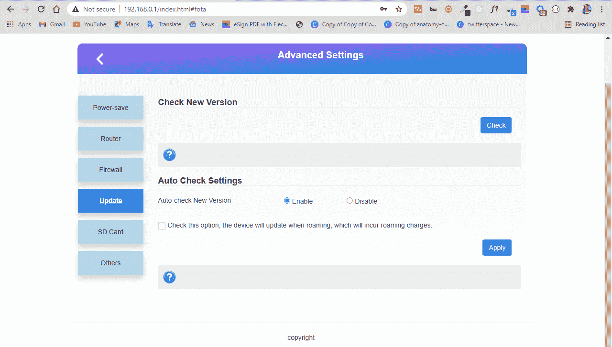

# 为什么我的 WiFi 一直断网？[在 Windows 10 PC 上解决]

> 原文：<https://www.freecodecamp.org/news/why-does-my-wifi-keep-disconnecting-solved-on-windows-10-pc/>

当您使用 Windows 电脑时，您的 WiFi 可能会意外断开连接。

这可能是由各种问题引起的，如过时的网络适配器驱动程序、过时的路由器软件和 Windows 10 中优化的电源管理。

如果您的 WiFi 一直断开连接，而您正在寻找解决方案，那么您来对地方了。在这篇文章中，我将向你展示 3 种修复 Wifi 连接的方法。

## 如何通过更新网络适配器驱动程序来阻止 WiFi 断开连接

拥有最新的驱动程序非常重要，这样您的硬件(包括外部硬件)才能正常运行。因此，如果您更新您的 WiFi 适配器，这可能会阻止您的 WiFi 断开连接。

执行以下步骤来更新您的网络适配器驱动程序:

**第一步**:点击开始(Windows logo)，搜索“设备管理器”。点击“设备管理器”搜索结果。

**第二步**:展开“网络适配器”选项。

**第三步**:找到你当前的适配器，点击右键，选择“更新驱动”。

**第四步**:选择“自动搜索驱动程序”。Windows 现在将在 internet 上搜索更新的驱动程序并为您安装。

## 如何通过更新路由器软件来阻止 WiFi 断开连接

每台路由器都有软件为其供电并使其正常工作。

不同的制造商有不同的用户界面，你只要在浏览器的地址栏输入你的 IP 地址就可以找到。

当您成功登录时，请检查是否有适用于您的路由器的更新并安装它。

## 如何通过检查网络适配器电源管理选项来阻止 WiFi 断开连接

Windows 10 经过优化，可以节省电池电量。互联网连接会增加功耗，因此有时您的设备可能会自动设置为不时断开连接以节省电量。

您可以通过以下步骤检查您的网络适配器是否配置为断开连接:

**步骤 1** :右键点击开始，选择“设备管理器”。

**第二步**:扩展网卡。

**步骤 3** :右键单击遇到问题的适配器，然后选择“属性”。

**第四步**:点击“电源管理”标签。取消选中“允许电脑关闭此设备以省电”。

## 结论

这篇文章重点介绍了 3 种方法来修复你的 WiFi，如果它一直断开连接。

除了这些解决方案，您还可以尝试其他次要的解决方案，例如:

*   不要离你的路由器太远
*   限制连接的设备
*   联系您的网络服务提供商
*   避免来自电话、蓝牙设备和其他设备的无线电干扰。

感谢您阅读这篇文章。如果你觉得这篇文章有帮助，请分享给你的朋友和家人。