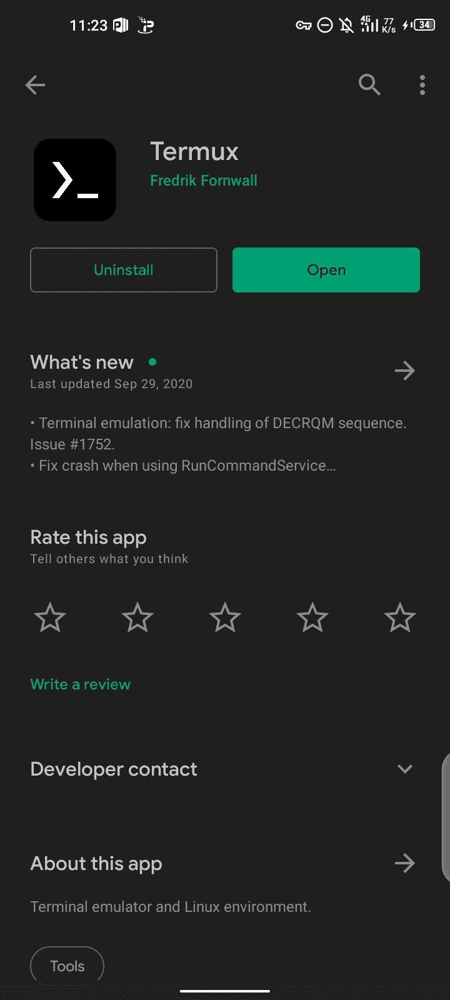
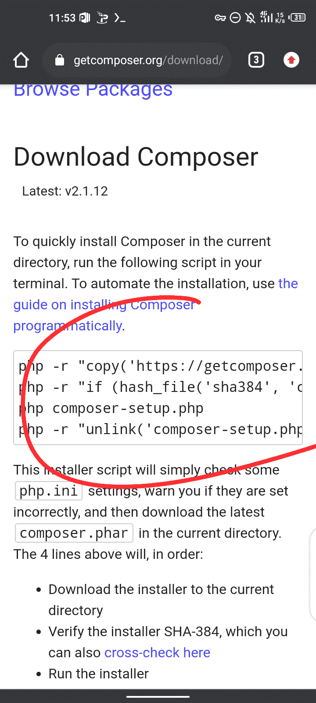
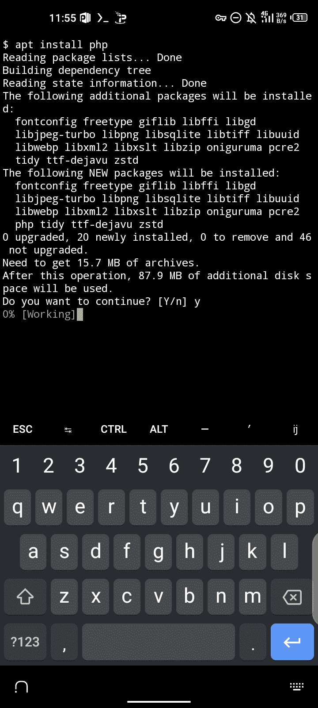
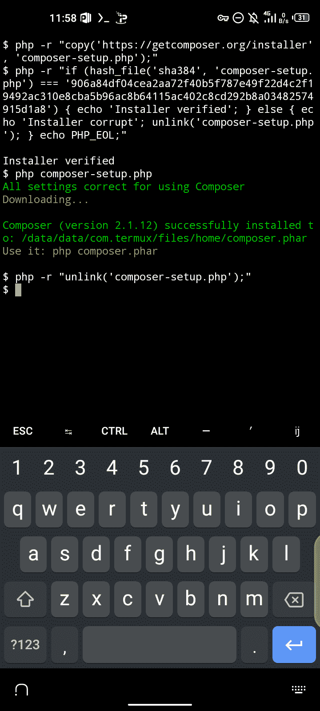
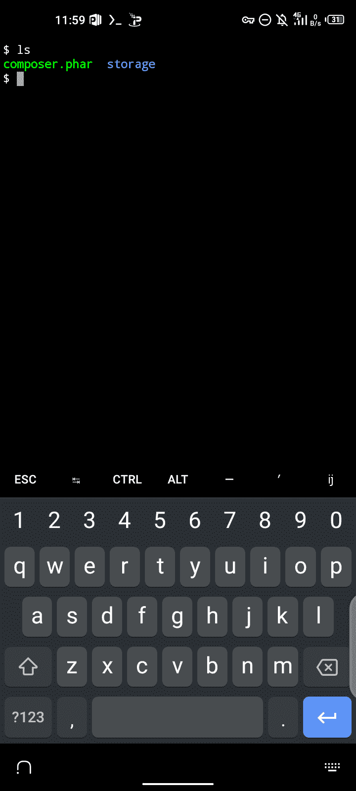
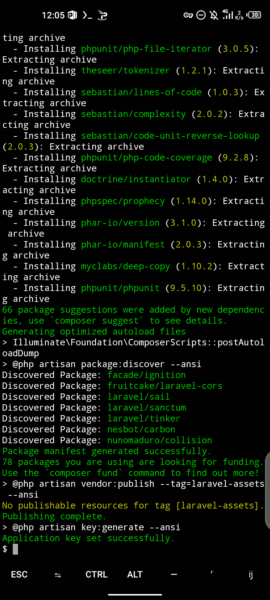
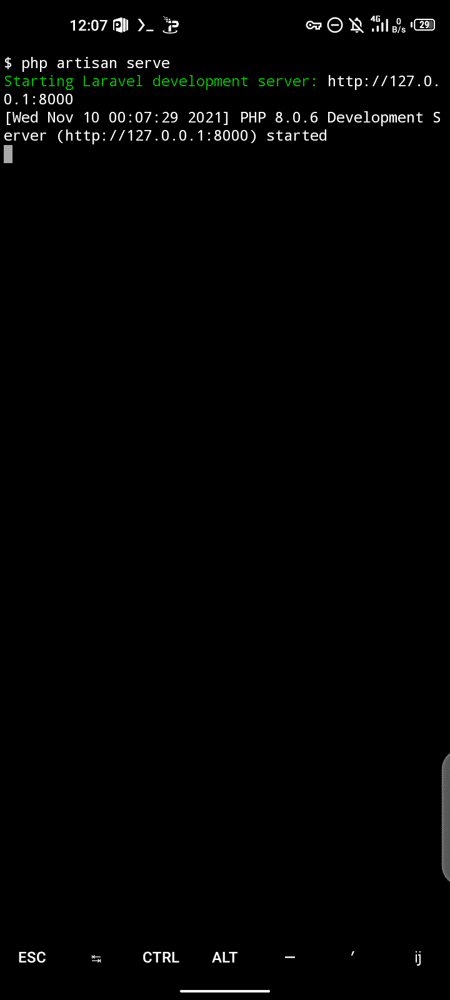
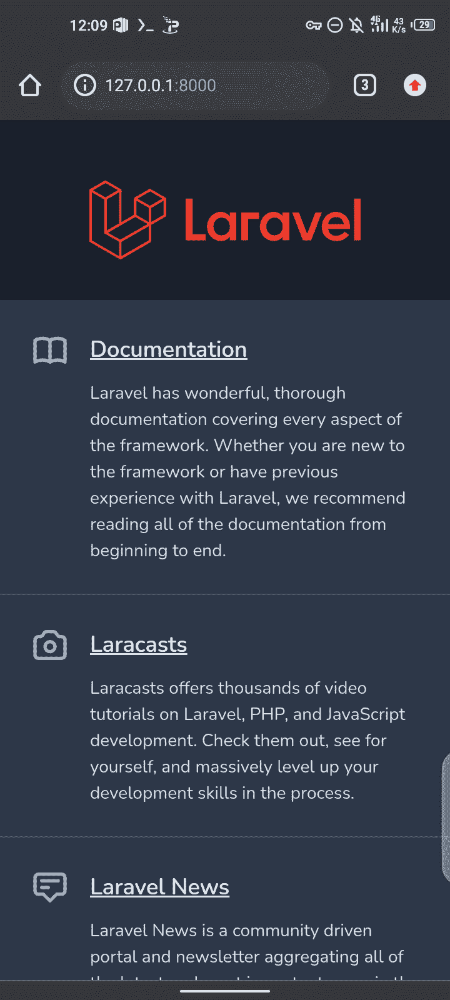
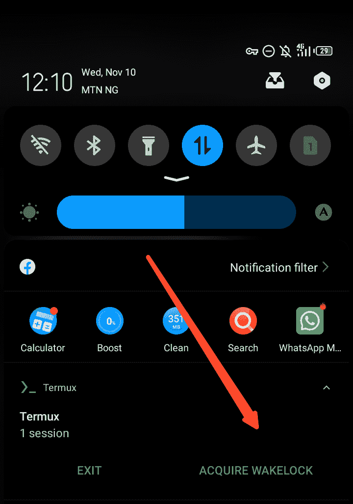

# 如何在 Android 手机上设置 Laravel 8

> 原文：<https://www.freecodecamp.org/news/how-to-setup-laravel-8-on-android-phone/>

嘿，你好吗？在本文中，我将向您展示如何在手机上安装 Laravel 8。

为了更好地理解本指南，您应该对 PHP 有所了解，并且应该知道 Laravel 是什么。但是如果你没有，不要担心——我会解释一些基础知识，这样你就可以开始了。

## 什么是 Laravel？

Laravel 是一个 web 应用程序框架，具有丰富、优雅的语法。它是基于 PHP 构建的，这意味着 Laravel 是 PHP，但它使事情更容易处理。

它附带了许多不同特性的包，比如身份验证，所以我们不需要自己编写身份验证。要了解更多关于 Laravel 的功能，你可以访问位于 laravel.com 的网站。

## 我为什么写这个教程

我创建了这个教程，因为我想让那些对编程感兴趣但没有笔记本电脑或 pc 的人能够在他们的手机上构建东西。

我在 freeCodeCamp 上的最后一篇帖子让我意识到，人们对了解这项技术的工作原理很感兴趣，所以这就是我制作更多类似指南的原因。

所以让我们深入研究一下。在本教程中，我将向你展示如何安装 composer.php，并使用它来设置你的手机上的 Laravel 8🔥🔥。

我是宝贝奥拉德勒，这个月我就快 19 岁了，🥴.我来自尼日利亚，我将带你经历这个过程。如果你想知道我怎么知道这么多，那是因为我也没有笔记本电脑，所以我用手机来探索😎。

## 要求

要浏览本教程，你需要一部 6.0+版本的 Android 手机。

## 建立

我们需要去游戏商店下载 **Termux:**



Termux 是一个基于 Linux 的系统，我们可以在手机上使用。这就像使用普通的 Linux 一样简单——你可以安装任何东西，甚至是 Kali、Ubuntu 或任何你想要的东西。但是在本教程中，我们将使用它在我们的手机上设置 Laravel 8。

## 下载作曲家

在我们下载 composer 之前，我们需要打开我们的 **Termux** 应用程序并键入以下命令:

```
termux-setup-storage
```

它会询问您存储权限，所以请继续并单击“接受”。一旦你完成了，就去 https://getcomposer.org/download/。



我们需要把那里的所有东西都拿走。但在此之前，我们需要安装 PHP，这样我们就可以在我们的应用程序中使用它。要在您的 **Termux** 中做到这一点，请键入以下命令:

```
apt install php 
```

然后点击回车。您应该看到这个:



一旦完成，就直接去 composer 页面获取代码。我们需要这样做，因为 Termux 是基于 Linux 的。如果是 Windows，那里会有一个下载 composer.exe 的简单按钮。

将整个代码复制到 Termux ，在那里你可以粘贴它。然后点击回车。

安装 composer 后，您应该会看到如下内容:



## 如何安装 Laravel 8

在安装 Laravel 8 之前，让我们检查一下是否有一个 **composer.phar** 文件。在您的**终端中键入以下命令:**

```
ls
```

然后回车。您将在那里看到可用的文件。



可以看到 **composer.phar** 文件和一个**存储**文件夹。存储文件夹向您的文件管理器授予访问权限。记住你先写的 **termux-setup-storage** 命令。

现在让我们安装 Laravel 8。为此，我们既可以创建一个项目，也可以全局安装它。但是在你的手机上全局安装它的过程有点长，因为你需要设置一个路径等等，这可能会很混乱。因此，在本指南中，我们将创建一个项目。

在你的**终端**中，继续输入:

```
php composer.phar create-project laravel/laravel myapp
```

`myapp`只是项目名称，您可以随意更改。然后按回车键，等待奇迹发生。

当您看到以下内容时，这意味着已经安装了 Laravel:



容易得很。现在要测试它，你可以通过键入**`cd myapp`**CD 进入`myapp`。然后就可以用 **`php artisan serve`运行 Laravel 服务器了。**

瞧，开发已经开始了🔥



现在你可以在浏览器中打开 [http://127.0](about:blank) .0.1:8000，看到 Laravel 正在运行:



还要确保你这样做，这样你的 **Termux** 应用就不会在你编码的时候强制关闭:😎



## 就是这样！

感谢阅读。我希望你从这篇教程中学到了一些东西。你现在应该能够在你的 Android 手机上安装 Laravel，并开始使用它来构建应用程序。

如果你想从我这里得到更多的内容，你可以订阅我的 YouTube 频道🙏😁
[DevStack](https://youtube.com/channel/UCLcHGKxbEO1XGVETXqzYXLA)

[https://www.youtube.com/embed/VAh6A1SpZfo?start=490&feature=oembed](https://www.youtube.com/embed/VAh6A1SpZfo?start=490&feature=oembed)