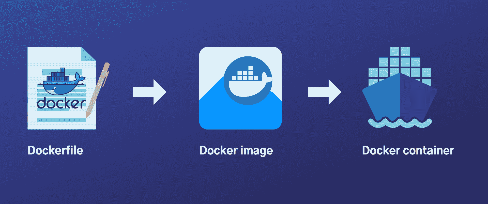
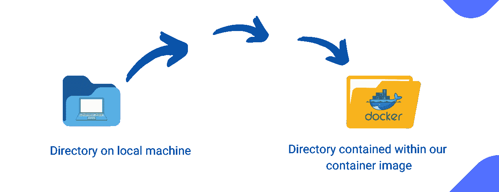

# 如何对烧瓶应用程序进行归档

> 原文：<https://www.freecodecamp.org/news/how-to-dockerize-a-flask-app/>

如今，开发人员需要比以往更快地开发、发布和运行应用程序。幸运的是，有一个工具可以帮你做到这一点——Docker。

使用 Docker，您现在可以轻松地快速交付、测试和部署代码，同时保持对基础架构的完全控制。它大大减少了从编写代码到在生产环境中运行代码的时间。

这篇文章将向你展示如何制作一个基本的 Docker 镜像，并把它作为一个容器来运行。在演示中，我们将使用 Flask 作为我们的 web 框架和 Docker 来进行图像创建和容器化。您还将学习一些常用的 Docker 命令。

## 烧瓶是什么？

[**Flask**](https://flask.palletsprojects.com/en/2.0.x/) 是一个流行的 Python 微型 web 框架，可以帮助你快速方便地开发轻量级 web 应用和 API。

作为一个 web 框架，它为简单的 web 应用程序提供了更大的灵活性、定制性和可伸缩性，同时保持与前沿技术的高度兼容。

## Docker 是什么？

Docker 是一个工具，它使得使用容器创建、部署和运行应用程序变得更加容易。

一个 **docker 容器**是一个依赖关系和代码的集合，组织成软件，使应用程序能够在一系列计算环境中快速高效地运行。

另一方面， **docker 映像**是指定如何运行应用程序的蓝图。为了让 Docker 自动构建映像，必须在一个名为 **Dockerfile** 的特殊文件中存储一组指令。

该文件中的指令由用户在命令行界面上执行，以创建映像。(来源:[docker.com](https://www.docker.com/resources/what-container))



## 如何设置项目

### 基本目录结构

完成以下步骤后，我们的应用程序目录结构将如下所示:

**flask 码头**
【app . py】

码头设施
要求. txt
**venv**

在这一节中，我们将介绍如何创建一个结构类似于上面所示的应用程序。你可以在这里找到关于如何创建或安装这个项目的详细指南。

假设您正确地遵循了安装说明，并且拥有一个安装了 Flask 的活动虚拟环境，我们现在将修改 GitHub 自述文件中创建的两个文件，如下所示。

### 如何修改 app.py

让我们将下面几行代码添加到我们的 **app.py** 中:

```
from flask import Flask
app = Flask(__name__)

@app.route('/')
def hello_geek():
    return '<h1>Hello from Flask & Docker</h2>'

if __name__ == "__main__":
    app.run(debug=True)
```

现在，如果我们在命令行上运行 **python app.py** 来测试我们的 Flask 应用程序，我们应该会得到如下所示的结果:

```
 * Serving Flask app 'app' (lazy loading)
 * Environment: production
   WARNING: This is a development server. Do not use it in a production deployment.
   Use a production WSGI server instead.
 * Debug mode: on
 * Running on http://127.0.0.1:5000/ (Press CTRL+C to quit)
 * Restarting with stat
 * Debugger is active!
 * Debugger PIN: 316-584-348 
```

### 如何修改 Dockerfile 文件

```
# syntax=docker/dockerfile:1

FROM python:3.8-slim-buster

WORKDIR /python-docker

COPY requirements.txt requirements.txt
RUN pip3 install -r requirements.txt

COPY . .

CMD [ "python3", "-m" , "flask", "run", "--host=0.0.0.0"]
```

在为我们刚刚创建的应用程序构建映像之前，让我们先了解一下上面 Docker 文件中的代码行是什么意思，它们扮演什么角色。

下面的代码应该是每个 Docker 文件的第一行——它告诉 Docker 构建器在解析 Docker 文件时使用什么语法以及 Docker 语法文件的位置。([来源](https://docs.docker.com/engine/reference/builder/#syntax))

```
# syntax=docker/dockerfile:1
```

虽然可以创建我们自己的基本映像，但是没有必要走那么远，因为 Docker 允许我们继承现有的映像。下面一行告诉 Docker 使用哪个基本图像——在本例中是一个 Python 图像。

```
FROM python:3.8-slim-buster
```

为了让事情有条理，我们还告诉 Docker 剩下的操作使用哪个文件夹，所以我们使用如下所示的相对路径。

在这种情况下，我们告诉 Docker 对其余操作使用相同的目录和名称——它是包含在我们的容器映像中的一个目录。

```
WORKDIR /python-docker 
```

在第四和第五行中，我们告诉 Docker 将 requirements.txt 文件的内容复制到容器映像的 requirements.txt 文件中。然后运行 pip install，将所有依赖项安装在同一文件中，供映像使用。

```
COPY requirements.txt requirements.txt
RUN pip3 install -r requirements.txt
```

继续复制，我们现在将本地工作目录中的剩余文件复制到 docker 映像中的目录。

```
COPY . .
```



到目前为止，我们的映像包含了所有与本地工作目录中的文件相似的文件。我们的下一个任务是帮助 Docker 理解如何在容器中运行这个映像。

这一行特别指示 Docker 将我们的 Flask 应用程序作为一个模块运行，如“-m”标记所示。然后它指示 Docker 让容器在外部可用，比如从我们的浏览器，而不仅仅是从容器内部。我们通过主机端口:

```
CMD [ "python3", "-m" , "flask", "run", "--host=0.0.0.0"]
```

因为我们有，

```
if __name__ == "__main__":
    app.run(debug=True)
```

因为在我们的应用程序文件中有“if”语句，所以如果我们将这个模块作为一个独立的程序运行，这将是正确的。因此，它可以作为由另一个程序导入的模块或独立程序运行，但如果作为程序运行，它将只执行 if 语句中的代码。([来源](https://stackoverflow.com/a/1973391/12943692))

## 如何建立码头工人形象

之后，剩下的就是建立我们的形象了。使用 **`docker build`** ，我们现在可以争取 Docker 的帮助来建立形象。您可以将 build 命令与其他标记(如"- tag "标志)结合使用，以指定图像名称。

```
docker build --tag python-docker .
```

### 如何将图像作为容器运行

在容器中运行映像就像构建映像一样简单。但是在我们这样做之前，我们想看看在我们的环境中还有什么其他图像可用。要从命令行查看图像，请执行以下操作:

```
docker images
```

如果上面的命令找到任何图像，输出应该如下所示:

```
REPOSITORY      TAG       IMAGE ID       CREATED             SIZE
python-docker   latest    cd52b70b361a   About an hour ago   912MB
headless-cms    latest    e8b253e230ee   43 hours ago        937MB
scrappy         latest    3e7ac0d44890   7 weeks ago         904MB
python          3.9.2     587b1bc803b3   7 months ago        885MB 
```

现在我们可以选择运行哪个映像。使用 **`docker run`** 命令，我们可以通过将图像的名称作为参数来运行图像。

```
docker run
```

在运行上面的命令时，您会注意到在命令行上它表明应用程序正在运行。但当你在浏览器上输入 [`http://localhost:5000/`](http://localhost:5000/) 时，问候会是:

> 无法访问此站点，本地主机拒绝连接。

不管容器是否正在运行，它都是在隔离模式下运行，无法连接到 localhost:5000。

最佳解决方案是在分离模式下运行映像。因为我们需要在浏览器中而不是在容器中查看这个应用程序，所以我们将修改 docker 运行并添加两个额外的标记:“-d”以在分离模式下运行它，以及“-p”以指定要公开的端口。

docker run 命令现在将被格式化如下:

```
docker run -d -p 5000:5000 python-docker
```

这一次，如果我们在分离模式下运行它并在端口 5000 访问 localhost，我们将看到以下输出:


我们可以使用以下命令来查看哪些容器当前正在运行:

```
docker ps
```

输出如下所示:

```
CONTAINER ID   IMAGE           COMMAND                  CREATED         STATUS         PORTS                    NAMES
a173935297cd   python-docker   "python3 -m flask ru…"   5 minutes ago   Up 5 minutes   0.0.0.0:5000->5000/tcp   happy_wescoff 
```

要停止当前运行的容器，我们执行以下命令:

```
docker stop <container-name>
```

使用 Docker 时，另一个有用的命令是:

```
docker container prune
```

它删除未使用的资源，释放空间，保持您的系统干净。

就是这样！

感谢您花时间阅读这篇文章。请分享，在推文中感谢我，别忘了在 Twitter 上关注我 [@dev_elie](https://twitter.com/dev_elie) 。

你可以在官方[文档](https://docs.docker.com/language/python/)中找到更多关于 Docker 和 Python 的信息。下次再见。