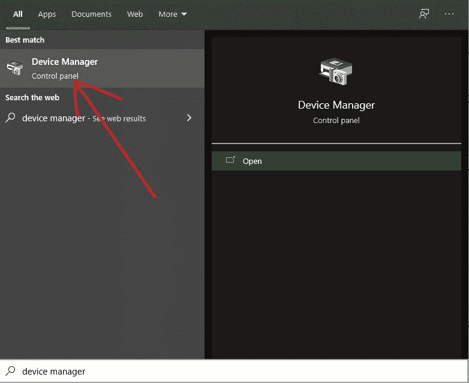
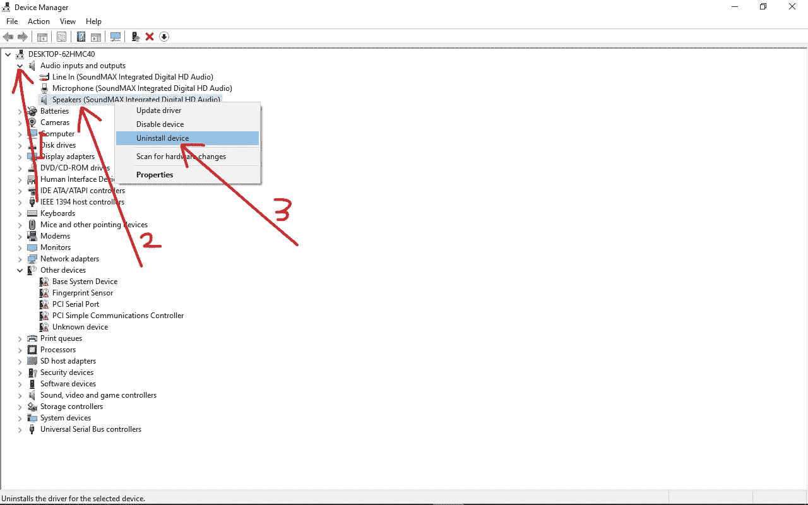

# 没有安装音频输出设备[固定在 Windows 10 PC 上]

> 原文：<https://www.freecodecamp.org/news/no-audio-output-device-is-installed-fixed-on-windows-10-pc/>

如果使用 Windows 10，可能会遇到“没有安装音频输出设备”的错误。

该错误可能是由损坏的驱动程序、过期的更新或不正确的连接引起的。

在这篇文章中，我将向你展示两种方法可以修复“没有音频输出设备安装”的错误。我还将向您展示一些其他故障排除方法，这样您就可以再次在电脑上听音乐或听到声音。

## 如何通过更新音频驱动程序来修复没有安装音频输出设备的错误

**第一步**:点击开始(Windows logo)或者按键盘上的`WIN`键，然后搜索“设备管理器”。点击第一个搜索结果或按下`ENTER`。

**步骤 2** :展开“音频输入输出”。

**第三步**:右键点击你的音频设备，选择“更新驱动”。

**第四步**:选择“自动搜索更新的驱动软件”。Windows 现在将在 internet 上搜索更新的音频驱动程序，并为您的计算机安装它。

## 如何通过卸载音频设备来修复没有安装音频输出设备的错误

**第一步**:按键盘上的`WIN` (Windows logo)键，然后搜索“设备管理器”。点击第一个搜索结果或按下`ENTER`。

**步骤 2** :展开“音频输入输出”

**第三步**:右击你的音频设备，选择【卸载设备】

第四步:重启你的电脑，新版本的音频设备就会被下载下来。

## 最后的话

在本文中，您了解了两种修复“没有安装音频输出设备”错误的方法。

除了更新电脑的音频驱动程序，或者音频设备本身，你还可以通过更新 Windows 10 来修复“没有音频输出设备安装错误”。

此外，如果您使用的是外部音频设备，您应该确保它正确连接到您的电脑，否则，这种不正确的连接可能会干扰外部音频设备。

感谢您的阅读。如果你觉得这篇文章有用，请分享给你的朋友和家人。