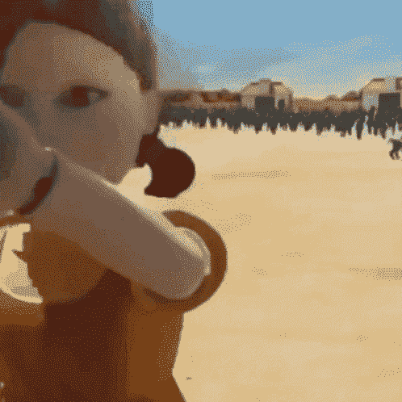

# 用 Three.js 创建一个乌贼游戏 JavaScript 游戏

> 原文：<https://www.freecodecamp.org/news/create-a-squid-game-javascript-game-with-three-js/>

你会在电视节目《乌贼游戏》中幸存下来吗？你能在编写电视节目《乌贼游戏》中生存下来吗？

是时候找出答案了。

我们刚刚在 freeCodeCamp.org YouTube 频道上发布了一个 JavaScript 课程，将教你如何从 Squid Game 创建红灯/绿灯游戏。

您将使用 Three.js 并学习如何在 JavaScript 游戏中使用 3d 模型。

Don't get caught.

来自 Angle Brace YouTube 频道的 Shuvo 开发了这个课程。他在自己的频道中创建了许多有趣的 JavaScript 教程。

本课程包括以下几个部分:

*   设置
*   Three.js 基础
*   加载 3D 模型
*   玩偶类
*   GSAP 动画
*   创建轨道
*   玩家等级
*   按键处理
*   发挥娃娃的功能
*   游戏逻辑

观看以下全部课程或在 freeCodeCamp.org YouTube 频道观看[(1 小时观看)。](https://youtu.be/4HSxX-EKJjw)

[https://www.youtube.com/embed/4HSxX-EKJjw?feature=oembed](https://www.youtube.com/embed/4HSxX-EKJjw?feature=oembed)