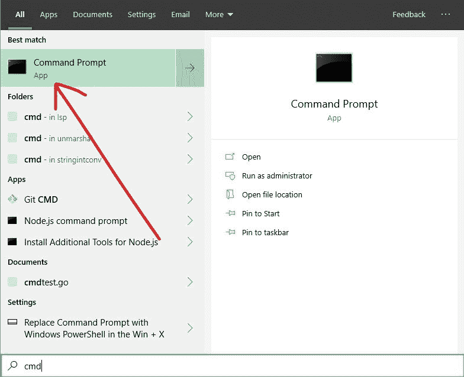
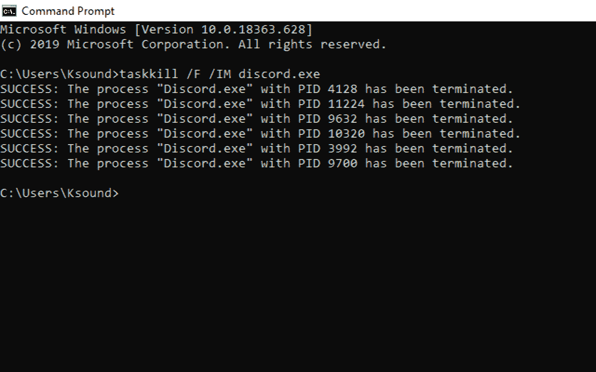
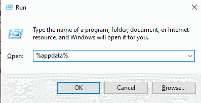
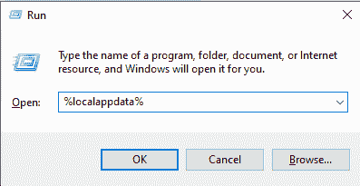
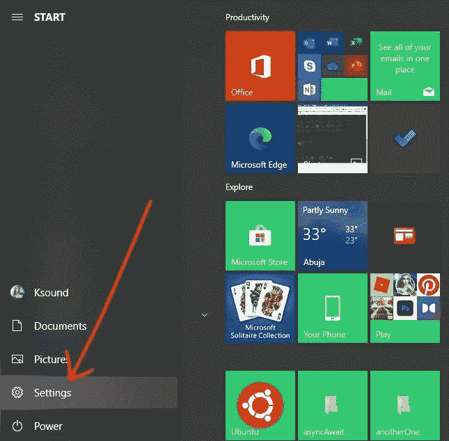
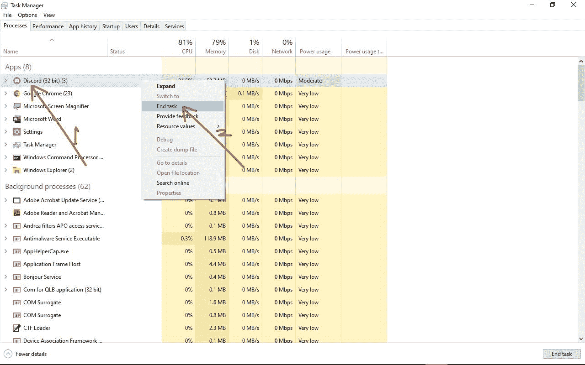

# 不和谐在我的电脑上打不开[在 Windows 10 中解决]

> 原文：<https://www.freecodecamp.org/news/discord-wont-open-on-my-pc-solved-in-windows-10/>

Discord 是一款即时通讯应用，您可以使用它通过文本消息、语音通话和视频通话进行交流。你也可以用它来分享文件。

Discord 最初是为游戏玩家创造的，但现在许多其他人也在使用它。对于许多用户来说，它已经成为 Slack 的替代品——尤其是对于那些想要拥有一个在线社区的人。

但有时，当你启动它时，不和谐可能不会打开。这可能是由于未决的更新、正在运行的游戏和其他原因。

在这篇文章中，我将向你展示 5 种快速的方法，你可以在 Windows 10 电脑上再次打开 Discord。

## 目录

*   [如何修复命令行不打开的不和谐](#howtofixdiscordnotopeninginthecommandline)
*   [如何通过清除 AppData 修复不和谐不打开](#howtofixdiscordnotopeningbyclearingappdata)
*   [如何通过清除 LocalAppData 修复不和谐不打开](#howtofixdiscordnotopeningbyclearinglocalappdata)
*   [如何通过关闭后台应用修复不和谐不打开](#howtofixdiscordnotopeningbyclosingbackgroundapplications)
*   [如何解决与任务管理器不一致的问题](#howtofixdiscordnotopeningwiththetaskmanager)
*   [结论](#conclusion)

## 如何修复命令行中不打开的不和谐

我建议再次打开 Discord 的第一个修复方法是用命令提示符终止 Discord 任务。

这是怎么做的:

**第一步**:点击开始或者按键盘上的`WIN` (Windows 键)，然后搜索“cmd”。

**第二步**:点击`ENTER`或选择第一个搜索结果打开命令提示符。

**步骤**:输入`taskkill /F /IM discord.exe`，点击`ENTER`。

您应该会收到一条消息，表明 Discord 进程已经终止。

## 如何通过清除 AppData 修复不和谐不打开

当您清除应用程序的 AppData 时，所有缓存文件都会被清除-这可以修复一些问题，包括加载。

通过以下步骤清除您的不一致的 AppData:

**第一步**:按`WIN` (Windows 键)+ R 打开跑步对话框。

**第二步**:输入“%appdata%”(不带引号)，然后按键盘上的`ENTER`。这将打开 AppData 文件夹。

**第三步**:定位 Discord 文件夹，删除。把它也从你的回收站里删除。

## 如何通过清除 LocalAppData 修复不和谐不打开

清除不一致的 LocalAppData 可以使它再次打开。它还可以修复与 Discord 相关的常见 JavaScript 错误。

要清除 LocalAppData，请按照下列步骤操作:

**第一步**:按`WIN` (Windows 键)+ R 打开跑步对话框。

**第二步**:输入“%localappdata%”(不带引号)，按键盘上的`ENTER`。这将打开 LocalAppData 文件夹。

**第三步**:找到 Discord 文件夹，删除。去你的回收站把它也删除。

请注意，在清除其 LocalAppData 之后，您可能需要重新安装 Discord 才能让它再次运行。我可以证明这解决了问题，因为我最近不得不这样做。

## 如何通过关闭后台应用修复不和谐不打开

许多游戏在后台运行，这可能会对你的 Discord 应用程序产生负面影响。

仅当您没有在后台运行有用的应用程序时，才使用以下步骤来解决问题。

**第一步**:点击开始或者按键盘上的`WIN` (Windows 键)选择设置。

**第二步**:选择“隐私”。

**第三步**:点击左边的后台应用，然后关闭“让应用在后台运行”下的切换。

## 如何解决任务管理器无法打开的问题

使用任务管理器停止不协调过程可以在刷新应用程序时再次打开不协调。

**第一步**:按`CTRL` + `SHIFT` + `ESC`打开任务管理器

**第二步**:确保你在`Processes`下面。右键点击 Discord，选择“结束任务”。

## 结论

在本文中，您学习了当不和谐以几种不同的方式打开时，如何修复它。

除了本指南中讨论的方法之外，您还可以通过卸载并重新安装 Discord 来解决该问题。

请注意，您还可以通过使用本文中建议的修复方法之一——清除 LocalAppData——来修复 Discord 的另一个常见问题——JavaScript 错误。我不得不自己做这件事。

非常感谢你的阅读。如果你觉得这篇文章有帮助，可以考虑分享给你的朋友。非常感谢。