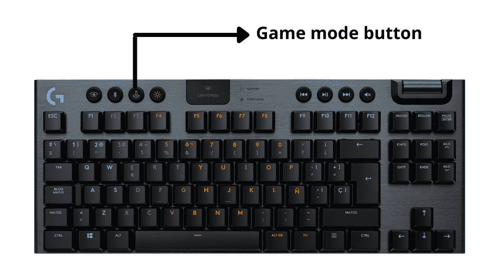
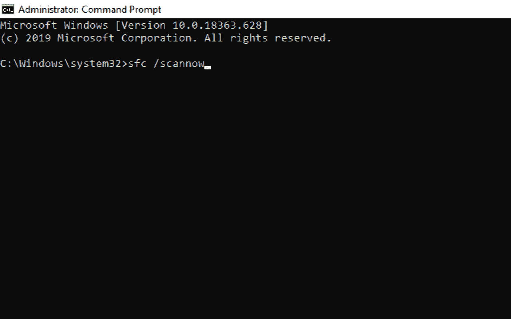
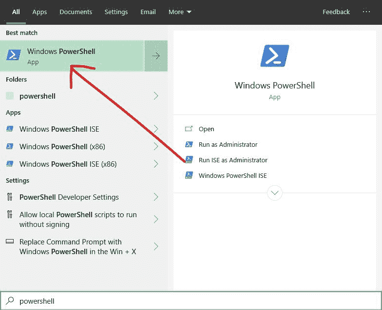
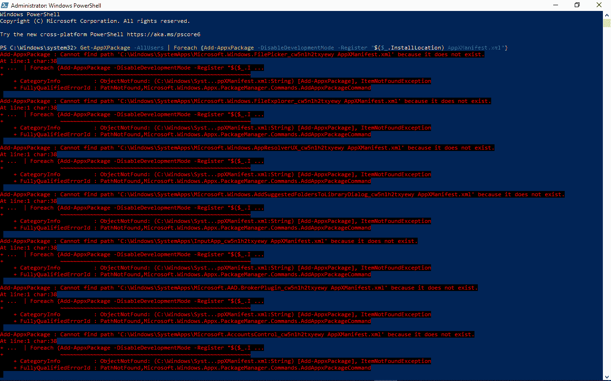

# Windows 键不起作用？以下是修复方法[Windows 10 PC 指南]

> 原文：<https://www.freecodecamp.org/news/windows-key-not-working-heres-how-to-fix-it-windows-10-pc-guide/>

在您的 Windows 机器上，Windows 键启动开始菜单，从那里您可以访问计算机上的任何内容。

当您将它与其他键一起按下时，它还可以作为一个有用的快捷方式来使用您不容易通过计算机的图形用户界面(GUI)获得的实用程序。

但是，如果你发现当你按下 Windows 键时，它不起作用，该怎么办呢？这可能是由硬件、驱动程序、游戏模式、机械损坏和其他原因造成的。

如果你有这个问题，你来对地方了。因为在这个详细的指南中，我将向您展示几种修复停止工作的 Windows 键的方法。

## 如何通过关闭游戏模式来修复 Windows 密钥

Windows 10 针对带有游戏模式的游戏进行了优化，但这有时会导致键盘故障，一些按键可能会停止工作。所以，禁用游戏模式可以让你的 Windows 键再次工作。

### 如何禁用游戏模式:

**步骤 1** :点击开始启动开始菜单，然后点击齿轮图标打开设置。

**第二步**:在菜单选项中，选择“游戏”。

**第三步**:点击游戏模式标签，确保游戏模式关闭。

一些 Logitech 键盘有用于打开和关闭游戏模式的键。

这不会针对游戏优化您的计算机，但会禁用一些不用于玩游戏的键，如 Windows 键。

如果你使用这些键盘中的一个，确保游戏模式已经关闭。

## 如何通过关闭 Windows 锁定键来修复 Windows 密钥

就像 Caps lock 和 Num lock 一样，一些键盘有一个 Windows lock 键，可以打开和关闭 Windows 键。

如果您的 Windows 键不起作用，请检查键盘上是否有该键，并确保它没有打开。

如果您不确定您的键盘是否有 Windows lock 键，请在 Google 上搜索您的键盘型号。

## 如何通过关闭筛选器键来修复 Windows 密钥

过滤键是 Windows 10 的辅助功能，可以忽略多次按键。这可能会干扰键盘的 Windows 键，因此关闭它可能会解决此问题。

要关闭过滤键，请按照以下步骤操作:

**步骤 1** :点击开始，搜索“控制面板”，启动控制面板。然后按`ENTER`或点击第一个搜索结果。

**第二步**:点击轻松访问。

**第三步**:点击“改变你的键盘工作方式”的链接。

**步骤 4** :取消勾选“关闭过滤键”复选框。

**第五步**:点击“应用”，然后点击“确定”。

## 如何通过关闭粘滞键来修复您的 Windows 密钥

粘滞键是 Windows 10 的另一个辅助功能，可以帮助无法按下多个键盘键的人有效地使用键盘。

此功能也可能会干扰 Windows 键，因此关闭它可以解决 Windows 键不起作用的问题。

**步骤 1** :点击开始，搜索“控制面板”，然后选择“控制面板”。

**第二步**:选择方便进入。

**第三步**:点击“改变键盘工作方式”链接。

**第四步**:取消勾选“开启粘滞键”。

**第 5 步**:点击“应用”按钮，确保关闭，然后点击“确定”。

## 如何通过更新键盘驱动程序来修复 Windows 密钥

如果您的计算机有一个过时或损坏的驱动程序，这可能会导致键盘的 Windows 键不起作用。因此，更新驱动程序，或者卸载并重新安装它，最终可能会解决问题。

**步骤 1** :点击桌面上的开始，搜索“设备管理器”，然后点击第一个【可能是唯一的】搜索结果。

**第二步**:展开键盘部分。

第三步:右击你正在使用的键盘，点击“更新驱动程序”。

**第四步**:选择“自动搜索驱动程序”。您的计算机现在将在线搜索并安装驱动程序更新。

## 如何通过在命令行中执行 SFC 扫描来修复 Windows 密钥

您可以使用系统文件扫描来修复 Windows 10 电脑上的许多问题，包括键盘问题，如 Windows 键不起作用。

**第一步**:点击桌面上的开始(Windows logo)，搜索“cmd”。

**第二步**:不要只选择“命令提示符”搜索结果，点击右边的“以管理员身份运行”。

**第三步**:粘贴这个命令`sfc /scannow` ，然后点击`ENTER`。

第四步:扫描可能需要一段时间。等待它完成，然后重新启动计算机。

## 如何使用 PowerShell 命令修复 Windows 密钥

就像命令提示符一样，PowerShell 是一个命令行应用程序，允许您运行脚本和命令，直接与您的计算机通信。

**第一步**:点击开始，搜索“powershell”。然后点击`ENTER`打开第一个搜索结果，应该是 Windows PowerShell。

**第二步**:将以下命令粘贴到 PowerShell 中，点击`ENTER` : `Get-AppXPackage -AllUsers | Foreach {Add-AppxPackage -DisableDevelopmentMode -Register "$($_.InstallLocation) AppXManifest.xml"}`

不要为错误而烦恼。它完成了任务。

第三步:重启电脑。

## 结论

这篇文章向您介绍了几种方法，当您的 Windows 键无法打开开始菜单或执行您想要的快捷方式时，您可以使用这些方法来修复它。

如果其中一个修复失败，您可以尝试其他几个选项。

只是要小心那些与命令行有关的修复。这些命令会直接干扰您电脑的操作系统，因此会对您的电脑产生持久的影响。

我希望这篇文章能帮助你修复一个不工作的 Windows 键。如果你觉得这篇文章有帮助，一定要与你的朋友和家人分享。

感谢您的阅读。