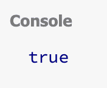
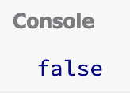
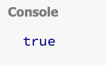
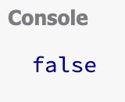

# JavaScript 字符串包含–如何使用 JS。包括()

> 原文：<https://www.freecodecamp.org/news/javascript-string-contains-how-to-use-js-includes/>

在 JavaScript 中，您可以使用`.includes()`方法来查看一个字符串是否在另一个中找到。但是它到底是如何工作的呢？

在本文中，我将带您浏览几个名为`.includes()`的 JavaScript 字符串方法的代码示例。

## 基本`.includes()`语法

下面是`.includes()`方法的基本语法:

```
str.includes(search-string, optional-position)
```

`search-string`参数是您在`str`中搜索的字符串。

`position`参数是`str`中开始搜索位置的可选数字。如果省略位置参数，则默认值为零。

如果找到了`search-string`，那么它将返回`true`。如果没有找到`search-string`，那么它将返回`false`。

## includes 方法的代码示例

在第一个例子中，我们有这样一句话，“我爱 freeCodeCamp”。我们想看看“爱”这个词是否包含在那句话里。

在代码中，`str`是“我爱 freeCodeCamp”，而`search-string`是“爱”。

```
"I love freeCodeCamp".includes("love")
```

由于单词“love”包含在`str`中，那么代码将返回`true`。



### `.includes()`方法区分大小写吗？

如果我们将我们的`str`修改为“我爱 freeCodeCamp ”,而`search-string`仍然是“爱”,那么返回值将是`false`。

```
"I LOVE freeCodeCamp".includes('love')
```



这是`false`，因为`.includes()`方法是区分大小写的。“爱”和“爱”不一样。

### 如何使用可选的位置参数

我们将修改我们的示例以使用位置参数。我们现在要检查当搜索从位置 1 开始时，是否在“我爱 freeCodeCamp”中找到了“love”。

请记住，字符串使用从零开始的索引，这意味着第一个字母“I”是索引 0。

我们的代码将返回`true`，因为当我们从位置 1 开始搜索时，单词“love”直到位置 2 才出现，所以它完全包含在字符串中。

位置 1 直到句尾包括这些字符和空格。

```
" love freeCodeCamp"
```

请记住，字符串中的空格会得到一个索引值。

这是我们的代码使用 position 参数后的样子。

```
"I love freeCodeCamp".includes('love', 1)
```



如果我们把位置改为 3，那么返回将是`false`。

```
"I love freeCodecamp".includes('love', 3)
```



这将返回`false`，因为位置 3 是字母“o”。

位置 3 直到句尾包括这些字符和空格。

```
"ove freeCodeCamp"
```

你可以看到,“爱”这个(完整的)单词并没有出现在那个字符串中。

## 结论

在 JavaScript 中，您可以使用`.includes()`方法来查看一个字符串是否在另一个中找到。

下面是`.includes()`方法的基本语法。

```
str.includes(search-string, optional-position)
```

如果找到了`search-string`，那么它将返回`true`。如果没有找到`search-string`，那么它将返回`false`。

`.includes()`方法区分大小写，这意味着如果`search-string`与`str`中的大小写不匹配，那么它将返回`false`。

`position`参数是`str`中开始搜索位置的可选数字。如果省略位置参数，则默认值为零。

我希望您喜欢这篇关于`.includes()`方法的文章，并祝您的 JavaScript 之旅好运。