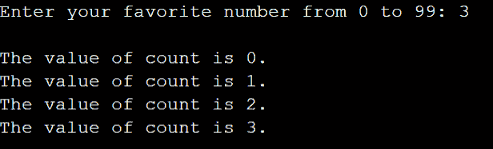
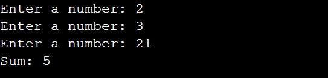
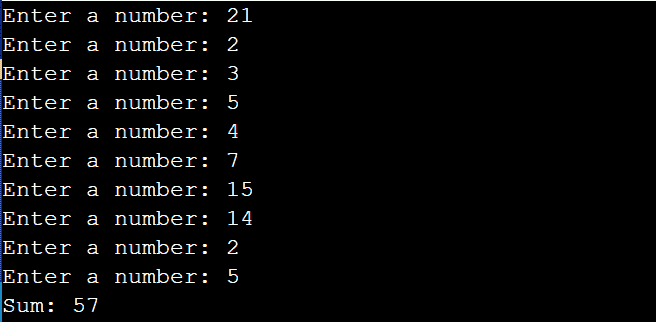

# C 中断和继续语句–解释了 C 中的循环控制语句

> 原文：<https://www.freecodecamp.org/news/c-break-and-continue-statements-loop-control-statements-in-c-explained/>

在 C 编程语言中，有时你会想要改变循环行为。`continue`和`break`语句帮助您跳过迭代，并在特定条件下退出循环。

在本教程中，你将学习`break`和`continue`语句如何改变程序的控制流。

让我们开始吧。

## 如何使用`break`退出 C 语言中的循环

在 C 中，如果你想在满足特定条件时*退出*循环，你可以使用`break`语句。

与 C 中的所有语句一样，`break`语句应该以分号(`;`)结束。

我们举个例子来理解这是什么意思。

考虑下面的代码片段。

```
#include<stdio.h>
int main()
{
    int count = 0;
    while(count < 100)
    {
        printf("The value of count is %d \n", count);
        count++;
    }
    return 0;
}
```

在这个例子中，只要`count`小于 100，`while`循环就重复循环体中的语句。

计数从 0 开始，每次迭代增加 1。

这是正常的控制流程。

让我们稍微修改一下。

*   从用户处读入一个整数`fav_num`。让我们假设`fav_num`是用户从集合`{0, 1, 2, ..., 99}`中最喜欢的数字。
*   在每次循环过程中，你必须检查`count`的当前值是否等于`fav_num`。
*   当`count`等于`fav_num`时，你想要退出循环。

那么你是如何做到这一点的呢？

通读以下代码片段:

```
#include<stdio.h>
int main()
{
    // Read in the user's favorite number
    int fav_num;
    printf("Enter your favorite number from 0 to 99: ");
    scanf("%d", &fav_num);

    int count = 0;
    while(count < 100)
    {
        printf("\nThe value of count is %d.", count);
        if (count == fav_num)
    		break;
        count++;
    }
    return 0;
}
```

*   在每次循环过程中，使用`if (count == fav_num)`来检查`count`是否等于`fav_num`。并且将`break;`语句添加到`if`语句的主体中。
*   只要`count ≠fav_num`，控制就不会到达`break;`语句。
*   当`count`等于`fav_num`时，触发`break;`语句，然后退出循环。
*   控制现在到达循环外的第一条语句。

示例输出如下所示:



注意一旦计数达到`3`，这里是`fav_num`，控制是如何退出循环的。

在下一节中，您将看到另一个例子来加强您的理解。

### C `break`语句示例

考虑以下示例:

*   `A[10]`是 10 个整数的数组，用 0 初始化。
*   你想从用户那里读入数组`A`的元素。并计算数组中元素的总和。
*   但是，你要求`A`的每个元素不大于`20`。
*   一旦用户输入一个大于 20 的数字，您选择终止循环。这就是`break;`语句派上用场的地方。

现在，通读下面的代码片段。

```
#include <stdio.h>

int main()
{
    int A[10] = {0};
    int sum = 0;

    for(int i = 0; i < 10; i++)
    {
        printf("Enter a number: ");
        scanf("%d",&A[i]);
        if (A[i] > 20)
            break;

        sum += A[i];
    }
    printf("Sum: %d",sum);
    return 0;
} 
```

*   这里，`sum`被初始化为`0`。
*   在每次循环中，用户都会被提示输入一个数字。并且输入的数字被加到`sum`的当前值上。
*   如果用户输入一个大于 20 的数字，控件将退出循环。



请注意，一旦用户输入一个大于`20`的数字——在本例中为`21`——循环就终止了。另外两个数字(2 和 3)的和被打印出来。

如果您已经在 C 中使用了`switch`语句，那么一旦找到匹配的 case 标签，您很可能会使用`break;`语句来退出 case 阶梯。

然而，本教程旨在教授如何使用`break;`和`continue;`语句来改变循环行为。

## 如何在 C 中使用`continue`跳过迭代

在 C 中，如果想跳过满足特定条件的迭代，可以使用`continue`语句。

> 与`break`语句不同，`continue`语句不退出循环。相反，它只跳过那些条件为真的迭代。

一旦`continue;`语句被触发，循环剩余部分的语句将被跳过。并且循环控制继续到下一次迭代。

### C `continue`语句示例

让我们使用上一节中的例子，并稍加修改。

假设您不想在用户输入大于 20 的数字时退出循环。相反，您希望忽略这些特定的输入，并计算数组`A`中剩余数字的总和。

*   假设用户输入 10 个数字，其中 3 个大于 20。
*   您的代码现在应该计算并显示剩余 7 个数字的总和。

那么你是怎么做到的呢？

> 您可以使用`continue;`语句只跳过那些用户输入大于 20 的迭代。🙂

您可以如下面的代码所示进行操作:

```
#include <stdio.h>

int main()
{
    int A[10] = {0};
    int sum = 0;

    for(int i = 0; i < 10; i++)
    {
        printf("Enter a number: ");
        scanf("%d",&A[i]);
        if (A[i] > 20)
            continue;

        sum += A[i];
    }
    printf("Sum: %d",sum);
    return 0;
}
```

在示例输出中，您可以看到第一个输入是大于`20`的`21`。

然而，该循环确实运行了 10 次。如果你准备做一个快速加法练习，你会发现 21 以外的数字(2、3、5、4、7、15、14、2 和 5)加起来确实是 57。✅



## 结论

在本教程中，你已经学习了如何使用`break;`和`continue;`语句来控制 c 语言中的循环。

总而言之，你已经学会了:

*   `break;`语句如何在特定条件下帮助退出循环。
*   在特定条件下,`continue;`语句如何帮助跳过迭代。

希望这篇教程对你有所帮助。编码快乐！😄