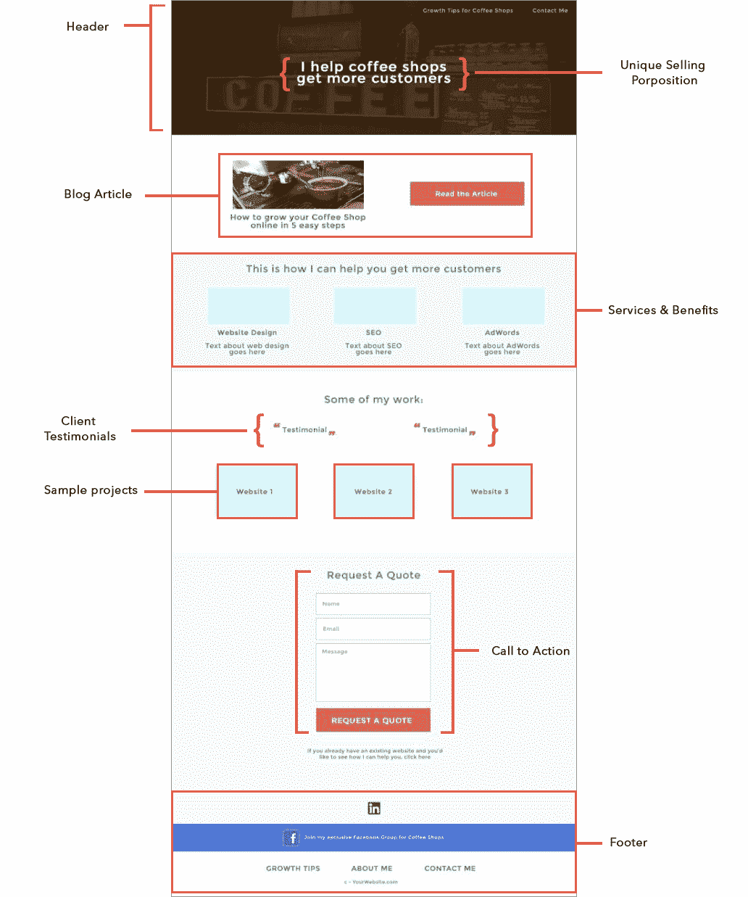

# 自由开发人员的免费线索生成技巧

> 原文：<https://www.freecodecamp.org/news/lead-generation-freelancers/>

作为一名自由职业者，锁定你想要的客户需要时间和努力，有时还需要金钱。

虽然花钱产生潜在客户可能是一件好事，但在这篇文章中，我想重点介绍作为自由开发者的[获得客户的免费潜在客户产生技巧](https://studywebdevelopment.com/how-to-get-clients-freelance-developer.html)，所有这些都可以快速轻松地阅读。

我们开始吧。

## 瞄准你想要的顾客或客户

确认您的销售线索是获得正确客户的关键，而销售线索挖掘是锁定正确客户的最佳方式。

请记住，无论您在流程中表现得多么出色，错误的销售线索都不会看到您服务的价值。

这里有[如何定位](https://studywebdevelopment.com/niche.html)以确保你专注于正确的客户。

## 产生品牌意识

事实是，大多数客户线索不会转化为付费客户。帮助转化更多潜在客户的一个方法是提高品牌知名度。当有人想到自由职业者或小众广告公司时，你必须是第一个想到的人。

要做到这一点，你需要活跃在社交媒体上，为你的目标客户发布有用的文章/内容。

想想你去年购买的东西。很有可能，大部分是因为知道了某个品牌或有人让你知道了它，很少是因为直接广告。

## 获得免费线索的最佳方式

作为一名自由职业者，你想充分利用你的技能，在销售线索挖掘上花费太多时间可能会分散你的注意力。

以下是一些产生客户线索的地方:

### 检查在线目录和平台

目录和[自由职业平台](https://dev.to/study_web_dev/here-are-10-freelancing-websites-to-find-clients-2d86)是产生潜在客户的绝佳方式。

这里有几个平台/目录可以考虑:

**Quora**
一个产生销售线索的好方法就是通过 Quora。我的哥哥也是一名自由职业者，他每个月都会从 Quora 获得大量线索。他所做的只是回答相关的商业问题，然后企业主就联系他。

很简单，但有时候我们就是把事情复杂化了。做和我哥哥一样的事。

**Hubstaff Talent**
我从这个平台上雇了几个自由职业者。强烈推荐。

**up work**
up work 有一个不好的 wrap，但是对于今天这么多自由职业者来说还是管用的，值得一试。它可能是当今存在的最好的网络目录，原因有很多。这在一定程度上是因为它允许消费者并鼓励他们发布对当地企业的评论。这意味着它不仅招募当地企业，还被视为一种在线口碑服务。黄页你可以找到大量的信息，比如企业的电话号码簿，这些信息是按类别组织的，而不是按企业名称的字母顺序。这个网络目录已经上市十年了，是城市或行业搜索的理想选择。

 **网络最佳帮助商家在网上找到商品近 20 年来，网络最佳以提供每份商品清单的详细信息而闻名。**

### **改进您的投资组合登录页面**

**改进您的[投资组合网站](https://studywebdevelopment.com/portfolio-tips-freelance-developer.html)是没有商量余地的。**

**以下是一个有效的投资组合网站的概要:**

****

**寻找投资组合网站的灵感？**

**阅读此文: [13 个自由开发者作品集来激励你](https://www.freecodecamp.org/news/13-awesome-freelance-developer-portfolios/)**

### **为搜索引擎优化优化你的网站**

**这个策略有助于在谷歌上获得高排名。一旦你应用了你想要排名的关键词，它会给你提供很好的结果。**

**选择正确的关键词需要定期重新评估你的网站，所以你必须不断更新你的网站。**

**以下是如何为 web 开发者应用[SEO](https://studywebdevelopment.com/seo-for-web-developers.html)。**

### **创建博客**

**写博客是一个产生免费线索的好方法。**

**底线:创建有针对性的博客文章和页面。有了更多高质量的内容，你的网站也会更容易被搜索到。谷歌可以很容易地确定哪个网站提供高质量和更新的内容，这样，你将保持你的网站流量，更多的流量意味着更多的线索。

我每个月都会收到一些有针对性的博客文章，比如:**

*   **为什么每个[插入利基]都需要一个网站**
*   **[插入利基]如何获得更多在线客户**
*   **[插入利基]的搜索引擎优化**

### **利用社交媒体**

**去你理想的客户所在的地方。

贴自己想看的，要一致。**

*   **如果你的理想客户是科技行业的，那就关注 Twitter。**
*   **如果你的理想客户是美食或美容，那就关注 Instagram。**
*   **如果你的 idea 客户是专业行业的，那就关注 LinkedIn。**

### **发送引人注目的电子邮件**

**电子邮件外联可以说是当今最成功的潜在客户挖掘方法之一。有很多方法可以像 Mailshake 一样自动发送邮件，但是如果你没有钱，你可以走手动路线。**

**要获取电子邮件，可以使用 FindThatLead 这样的工具。

下面是一封邮件的例子:**

***你好【姓名】，***

***我在搜索了 X 之后偶然发现了你的网站，并注意到了 y。***

**我很乐意讨论一些可以改善你的网站并获得更多客户的方法。**

**我们已经帮助其他[插入利基]将他们的在线预订翻了一番。**

**本周你有时间打一个 5 分钟的电话吗？**

***问候，***

***你的名字***

**现在你只需要付出努力，接触潜在客户:)**

## **包扎**

**在一个理想的世界里，吸引潜在客户并出售你的自由职业服务是一件轻而易举的事，但在现实中，这并不容易。自由职业生涯的成功很大程度上取决于积极主动和投入工作。

走出自己的舒适区可能会让人害怕，但回报是值得的！

记住，现在是开始领导一代的最佳时机。

我希望这篇文章能帮助你开始或改进你的销售线索挖掘过程。**

**直到下一次，**

**凯尔**