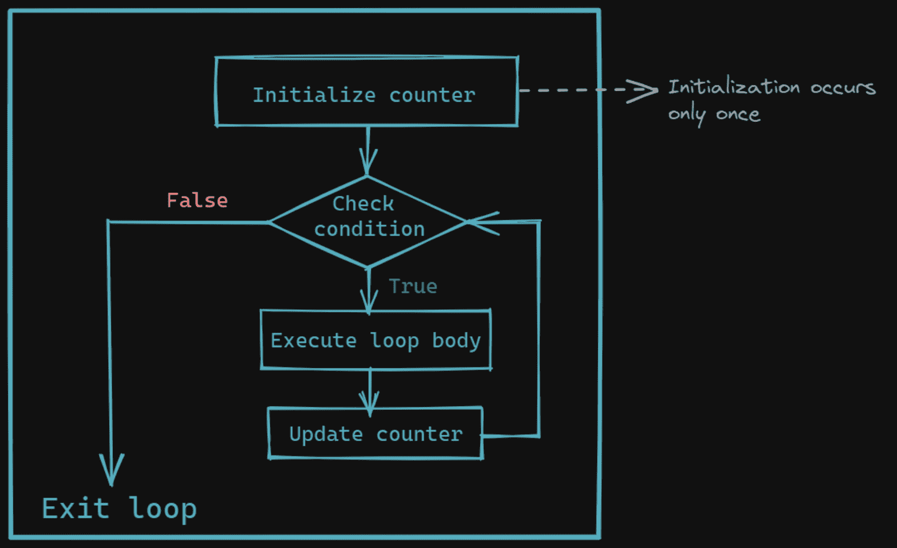

# C 语言中的 For 循环–用代码示例解释

> 原文：<https://www.freecodecamp.org/news/for-loops-in-c/>

在编程中，当你需要多次重复一个代码块时，你会用到循环。

相同代码块的这些重复一定次数被称为*迭代*。有一个循环条件决定了迭代的次数。

`for`和`while`循环在几乎所有编程语言中都被广泛使用。

在本教程中，您将学习 c 语言中的`for`循环。具体来说，您将学习:

*   使用`for`循环的语法，
*   循环在 C 语言中是如何工作的
*   无限`for`循环的可能性。

让我们开始吧。

## 循环语法及其工作原理

在本节中，您将学习 c 语言中`for`循环的基本语法。

使用`for`循环的一般语法如下所示:

```
for(initialize; check_condition; update)
    {
        //do this
    }
```

在上面的语法中:

*   `initialize`是初始化语句——循环控制变量在此初始化。
*   `check_condition`是确定循环是否应该继续的条件。

> 只要`check_condition`为*真，*就执行循环体。

*   执行完循环体中的语句后，`update`语句更新循环控制变量。

### C `for`循环中的控制流

控制流程如下:

1.  初始化计数器–执行`initialize`语句。这种情况只发生一次，在循环开始时。
2.  检查循环条件是否为真–计算表达式`check_condition`。如果条件为*真*，转到步骤 3。如果*为假*，退出循环。
3.  执行循环体中的语句。
4.  更新计数器–执行`update`语句。
5.  转到步骤 2。

下图也说明了这一点:



C For Loop

现在您已经了解了`for`循环是如何工作的，让我们举一个简单的例子来看看 for 循环是如何工作的。

### C `for`循环示例

让我们编写一个简单的`for`循环来计数到 10，并在每次循环时打印计数值。

```
#include <stdio.h>

int main() 
{
   for(int count = 0; count <= 10; count++)
   {
       printf("%d\n",count);
   }
   return 0;
}
```

在上面的代码片段中，

*   `count`是计数器变量，初始化为`0`。
*   这里的测试条件是`count <= 10`。因此，`count`最多可以为 10，以便循环继续。
*   在循环体中，`count`的值被打印出来。
*   并且`count`的值增加 1。
*   然后控制到达条件`count <= 10`，如果条件评估为真，则循环继续。
*   在本例中，当计数值为 11 时，循环条件`count < = 10`评估为*假*,循环终止。

这是输出结果:

```
//Output
0
1
2
3
4
5
6
7
8
9
10
```

当使用循环时，你应该总是确保你的循环*在某个点终止*。

> 你知道只要`check_condition`为*真*，循环就会继续。并且一旦`check_condition`变为*假*，循环停止。但是当你的循环条件是*总是真*时会发生什么呢？

嗯，这就是你进入无限循环的时候——你的循环会永远继续下去，直到你的程序崩溃，或者你的系统关机。😢

在下一节中，您将了解更多关于无限循环的知识。

## 无限`for`循环

当你的循环没有停止，一直运行下去，你就会有一个无限循环。我们举几个例子来理解这一点。

在`for`循环结构中，如果没有指定测试条件(`check_condition`)，默认情况下假设为*真*。

结果，你的条件永远不会变成假的。这个循环会一直运行下去，直到你强制停止这个程序。

这显示在下面的代码片段中:

```
#include <stdio.h>

int main()
{

    for(int i = 0; ; i++) //test condition is not mentioned
    {
        printf("%d ",i);
    }

    return 0;
} 
```

这里还有一个例子。

您将计数器变量`i`初始化为 10。并且`i`在每次迭代后增加 1。

注意测试条件是怎样的`i > 0`。`i`的值不会一直大于 0 吗？

这样就有了另一个无限循环，如下所示:

```
#include <stdio.h>

int main()
{

    for(int i = 10; i > 0 ; i++) //test condition is always TRUE
    {
        printf("%d ",i);
    }

    return 0;
} 
```

在本例中，您的计数器变量`i`被初始化为`0`。但是每次迭代都减 1。

因此，`i`总是小于 10。所以条件`i < 10`是*总是为真*，你会有一个无限循环。

```
#include <stdio.h>

int main()
{

    for(int i = 0; i < 10 ; i--) //test condition is always TRUE
    {
        printf("%d",i);
    }

    return 0;
}
```

为了避免陷入无限循环，您应该正确定义循环条件。

如果你是初学者，问自己以下问题可能会有帮助。

> 我想让这个循环做什么？我希望循环运行多少次？
> 我的循环应该什么时候停止？

然后你可以继续定义你的循环结构。🙂

## 结论

我希望这篇教程对你有所帮助。

总而言之，你已经学习了`for`循环的语法以及它们是如何工作的。您还知道如何预测无限`for`循环的可能性，以及如何通过仔细定义循环条件来避免它们。

下节课再见。在那之前，编码快乐！