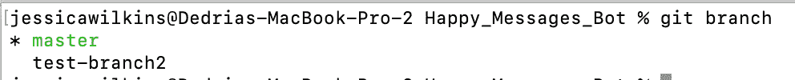

# Git 重命名分支——如何更改本地分支名称

> 原文：<https://www.freecodecamp.org/news/git-rename-branch-how-to-change-a-local-branch-name/>

当您构建一个项目时，有时可能需要重命名本地分支。但是如何在 Git 中做到这一点呢？

在本文中，我将为您提供两种在 Git 中重命名本地分支的方法。

## 如何在 Git 中重命名分支——方法 1

### 步骤 1:确保您在项目的根目录中

你首先需要打开你的终端，然后`cd`(改变目录)到你的项目的根目录。

例如，如果您在主目录中，并且想要`cd`进入位于桌面上的项目，这个命令看起来就像这样。

```
cd Desktop/project-name
```

这是一个将目录更改为名为`Happy_Messages_Bot`的项目的例子。


### 步骤 2:转到要重命名的分支

我们可以使用`git checkout`命令切换到另一个分支。

```
git checkout branch-name
```

在这个例子中，我想切换到我创建的`test-branch`。


### 第 3 步:使用`-m`标志更改分支的名称

更改分支名称的命令如下所示:

```
git branch -m new-branch-name
```

在本例中，我想将我的分支名称从`test-branch`改为`test-branch2`。

```
git branch -m test-branch2
```

您可以使用`git status`来查看您的新分支机构名称。


## 如何在 Git 中重命名分支——方法 2

我们可以只用一个命令重命名本地分支，而不必使用`git checkout`。

### 步骤 1:确保你在主/主要分支

要检查您是否在主/主要分支中，运行`git status`:


如果您不在主/主要分支中，那么您将需要运行`git checkout master`或`git checkout main`。


### 第 2 步:使用`-m`标志重命名分支

您可以使用此语法将旧分支重命名为新分支。

```
git branch -m old-branch new-branch
```

这就是将`test-branch`重命名为`test-branch2`的样子。

```
git branch -m test-branch test-branch2
```

要查看您的新分支名称，您可以运行`git branch`，它将列出您的所有分支。



这是在 Git 中重命名本地分支的两种方法。