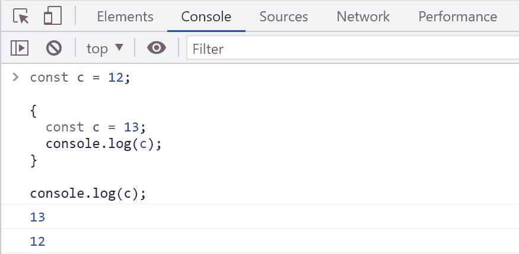
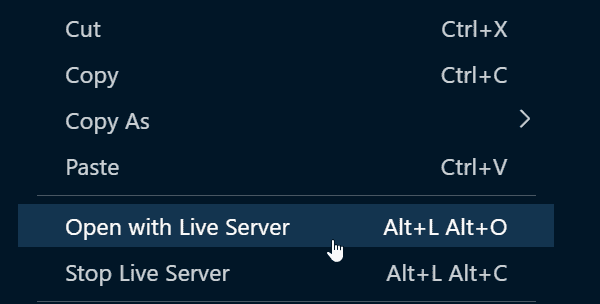
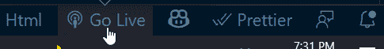
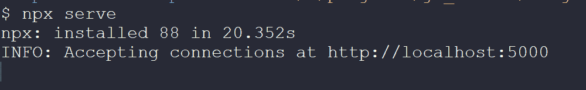

# 如何改进和自动化您的 Web 开发工作流

> 原文：<https://www.freecodecamp.org/news/how-to-improve-your-web-development-workflow/>

网络开发的现代时代是不可思议的。我们有大量的框架和库来帮助我们更有效地工作，有大量的优质资源可以学习，还有无数的项目可以激励我们。

作为一名 web 开发人员，我长达十年的旅程可能与您的许多旅程没有太大不同。但最近，我更关注于高质量地快速完成工作。这不仅仅是关于我们编码什么和如何编码。它也是关于我们如何测试、调试，以及最终发布/部署应用程序。

在本文中，您将学习一些 web 开发工作流，它们可以帮助您更快地开发、测试、构建和部署。

## 浏览器控制台——网络开发人员最好的朋友

在我开发的早期，浏览器的控制台曾经是我最好的朋友(今天依然如此)。

您可以直接在控制台中尝试所有的 JavaScript 逻辑、代码片段和代码想法。在将代码放入应用程序之前，如果您想在控制台中试验您的逻辑的概念证明，它会非常有用。



JavaScript Program in the Browser's Console

你可以在你喜欢的浏览器上使用`F12`键启动 dev tools(Chrome 版，其他浏览器也有)。接下来，您可以导航到`console`选项卡，开始编写和试验代码。

## 不过，这是针对 JavaScript 逻辑的...

浏览器的控制台是测试逻辑部分的一个很好的方式，但是它不足以在旅途中构建和测试 web 应用程序。

如果你正在开始使用任何流行的框架或库，如`Angular`、`React`、`Vue`或`Svelte`，它们会帮你搞定。您将拥有一个完整的基础设施来开发、测试、运行并几乎实时地看到变化。

然而，假设你正在用普通的 JavaScript、HTML5 和 CSS 做一个项目(我喜欢这个组合)。在这种情况下，您可能不需要任何特定的基础设施。

这里有几个选项可以帮助你开始。

### VS 代码+实时服务器或任何等效的东西

假设您使用 Visual Studio 代码作为 web 开发的首选编辑器/IDE。在这种情况下，您可以安装一个名为`Live Server`的扩展。它启动一个本地开发服务器，为静态和动态页面提供实时重新加载功能。

[](https://marketplace.visualstudio.com/items?itemName=ritwickdey.LiveServer)[Live Server - Visual Studio MarketplaceExtension for Visual Studio Code - Launch a development local Server with live reload feature for static & dynamic pages](https://marketplace.visualstudio.com/items?itemName=ritwickdey.LiveServer)

Try Live Server for VS Code

安装完成后，你可以右键点击 app 的入口点 HTML 文件(通常是一个`index.html`文件)，用 Live Server 打开。



Launch the App using the Live Server

或者，您可以尝试 VS 代码状态栏中的`Go Live`选项。



Alternate way to Go Live

这种工作流程非常适合开发和测试您的 web 应用程序。它提供热重装，所以你不需要刷新浏览器就能看到最新的变化。它会自动发生。

如果您不使用 VS 代码，那么您最喜欢的 IDE 可能会有其他选择。

### 使用 npx serve 命令

`npx`代表节点包执行。它附带了`npm`,可以从 npm 注册表中执行任何您想要的包，而无需在本地安装它。 [serve](https://www.npmjs.com/package/serve) 是一个帮助你在本地提供静态站点、单页面应用的工具。

要使用它，请在项目文件夹的根目录下打开命令提示符，并键入以下内容:

```
npx serve
```

您将获得一个本地访问该应用程序的 URL。



Using npx serve

这两种方法对于运行和测试应用程序`locally`非常有帮助。但是您可能需要更复杂的工作流程来构建和部署应用程序，以便同时测试生产版本。

## 更复杂的工作流程

您最不希望的是您的应用程序在生产环境中的行为方式与在本地时不同。如果你在临近截止日期的时候发现它，那将是一场噩梦。

更好的方法是开发功能，在本地测试，然后在类似生产的基础设施上部署和预览。如果一切顺利，你就可以开始生产了。你可以在几分钟内以完全自动化的方式完成所有这些工作。

我已经开始遵循一个帮助我完成这些任务的工作流程:

> 当你开始一个 web 开发项目时，你的工作流程是什么？
> 
> 我做这些，
> -创建项目框架
> -创建 GitHub repo 并推送初始代码
> -用 Vercel/Netlify 设置 GitHub 持续部署
> -继续开发，本地测试，提交&推送。
> 
> — Tapas Adhikary (@tapasadhikary) [October 21, 2021](https://twitter.com/tapasadhikary/status/1451041822285783040?ref_src=twsrc%5Etfw)