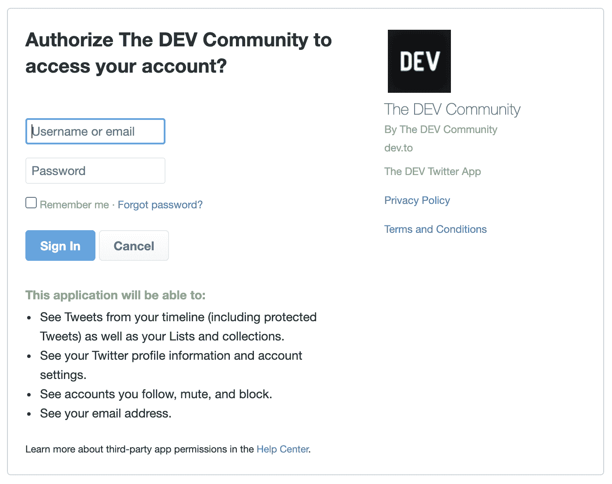

# 如何通过 OAuth 使用社交登录使您的应用更加安全

> 原文：<https://www.freecodecamp.org/news/how-to-use-social-login-with-oauth-for-more-secure-apps/>

许多开发人员在某个时间点编写了一个演示登录应用程序。我们都从简单的用户定义的 ID 和密码开始。然后，我们试着用谷歌或 Twitter 实现类似社交登录的东西。

当然，设置社交登录涉及到一个更复杂的过程，但对于用户来说，这就像点击一个按钮登录一样简单。

不需要记住 ID/密码，只需点击一个按钮就可以注册/登录，这种简单性对用户来说非常有益。

## 如果我告诉你这更安全呢？😉

社交登录确实帮助我们实现了几件事:

*   支持多种设备
*   单点登录
*   易于实施
*   无需发布个人信息即可为用户共享数据的能力
*   能够撤销活动会话，即不允许第三方访问登录和数据
*   没有正在交换的长期凭据

## 那么是什么技术推动了社交登录呢？🤔

使用的底层协议叫做 [OAuth](https://oauth.net/) 。它被定义为:

> 一种开放协议，允许通过简单标准的方法从 web、移动和桌面应用程序进行安全授权。

现在对社交登录和上面的定义有了基本的了解，你可能对它的工作原理有所了解——但是让我用一个简单的例子来解释如何使用 OAuth。

我记得我的朋友 Sumedh 把它描述为母亲、父亲和他们的儿子之间的互动。想象一下，母亲想从市场上买些杂货，她想让儿子给她买。

在我开始谈话之前，让我先介绍一下背景。

> **母亲:**应用程序的用户

> **Son:** 第三方客户或技术术语 OAuth 客户

> 父亲:社交账户，或者用专业术语来说，OAuth 提供者

对话可能是这样的:

> 母亲:嘿，儿子，去市场给我买些咖啡粉。从你父亲那里拿所需的钱。

> **儿子:**好的。

> *儿子(OAuth 客户端)到父亲(OAuth 提供者)*

> 儿子:嘿，爸爸，妈妈让我从你这里拿钱，因为她想在市场上买点东西。

> *父亲(OAuth 提供者)询问母亲(用户)是否允许给他们的儿子(OAuth 客户端)钱*

> 父亲:嘿，我要给他钱吗？要多少？

> 您的申请授权在这里进行。

> 母亲:好的，请给他。

> *母亲(用户)授予的权限*

> *Son (OAuth 客户端)从市场上获取需要的东西，并返还给 mother(用户)。在这里，将东西返回给母亲(用户)可以被认为是将用户重定向(或登录)到第三方网站。*

为了从技术上更好地理解这在代码中是如何工作的， [Richard Schneeman](https://twitter.com/schneems) 在下面提供了这个令人惊叹的视频:

[https://www.youtube.com/embed/tFYrq3d54Dc?feature=oembed](https://www.youtube.com/embed/tFYrq3d54Dc?feature=oembed)

## 现在让我们把所有这些放在上下文中

让我们以开发社区为例[。如果你想用 Twitter 在 DEV 社区上创建一个账户，会发生什么？](https://dev.to/)

基本上，如果“注册 Twitter”按钮存在，那么 OAuth 客户端(Dev.to)和 OAuth 提供者(Twitter)之间的初始设置已经完成。

客户机根据从初始设置中收到的凭证触发 OAuth 提供者的权限授予页面。这看起来像下面这样:

一旦您登录并授予权限，OAuth 提供程序会将您重定向回客户端，客户端会从 OAuth 提供程序获得一个令牌来访问您的信息。这个访问令牌使客户端能够从提供者那里获得特定的数据

基于这些数据，客户端会创建一个帐户并让您登录

### 连续登录会发生什么？

这是一个好问题。现在 OAuth 有多种授权类型，基于此，我们有不同的方法从 OAuth 提供者那里获得访问令牌。

对于所有后续的登录，OAuth 客户端将访问提供者并生成一个新的访问令牌来访问数据并进行登录。

因此，这使我们能够实现单点登录、无需发布个人信息即可为用户共享数据的能力、撤销访问的能力以及不交换长期凭据的能力。

这一切都带来了更安全的体验。

## 结论

我希望这篇简短的博文能帮助你理解为什么社交登录比传统的用户名/密码选项更安全。我将在未来撰写关于不同 OAuth 授权类型的文章，并提供代码示例。

感谢阅读！我真的希望这篇文章对你有用。我总是有兴趣知道你的想法，并乐意回答你脑海中的任何问题。如果你认为这篇文章是有用的，请分享它来帮助推广这篇文章给其他人。

感谢阅读！:)

页（page 的缩写）请随时在 LinkedIn 或 T2 Twitter 上与我联系