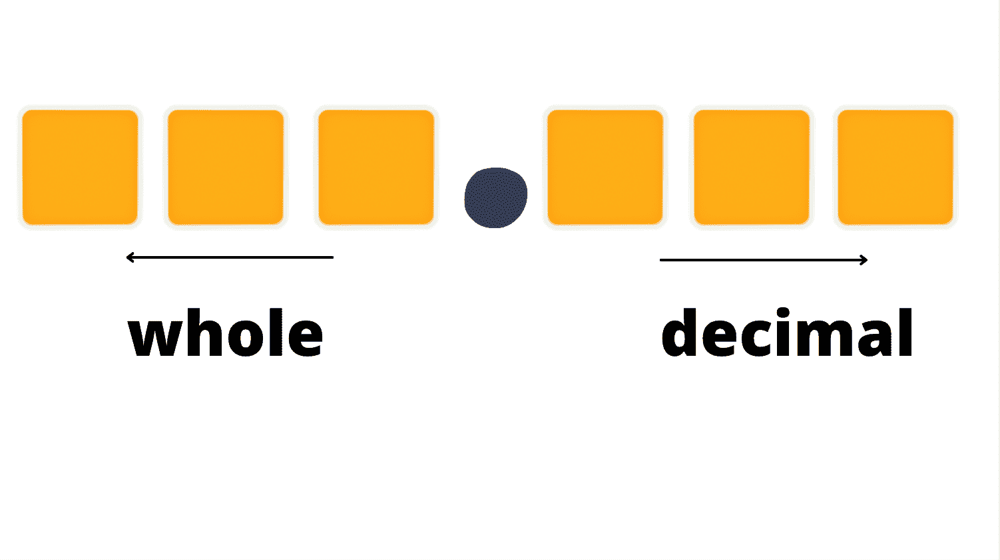

# 小数位值——百、千及以上

> 原文：<https://www.freecodecamp.org/news/decimal-place-value-hundreds-thousandths-and-beyond/>

什么是小数位值？整数和小数有什么区别？

在本快速指南中，您将学习小数位数的基础知识及其工作原理。

我们开始吧！

## 数字系统是如何工作的

数字用于执行数学运算和表示数据和信息。

数字系统是一种表示数字的方式。

有各种不同的数字系统。

有以 2 为基数的数字系统。这是一个只由 0 和 1 两个数字组成的系统，叫做二进制。

有一种以 8 为基数的数字系统或八进制数字系统，它是由第八个数字 0 到 7 组成的。

有一种以 16 为基数的十六进制数字系统，它包括 16 个字母数字字符，即数字和字母。具体来说，有 A-F 范围的字母，也有 0-9 范围的数字。

最后，十进制包括十个数字(也称为*数字*)用于计数:0，1，2，3，4，5，6，7，8，9。这个数字系统是数学中最广泛使用的系统，也是我们在这篇文章中要关注的。

## 整数和它们的位置值

在以 10 为基数的数字系统中，有不同的数位值。位置值代表不同大小的计数组。

比如，有**个**的地方。这个一次数一个数字。它显示有多少个。

然后，就是**十位**位。这个显示了一次有多少组十个。

还有就是**百位**位，一次算一组百位，以此类推。这些地方变得越来越大。

所以，对于*位的*位，你要从 0 数到 9。

当你想计算更大的数值并且已经用完了可用的数字时，你可以去*十位*的地方，在那里你可以从 0 - 99 开始计数。当你用完这些数字时，你将继续到*百位*位，在那里你将从 0 - 999 开始计数，以此类推。

对于整数，左边的每个位值乘以 10，变得越来越大。每一组都比前一组大十倍。

例如，数字`659`可以明确地写成这样:

```
600 + 50 + 9 
```

一个位置在最右边。十位是个位左边的一个空格，百位是十位左边的一个空格。

向左移动的地方总是代表更大的数字。

以 10 为基数的数字系统中的十位数字可以有多种组合，根据它们的位值来表示不同大小的数字。

简而言之，一个数字的位置将决定它的价值。

例如，在数字`1467`中，数字`6`不代表单个数字 6，而是数字 60，因为它在十位。

## 十进制数及其位值

十进制数是一个数的分数，特别是在一个整数的数量之间。

他们的位置值与十进制数相反。

它们延伸到整个数字的右边(小数点后)，右边的每一位都比前一位小 10，也就是说，每一位都除以 10。

整数和小数的分隔方式是用小数点或句号，(`.`)。



以数字`543.769`和小数点右边的数字为例。

7 在十位。可以显式写成:`7/10`或者`0.7`。

如前所述，右边的每个地方变得越来越小，然后除以 10。

所以，6 在百位，写为:`6/100`或`0.06`。

9 在千分之一的位置，可以写成:`9/1000`或`0.009`。

总之，数字`543.769`可以写成:

```
500 + 40 + 3 + 7/10 + 6/100 + 9/1000 
```

再举个例子，比如数字`6753.942`。

数字`2`的位值是多少？

提醒一下，数位所在的位置也将决定它的值。

它在千分之一处，也写成`2/1000`或`0.002`。

## 结论

对于整数，左边的每一位值都要乘以 10，而对于小数，右边的每一位值都要除以 10。

感谢阅读！