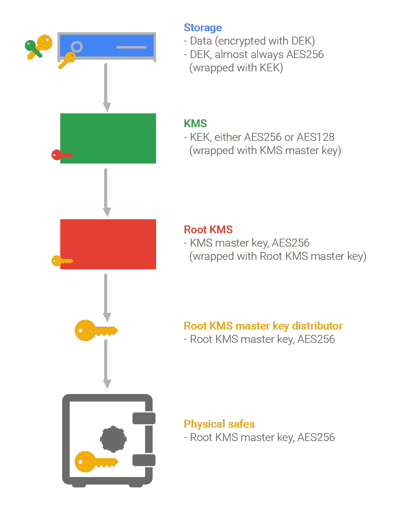
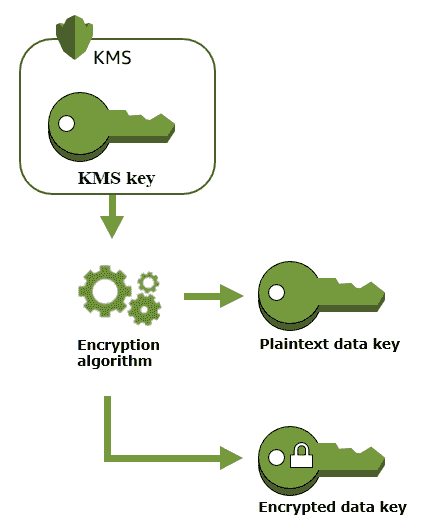
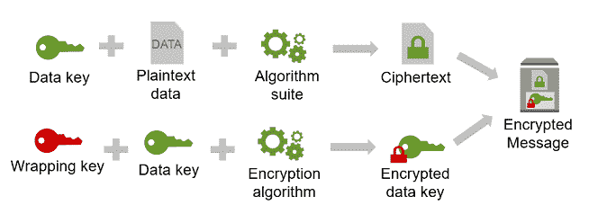
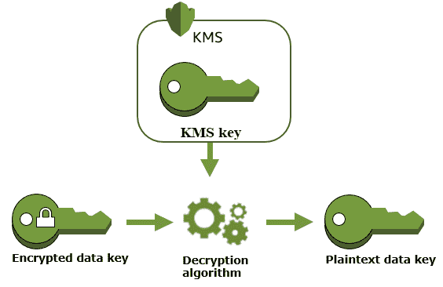
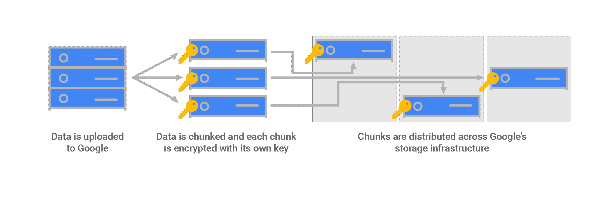

# 如何使用信封加密和密钥管理系统管理大规模加密

> 原文：<https://www.freecodecamp.org/news/envelope-encryption/>

最近在工作中，我遇到了一个有趣的方法来处理大规模加密，称为信封加密。

首先，它增加了安全性，并帮助您轻松管理加密密钥。但它也是 PCI-DSS(信用卡处理的安全标准)强烈推荐的模式，并导致更强的数据隐私和个人可识别信息的数据保护(PII)。

当我们想到数据时，有 3 个地方我们可以想到加密它:

*   静态–在磁盘等硬件存储设备上或在您的设备中
*   传输中——通过 API 调用在不同位置(如服务器之间)移动数据
*   使用中——当它被服务器使用时(这是一个新概念，仍在研究中)

我们将主要处理静态加密，信封加密是这个用例的一种流行模式。

## 那么什么是信封加密呢？🤔

信封加密包括用数据加密密钥加密您的数据，然后用客户主密钥(CMK)加密数据加密密钥(DEK)。

然后，您将加密的数据和加密的 DEK 一起存储在数据库中。这种使用包装密钥来加密数据密钥的做法称为信封加密。

在我们了解加密过程如何发生之前，您需要理解这两个密钥:

1.  客户主密钥(CMK)
2.  数据加密密钥(DEK)

### 客户主密钥/根密钥/密钥加密密钥(CMK)

这些是用于加密、解密和重新加密数据的对称密钥。它们还可以生成您可以在 KMS 系统之外使用的数据加密密钥。他们遵循以下规则:

*   对这些密钥的访问必须限制在最少的端点
*   应该通过 ACL 保护对这些密钥的访问
*   这些密钥必须存储在一个像硬件安全模块的 KMS 一样安全的位置(以符合 [FIPS 140-2](https://en.wikipedia.org/wiki/FIPS_140-2)

在像谷歌云密钥管理服务这样的系统中，你有一个如下所示的密钥层次结构(你可以在这里找到更多信息):

### 数据加密密钥(DEK)

数据密钥是可以用来加密数据的加密密钥，包括大量数据和其他数据加密密钥。

与不能下载的 CMK 不同，数据密钥会返还给你，供你在 KMS 之外使用。DEKs 的一些最佳实践如下:

*   您应该在本地生成 DEKs
*   存储时，请始终确保 DEKs 在静止状态下加密
*   为了便于访问，请将 DEK 存储在它加密的数据附近
*   每次写入数据时都会生成一个新的 DEK。这意味着你不需要旋转 DEKs。
*   不要使用同一个 DEK 来加密来自两个不同用户的数据
*   使用强算法，如 256 位高级加密标准(AES)

## 信封加密过程

首先，一个 API 请求被发送到 KMS，使用 CMK 生成数据密钥。

然后，KMS 返回一个带有普通数据密钥和加密数据密钥的响应(使用 CMK)。

使用普通数据密钥对数据进行加密，然后从内存中删除普通数据密钥。

加密数据和加密数据密钥被一起打包成信封并存储。

## 解密过程

首先，从信封中提取加密的数据密钥。

然后，使用加密的数据密钥将 API 请求发送到 KMS，该密钥具有关于 CMK 的信息，将在 KMS 用于解密。

KMS 返回带有普通数据密钥的响应。

然后，使用明文数据密钥对加密数据进行解密，并从存储器中删除明文数据密钥。

## **信封加密与其他加密模式有什么不同**？🤔

您构建的每个服务在某个时候都需要加密。这可能是数据库中的密码或 PII、外部服务的凭证，甚至是文件系统中的文件。

### 配置文件

您可以使用配置文件轻松处理其中一些情况，但是它们会带来自身的安全风险，例如:

*   需要适当的规划来保证数据的安全
*   存在多种格式，例如 YAML、JSON 和 XML
*   确切的存储位置可能被硬编码在应用程序中，这使得部署存在潜在问题
*   配置文件的解析可能会有问题。

### 对称加密

您可以使用对称密钥加密数据，但它们面临一个主要问题，即密钥管理。

您需要找到一种方法来获得与您共享数据的一方的密钥。但是如果有人得到了对称密钥，他们就可以解密用该密钥加密的所有内容。

### 不对称加密

你可以使用不对称加密来加密数据，不对称加密现在被认为是一种标准。然而，它的一些缺点是:

*   这是一个缓慢的过程，这使得它不适合解密批量消息
*   当您丢失您的私钥时，您收到的消息将不会被解密
*   如果您的私钥被攻击者识别，他们可以阅读您的所有消息

### 信封加密

信封加密提供的一些好处是:

*   **对称和非对称加密的优势组合**–数据使用遵循对称加密的 DEK 加密。DEK 由遵循非对称加密的 CMK 加密。通过使用非对称加密，加密的密钥只能由有权访问 CMK 的人共享和解密，减轻了对称算法的密钥交换问题。
*   **更简单的密钥管理**–多个密钥可以在一个根密钥下加密，简化了 KMS 中的密钥管理。你也可以通过旋转你的根密钥来做更安全的密钥维护，而不是旋转和重新加密你的所有密钥。
*   **数据密钥保护**–因为我们使用 CMK 加密数据密钥，所以我们不必担心存储加密的数据密钥。因此，我们可以安全地将加密数据密钥与加密数据一起存储。

## 为什么密钥管理系统在大规模下运行良好

由于**的性能，信封加密和 KMSs 在大规模应用中表现出色。**正如我们之前提到的，非对称加密通常很慢，而对称加密非常快，但管理密钥可能是个问题。

因此，在信封加密中，对于大量数据，您可以使用带有随机密钥的对称加密来快速加密。然后，使用非对称加密仅对密钥进行加密。这提供了非对称加密的优点和对称加密的性能。

AWS KMS、Azure Key Vault 和谷歌云密钥管理服务等密钥管理系统为您提供了存储和管理加密密钥的全面托管服务。它们在内部使用信封加密，默认情况下，它们在很多支持云基础设施提供商(如 AWS、GCP、Azure 等)的加密服务中使用。

一个理想的密钥管理系统应该是高度可用的，它应该控制对主密钥的访问，它应该审计密钥的使用，最后，它应该管理密钥的生命周期。

因此，通过具有上述特征并在内部使用信封加密，密钥管理系统是处理大规模加密的理想选择。

## 摘要

信封加密是大规模使用的最值得信赖的应用程序安全设计模式之一。它是 AWS S3、GCP 等服务中使用的默认加密方法。

希望这有助于您理解如何在更可信的设置中使用信封加密方法大规模加密/解密大量数据。

感谢阅读！我真的希望这篇文章对你有用。我总是很想知道你的想法，并且很乐意回答你的任何问题。如果你认为这篇文章有用，请分享，这样其他人也可以阅读。

附注:请随时在 LinkedIn 或 T2 Twitter 上与我联系。

## 资源

这篇文章主要依靠以下材料:

*   [谷歌云数据加密-贾延德拉的云认证博客-](https://jayendrapatil.com/tag/envelope-encryption/)
*   [AWS KMS 概念- AWS](https://docs.aws.amazon.com/kms/latest/developerguide/concepts.html)
*   [AWS KMS 和信封加密- Manish Pandit](https://lobster1234.github.io/2017/09/29/aws-kms-envelope-encryption/)
*   [云架构模式:公共云提供商的信封加密(或数字信封)第 1 部分——Nilay Parikh](https://blog.nilayparikh.com/security/application/cloud-architecture-patterns-envelope-encryption-or-digital-envelope-with-public-cloud-providers-part-1/)
*   [AWS KMS 信封加密-奇拉格莫迪](https://dev.to/chiragdm/aws-kms-envelope-encryption-3689)
*   [用信封加密保护数据- IBM](https://cloud.ibm.com/docs/key-protect?topic=key-protect-envelope-encryption)
*   [信封加密- GCP](https://cloud.google.com/kms/docs/envelope-encryption)
*   [谷歌云 GCP 的静态加密](https://cloud.google.com/security/encryption/default-encryption)

[https://www.youtube.com/embed/StJ1NOQjAjo?feature=oembed](https://www.youtube.com/embed/StJ1NOQjAjo?feature=oembed)