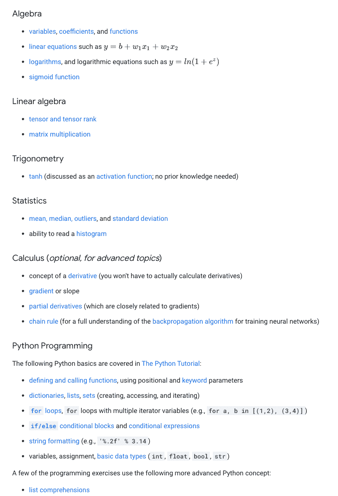
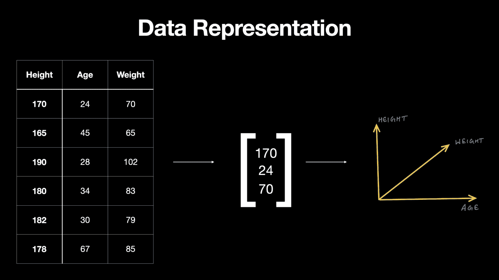
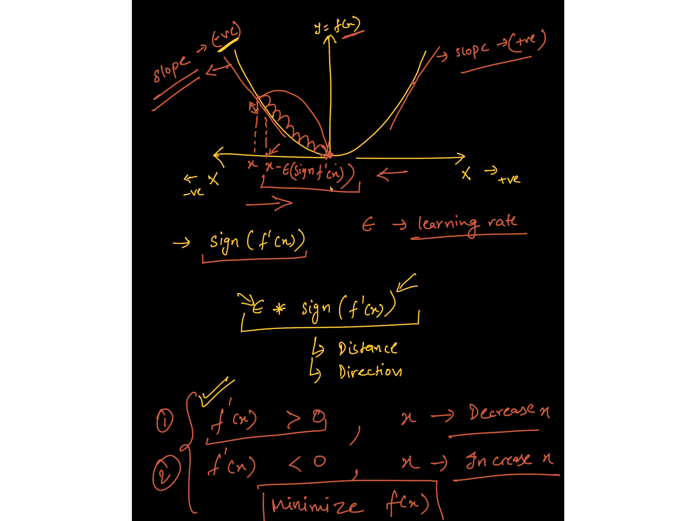
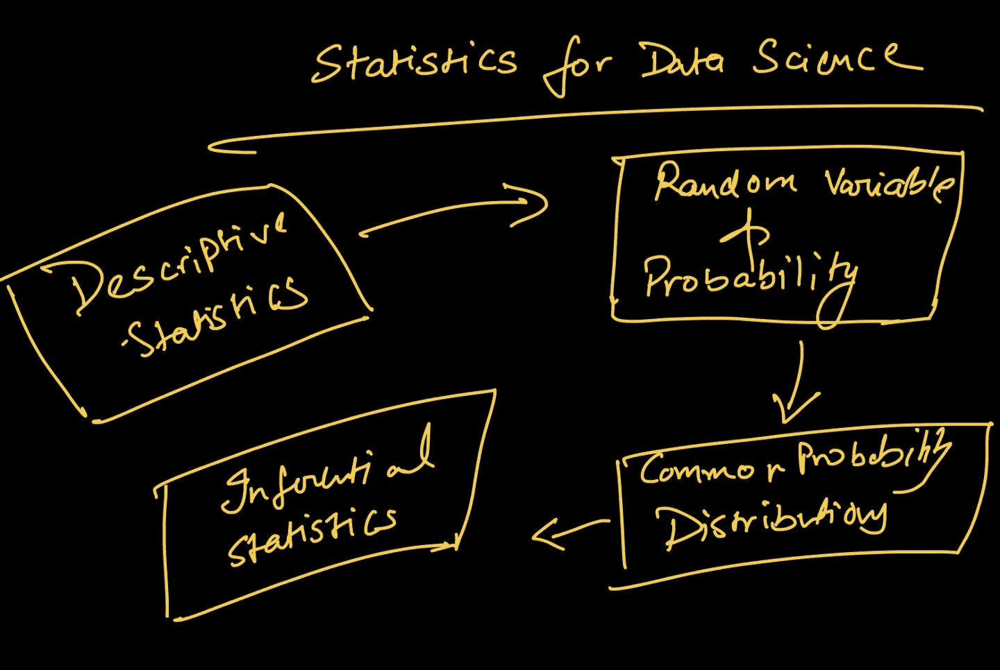
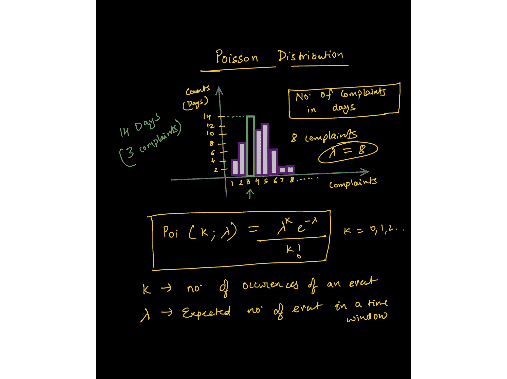
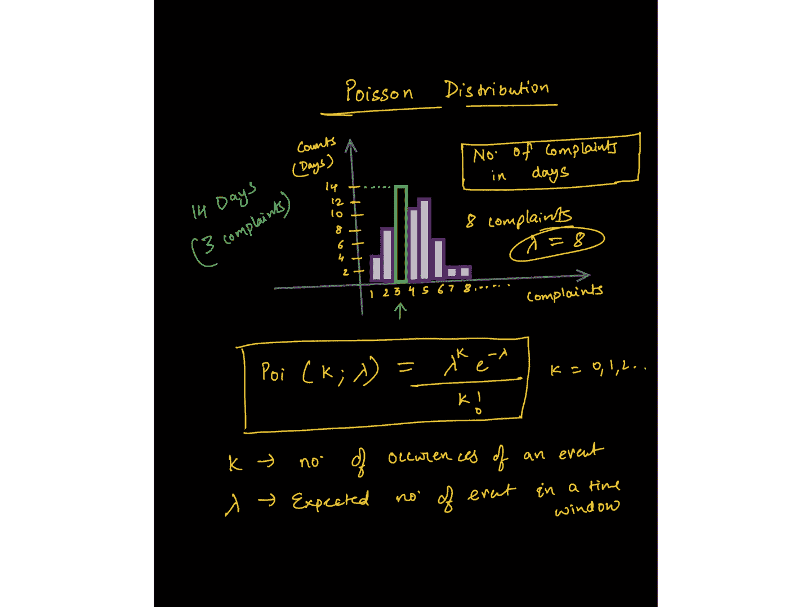
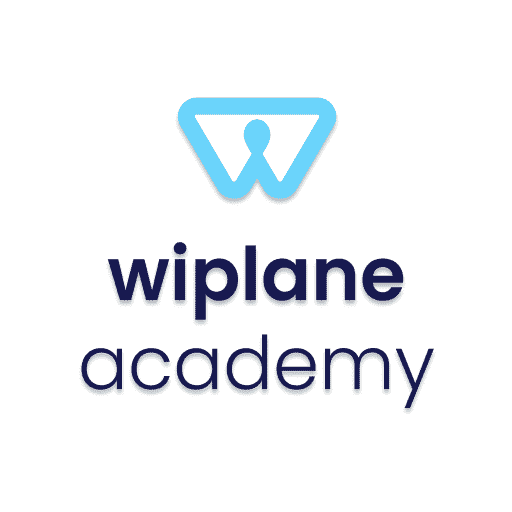

# 在参加谷歌的机器学习或数据科学课程之前需要知道什么

> 原文：<https://www.freecodecamp.org/news/how-to-prepare-for-googles-machine-learning-data-science-course/>

无论你决定参加吴恩达在 YouTube 或任何数据科学训练营上的机器学习和深度学习课程，你都需要一定程度的数学和统计知识。

这不仅有助于你理解 ML/DS 的基本概念，而且有助于你成为一名持久、稳健的数据专业人员。

这是一个简短而精确的指南，适用于数据科学和机器学习领域的所有自学开发人员和初学者。

在我所有的培训项目、LinkedIn 课程、YouTube 视频或时事通讯中，都有一个常见的问题。而是当人们开始学习 DS/ML 时，在某个点之后，他们会感到迷失在数学或统计中，有时会迷失在编程中。

我一直建议学习或更新一些支撑 ML 的数学概念，因为它可以帮助你建立直觉，让你在整个学习过程中保持好奇心。

为了支持这种说法，以下是谷歌在参加机器学习速成班之前推荐的[先决条件和准备工作:](https://developers.google.com/machine-learning/crash-course/prereqs-and-prework)

Google ML course prerequisites

我建议你先通读这篇文章，然后一个一个地查找所有的链接，并把这篇博客作为参考。

在浏览了 Google 文章中提到的概念和技能的完整列表后，我还浏览了几本书(Ian Goodfellow 的 Deep Learning，Francois Chollet 的 Deep Learning with Python，以及其他几本书)。

我试图从它们中提炼出精华，分成三个分支，为你成为一名**数据分析师/科学家/ML 工程师打下坚实的基础。**

以下是一个好的入门项目的三大支柱和一系列概念:

From my [course here](https://www.wiplane.com/p/foundations-for-data-science-ml).

## 面向数据科学和机器学习完全初学者的编程

编程意味着告诉计算机预定义的规则，帮助它处理输入数据，然后得到结果。

另一方面，机器学习是给机器结果和数据，以找到最接近数据和结果之间关系的规则。

编程提供了一个基础平台，您可以用它来自动化、验证和解决任何规模的问题。

下一个问题是你应该学习哪种语言？

由于大多数课程、库和书籍都是为了支持 Python 基础设施而编写的，所以我建议学习 Python，Google 的指南也是如此。使用哪种语言是个人的选择，很大程度上取决于你要解决的问题的类型。

大多数初学者更喜欢 Python，因为它是开发端到端项目的最佳方式，并且有一个非常大的社区可以帮助你。你在旅途中遇到的 90%的问题(尤其是在开始阶段)很可能已经为你解决并记录在案。

## 1.机器学习的基本 Python 编程

大多数数据角色都是基于编程的，只有少数例外，如商业智能、市场分析和产品分析。

我将专注于需要至少一门编程语言专业知识的技术数据工作。相对于任何其他语言，我个人更喜欢 Python，因为它的通用性和易学性——对于开发端到端项目来说，这无疑是一个很好的选择。

以下是一些你应该学习的关于数据科学/ML 的主题/库:

*   **常用数据结构**(数据类型、列表、字典、集合、元组)、编写函数、逻辑、控制流、搜索和排序算法、面向对象编程、与外部库协同工作。
*   **编写 Python 脚本**将数据提取、格式化并存储到文件或数据库中。
*   **处理多维数组**，使用 NumPy 进行索引、切片、转置、广播和伪随机数生成。
*   使用 NumPy 等科学计算库执行矢量化运算。
*   **使用 Pandas 操作数据–**系列、数据帧、数据帧中的索引、比较运算符、合并数据帧、映射和应用函数。
*   **使用 pandas 处理数据—**检查空值、输入空值、对数据进行分组、描述数据、执行探索性分析，等等。
*   **使用 Matplotlib 的数据可视化–**API 层次结构，为绘图添加样式、颜色和标记，了解各种绘图以及何时使用它们，线图、条形图、散点图、直方图、箱线图和 seaborn，以进行更高级的绘图。

## 2.数据科学和机器学习的基础数学

对于那些想成为人工智能从业者、数据科学家或深度学习工程师的人来说，数学是必不可少的，这是有实际原因的。

### 使用线性代数来表示数据

An image from the course: [https://www.wiplane.com/p/foundations-for-data-science-ml](https://www.wiplane.com/p/foundations-for-data-science-ml)

ML 天生是数据驱动的——数据是机器学习的核心。我们可以把数据想象成**向量**，一个遵守算术规则的对象。这让我们理解了线性代数的规则是如何操作数据数组的。

### 使用微积分训练 ML 模型

Image from the course: [https://www.wiplane.com/p/foundations-for-data-science-ml](https://www.wiplane.com/p/foundations-for-data-science-ml)

模型训练不会“自动”发生。微积分是大多数 ML 和 DL 算法学习的驱动力。

最常用的优化算法之一(**梯度下降**)是偏导数的应用。

模型是某些信念和假设的数学表示。据说首先要学习(近似)如何提供数据、如何生成数据的过程(线性、多项式等),然后根据学习到的过程进行预测。

重要主题包括:

*   **基础代数**–**变量、系数、方程、函数——线性、指数、对数等。**
*   ****线性代数**–**标量、向量、张量、范数(L1 & L2)、点积、矩阵的类型、线性变换、用矩阵符号表示线性方程、用向量和矩阵解线性回归问题。****
*   ******微积分**–**导数和极限、导数规则、链规则(用于反向传播算法)、偏导数(用于计算梯度)、函数的凸性、局部/全局最小值、回归模型背后的数学、从头开始训练模型的应用数学。******

## ******3.数据科学的基本统计学******

******如今，每个组织都在努力成为数据驱动型组织。为了实现这一目标，分析师和科学家需要能够以不同的方式使用数据来推动决策。******

### ******描述数据—从数据到见解******

******数据总是原始而丑陋的。最初的探索告诉您缺少什么，数据是如何分布的，以及清理数据以满足最终目标的最佳方式是什么。******

******为了回答您定义的问题，描述性统计使您能够将数据中的每个观察转换为有意义的见解。******

### ******量化不确定性******

******此外，量化不确定性的能力是任何数据公司都非常重视的最有价值的技能。了解任何实验/决策的成功机会对所有企业都至关重要。******

******以下是构成最低限度的几个主要统计数据:******

******************

Image from the lecture on Poisson distribution — [https://www.wiplane.com/p/foundations-for-data-science-ml](https://www.wiplane.com/p/foundations-for-data-science-ml)****** 

*   ******位置估计值——平均值、中间值和其他变量。******
*   ******可变性的估计******
*   ******相关性和协方差******
*   ******随机变量******
*   ******数据分发–PMF、PDF、CDF******
*   ******条件概率–贝叶斯统计******
*   ******常用的统计分布–高斯分布、二项式分布、泊松分布、指数分布。******
*   ******重要定理-大数定律和中心极限定理。******

******************

Image from the lecture on Poisson distribution — [https://www.wiplane.com/p/foundations-for-data-science-ml](https://www.wiplane.com/p/foundations-for-data-science-ml)****** 

******每个初级数据科学爱好者都应该在深入任何核心数据科学或核心 ML 课程之前关注这三个支柱******

## ******如何学习这些基本的 DS 和 ML 概念******

******[我创建了一个学习路线图，你可以在这里找到](https://towardsdatascience.com/data-science-learning-roadmap-for-2021-84f2ba09a44f)。它还告诉你该学什么，并且还载有你可以查看的资源、课程和程序。******

******但是在推荐的资源和我绘制的路线图中有一些不一致的地方。******

### ******数据科学或 ML 课程的问题******

1.  ******我在那篇文章中列出的每一门数据科学课程都要求学生对编程、数学或统计有相当好的理解。例如，[吴恩达最著名的 ML 课程](https://www.youtube.com/watch?v=PPLop4L2eGk&list=PLLssT5z_DsK-h9vYZkQkYNWcItqhlRJLN)也非常依赖于对向量代数和微积分的理解。******
2.  ******大多数涵盖数据科学的数学和统计学的课程只是 DS/ML 所需概念的清单，没有解释它们如何应用以及它们如何被编程到机器中。******
3.  ******有一些特殊的资源可以深入研究数学，但我们大多数人都不是天生的，你不需要成为金牌得主来学习数据科学。******

********底线:**你需要一个涵盖应用数学、统计学或编程的资源来开始学习数据科学，否则就缺少 ML。******

### ****双翼学院****

****

https://www.wiplane.com**** 

****所以，我决定让步，自己开发课程。我花了几个月的时间来设计和开发课程，这将为你的职业生涯提供一个坚实的基础****

*   ****数据分析师****
*   ****数据科学家****
*   ****或者 ML 从业者/工程师****

****以下是课程—[**数据科学基础或 ML**](https://www.wiplane.com/p/foundations-for-data-science-ml) **—** [**学习数据科学和 ML**](https://www.wiplane.com/p/foundations-for-data-science-ml) 的第一步****

 ****[https://www.youtube.com/embed/ZHCFVwq2Dgk?feature=oembed](https://www.youtube.com/embed/ZHCFVwq2Dgk?feature=oembed)**** 

****这是一门全面而紧凑且负担得起的课程，不仅涵盖了**所有的基本要素、先决条件和准备工作**，还解释了如何通过计算和编程(用 Python 语言)来使用每个概念**。******

****不仅如此，我还会根据您的意见每月更新课程内容。点击了解更多[。](https://www.wiplane.com/p/foundations-for-data-science-ml)****