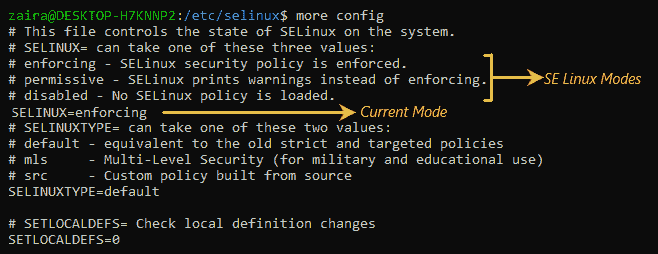
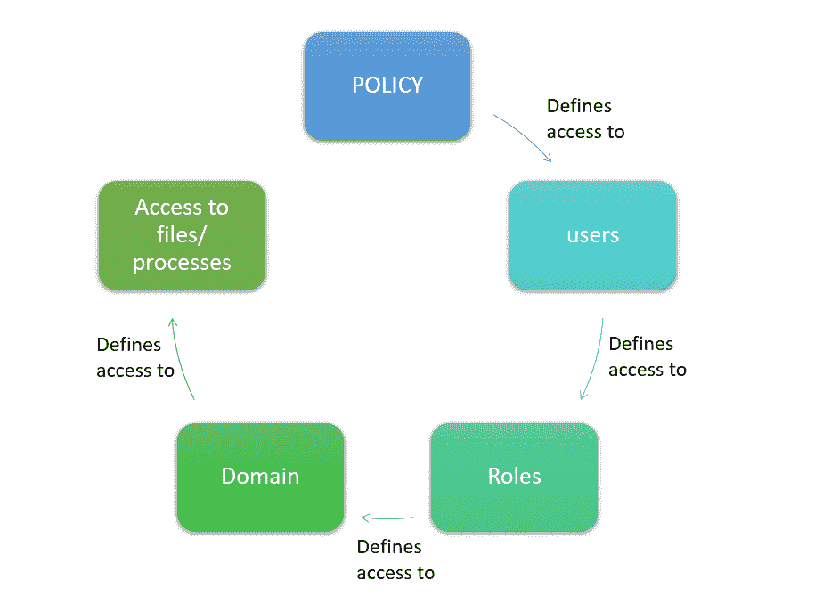
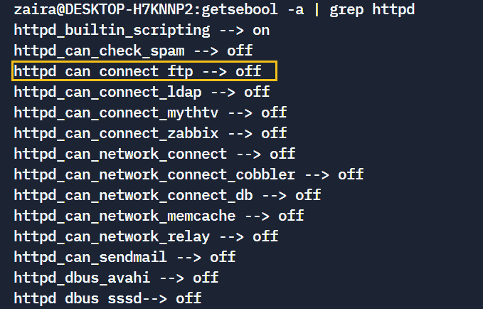
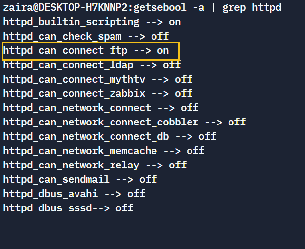
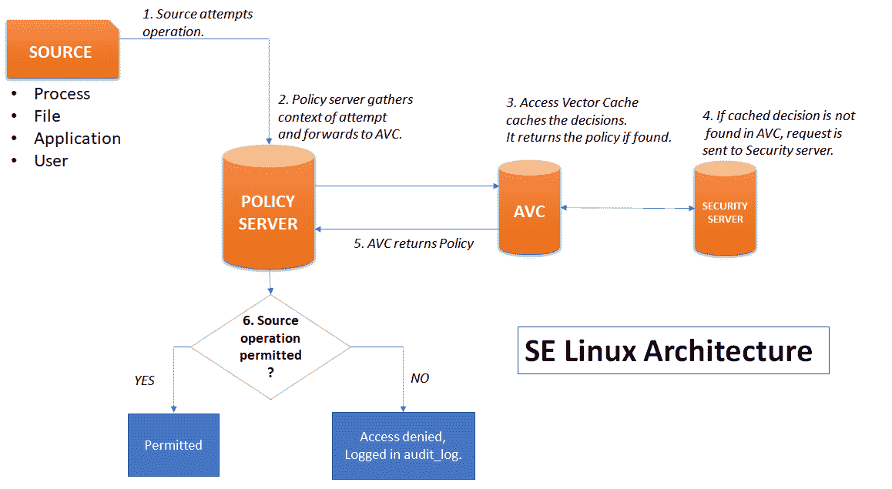

# 如何使用 SE Linux 保护 Linux 服务器

> 原文：<https://www.freecodecamp.org/news/securing-linux-servers-with-se-linux/>

如今，安全性是软件开发、服务器管理和应用程序开发的一个极其重要的方面。

如果你使用 Linux，你很幸运——它有一个非常好的特性，叫做 se Linux，可以帮助你增加额外的安全层。

## 什么是 SE Linux？

SE Linux 由 NSA(美国国家安全局)开发，服务于政府相关的安全任务。

SE Linux 代表安全性增强的 Linux。它为系统管理员提供了对文件和进程访问的更多控制。使用 SE Linux，管理员可以定义一个上下文，标记文件，并允许它们在该上下文中使用。

访问和权限通常是基于用户组继承的。但是有一些资源(比如 web 服务器和进程)需要访问网络端口和内核进程。这些通常由根用户或具有特殊访问权限的用户产生。SE Linux 帮助您限制谁可以访问这些特殊的进程。

## 如何使用 SE Linux

SE Linux 在大多数 Linux 发行版中都是默认的。在这篇文章中，我将致力于 Fedora。

请记住，使用 SE Linux 需要`sudo`或`root`访问权限。

SE Linux 配置文件位于`/etc/sysconfig/selinux`文件夹中。让我们来看看它的内容:

### 如果 Linux 模式



SE Linux config file

在配置文件中，我们可以更改模式，并从以下选项中选择一个:

1.  **Enforced**–默认启用，根据定义的策略过滤。
2.  **许可**–不强制执行已定义的策略，但在日志文件中记录所有尝试。此模式对于故障排除非常有用。
3.  **禁用**–SE Linux 完全禁用。不建议这样做，因为这可能会使您的系统面临威胁。此外，恢复到强制可能会产生某些差异。

您可以使用以下命令检查您当前的 SE Linux 模式:

1.  `getenforce`
2.  `sestatus`

如果您只需要更改当前会话的模式，您可以使用以下命令:

1.  `sudo setenforce 0`–设置当前会话的许可模式
2.  `sudo setenforce 1`–设置当前会话的强制模式

## SE Linux 策略

在 SE Linux 中，策略定义了对用户的访问。用户定义对角色的访问，角色定义对域的访问。然后，域提供对某些文件的访问。



SE Linux Policies

为了改变和修改访问，定义了“布尔”。我们将在下一节研究布尔值。

### 如何用布尔值管理 SE Linux 策略

如您所知，SE Linux 策略是由布尔值管理的。

让我们看一个如何查看和设置布尔值的工作示例。在这个例子中，我们将设置特定于`httpd`的布尔值。

首先，列出所有特定于 http-`getsebool -a | grep httpd`的模块。

*这里的 **`-a`** 列出了所有的布尔。*



List of Booleans

接下来，让我们选择并更改上面代码中黄色突出显示的布尔值:

```
getsebool httpd_can_connect_ftp
```

现在，将值设置为`allow`。

```
setsebool -P httpd_can_connect_ftp 1
```

在上面的命令中，

*   标志 P 用于使更改永久化，即使在重启之后。
*   `1`正在启用布尔。

现在，当您再次列出该进程时，它的值将被允许。



Boolean 'on'

## SE Linux 架构

下图解释了 SE Linux 如何验证来自源的尝试:



## 故障排除和 SE Linux 日志

SE Linux 为每次尝试生成非常详细的日志。您可以在这里找到并查看日志:`/var/log/audit`。

进行故障排除时，您应该进入“许可”模式，这样所有事件都可以记录在日志中。虽然没有强制执行策略，但尝试会被记录在日志中。

## 如何禁用和启用 SE Linux

完全禁用 SE Linux 从来都不是一个好的选择。但是在某些情况下，策略可能会被绕过，例如在故障排除时。

如果遇到小问题，与其禁用 SE Linux，不如花些时间进行故障排除。

但是如果您真的需要禁用 SE Linux，请遵循以下步骤:

1.  将模式从“强制”更改为“许可”。
2.  将模式从“许可”更改为“禁用”。

## 包扎

学习 SE Linux 值得你花时间，在使用它的时候你可以探索无限的可能性。

SE Linux 为管理员提供了细粒度的控制。那么，为什么不学习它并利用它来增加您的安全性呢？

感谢阅读到最后。我们在[推特](https://twitter.com/hira_zaira)上连线吧。