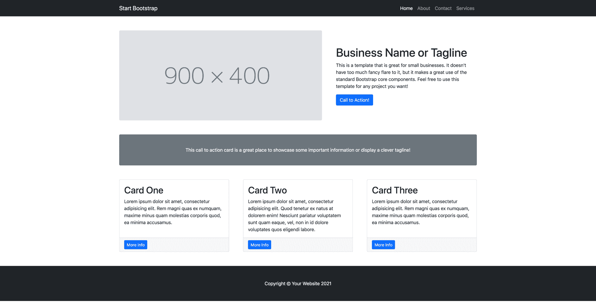
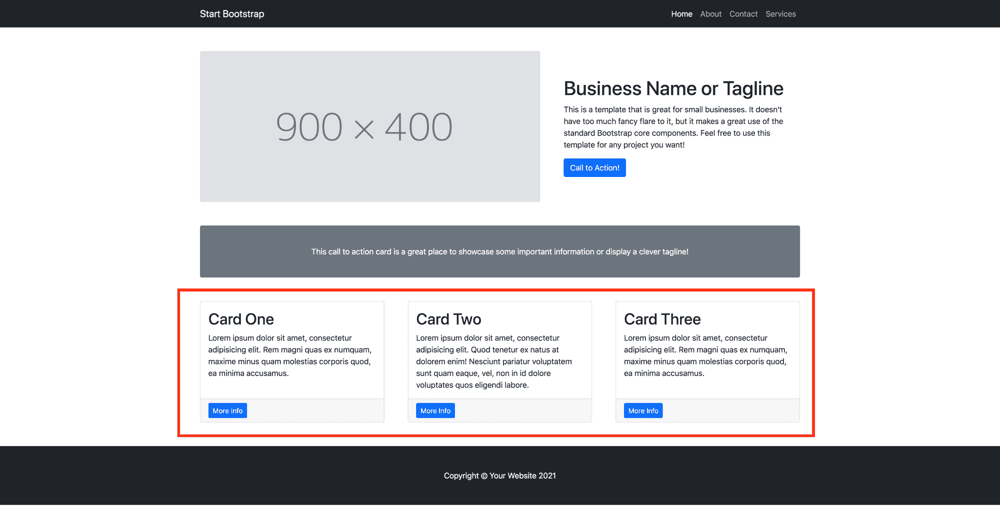
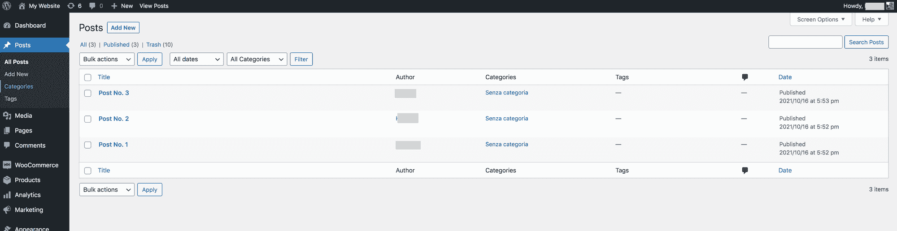
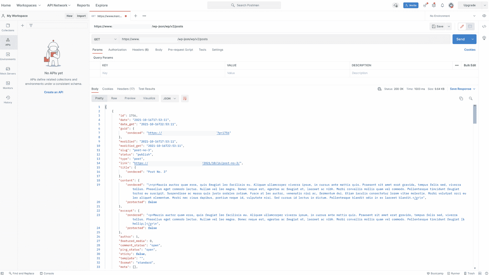
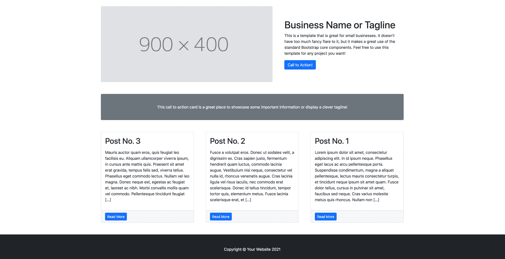
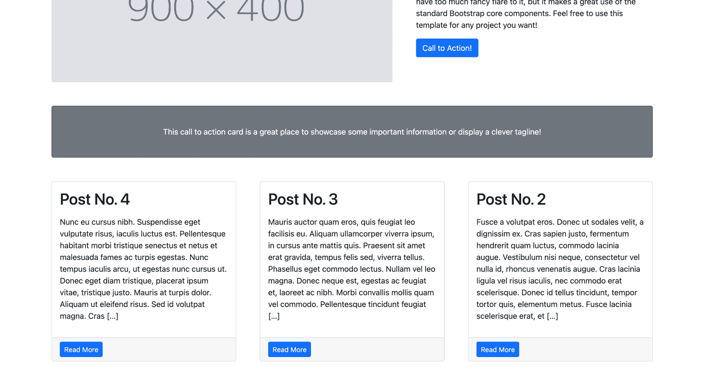
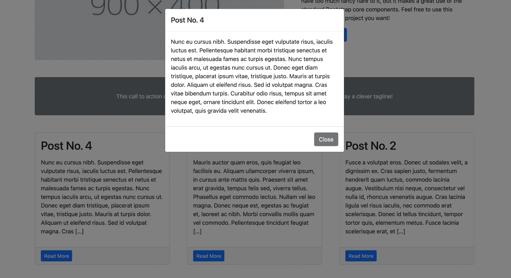

# 如何用 WordPress 集成一个静态网站

> 原文：<https://www.freecodecamp.org/news/how-to-integrate-a-static-website-with-wordpress/>

许多人仍然使用静态网站，从不需要经常更新信息的家族企业，到需要快速发布信息而不需要花费太多时间和精力的大型团队。

出于以下原因，您可能还需要一个静态网站:

1.  速度:页面加载速度快
2.  最低限度的技能要求:没有太多经验的 Web 开发人员可以很容易地从事这个项目
3.  托管很容易:今天的市场提供了多种选择来托管你的静态网站(像 AWS S3，Azure 存储，Netlify，等等)

到目前为止，我们已经讨论了为什么你可能会选择一个静态网站，以及他们擅长什么。

但是，如果你想快速添加内容到你的网站或者只是更新其中的一部分呢？如果你想在你的网站上添加一个博客来获得新的访问者，该怎么办？

这是我在过去几次不得不处理的问题:客户要求我在他们的网站上添加动态内容，而他们没有预算或时间来创建一个新项目。幸运的是，WordPress 帮我找到了解决方案。让我们看看怎么做。

## WordPress 是如何帮助我的

WordPress 是博客和快速发布内容的行业标准。仪表板直观且易于使用。管理员还可以添加新用户，并通过选择适当的角色来指定他们的权限。

WordPress 公开 Rest APIs 来帮助开发者构建与 WordPress 本身和第三方服务的集成。

所以我决定通过调用 WordPress APIs 提供的`/wp/v2/posts`端点，将一个 WordPress 博客与我的客户的静态网站集成在一起。在接下来的步骤中，我将解释我是如何做的以及为什么这样做。

## 项目设置

首先，我想分享我将在这篇文章中工作的网站。没什么特别的:我选择了这个引导静态模板:



如您所见，我们可以将页面分为三个不同的主要部分:

1.  公司演示文稿(图片+标语)
2.  行动号召卡(中间的灰色区域)
3.  有三张牌的一排

我将在第三部分整合我们的 WordPress 博客。



每个帖子都将由一个卡片表示，用户可以在卡片上阅读帖子标题、摘录，并通过单击蓝色按钮“阅读更多”来查看帖子内容。该按钮将打开一个显示文章内容的模式。

## 让我们看看我们的 WordPress 实例是如何工作的

让我们看看我们的 WordPress 实例，看看我们有什么。如果我登录到仪表板并转到帖子部分，我会看到我已经发布了三篇帖子:1 号帖子、2 号帖子和 3 号帖子。

每篇文章都有一些“Lorem ipsum”的内容。所以，在这篇文章的最后，我期望这些帖子能以如上所述的三种不同的卡片显示。



## 如何使用 WordPress APIs

WordPress APIs 有很好的文档记录，并由一个巨大而热情的社区维护。让我们看看如何用可用的 API 处理帖子。

因此，在文档页面上，我点击“端点引用”，然后点击“文章”。如前所述，我想检索我在实例上发布的所有帖子。我转到“列出帖子”并阅读“查询此端点以检索帖子集合”。您收到的响应可以使用下面的 URL 查询参数进行控制和过滤。

听起来这就是我要找的。根据文档，这是请求:

```
https://<BASE_URL>/wp-json/wp/v2/posts
```

在开始实现之前，我用 Postman 测试了它。这是我得到的:



正如所料，我得到了一个 JSON，其中包含了我在 WordPress 实例上创建的帖子的相关信息。

## 编码时间到了

为了完成这个实现，我将编辑 index.html，并创建一个名为 blog.js 的新文件

在 index.html，我将删除静态卡片，添加一个加载器使其在等待 API 调用响应时出现，并向我希望帖子的卡片出现的 DOM 元素添加一个 id——“包装器”。看起来是这样的:

```
<div id="wrapper" class="row gx-4 gx-lg-5">
	<div id=spinner class="text-center">
		<div class="spinner-grow spinner-grow-lg">
			<span class="visually-hidden">Loading...</span>
		</div>
	</div>
</div>
```

在 blog.js 文件中，我获取 URL，第一个`.then()`检查响应是否正常:

```
fetch('https://<BASE_URL>/wp-json/wp/v2/posts').then(function (response) {
	if (response.ok) {
        return response.json();
	} else {
		return Promise.reject(response);
	}
})
```

使用第二个`then()`,我从 DOM 中移除微调器，并为我在 JSON 中找到的每个帖子映射卡片和模态。我选择只显示博客的最近三篇文章。看起来是这样的:

```
.then(function (data) {
    spinner.remove()
    for (let i = 0; i < 3; i++) {

        cardCreation = '<div class="col-md-4 mb-5">'
        cardCreation += '<div class="card h-100">'
        cardCreation += '<div class="card-body">'
        cardCreation += '<h2 id="test" class="card-title">' + data[i].title.rendered + '</h2>'
        cardCreation += '<p class="card-text">' + data[i].excerpt.rendered + '</p>'
        cardCreation += '</div>'
        cardCreation += '<div class="card-footer"><button type="button" class="btn btn-primary btn-sm" data-toggle="modal" data-target="#modal-' + data[i].id + '">Read More</button></div>'
        cardCreation += '</div>'
        cardCreation += '</div>'

        modalCreation = '<div class="modal fade" id="modal-' + data[i].id +'" tabindex="-1" role="dialog" aria-labelledby="exampleModalLongTitle" aria-hidden="true">'
        modalCreation += '<div class="modal-dialog" role="document">'
        modalCreation += '<div class="modal-content">'
        modalCreation += '<div class="modal-header">'
        modalCreation += '<h5 class="modal-title" id="exampleModalLongTitle">' + data[i].title.rendered + '</h5>'
        modalCreation += '</div>'
        modalCreation += '<div class="modal-body">' + data[i].content.rendered + '</div>'
        modalCreation += '<div class="modal-footer">'
        modalCreation += '<button type="button" class="btn btn-secondary" data-dismiss="modal">Close</button>'
        modalCreation += '</div>'
        modalCreation += '</div>'
        modalCreation += '</div>'
        modalCreation += '</div>'

        document.querySelector("#wrapper").insertAdjacentHTML("beforeend",cardCreation)
        document.querySelector("#wrapper").insertAdjacentHTML("beforeend",modalCreation)
      }
})
```

最后，我使用`catch()`方法来处理错误。我决定添加一个引导危险横幅，在那里我解释出了什么问题，并添加一个用户可以找到有用资源的链接:

```
.catch(function (err) {
    spinner.remove();
    errorMsg = '<div class="alert alert-danger" role="alert">'
    errorMsg += 'Sorry, we can\'t retrieve posts at the moment. Please visit www.ourblog.com'
    errorMsg += '</div>'

    document.querySelector("#wrapper").insertAdjacentHTML("beforeend",errorMsg)

	console.warn('Something went wrong.', err);
});
```

我用浏览器打开了 index.html 文件，现在我看到了显示我的 WordPress 博客帖子的卡片



为了测试一切是否正常，我在我的博客上添加了一个新帖子。这是我在我的静态网站上看到的:



如果我点击“阅读更多”，我会看到这篇文章的全部内容:



这就是我如何整合一个静态网站和一个 WordPress 博客。你可以在这里找到完整的代码。我希望这篇文章对你有用。放心分享吧！😀