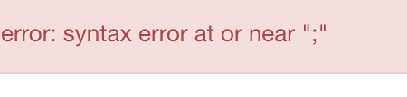
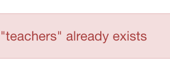
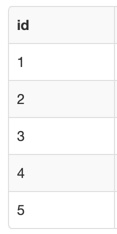
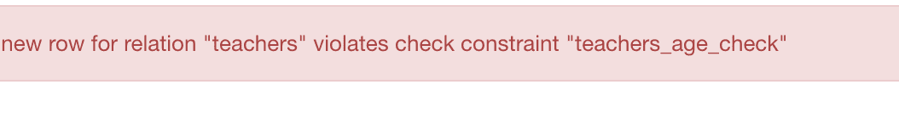
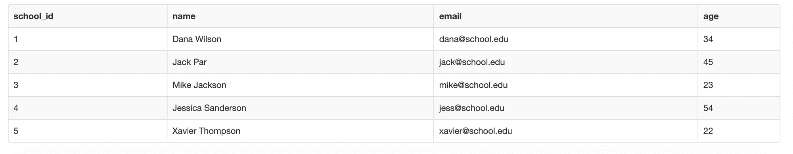

# 如何在 SQL-Postgres 和 MySQL 示例查询中创建表

> 原文：<https://www.freecodecamp.org/news/how-to-create-a-table-in-sql-postgres-and-mysql-example-query/>

知道如何在`SQL`中创建表格是一个重要且基本的概念。

在本教程中，我将使用 PostgreSQL 和 MySQL 的代码示例，带您了解`CREATE TABLE`语句的`SQL`语法。

## 基本`CREATE TABLE`语法

下面是`CREATE TABLE`语句的基本语法:

```
CREATE TABLE table_name(
	column1 data_type column_constraint,
    column2 data_type column_constraint,
    column3 data_type column_constraint,
    column4 data_type column_constraint,
    ... etc
);
```

对于第一部分，您需要以`CREATE TABLE`语句开始，后跟您想要创建的表的名称。

如果我想创建一个教师信息表，那么我会这样写:

```
CREATE TABLE teachers();
```

在括号内，您将添加创建表列的信息。如果您忘记了括号，那么您将得到一条错误消息。

```
CREATE TABLE teachers;
```



括号末尾的分号告诉计算机这是`SQL`语句的结尾。你有时会听到这被称为语句结束符。

### 什么是`MySQL`存储引擎？

根据`MySQL` [文档](https://dev.mysql.com/doc/refman/8.0/en/storage-engines.html):

> 存储引擎是 MySQL 组件，处理不同表类型的 SQL 操作。

`MySQL`使用这些存储引擎在数据库上执行 CRUD(创建、读取、更新和删除)操作。

在`MySQL`中，您可以选择为您的表指定您想要使用的存储引擎的类型。如果省略了`ENGINE`子句，那么缺省值将是 InnoDB。

```
CREATE TABLE table_name(
	column1 data_type column_constraint,
    column2 data_type column_constraint,
    column3 data_type column_constraint,
    column4 data_type column_constraint,
    ... etc
)ENGINE=storage_engine;
```

### 什么是`IF NOT EXISTS`条款？

有一个名为`IF NOT EXISTS`的可选子句，它将检查您想要创建的表是否已经存在于数据库中。您可以将该子句放在表名之前。

```
CREATE TABLE IF NOT EXISTS teachers();
```

如果该表已经存在，则计算机不会创建新表。

如果您省略了`IF NOT EXISTS`子句并试图创建一个已经存在于数据库中的表，那么您将得到一条错误消息。

在这个例子中，我首先创建了一个名为教师的表。但是如果我试图在下一个命令中创建相同表，我会遇到错误。

```
CREATE TABLE IF NOT EXISTS teachers();
CREATE TABLE teachers();
```



## 如何在表格中创建列

在`CREATE TABLE`语句的括号内，您将列出想要创建的列的名称以及它们的数据类型和约束。

这是一个如何向教师表中添加四列`school_id`、`name`、`email`和`age`的例子。每个列名应该用逗号分隔。

```
CREATE TABLE teachers(
	school_id data_type column_constraint, 
	name data_type column_constraint,
    email data_type column_constraint, 
	age data_type column_constraint
); 
```

根据`MySQL` [文档](https://dev.mysql.com/doc/refman/8.0/en/create-table.html#create-table-types-attributes):

> MySQL 对每个表有 4096 列的硬性限制，但是对于给定的表，有效的最大值可能会更少。确切的列限制取决于几个因素。

如果您正在处理较小的个人项目，那么您可能不必担心超出表格的列数。

根据 [PostgreSQL 文档](https://www.postgresql.org/docs/current/limits.html)，每个表有 1600 列的限制。与`MySQL`类似，确切的限制可能因磁盘空间或性能限制而异。

### `SQL`中的数据类型

当您在表中创建列时，您需要为它分配一个数据类型。数据类型描述列中值的类型。

以下是`SQL`中六种流行的数据类型类别:

1.  数字(int、float、serial、decimal 等)
2.  数据和时间(时间戳、数据、时间等)
3.  字符和字符串(char、varchar、text 等)
4.  Unicode (ntext、nvarchar 等。)
5.  二进制(二进制等。)
6.  杂项(xml、表格等。)

本文不会讨论每一种数据类型，但会涉及一些流行的数据类型。

这里是 [`PostgreSQL`数据类型](https://www.postgresql.org/docs/8.1/datatype.html)和 [`MySQL`数据类型](https://dev.mysql.com/doc/refman/8.0/en/data-types.html)的完整列表。

### 什么是`SERIAL`和`AUTO_INCREMENT`？

在`PostgreSQL`中，`SERIAL`数据类型是一个整数，对于每一个新创建的行，它会自动增加 1。

我们可以在教师表的`school_id`列后添加`SERIAL`。

```
school_id SERIAL 
```

在`MySQL`中，你会用`AUTO_INCREMENT`而不是`SERIAL`。在本例中，使用了代表整数的`INT`数据类型。

```
school_id INT AUTO_INCREMENT
```

如果我们向教师表中添加了 5 行，输出将显示数字 1、2、3、4、5 作为`school_id`列，因为对于每一个新行，整数都会自动增加 1。



### 什么是`VARCHAR`数据类型？

`VARCHAR`数据类型是一个可变的字符串长度，您可以在其中设置最大字符长度。

这是一个为教师表中的`name`和`email`列使用`VARCHAR`数据类型的例子。数字 30 是最大字符长度。

```
name VARCHAR(30) column_constraint,
email VARCHAR(30) column_constraint,
```

### SQL 中的列约束

这些规则应用于表列中的数据。

以下是一些更常见的列约束的列表:

*   主键——这个键是表的唯一标识符
*   外键——该键确保一列中的值也出现在另一个表中。这充当了表之间的链接。
*   唯一-列中的所有值都必须是唯一的
*   NOT NULL -值不能为 NULL。NULL 是指没有值
*   检查-根据布尔表达式测试一个值

### `PRIMARY`和`FOREIGN`键的示例

在我们的教师表中，我们可以在`school_id`列中添加一个`PRIMARY KEY`。

PostgreSQL 中的代码如下所示:

```
 school_id SERIAL PRIMARY KEY
```

这是 MySQL 中的代码:

```
school_id INT AUTO_INCREMENT PRIMARY KEY
```

如果您希望`PRIMARY KEY`有多个列，那么您应该在创建列之后添加它。

```
CREATE TABLE table_name(
	column1 data_type column_constraint,
    column2 data_type column_constraint,
    column3 data_type column_constraint,
    column4 data_type column_constraint,
    ... etc
    PRIMARY KEY (column1, column2)
);
```

如果你想将一个表格链接到另一个表格，那么你可以使用一个`FOREIGN KEY`。

假设我们有一个名为 district_employees 的表，主键为`district_id`。以下是 PostgreSQL 中的代码:

```
CREATE TABLE district_employees(
   district_id SERIAL PRIMARY KEY,
   employee_name VARCHAR(30) NOT NULL,
   PRIMARY KEY(district_id)
);
```

在我们的教师表中，我们可以使用一个外键并引用 district_employees 表。

```
district_id INT REFERENCES district_employees(district_id), 
```

```
CREATE TABLE teachers(
    school_id SERIAL PRIMARY KEY,
    district_id INT REFERENCES district_employees(district_id),
    column1 data_type column_constraint,
    column2 data_type column_constraint,
    column3 data_type column_constraint,
    column4 data_type column_constraint,
    ... etc 
);
```

### `NOT NULL`、`CHECK`和`UNIQUE`的例子

如果我们想确保没有任何值为空，我们可以使用`NOT NULL`约束。

```
name VARCHAR(30) NOT NULL
```

我们可以使用`CHECK`约束来确保我们所有的老师都年满 18 岁。`CHECK`约束根据布尔表达式测试一个值。

```
age INT CHECK(age >= 18)
```

如果我们的一个值不满足那个条件，那么我们将得到一个错误消息。



我们可以使用`UNIQUE`约束来确保所有的电子邮件都是唯一的。

```
email VARCHAR(30) UNIQUE 
```

这是教师表的最终结果:



PostgreSQL 中的代码如下所示:

```
CREATE TABLE teachers(
	school_id SERIAL PRIMARY KEY,
	name VARCHAR(30) NOT NULL,
    email VARCHAR(30) UNIQUE,
	age INT CHECK(age >= 18)      
);
```

这是 MySQL 中的代码:

```
CREATE TABLE teachers(
	school_id INT AUTO_INCREMENT PRIMARY KEY,
	name VARCHAR(30) NOT NULL,
    email VARCHAR(30) UNIQUE,
	age INT CHECK(age >= 18)      
);
```

我希望您喜欢这篇文章，并祝您的 SQL 之旅好运。