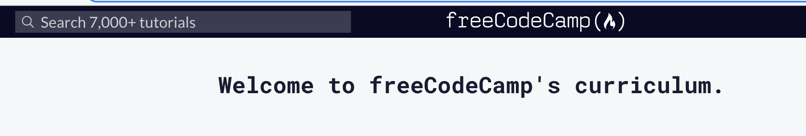
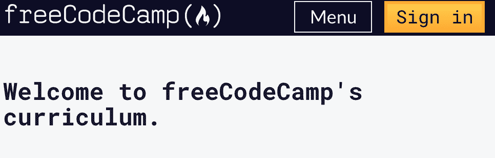
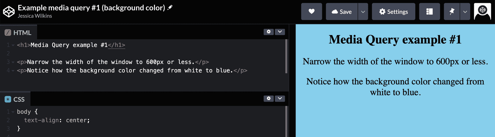

# 媒体查询 CSS 示例–移动响应式设计的最大和最小屏幕宽度

> 原文：<https://www.freecodecamp.org/news/media-query-css-example-max-and-min-screen-width-for-mobile-responsive-design/>

当你在设计一个网站时，你的内容在所有屏幕尺寸上都好看是非常重要的。

在本文中，我将讨论如何使用响应式设计和媒体查询来实现这一点。我还将提供使用最大和最小屏幕宽度进行媒体查询的代码示例。

## 什么是响应式设计？

响应式设计是确保你的内容在所有屏幕尺寸上都好看的实践。网站中的一切，包括布局，字体和图像应该自动适应用户的设备。

在 21 世纪初，开发人员专注于确保他们的网站在笔记本电脑和台式电脑等大屏幕上看起来不错。在当今世界，你必须考虑手机、平板电脑甚至手表等设备。

响应式设计的一个重要组成部分是媒体查询。

## 什么是媒体查询？

在 CSS 中，媒体查询用于根据浏览器的特征(包括宽度、高度或屏幕分辨率)应用一组样式。

您可以在 [freeCodeCamp 学习页面](https://www.freecodecamp.org/learn)上看到一个媒体查询示例。

对于像台式机这样的大屏幕，我们可以在左上角看到一个搜索菜单。



但在移动设备上，没有搜索菜单，我们只有菜单选项和登录按钮。



## 媒体查询的基本语法

以下是 CSS 中媒体查询的基本语法:

```
@media media-type (media-feature){
/*Styles go here*/
}
```

让我们来分析一下这个语法的意思。

`@media`是 CSS 中`At-rule`的一种类型。这些规则将决定 CSS 在特定条件下的外观。

媒体类型是指设备的媒体类别。不同的媒体类型包括`all`、`print`、`screen`和`speech`。

*   所有-适用于所有设备
*   打印-适用于媒体处于打印预览模式的设备
*   屏幕-适用于带屏幕的设备
*   语音——适用于屏幕阅读器等设备，向用户大声朗读内容

根据[文件](https://developer.mozilla.org/en-US/docs/Web/CSS/@media)，

> 除了使用`not`或`only`逻辑运算符时，媒体类型是可选的，隐含了`all`类型。

您可以选择省略媒体类型，而使用以下语法。

```
@media (media-feature){
/*Styles go here*/
}
```

媒体特征是指浏览器的特征，包括视口的高度和宽度、方向或纵横比。有关可能的媒体功能的完整列表，请[访问 MDN 文档](https://developer.mozilla.org/en-US/docs/Web/CSS/Media_Queries/Using_media_queries#media_features)。

在本文中，我们将重点介绍宽度媒体功能。

如果您想创建更复杂的媒体查询，那么您可以使用逻辑运算符。

*   `and` -该运算符用于连接多个媒体特性。如果所有的媒体特性都为真，那么花括号内的样式将应用于页面。
*   `not` -该操作符将真查询转换为假查询，将假查询转换为真查询。
*   `,`(逗号)-如果其中一个条件为真，该操作符将使用逗号分隔多个媒体特征，并应用花括号内的样式。

## 媒体查询示例

让我们看几个例子，展示如何在 CSS 中使用媒体查询。

在第一个示例中，当设备的宽度小于或等于 600px 时，我们希望背景色变为蓝色。

在 CSS 中，我们想为媒体查询添加一个`(max-width: 600px)`,它告诉计算机目标设备的屏幕宽度不超过 600px。

在媒体查询中，我们将主体的背景样式更改为`background-color: #87ceeb;`。

以下是完整的媒体查询:

```
@media (max-width: 600px) {
  body {
    background-color: #87ceeb;
  }
}
```

下面是 CodePen 的例子。如果你点击右上角的“在 Codepen 上编辑”,你可以在 CodePen 上测试一下。

[https://codepen.io/jessica-wilkins/embed/preview/MWvJvoW?default-tabs=css%2Cresult&height=300&host=https%3A%2F%2Fcodepen.io&slug-hash=MWvJvoW](https://codepen.io/jessica-wilkins/embed/preview/MWvJvoW?default-tabs=css%2Cresult&height=300&host=https%3A%2F%2Fcodepen.io&slug-hash=MWvJvoW)



在第二个示例中，如果设备的宽度在 600 到 768px 之间，我们希望将背景色从蓝色改为红色。我们可以使用`and`操作符来完成这个任务。

```
@media (min-width: 600px) and (max-width: 768px) {
  body {
    background-color: #de3163;
  }
}
```

以下是完整的 CodePen 示例供您试用:

[https://codepen.io/jessica-wilkins/embed/preview/rNzjGvp?default-tabs=css%2Cresult&height=300&host=https%3A%2F%2Fcodepen.io&slug-hash=rNzjGvp](https://codepen.io/jessica-wilkins/embed/preview/rNzjGvp?default-tabs=css%2Cresult&height=300&host=https%3A%2F%2Fcodepen.io&slug-hash=rNzjGvp)

测试时，如果屏幕宽度低于 600 像素或高于 768 像素，您应该会看到背景颜色为蓝色。

## 你应该为市场上的每一个设备编写单独的媒体查询吗？

这个问题的简短答案是否定的。

市场上有太多的设备试图为每个设备编写媒体查询。技术总是在变化，这意味着新的设备总是会出现。

更重要的是，使用介质查询来定位一系列设备。在 Cem Eygi 的 freeCodeCamp 文章中，他列出了一些用于媒体查询的常见断点。

*   320 像素—480 像素:移动设备
*   481 像素—768 像素:iPads、平板电脑
*   769px — 1024px:小屏幕，笔记本电脑
*   1025 像素—1200 像素:台式机、大屏幕
*   1201 像素及更多—超大屏幕、电视

## 结论

响应式设计是确保你的内容在所有屏幕尺寸上都好看的实践。网站中的一切，包括布局，字体和图像应该自动适应用户的设备。

在 CSS 中，媒体查询用于根据浏览器的特征(包括宽度、高度或屏幕分辨率)应用一组样式。

下面是 CSS 中媒体查询的基本语法。

```
@media media-type (media-feature){
/*Styles go here*/
}
```

媒体类型是可选的，除非您使用了`not`或`only`逻辑运算符。如果省略媒体类型，则媒体查询将针对所有设备。

我希望这篇文章对你有所帮助，并祝你在 CSS 之旅中好运。