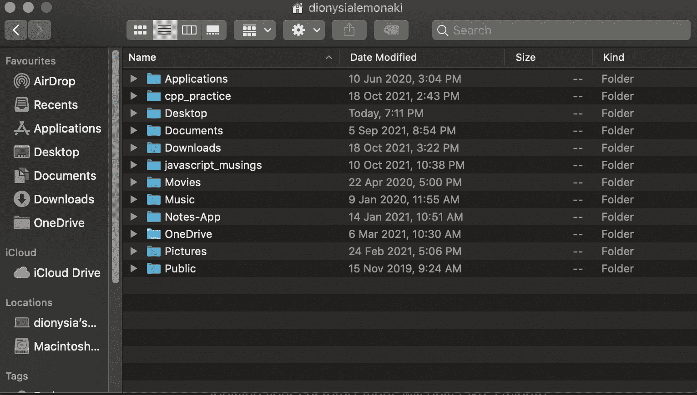
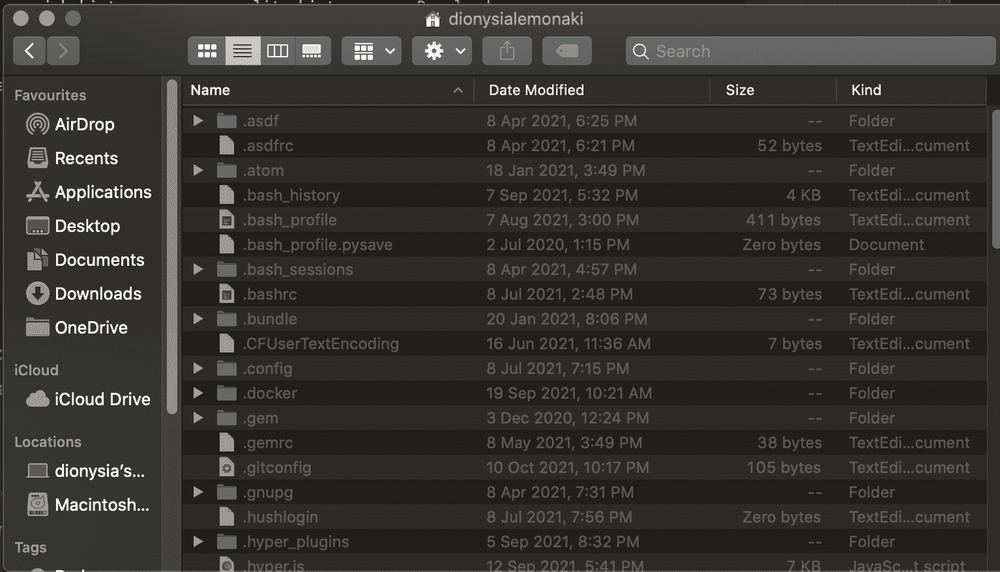
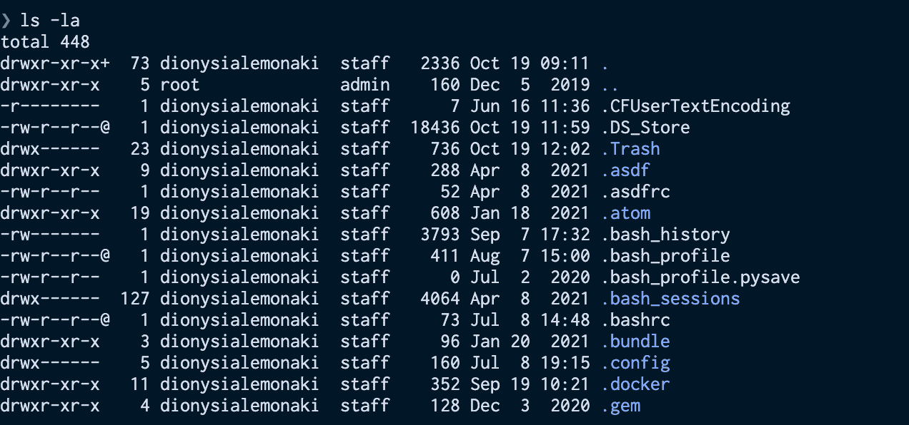
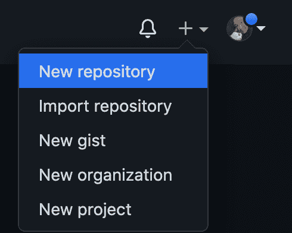

# 点文件–什么是点文件，如何在 Mac 和 Linux 中创建它

> 原文：<https://www.freecodecamp.org/news/dotfiles-what-is-a-dot-file-and-how-to-create-it-in-mac-and-linux/>

点文件是重要的文件，将在你的软件开发职业生涯中发挥不可或缺的作用。

首先，它们能让你更有效率。不仅如此，你将能够在任何机器上拥有你为自己创建的高效设置。

这篇文章是关于如何开始使用点文件的介绍。

您将了解它们是什么，如何在您的系统中找到它们，以及如何创建几个简单的点文件。此外，我会给你一些建议和资源，告诉你如何定制你的设置和扩展你的知识。

我们开始吧！

## 什么是点文件？

许多计算机软件程序将它们的配置设置存储在普通的、基于文本的文件或目录中。

点文件是各种程序的配置文件，它们帮助这些程序管理它们的功能。

区别于普通文件和目录的是它们的前缀。

点文件这样命名是因为每个文件和目录都以点(`.`)开头

在基于 Unix 的系统上，默认情况下，操作系统隐藏点文件。

### 常见点文件的示例

默认情况下，大多数程序将其配置存储在您的主目录中。

您以前可能听说过或使用过的一些常见点文件有:

*   如果您使用 Bash shell，您可能有一个`.bash_profile`和`.bashrc`文件，这两个文件都包含每次启动新的终端会话和配置 shell 时加载的脚本。
*   如果您使用 Zsh shell，这是 MacOS 的新默认设置，您将拥有(或者已经创建了)一个配置和定制 shell 的`.zshrc`文件。
*   如果您使用命令行代码编辑器 Vim，您可以将其配置存储在一个`.vimrc`文件中。
*   在本地机器上设置和配置 Git 之后，您将拥有一个`.gitconfig`文件，其中包含您的所有信息和设置。
*   许多程序不是将它们的配置存储在您的主目录中，而是将它们存储在您系统上隐藏的`.config`目录(文件夹)中。

## 如何查找点文件

在 Finder 中，您的个人目录的根目录可能如下所示:



但是你已经看到计算机系统存储了更多的默认隐藏的文件。

要在 Finder 中查看点文件，请转到您的主目录的根目录，同时按住`Command Shift .`键。

你很快就会看到各种各样的点文件，这些文件要么是你自己创建的，要么是你安装某个软件时创建的。



要从命令行查看点文件(这是您使用它们并与之交互最多的地方)，您必须再次向您的搜索添加一些额外的步骤。

list 命令`ls`列出了当前目录中的所有文件和目录，默认情况下不显示点文件——尽管它们在那里。

首先，导航到您的主目录。如果您还没有到达那里，您可以使用`cd`命令来帮助您到达那里。

然后使用带有代表`all`的`-a`标志的`ls`命令，就像这样:

```
ls -a 
```

如果您想查看关于您的文件的一些额外信息，您也可以使用`-l`标志，它以长格式列出文件和目录，包括关于它们创建的日期和时间、它们的大小等等的细节。

```
ls -la 
```

在输出中，您将看到当前主目录中的所有文件和目录——包括所有隐藏的文件和目录。



每个以句点/点开头的文件和目录都是一个点文件。

## 为什么使用点文件？

你的网络文件是你个人的。

你花了足够多的时间来微调你的设置。您可以策划最适合您的工作流程、审美和偏好的配置和设置。你最终会得到一个开发环境，帮助你个人更有效率。

如果在你花了那么多时间之后，你现在必须换一台新的不同的机器，那该怎么办？那是不是意味着你得从头再来一遍？

您如何记得您使用的确切设置和命令？

或者，如果您有第二台机器，并且希望您的设置在两个系统上完全相同，该怎么办？

开发人员的主要目标之一是自动化重复的任务。

创建一个受源代码控制并托管在 GitHub 上的点文件存储库，当您想要设置一台新计算机并安装与您为上一台计算机创建的设置完全相同的设置时，将会节省您的时间。

这样，您的所有设置和首选项都可以在其他机器上重复使用和保持一致。

## 如何创建点文件

### 如何设置一个文件夹来存放您的点文件

将所有的点文件放在各自的文件夹中是一个好习惯。

为了简单起见，我将展示一个如何在主目录的根目录下创建文件夹的例子。但是您可以在任何方便的地方添加该文件夹。

此外，我将展示如何创建一个`.zshrc`和`.vimrc`文件的例子，但是类似的想法也适用于您创建的任何其他点文件。

导航到您的主目录(`cd`)并创建一个名为`dotfiles`的目录来保存您的所有配置文件:

```
mkdir dotfiles 
```

要创建点文件，可以使用`touch`命令，并将文件名作为参数传递给命令。文件名前面会有一个句点。

要在`dotfiles`目录下创建一个`.zshrc`和一个`.vimrc`文件，执行以下操作:

```
touch ~/dotfiles/.zshrc  ~/dotfiles/.vimrc 
```

如果这些文件已经存在于您的系统中，并且您想要将它们移动到`dotfiles`目录，您可以使用`mv`命令将它们移动到那里:

```
mv ~/.zshrc ~/dotfiles/ 
```

第一个参数是文件的当前路径——波浪号(`~`)代表主目录。默认情况下，大多数隐藏的配置文件都在那里。

第二个参数是要将文件移动到的路径。在这种情况下，您希望将它移动到位于主目录中的 dotfiles 目录。

您可以对`.vimrc`文件进行同样的操作:

```
mv ~/.vimrc ~/dotfiles/ 
```

要查看文件:

```
ls -a dotfiles 
.         ..     .vimrc    .zshrc 
```

有了这些文件，您就可以在那里添加所有您喜欢的配置。

### 如何设置配置

下面是一些想法，可以帮助你开始配置你创建的点文件。

#### 如何个性化您的 Zsh 提示

设置好`.zshrc`文件后，添加到该文件中的任何东西都会影响 Zsh shell 程序的定制。

现在可以定制您的 shell 提示符了。这将是你个人的口味，但这里有一些资源让你开始:

*   [如何像专业人士一样定制你的 zsh 提示](https://www.freecodecamp.org/news/how-to-configure-your-macos-terminal-with-zsh-like-a-pro-c0ab3f3c1156/)
*   [用七个步骤激活你的 zsh 终端](https://www.freecodecamp.org/news/jazz-up-your-zsh-terminal-in-seven-steps-a-visual-guide-e81a8fd59a38/)
*   [自定义 zsh 提示的更多想法](https://scriptingosx.com/2019/07/moving-to-zsh-06-customizing-the-zsh-prompt/)
*   [如何在 macOS 终端自定义 zsh 提示符](https://www.makeuseof.com/customize-zsh-prompt-macos-terminal/)

#### 如何定制 Vim

创建完`.vimrc`文件后，您可以定制命令行文本编辑器 Vim。这里有一些资源可以帮助你开始这个过程:

*   [Vimrc 配置指南](https://www.freecodecamp.org/news/vimrc-configuration-guide-customize-your-vim-editor/)
*   [如何让 Vim 好看:5 个 Vim 定制小技巧](https://www.makeuseof.com/tag/5-things-need-put-vim-config-file/)

#### 什么是别名和函数

改进工作流程和提高工作效率的一个方法是减少输入常用命令的时间。你可以通过创建快捷方式来实现。

替身是终端命令的快捷方式。它们是长命令的较短版本。

作为一名开发人员，您会经常使用 Git，所以创建 Git 别名是一个好主意，有助于节省长时间的重复 Git 命令。[阅读这篇 freeCodeCamp 文章](https://www.freecodecamp.org/news/how-to-use-git-aliases/)中一些最有帮助的内容。

另一种节省时间的方法是简化流程。

您可以通过创建执行一项特定工作的独立行为，将两个命令合并为一个。你可以通过创建函数来做到这一点。

创建一个有用的函数是将创建新目录的命令(`mkdir`)与改变目录的命令(`cd`)结合起来。

通过这种方式，您将创建一个新文件夹并立即切换到该文件夹，这一切都只需一个步骤。

这样做的函数如下所示:

```
function mkcd() {
  mkdir -p "$@" && cd "$_";
} 
```

要阅读 Zsh，函数请看一下[这篇关于编写 OS X 脚本的文章，它涵盖了 Zsh 中的别名和函数](https://scriptingosx.com/2019/07/moving-to-zsh-part-4-aliases-and-functions/)。

您可以将别名和函数添加到您的`.zshrc`文件中，或者您可以创建单独的`.aliases`和`.functions`点文件。

## 如何符号链接您的点文件

您可能已经注意到，您添加到`dotfiles`文件夹中的文件的设置对您的系统没有任何影响。

如前所述，默认情况下，程序的配置文件隐藏并存储在主目录中。这是程序寻找和读取设置的地方。

将文件符号链接(或创建一个符号链接——一个指针)到`dotfiles`目录中是一个好主意，在该目录中，您已经存储了您的首选设置以及您创建的其他文件，该文件位于其默认主目录中。

就好像文件会同时在两个地方！

该文件既在`dotfiles`目录中，也在主目录中有一个“副本”。

要创建一个链接，可以使用带有`-s`参数(代表符号)的`ln`(代表链接)命令。

下面是如何符号链接`.zshrc`和`.vimrc`文件:

```
ln -s ~/dotfiles/.vimrc  ~/.vimrc
ln -s ~/dotfiles/.zshrc  ~/.zshrc 
```

这将使您使用的程序知道它们的配置文件通常在哪里——回到主目录。

```
ls -l ~/.zshrc 

lrwxr-xr-x  1 dionysialemonaki  staff  39 Oct 21 18:30 /Users/dionysialemonaki/.zshrc -> /Users/dionysialemonaki/dotfiles/.zshrc 
```

查看`.zshrc`文件的详细信息，显示位于 home 目录的文件指向 dotfiles 目录中的文件。`->`表示符号链接。

手动对所有的点文件进行符号链接是一个繁琐的过程，当您向文件夹中添加更多的点文件时，会很快变得疲劳和重复。

为了使这个过程更容易，你可以创建一个 shell 脚本来自动调用你创建的点文件上的`ln -s`,或者使用一个[工具](http://dotfiles.github.io/utilities/)来完成这项工作。

## 如何对您的点文件进行版本控制

将你的文件置于版本控制之下将有助于你追踪所有你随时间对它们所做的改变，也将允许你在 GitHub 上分享它们。

确保将目录更改为`dotfiles`目录(`cd dotfiles`)。

按照以下步骤组织 git 存储库中的文件:

1.  初始化存储库:

```
git init 
```

2.  添加到目前为止您创建的所有文件:

```
git add . 
```

3.  提交更改并添加提交消息:

```
git commit -m "Added dotfiles" 
```

### 如何在 GitHub 上托管您的点文件

确保您已登录 GitHub 帐户。

然后，创建一个新的存储库:



给它一个名字，点击“创建存储库”。

接下来，在命令行中添加:

```
git remote add origin url 

#where 'url',the GitHub url of the repository you previously created
#ending in .git 
```

最后，

```
git push -u origin main 
```

现在你可以在线分享你的网络文件了！

## 结论

现在你知道了——你现在知道了点文件的基础！我希望这篇教程对你有所帮助。

你的点文件项目很可能会伴随你的整个职业生涯，并且会随着你对点文件本身了解的越多而成长。随着你通过大量的试验和错误了解到更多关于你的工作流和开发环境的你喜欢什么和不喜欢什么，它也会改变。

感谢阅读！