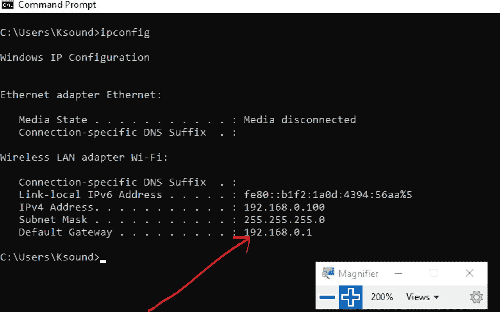
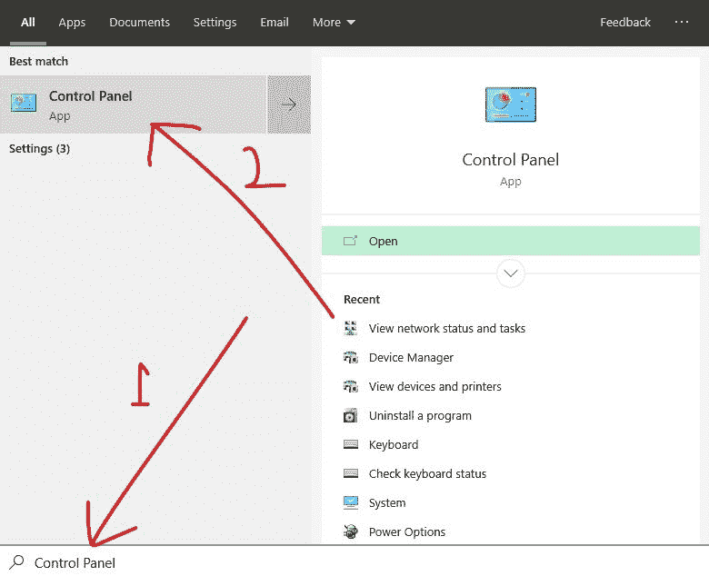
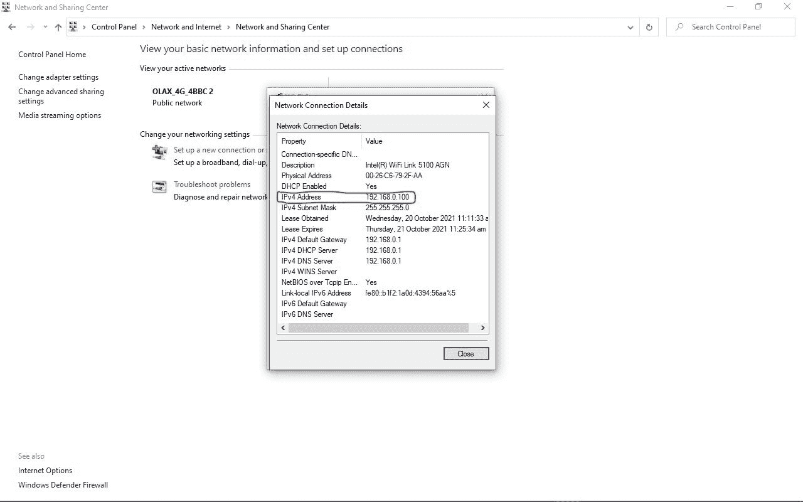
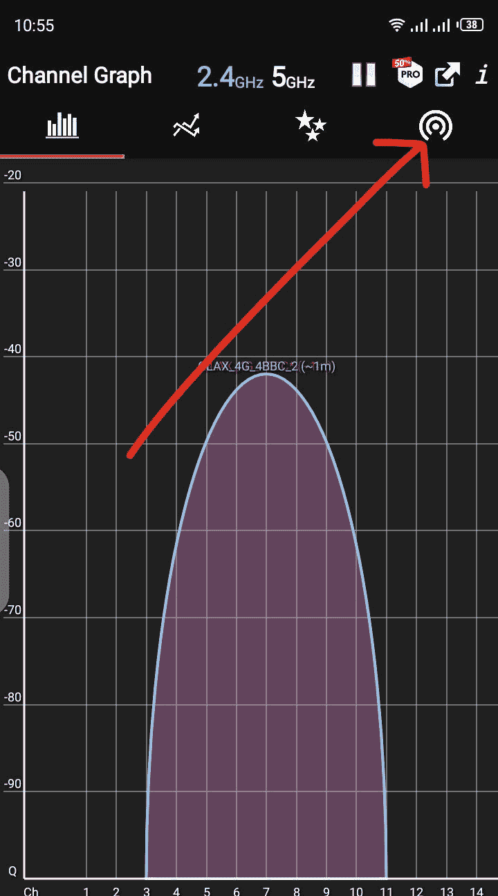
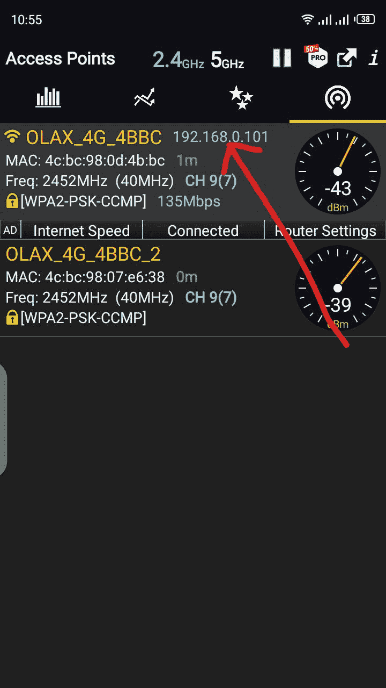

# 我的路由器的 IP 地址是什么？如何找到你的 Wifi 地址

> 原文：<https://www.freecodecamp.org/news/what-is-my-ip-address-for-my-router-how-to-find-your-wifi-address/>

有时你可能需要知道你的路由器的 IP 地址。这将允许您访问设置页面，以便您可以进行配置更改，如更改密码、赶走不需要的用户、限制用户等等。

在本文中，我将向您展示如何在 Windows 机器和 Android 智能手机上找到您的路由器 IP 地址。

## 什么是 IP 地址？

但是在我们开始之前，让我们澄清一下——什么是 IP 地址？

缩写 IP 代表“互联网协议”。互联网协议是一套管理计算机、电话和其他设备如何通过互联网或本地网络共享数据的规则。

IP 地址是一种特殊的数字标识符，允许信息在网络上的各种设备之间发送。

## 如何在 Windows 电脑上找到您的 Wifi 地址

要找出您的路由器的 IP 地址(或您可以访问其 Wifi 的任何其他设备的 IP 地址)，您可以使用命令提示符或通过控制面板访问它。

### 如何通过命令提示符在 Windows 电脑上找到您的 Wifi 地址

**第一步**:点击开始(Windows logo)或者按键盘上的`WIN`。
**第二步**:搜索“cmd”，点击`ENTER`启动命令提示符。

**第三步**:在命令提示符下，输入“ipconfig”并回车。
分配给“默认网关”的数字就是你路由器的 IP 地址。

### 如何通过控制面板在 Windows 电脑上找到您的 Wifi 地址

**步骤 1** :点击开始，搜索“控制面板”，然后点击第一个搜索结果或点击`ENTER`启动控制面板。

**步骤 2** :在“网络和互联网”下，点击“查看网络状态和任务”。

**第三步**:你会在右边看到你的路由器名称。点击它，会弹出一个小窗口。

**第四步**:在弹出的框中，点击“详情”。

点击“详细信息”按钮后，会弹出另一个小窗口，显示您路由器的各种信息。分配给 IPv4 的值是您路由器的 IP 地址。

## 如何在 Android 智能手机上找到您的 Wifi 地址

Android 设备没有开箱检查路由器地址的内置选项。但是可以用 Wifi 分析仪之类的第三方 app。

如果您的 Android 智能手机上安装了 Wifi Analyzer，请启动该应用程序。

您将立即看到通道图选项卡。

滑动到接入点标签，你会看到你的路由器的 IP 地址。

## 结论

在本文中，您学习了如何在 Windows 电脑和 Android 智能手机上找到路由器的 IP 地址。

你可以在不知道 IP 地址的情况下使用你的路由器，但是知道它会给你更多的控制权，你可以对它进行个性化设置。

感谢您的阅读。如果你觉得这篇文章有帮助，请分享给你的朋友和家人。