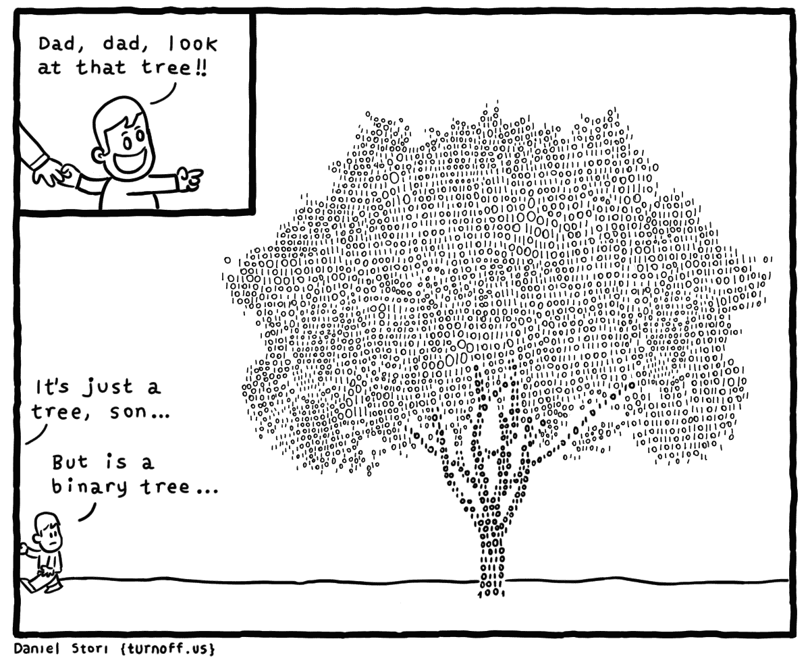

# 如何在技术面试中实现二叉树算法

> 原文：<https://www.freecodecamp.org/news/how-to-implement-binary-tree-algorithms-in-technical-interviews/>

二叉树是软件开发中常用的数据结构。也是技术编码面试中经常出现的话题。

我们刚刚在 freeCodeCamp.org YouTube 频道上发布了一门课程，该课程将教你所有关于二叉树算法的知识，并让你准备好在编码面试和编程项目中使用它们。

Structy 的 Alvin Zablan 开发了这个课程。他创建了许多技术课程，包括互联网上最受欢迎的动态编程课程之一。

在本课程中，你将首先学习算法背后的理论，然后学习如何用代码实现它们。这些算法将通过图像和可视化来帮助你真正理解它们是如何工作的。

This type of binary tree will not be covered in the course.

以下是本课程涵盖的主题:

*   什么是二叉树？
*   二叉树节点类
*   深度优先值
*   广度优先价值观
*   树包括
*   树和
*   树最小值
*   最大根到叶路径和

观看以下全部课程或在 freeCodeCamp.org YouTube 频道观看[(2 小时观看)。](https://youtu.be/fAAZixBzIAI)

[https://www.youtube.com/embed/fAAZixBzIAI?feature=oembed](https://www.youtube.com/embed/fAAZixBzIAI?feature=oembed)

## 副本

(自动生成)

二叉树是软件开发中常用的数据结构。

这也是一个常见的话题和技术编码面试在这个课程中，阿尔文将解释二叉树算法，并准备你在面试和编码项目中使用它们。

嘿，程序员们，来自麋鹿 Shruthi 的 Hamilton 来到我们的二叉树课程，我想告诉你们如何在那些有二叉树问题的技术面试中做得很好。

所以我为这门课准备了什么，像往常一样，我们会复习松树理论和二叉树算法，当然也会更实际一些，想出一个代码来实现这些算法，真正的一击两中。

对于每一部分，我们都要画出图片，在白板上可视化并真正理解算法。如果您对此感到满意，我们将查看代码实现。

所以在描述和时间戳中，你可以找到相应的练习，你可以练习我们讲过的每一个算法。

就这门课的先决条件而言，我假设你不是编程新手。

而且可能你已经涉猎了一些以前的数据结构和算法。

你也熟悉一些递归。

但话虽如此，我还是假设你对二叉树一无所知，甚至只是一般意义上的树。

事不宜迟，让我们直接开始吧。

首先，让我们来理解树这个词的真正含义。

而且喜欢编程概念，对。

所以当我们可视化一棵树时，一棵树包含许多节点，通常我们把节点画成圆形，对吧。

并且这些节点还可以指向其他节点。

这里有一个节点。

我可以指向其他节点，对，我可以指向任意数量的节点。

这是圆圈，我把它们称为节点，它们之间的线或小时，我称之为边。

这是一棵树的例子。

当然，树可以有许多不同的形状和大小。

这是一棵相当大的树。

让我们试着理解一些在技术面试中可以使用的术语。

这是我强烈推荐的，对吗？如果你会说这种语言会有帮助，这确实表明你对处理数据结构很熟练，我们可以在树的节点中存储值。

现在我要把一些字母。

说到你的程序，你可以存储任何你想要的类型，你可以存储整数，数字，甚至其他对象。

因为我们有一棵树，我们喜欢用家族关系。

换句话说，我认为像一个家谱，对不对？如果我看节点 B，假设我称它们为父节点。

如果 B 是父节点，我知道 B 的子节点就是 D 节点，对吗？他们的父母和孩子就像是亲戚关系。

假设我改变了我的参照系。

假设我把 a 看做父亲，那么 B 和 C 是 a 的孩子。

对于 C 节点的情况，如果我想到 CSM 父节点，它只有一个子节点，它唯一的子节点是 F 节点。

因此，在描述树中节点之间的关系时，可以随意使用父子关系。

另一个终端在树的上下文中是单词 root，对吗？所以根将会是一个没有父节点的节点。

所以在这棵树里，A 是根，因为 A 没有父代，对吗？没有箭头指向 a 节点。

另一方面，如果我观察 DNF 的节点，我们称之为叶节点。

叶节点是没有孩子的节点，对吧，所以 d 和 f 没有向外的箭头。

典型地，在二叉树中，我们有一个根，我们可以有很多叶。

我想确定的一件事是，确定你对叶子的理解是概括的，对吗？在这个特殊的例子中，看起来每片叶子都离根有两条边，从根开始计算箭头的数量，任何一片叶子，都可能出现在不同的层次，对吗？所以我去掉了 F 节点，这种情况下 C 是一片叶子，对吗？虽然 C 和 D，E 在不同的层次上，但它不是最底层，它仍然是一片叶子，对吗？叶节点只是一个没有子节点的节点。

好吧。

所以，抛开所有这些术语，让我们专注于真正的主题。

对，我讲了很多关于树的东西。

但是在这门课中，我想复习二叉树的基础知识。

对吗？让我们从二进制部分开始。

那确实是一个致命的泄露。

我们知道二进制与数字 2 有关。

二叉树是每个节点最多有两个子节点的树。

对吗？现在在屏幕上，我有一棵二叉树。

如果我给 a 另一个孩子，比如 f 的第三个节点，这将是一棵树，而不是二叉树。

对吗？这就像一棵三叉树，因为我最多有三个孩子。

假设我移除了多余的节点。

现在又回到了二叉树。

可能的情况是，一个节点有少于两个子节点，但仍然是一棵二叉树，对吗？所以如果我给 C，只是 f 的一个孩子，这仍然是一棵二叉树。

如果我看我的树中的任何一个节点，这个节点会有一个或两个孩子，没有人会有两个以上的孩子，对吗？所以你要确保记住二叉树中的一个节点可以有少于两个子节点。

好吧。

所以我将首先理解二叉树是什么的标准，对吗？这可能是最简单的标准，每个节点的大多数子节点，也想确保加入我们的定义，有一个可靠的理解是，也要记住，至少对我们计算机科学的人来说，我们认为我们的二叉树只有一个根，这意味着应该只有一个没有父节点的节点，对吗？通常当我们绘图时，它就像是最顶端的节点。

所以现在这绝对是一棵二叉树。

如果在这幅图中有其他的节点，比如 G，对，G 也没有双亲，我就不再认为这是经典的二叉树了，对吗？所以要小心。

让我们继续我们的最终标准，我们还需要一个成分。

这就是根和任何节点之间的一条路径。

所以看我左边的例子，这确实是一棵满足所有三个标准的二叉树。

假设我选择了根和任何节点，很明显，只有一个根，所以我们肯定会考虑 A 节点，假设我选择了像 E 这样的随机节点，这实际上是一棵二叉树，那么我们保证只有一条路径连接 A 和 E，一条路径实际上就是一系列我可以穿过的连接节点，所以要从根 A 到节点 E，我可以从 A 到 B 到 E，这就是一条路径。

这是从 A 到 e 的唯一途径。

这就是我所说的一条路。

假设我选择了另一个像 f 一样的节点。

从根到 F 也有一条路径，这就是 CF，这是唯一的路径。

如果我在我的树中添加一些额外的连接或边，我可以得到这样的场景，这将不再是一棵二叉树。

首先，我们可以看到，B 有三个孩子，但也没有一个唯一的路径之间的路由在任何节点。

例如，如果我选择了 a 和 f 的音符，一种方法是使用 ACF。

但是到达那里的另一种方法是 a，b，c，f，对吗？所以当你考虑二叉树的时候，要注意这三个标准。

太棒了。

所以我们来看一些更小的例子。

这就是我认为一些学生在理解二叉树的时候容易纠结的地方。

所以如果我去掉这里的一些节点，这肯定还是一棵二叉树，对吗？只是看看我们不同的规则，对吗？假设根节点 A 只有一个子节点，那么它仍然是一棵二叉树，对吗？因为二叉树只要求我们最多有两个孩子，所以我们仍然有一个根，我们仍然只有一条从根到任何节点的路径。

假设我有一棵最小的树，它有一个节点，这将是一棵单元素树，这仍然被认为是一棵二叉树，右有一条路线。

除了通往它自己的路，这里没有真正的通行证。

并且每个节点至多有两个子节点。

这里我们没有孩子，对吗？我们要考虑的最后一种边缘情况是，当我们没有节点时会发生什么，对吗？我们认为这是一棵空树。

这是一个非常特殊的案例。

我们应该把任何一棵空树看作是一棵二叉树。

当我们以后想出一些算法时，这将非常有用。

一个常见的边缘情况是，当我们有一棵空树时会发生什么，这是一棵没有节点的树，对吗？让我们看另一个例子。

假设我有这个结构，花一点时间看一下，看看它是否符合我们的标准。

这不会被认为是二叉树。

所以我们来看看你不同的标准。

看第一个，它每个节点最多有两个子节点，所以没问题。

但是我们不能在这里准确地确定一个根。

记住根节点是没有父节点的节点，对吗？如果你观察这幅图中的每个节点，每个节点都有一个箭头。

这意味着每个节点至少有一个父节点，对吗？所以不符合那个标准。

此外，在根和任何节点之间，没有一条路径，因为我们在结构中有一个循环。

举个例子，假设我从右边开始，我想去看看，去那里的一条路是 A，B，C，这是一条路。

但是我也可以有另一条路径，或者我只是绕了两圈，然后走 A，B，C，再一次，在这种情况下，实际上有无限多条路径。

正因为如此，这绝对不是二叉树。

这有很多原因。

如果我有一个不同的例子，看看这个，现在我需要标准一和标准二，对，每个节点最多有两个子节点。

但是我还有一个根节点，我认为 z 是根节点。

然而，在任何节点的根之间都没有一条路径，因为我有那个循环。

所以这些规则真的值得记住，它们真的会帮助你解决一个更加困难的二叉树问题。

如果你记住了这三条规则，你就可以在二叉树框架中识别不同的问题。

换句话说，你在面试中会遇到的最困难的问题是，他们不会直接告诉你你在处理什么数据结构，你只需要注意它的模式。

换句话说，如果我给你一个这样的结构，花一点时间，算出这是不是一棵二叉树。

如果你仔细观察，这确实符合二叉树的所有三个标准。

我可以把 a 当作根，因为它没有父节点。

我可以把节点 D 和 F 看作树叶，因为它们没有孩子。

我只是用一种非常有趣的方式画了这个。

对吗？如果你真的用一个经典的二叉树来排列事物，看起来会像这样。

更重要的是，这与之前的图有着相同的关系，我只是以自上而下的方式展示了它，对吗？所以无论如何你要理解二叉树的这三条规则，对吗？因为有时可能不像漂亮的三角形图画那样清晰。

太棒了。

所以我们已经讨论了很多关于如何，你知道，通过一些二叉树定义来观察和推理的理论。

让我们继续，开始讨论如何以编程方式表示二叉树。

换句话说，我们如何在一些代码中做到这一点？不管你选择哪种编程语言，我想你都要把它们表示成对象。

换句话说，这里的每个节点都是一些对象。

所以它可以像一个类的实例，只存储在这个对象中的属性是当前值。

所以我需要存储一些东西，比如我当前节点的 A。

但我还需要提到一些孩子。

所以我们还需要一些指向子对象的左右指针，这些只是对象的一些属性。

在经典的二叉树中很常见的是用左右方向来指代两个子树。

注意这里的一些节点，比如 C 节点，它们只有一个子节点，对吗？c 只有一个节点，对吗？它没有左边。

所以我们必须使用一些空值，比如 null 或者 undefined。

代表一个不存在的孩子，对吗？特别是像何这样的节点，他没有左，也没有右。

所以这就是我们要做的，让我们进入我的文本编辑器。

我将向您展示如何以编程方式表示二叉树。

过渡，这是我的文本编辑器。

让我们从创建节点类开始，对吧。

所以你可以使用你选择的任何语言，我将用 JavaScript 来完成我的工作。

所以我认为呈现一个节点的最好方法就是使用一些类。

希望大家熟悉一些经典的类语法，让我们创建一个节点类，将会有一个快速的构造函数，我认为将会很有价值，接受将要存储在 notes 中的初始值，我将接受 ns a 构造函数参数，我可以将这个点 Val 设置为那个值，还需要两个属性，一个在我的左边，所以我可以说这个点在左边，我将把它初始化为 null，这意味着默认情况下，一个节点将没有左子节点。

默认情况下，一个节点没有合适的子节点，对吗？所以当你用“不”来代表这里不存在的孩子时，太棒了。

这就是你需要创建的所有东西，你知道，一个基线二叉树，对，我们会在课程中经常用到这个类来测试我们的算法。

因此，我将创建一个节点，并最终连接一棵树。

我会调用几次我的构造函数，我会创建不同的节点，我会把它们存储到一些变量名中。

当然，一个新的节点来创建节点的新实例，我会在里面存储一些值，我会在里面存储一些字符，我会创建一堆这些不同的节点，我们要确保做的是确保你也正确地设置它们的指针。

所以我会给每一个不同的值 ABC，D，E，还有 f。

现在，我将手动正确设置它们的指针。

所以如果我像这样做语法，因为我在 JavaScript 中，我可以很容易地分配这些指针，我可以说，A 的左边是 b。

我可以说 A 是对的吗？就是 C 也可以说 B 的左 d。

然后 B 的右边是 e。

也许最终我可以说 C 的右边是 f。

所以通过做这些赋值，我把一些节点连接在一起，我应该得到这样的结构，对吗？以 a 为根，因为没有任何东西指向 a，它没有父节点。

但是 a 有两个 NC 的孩子。

除此之外，B 还有 D 和 e 的两个孩子。

最后，C 只有 f 的一个右子，这实际上是我们在白板会议上看了很多的同一棵树，对吗？这就是你如何以编程的方式表示同一棵树，对吗？所以我一直认为，尝试想象你的树是有价值的，对吗？显然，我们以非常手动的方式创建了这个树，从长远来看，可能会创建一些应用程序来在一些输入期间动态地维护和创建树。

但是现在，我们将开始用这种非常静态的方式来创建我们所有的树。

对吗？至此，我们已经了解了如何表示二叉树，让我们回到白板。

我可以展示我们的第一个算法。

嘿，程序员们，我是艾尔文，对吧？现在我想谈谈深度优先值的问题。

所以这将是对深度优先遍历算法的一个很好的回顾。

那么这个问题你想怎么做呢？我们要做的是，取一棵二叉树，特别是，你的函数要取二叉树的根。

回想一下，给定二叉树的根节点，我们知道该节点将有指向其左右子节点的指针，这些指针可能指向其他节点。

然而，如果我们说一个节点没有左或右子节点，那么它的指针将被设置为 No。

这就是我如何用程序来表示我们的二叉树。

但是现在，让我们只关注我们的树的视觉表现。

所以对于深度优先遍历，我们可以从 a 的根节点开始，我们要做的就是把它添加到某个集合中。

我们将不得不以一种非常特殊的顺序来维护它们。

然后从那里，根据深度优先遍历，我可以到 b。

这里是我们做出真正重要决定的地方，对，我们可以去 C，或者 D，如果我在做深度优先遍历，我需要在横向移动之前在树中更深入。

这意味着我从 B 到 d。

一旦我在 D 买下它们，就没有更深的地方了，我可以从 D 开始。

现在我横向移动到 E 节点。

这种模式还在继续，对吗？我没有 e 更深的东西。

所以现在我去 c。

然后从 C 到 f。

所以这是对二叉树的深度优先遍历。

注意，它是 A，B，D，E，C，F，同样，真正重要的特征是我们必须在树中更深入，直到我们不能再深入，然后我们可以遍历树。

也就是说，我们如何实现这个算法。

如果你首先熟悉深度，传统上，然后我们知道它将使用像堆栈这样的数据结构。

所以让我们坐在这里。

所以我们再追踪一遍。

但这一次，让我们仔细看看如何使用堆栈来完成直接订购。

回想一下，栈是一个顺序的数据结构，我们只能在栈顶添加和移除数据。

所以一个非常重要的特征是，除了栈顶，我们不能在任何地方插入或移除元素。

所以当我往栈里添加东西的时候，我是这样被添加到上面的。

当我移除东西时，也是像这样从顶部开始。

好的，当我开始深度优先遍历算法时，我将从 a 的根节点开始。

默认情况下，我只取根节点，并把它存储在堆栈中。

所以这是我现在栈中唯一的东西，我将用这些矩形代表我不同的栈帧。

实际上在我的程序中，这意味着存储节点的实际实例或者指向它的指针。

酷毙了。

然后从那里，我实际上开始我的主要算法。

所以在深度优先遍历的主流程中，我们将检查堆栈是否为空。

现在堆栈不是空的，因为我至少有一个元素。

我要做的是从移除或者弹出栈顶元素开始。

所以我要删除 A，我会把它标记为我当前正在浏览的节点。

当某个东西离开堆栈时，我可以认为它正在被访问。

所以我需要列出我的价值观，因为这就是这个问题的全部，对吗？至此，我已经访问了 a 节点。

现在，我可以查看节点子节点了。

所以我看着树中的 a 节点，我看到它左边有一个 B 子节点，右边有一个 C 子节点。

然后，我将这两个孩子放入或添加到我的堆栈中。

所以我先放 c，然后放 B。

请注意，如果我先推右边的孩子，然后推左边的孩子，那么左边的孩子就在堆栈的顶部，这意味着我会下一个点击它们。

这实际上结束于我的深度优先遍历的第一次迭代。

现在我问了同样的问题，我的栈是空的，不是。

所以我移除了栈顶，我称之为 B，我的 current，这意味着我可以把它打印出来，或者插入到我的值列表中。

很好。

从那里，我考虑 B 的孩子，B 有两个孩子。

所以我把它们都加起来，我按 E，然后按 d。

这就结束了迭代。

现在有趣的事情发生了，我的栈仍然不是空的。

我知道我去掉了顶部，所以我调用 D，我的电流，我把 D 加到我的值列表中。

但是如果我看这些子元素，它实际上没有子元素，对吧，所以这里没有什么可以添加到堆栈中。

所以从技术上来说，我完成了这个迭代。

现在我的书库里还有很多东西。

所以现在我把他从栈顶取出来。

和以前一样，对，我加上我的价值观，他没有孩子。

所以我完成了这个迭代。

最后，我从堆栈中移除了 C，并输出了我的值。

在这一点上，我看到 C 节点只有一个子节点，所以我只需推送现有的子节点，这样我就可以将 F 节点推送到我的堆栈上。

这是一件非常重要的事情，当你实现深度优先遍历的时候，你需要检查你的孩子是否存在，然后再把他们添加到你的堆栈中。

现在在最后一次迭代中，我们有了 F 节点，我们把它从堆栈中移除，我们把它添加到我们的值列表中，F 没有子节点。

我完成了这个迭代，现在我的栈是空的，一旦栈空了，我就退出。

我知道我一定遍历了整个二叉树。

这就是我们的结果，我们在这里得到了正确的输出。

所以只要使用堆栈，遵守堆栈的规则，也就是说，我们被推到顶部，然后从顶部移除，我们就会得到正确的顺序。

重要的是要记住，无论什么时候有东西离开堆栈，你都应该将你的值添加到你的 like 值列表中。

话虽如此，关于这个算法的时间和空间复杂度，我们能说什么呢？嗯，其实很简单。

假设我们定义 n 为这个二叉树的节点数，那么我们可以说这个的时间复杂度是 O/n。

我为什么这么说？我们只是要把每个节点最终添加到堆栈中。

节点也将恰好离开堆栈一次。

所以我们并没有重复访问任何节点。

所以我保证只跑 n 步中的 O 步。

类似地，我们可以看到空间复杂度是 O/n，我们唯一存储的东西实际上是堆栈，这是一种线性数据结构。

我们知道我们不会在栈上放置超过 n 个东西。

所以总的来说，对于这个深度优先遍历问题，我们有一个线性的时空解。

好了，我想我们对深度优先遍历的方法有了很好的理解。

现在，让我们继续观看演练视频。

我们将一起用几种方法来实现它。

嘿，程序员们，我是艾尔文，对吧。

我想看看这个深度优先值问题的 JavaScript 解决方案。

因此，我们在这里要做的实际上只是实施我们在进场视频中跟踪的相同策略，非常接近开球。

我们将从迭代版本开始。

这意味着，当然，我们会用两种不同的方法来解决这个问题，对，我们会先迭代解决，然后，我们会继续递归解决。

好吧，让我们从这里开始吧。

正如我们所说，在方法视频中，我们知道迭代版本确实依赖于我们创建一个堆栈。

对于大多数编程语言来说，你可以直接使用你喜欢的数组数据结构。

所以我将只使用一个普通的旧 JavaScript 数组，我将把它命名为 stack。

我们可以用一个数组来表示一个栈，只要我们坚持两个特定的方法，对，我要用数组 push，它添加到数组的末尾，还有数组 pop，它也从数组的末尾移除。

所以我将把数组的末尾看作堆栈的顶部。

酷，我们将继续做的是初始化堆栈，根节点在它的上面。

很好，这样我就可以有算法的主循环了。

所以我们知道，当栈上还有东西的时候，我们需要继续运行算法。

所以我可以在栈点长度大于零时检查。

因此，虽然我的堆栈中至少有一个元素，但这里还有一些工作要做。

这将逐步完成该算法的一次迭代，我们知道，我们只需移除栈顶即可开始交互，换句话说，JavaScript 中的 stack dot pop 也将返回我们刚刚移除的元素。

所以我称之为我的电流常数。

这将是节点的一个实例，它将是这些对象之一。

酷毙了。

现在我把这个元素从栈顶移除了，比如现在，我只是我不知道，把它打印出来，也许我们会边走边调试这个。

因为我知道 node 的每个实例内部都有一个点值属性。

然后从那里，我需要添加这个节点的孩子。

所以你可能会猜测，要做到这一点，我们可以只做堆叠推，我要推左边的孩子，一个在这里，所以节点或当前点左边，跟着右边的孩子。

但我们也需要确保这些孩子的存在，对吗？看提示。

可能会有这样的例子，比如说，这里的这个 C 节点，这个 C 节点只有一个右边的子节点，但是没有左边的子节点。

所以我不想做的是把 C 向左推，因为那会把 no 推到我的栈上，这会给我一个错误。

对吗？所以我想只有孩子存在的情况下才推。

我需要分别检查左边是否存在并按下它，以及右边是否存在并按下它，我将为这两者添加一些守卫语句。

我们继续，插入 will 说，好的，如果电流有左右两边，电流点在左边，称为右边的正义，酷，如果你喜欢，也许我们可以内联它。

好吧，所以我只推那些存在的孩子。

这应该是我们深度优先算法的核心。

所以我们没有像问题所要求的那样把我们的值放在一个数组里面，但是我们至少应该能够看到这里正确的打印顺序，因为我要在一个节点值从我的堆栈中移除后就打印它。

所以我会继续，实际上可能会引入一个字面上的测试用例，所以我可以把这个小存根偷过来。

这将打印出这些值。

好，我来测试一下，我可以点击 Run，如果我点击 Run，它会像脚本一样执行这个文件。

所以它不会运行任何自动测试用例，只是按原样运行我的文件。

所以如果你想用这种方式测试它，有点像手工测试，你必须确保调用你的函数。

我在里面有一个控制台日志。

所以我会手动运行。

当我这样做的时候，应该会看到一些输出，看起来像是 node 没有被定义，因为我忘记带我的类定义了。

所以我会这么做。

试试看。

好了，看看我们的输出，我们没有得到我们期望的精确的深度优先遍历，对吗？我得到了 ACF，B，D，如果你看看我们真正打印出来的东西，我们技术上确实打印出了深度优先打印，但我们更喜欢右手边。

所以我们做了 a，c，f，然后 B，E，d。

假设我们真的想要这种从左到右的版本，你所要做的就是翻转你推孩子的顺序，对吧，看这两行就清楚了，对吧？当我添加我的孩子时，看起来像是我先推左边的孩子，然后是右边的孩子。

如果你先推左边的孩子，然后再推右边的孩子，这意味着右边的孩子会在下一次迭代中在最上面。

所以如果你这样做，这将有利于右手边，并首先通过它。

但是如果你像这样做，现在你实际上会先迭代到左边的分支，向右。

做了这么小的改动，让我们看看我们的印刷品是什么。

在那里我们有一个很好的 ECF。

然而，在这个问题中，他们希望我们实际上在一个数组中返回这些值。

所以我可以在这里去掉这个小的手工测试，我不再需要这个类定义了。

现在，我将把我所有的值聚集到一个结果数组中。

所以我会说，也许这里的结果是从一个空数组开始的。

然后，当我从栈顶弹出元素时，而不是记录它们，我将继续进行结果点推送，并将该值推入结果数组。

一旦我完成了这个 while 循环，就意味着我的整个树都被浏览过了。

我可以返回哪种情况，确保我拼写正确，返回我的结果。

酷毙了。

因此，这应该是一个不错的解决方案，它实际上运行测试用例。

试试看。

所以看起来我们做得很好。

但是对于最后一个例子，看起来我们无法读取 na 的 Val 属性，这是运行测试用例 04。

因此，如果你真的进入提示，那些测试用例实际上在这里被明确地展示出来。

现在我想回到零，让我们看看测试用例的零。

它们继续前进，传递我的函数，不，就像一棵空树或者一个空节点。

我们可以追踪代码在这里发生了什么。

假设根是空的。

这意味着当我们初始化堆栈时，我们的堆栈实际上包含了一个空值。

所以这还不是一个值得注意的例子。

也就是说，当我输入这个的时候，我们要检查，你知道，我的堆栈里有没有东西，我有，因为我的堆栈长度是 1。

然后当我弹出时，堆栈电流的顶部元素是 no，然后在第 14 行上显示为空点 Val。

这就是我们的代码爆炸的地方，就在第 14 行，对吗？不能引用空值的属性 Val。

所以为了处理这种情况，我们要确保我们永远不允许任何东西进入堆栈。

这就是为什么我们在这里有这个警卫。

上面提到的也适用于顶级路线，以防他们给我们一棵空树。

有点像陈词滥调，你知道边缘案例。

但这是一个很常见的问题，当你真的去面试的时候，对吗？如果输入为空会发生什么？

所以我会明确地保护它，我会继续检查，如果我的路径，如果我的整个树是空的。

所以如果 route 等于 null，那么我要做的就是返回一个空数组，对吗？因为这意味着里面没有值。

这实际上是预期的答案，根据这个，right 应该返回一个空数组。

所以现在让我们试一试应该不错。

很好。

这里，我们有了这个深度优先值问题的很好的迭代解。

好吧，我们这么办。

这是一个解决方案。

让我告诉你另一种方法。

让我们实现这一点。

这就是我们的递归风格。

所以我会在下面重新定义它。

实际上，我建议练习这两个版本，因为它们将作为你解决许多不同树木问题的基础。

所以当我考虑递归版本时，就像我们所有的递归代码一样，我必须考虑输入的最简单情况，这将作为我的基本情况，对吗？所以在二叉树的情况下，你能得到的最简单的树是一棵空的树，或者是一棵没有根的树，对吗？所以它甚至不是关于一个节点，一个二叉树中的单个节点。

这将是一棵空树，一棵没有节点的树。

我要检查一下我的路线是不是 no，我有一棵空树。

我考虑这个基本情况，好像它是自己的输入，因为它确实是正确的，所以如果有人让我把空树中所有值的数组返回给他们，这仍然是一个空数组，对吗？因为没有值，所以甚至没有节点和空树。

然后从那里，我可以生成实际的递归调用。

我知道我递归地把我的东西叫做什么。

这意味着我必须引用一个函数，然后调用它。

我会叫左边的根点，还有右边的根点。所以这个调用会返回一个数组，包含左子树中的所有值。

这将给我一个数组，包含右边子树中的所有值。

假设我把这些变量分别转化成它们自己的变量，你不用做这部分。

但是我有点喜欢它，尤其是如果它是第一次实现这个的话。

所以我称之为我的左值。

我称之为我的正确价值观。

这就是我如何快速创建递归代码的方法，当我调用时，这是一个信念的递归跳跃。

假设我们正在通过测试 00。

这是我们的视觉树，对吗？所以我们知道我们的根将会是一个节点。

因此，当我实际进行这个顶级调用时，这个基本情况不会触发。

所以我进行递归调用，对吗？我知道当我处理深度优先值时，或者更确切地说，让我把根点的深度优先值固定在左边，这意味着我要传入 B 节点，对吧，这就是我要如何假装我的代码的行为，我只是要从这个调用中得到正确的结果，对吧？所以如果我把 B 节点传入这个调用，我期望得到的是完整的数组，它代表子树的深度优先遍历，从 B 开始，对吧。

如果我在这里得到正确的数据，它看起来就像是 B，D，和 e。

这实际上是从这个子树开始的最大深度的第一次遍历。

我只是在心里这么做，或者我知道对这个算法的期望，对我的正确选择来说，会是一个类似的故事，对吗？如果我在 A 处，那么 A 仍然是我的路径，我传入了我右边的子树，看，对于这个调用，我期望返回的只是一个 CF 数组，这将是左边子树的深度优先遍历。

现在我有了，你知道，我的左子树值和右子树值，我必须考虑如何把它们结合在一起，对吗？我如何把我孩子的两个结果组合起来，得到那个输出，对，我需要做的就是把它放到数组里，然后是我左边的孩子，然后是我右边的孩子。

所以我可以做一些很好的 JavaScript 语法，当我把自己放进去的时候，无论何时返回右，所以我要放进去一个根点 Val，那就是我自己。

这就像一个节点，我把左边结果中的所有值都放在这里，然后用 spread 运算符来解包这个数组。

对于 CF 的正确值，我会做同样的事情。

点点，点点，展开正确的值，我返回一个数组，这个模式本身和这个输出相匹配，对吧，有点冒险，假设这些递归调用是正确的，对吧，我有一个 a，我插入替换 B，D，E，然后对于右边，我有 CF。

即使在我们运行这个之前，我也不打算假设太多的 JavaScript 知识。

所以也许你对这种传播运营商有点陌生。

总的来说，先不说这个，我们假设有一系列的东西。

所以我会说，那边的人和这边的人。

所以我们会让弗莱贝上场，让杰森上场，让拉吉上场，让海德上场。

我能做的是，每当我有一个数组，我就可以用一个 spread 运算符来解包这个数组。

举个例子，我可以说 const 会说 new peeps。

我将创建一个新的文字数组。

所以每当我说方括号，它给我一个新的数组文字。

我要做的是，我不知道，在前面放一个元素，我们称它为 Alvin。

那会分散 peeps 的元素，对吧？想象一下，我把所有的元素都拿出来，去掉括号。

这样我就不会添加任何初始嵌套。

然后到最后，我不知道还能不能加别人。

就像，对吗？嗯，控制台点日志，新 peeps 看起来像什么，所以我不打算运行测试用例，我们只是要运行这个文件作为脚本，这样我们就可以审查这个传播指数。

所以如果我试一试，我们会让事情变得更大。

注意到我已经正确地展开了吗？阿尔文在前面，我在中间有所有来自 peeps 的东西，对，后面是布莱恩在最后。

所以你可以这样做。

还可以在数组上使用 like concat 方法。

你可能会看到我经常使用这种展开语法，因为我是你的粉丝。

但是记住这一点，让我们继续实际测试这段代码。

所以我们会运行所有的测试案例。

很好。

这是我们深度优先价值观的另一个可行的解决方案。

很自然，我们也可以递归地解决这个问题。

所以我知道这个深度优先遍历的迭代解需要一个栈数据结构。

我知道每当我写递归代码时，在幕后，你的编程语言实际上会使用调用栈来跟踪所有这些递归调用，对吗？该调用堆栈行为为您提供了相同类型的排序，这非常方便。

酷毙了。

好吧。

所以在我给你们讲下一个问题之前，我希望你们实际上练习这两个解决方案，对于这个深度优先值代码，实际上掌握一些后面即将出现的概念是非常必要的。

所以一定要花点时间在这个熟能生巧的练习上，好的，我会在下一节课赶上你的。

嘿，程序员们，我是艾伦，对吧？现在我想谈谈这个广度优先的价值问题。

因此，它实际上只是我们刚刚做的深度第一个的一点变化，当然，对于我们所有的树算法和其他数据结构来说，我们有两个版本是非常重要的。

所以在这个问题中，我们将接受一个二叉树，再一次，非常经典的二叉树结构，这一次，我想根据广度优先遍历顺序返回一个数组或所有值的列表。

所以广度优先遍历从 a 的根节点开始，这并不新鲜。

然后从那里，我可以去 b。

现在我有了 a 节点和 B 节点。

这就是我们在广度优先遍历中偏离前面问题的地方。

广度指的是在我深入之前，我走过的东西的宽度。

所以在我们的广度优先遍历中，我现在要移动到 C 而不是 D。

所以我把我的 C 节点 C 值加到我的列表里。

然后从这里开始，一旦我完成了这一层，就没有地方再穿过树了，现在我可以向下到下一层。

现在我有 D，然后是 E，然后是 f。

所以它们非常重要的区别是广度优先遍历从 ABC 开始，而深度优先遍历从 A，B，d 开始。

这是一个非常非常重要的区别。

那么我们如何着手实施广度优先的版本呢？回想一下，深度优先使用堆栈数据结构，广度优先现在将使用队列数据结构，实际上只是该结构的合作版本。

因此，让我们以一种更程序化的方式来逐步实现这一点。

因此，我将使用并跟踪我的队列。

回想一下，一个队列没有方向感，有我的队列的后面和我的队列的前面，事物进入队列的后面，它们离开队列的前面。

没错。

所以也没有人会被跳过。

这给了我一个很好的公平排序，把排队想象成在杂货店或其他地方排队结账。

那么我如何开始我的算法，我将从用根节点初始化我的队列开始。

所以我要从队列中的 a 开始。

然后从这里，我可以开始我的主算法。

所以我的主算法应该在每次迭代中检查我的队列是否为空，现在不是因为我至少有一个元素。

所以我移除了队列的前端元素。

所以我们知道 a 会被移除，我们把它标为当前的。

当某个节点离开队列并被标记为当前节点时，它会说现在正在被访问。

所以我会在我的值列表中添加一个。

然后从这里，我需要看着他的孩子。

他有两个孩子 B 和 C，我需要将他们添加到我的队列中。

假设我先把 B 放入队列，然后是 c。

注意 C 必须在 B 后面进入，对吧。

现在我完成了这个迭代。

在这一点上，我有我的算法的下一次迭代，我把我的队列的前面的元素，它离开，所以 B 现在是我的当前，我把 B 添加到我的运行列表，然后我看 B 的 D 的孩子，我推 D 后面跟着他。

此时，我还有另一个迭代要做。

如此等等。

从这里，see 离开我的队列的前面，我把它添加到我的值列表中，我查看 sees children，see 只有一个孩子。

所以对于存在的那个孩子，我继续把他们添加到我的队列的后面。

非常重要的是，我在后面添加了我的下一个迭代。

在这一点上，我继续，我的队列仍然不是空的，所以我仍然有一些东西要删除。

所以 D 在我的队列前面离开，我把它添加到我的值列表中。

既然 D 没有孩子，这里就没什么好补充的了。

下一次迭代，他离开我的队列的前面，我添加到我的值列表，没有孩子，所以我不需要添加任何东西。

最后 f 离开了我的队列的前面，我只是把它添加到我的值列表中，同样，f 没有孩子。

所以现在我的队列是空的，这意味着，嘿，我一定完成了算法，对吗？没有更多的节点需要浏览，我浏览并添加了每个节点到我的值列表中。

好的，这个输出看起来是正确的，我得到了 abcdef，就像我们说的。

但是这个算法的复杂度呢。

让我们仔细看看这里。

我们从一开始就知道，n 是二叉树中节点的数量。

这就是我们输入端的术语。

我们可以说，时间复杂度只是 O/n，因为我们知道何时访问这些节点，你知道，使用我们的循环，我们将每个节点添加到队列一次，这也意味着该节点将离开队列也想要，所以这不像我们在队列中添加一个节点，对，我们不会两次访问这些节点。

类似地，空间复杂度最多为 O/n，因为，你知道，我们最多只是将所有节点添加到我们的队列中。

一般来说，就我们在队列中使用的空间而言，它可能会小于，哦，事件空间。

我现在要提到的一件重要的事情是，关于这个问题的时间复杂度，这里，我们说时间复杂度是 O/n。

如果我们可以假设现在向队列中添加一个东西在恒定时间内运行。

并且从队列中移除一些东西是在恒定的时间内发生的。

因此，取决于你如何实现它，如果你实际上使用一个内置的有效的队列数据结构，你将首先获得我们广度的 O/n 时间复杂度。

但是如果你使用一个次优的，比如数据结构，也许不是一个完美的队列，那么你可能会有一个实际上更糟糕的复杂性。

所以，这个 O/n 的时间复杂度假设我们有一个最高效的队列，它有 O 个添加和删除操作。

也就是说，我对编写这个程序感觉很好。

我将在演练视频中向您展示实现这一点的几种不同方法。

嘿，程序员们，我是 Alvin，现在我想介绍一下这个广度优先值函数的 JavaScript 解决方案。

所以，希望你刚刚完成了深度第一版，在这种情况下，这一个应该是非常容易的。

但是当然，我们仍然会经历它的运动，因为它会对以后解决更困难的问题有用，正如你经常听到我说的，好吧，所以为了解决这个问题，我们将从我们的队列数据结构开始，对吗？所以在 JavaScript 中没有什么新奇的东西，我要做的就是使用一个数组，坚持使用非常特殊的方法，对吗？所以我要创建一个数组，我把它叫做我的立方体。

默认情况下，我们将使用路由初始化该队列。

我们还会预先防范他们给我们一棵空树作为开始。

换句话说，最初的路线是不，这种情况下，它会像这个测试 04。

他们只是想让我们返回一个空数组。

所以我要明确地保护它。

所以我要检查一下嘿，我的路线是不是

如果是的话，就这样返回一个空数组。

很好。

然后从这里，我需要从算法开始我的主循环。

所以当我的队列不为空时，我迭代一次，就像我们在方法视频中提到的，对吗？所以当 q 点长度大于零时，继续前进。

现在我开始这个算法的一次迭代，只需要移除队列的前端，对吗？因此，使用哪种方法真的取决于你，你只需要确保从一端移除，然后添加到另一端。

对我来说，我会把索引 0 当作数组的前面，把最后一个索引当作数组的后面，对吗？所以如果我想去掉前面的元素，比如说，数组点位移，或者对我来说，Q 点位移，去掉前面的元素也会返回给我，这个元素，所以我把它叫做我当前的音符，x。

然后从这里开始，我需要将这个节点的子节点添加到我的队列中。

这就是我这次广度优先遍历的主要流程。

没错。

所以我要继续检查，如果我的左孩子存在，那么如果，假设当前点左，这是未知的，那么我应该继续做的是把它推到我的队列中。

所以我说 q 点向左推我当前的点，当然，它对右边是对称的。

所以如果右边存在，那么就把右边推入队列。

就这样。

太棒了。

这看起来相当不错。

然后，从那里，我实际上想把我访问的节点存储在一个数组中，以便最终返回，就像问题所要求的那样，所以不要太花哨。

我真的想在这里插入一些代码，所以我将创建一个结果数组，我称它为 values，每当有东西离开队列时，它就有点空了。

我会把它融入我的价值观。

所以我说价值观推动。

我将把当前值放入我队列中。

请注意，你不能像对待队列一样对待它，就像对待你的最终返回值一样，它必须是一个完全独立的东西，我使用队列只是为了以广度优先的顺序遍历。

你访问的顺序实际上来源于事物在队列中的排列顺序。

这就是我在这里做的原因，一旦有东西离开队列，我就认为它被访问了。

所以我增加了我的价值观。

很好。

在我的 while 运行完毕后，我将返回我的整个值数组。

让我们来测试一下。

我要运行所有的测试用例，我们得到的，有几个测试用例通过。

现在我们有了。

这是我们广度优先遍历的一个很好的迭代解决方案。

只是有件事我想提一下，顺便来看看提示。

所以看，我不知道，就像第一个例子，在这种广度优先的演奏中，他们要求我们做的是真正给我们一个广度优先的遍历，从左到右移动，所以注意它的结果输出是 A，B，C，而不是 CB，对，这两者在技术上都是正确的，先开始呼吸。

然后你可以根据你要解决的问题来选择，是从左到右还是从右到左。

对我来说，因为我先推左，后推右，这意味着左会先离开队列，对吧，因为记住，队列就像排队和结账。

所以如果有人先进入，也就是说左边的人先进入，他们会在右边的人进入之前得到服务。

你可以把这些翻过来。

我会给你一个从右到左的通用目标。

因此，根据您的问题，您总是可以对代码进行一些操作。

这可能是你唯一的解决办法。

你知道，也许除了喜欢代码风格的一些表面上的改变，这将是你在二叉树上广度优先遍历的唯一解决方案，对吗？我看到人们经常犯的一个常见错误是，没有一种直接的方法来递归地实现广度优先遍历。

这应该是有意义的，因为广度优先遍历需要一个队列，顺序正确需要使用一个队列。

如果你写任何递归代码，你知道，在引擎盖下，它使用堆栈。

因此，堆栈与队列实际上只会对您不利。

你将会有一段非常艰难的时间来实现正确的排序。

所以总是为广度优先遍历编写迭代版本。

好的，所以我建议在你进入下一个视频之前，确保你能够自己编写这段代码，因为我们会稍微提高难度，但我会在下一个视频中赶上你。

嘿，程序员们，我是 Alvin，现在我想介绍一下解决这个树包含问题的方法。

所以这个问题的前提是，我要给你一棵二叉树，还有一个要寻找的目标值。

我只想你告诉我是真是假？在二叉树中找到目标值了吗？对于这个特殊的输入例子，答案显然是真的，或者是的，对，你肯定能在这个二叉树中找到 e，给你另一个目标值，比如 j，你会用假来回应，对吗？因为在二叉树中找不到 j 值。

实际上，我在这里要求你们做的是，我们逐步解决典型的问题，比如广度优先搜索和深度优先搜索问题。

我想现在我会为你们介绍这两种方法。

假设我在测试，或者我想跟踪目标的输入，也就是说，我该如何着手攻击这个呢？我们知道，在大多数这样的问题中，当他们给你一个二叉树作为输入时，他们只会给你一个根节点。

也就是说，如果你可以访问根节点，那么你知道你可以访问树的所有节点，对吧。

所以我能做的就是执行我的任何遍历算法。

所以也许要开始了。

现在，让我们只做广度优先搜索或深度优先搜索迭代风格。

所以我认为对于这个轨迹，我将坚持宽度优先的版本，这意味着我们将使用一个队列，对吗？所以当我们追踪这个的时候，我在反复思考这个。

现在，希望你能回忆起我们之前的问题，当谈到广度优先遍历时，你从队列中的根节点开始。

当有东西离开队列时，你把它标记为你当前的权利。

这就是我用新的逻辑来解决这个特殊问题的地方。

当有东西离开我的队列前面时，我要检查一下，那个当前值和我的目标值是一样的吗，那么 a 和 e 是一样的吗？

不是的。

所以我还没有找到我要找的东西，对吗？我现在能做的就是考虑他的孩子。

对吗？所以我看着他的孩子。

它们都存在，我将它们添加到队列中。

所以我会把 see 添加到我的队列中。

现在我正在进行下一次迭代，对吗？前端元素 B 离开一个队列，我要检查，嘿，是 B，我的目标，不对我的目标 t。

所以我一直跑，我看着 B 的孩子。

所以我把 D 加上去，我把 E 也加上去。

而这个过程只是继续着，看到我队列前面的叶子就是看到我的目标，其实不然。

所以继续下去，我会把 C 的孩子加到我的队列里。

所以我把 F 加到我的队列里。

这个过程还在继续。

所以 D 离开了我的队列的最前面，我检查了 D 是我的目标，它不是，D 没有要添加的孩子，对吗？回想一下，在我们的广度优先遍历中，我只添加存在的子元素，因为我不想添加任何元素，比如空指针到我的队列中。

所以我继续我的算法，对，我的队列里还有东西要检查。

最后，当他离开我的队伍时，我会检查他是不是我的目标。

在这一点上确实是对的，我刚刚确认了他在我的二叉树中。

所以我能做的就是通过返回真值来结束我的算法，对吗？实际上查看树的其余部分是没有意义的，因为我已经算出，嘿，我的目标值确实在树内。

对吗？你可能注意到的一件事是，看起来我只在 IE 离开我的队列时检查它，而不是在它最初被添加到我的队列时。

从技术上讲，当您将它添加到队列中时，您可以提前返回。

但是我们会看到，当我浏览这个的完整代码时，如果你只是检查你的目标值，当有东西离开你的队列时，它会以更干净的代码结束。

所以我们看代码的时候会看到。

这只是一个小小的实现细节。

也就是说，对于这种迭代的广度优先策略，我们能说什么复杂性呢？如果我们将 n 定义为节点数，那么我们知道时间复杂度是 n 的 O，这实际上是一个经典的广度优先遍历。

所以节点进入队列一次，一旦队列打开就离开。

再一次，这是考虑如果我们使用一个有效的队列，我们的队列添加和删除操作运行一个常数时间。

所以我们有线性时间。

对于空间复杂度，也是 O/n 线性的，对吗？因为我们只是将节点存储在队列中。

我们刚刚看了一个很好的迭代宽度优先解决方案的方法，不是针对这个问题，但是我想给你们看深度优先版本，深度优先版本，这是递归的，对吗？所以很明显，你可以为每个解决方案编写迭代债务，这种情况下，你只需使用我们刚刚谈到的基本相同的代码，但只需使用堆栈而不是队列。

但是让我们试着解决这个问题。

递归地，对。

我认为让自己接触这样的递归非常重要的原因是，随着我们转向更复杂的主题，你会发现这种递归方式。

非常非常有用吧？所以我们有相同的输入，对吗？假设我的目标是 E，我有同样的二叉树。

现在我想递归地检查 E 在这棵树里吗？那么我们该如何着手解决这个问题呢？嗯，我们需要考虑我们的基本情况，对吧？所以我们有两种基本情况，肯定的基本情况，意思是嘿，我们找到匹配了。

所以每当我对一个节点计数，它的值是 he，或者它的值匹配我的目标，那么我会让那个节点或者那个递归调用，返回 true，对吗？这就是我的基本情况。

所以我要把返回值直观地插入到我的树中，你知道这个 II 节点会返回 true。

现在我要考虑我的否定基本情况，对吗？当我调用空节点或空节点四次时，我应该返回 false。

回想一下我们之前的课，我们说过，我们有时会明确地表示我们的空节点。

所以我要把它们填充进去，例如，我图片中的 C 节点会有一个空的左子节点。

所以我会明确地画出来。

我知道这样的节点会返回 false。

因为从逻辑上来说，我不应该把所有的递归调用都当成它们自己的子问题。

对吗？所以如果有人问我，嘿，你能在一棵空树上找到这个 E 值吗？对吗？空节点代表空树？答案是否定的，我找不到空树上的值，因为那里什么也没有。

从那里，我也要画出所有类似的空节点，空指针，对吗？所以它看起来像这样。

注意，从 E 节点开始，我不需要给它一个空的左右，因为我已经说过那个节点会返回 true，对吗？这就是为什么我这样画我的树。

我有所有这些错误的返回值。

酷毙了。

所以我们只是标记了所有的基本案例，就像我们树的叶子一样，回忆一下叶子只是一个没有子节点的节点，对吗？从这里开始，我如何组合所有这些布尔值，在最顶层得到真值，我知道对于我的顶层颜色，在 a 节点，或者递归调用，我需要得到真值，对吗？我们应该使用的逻辑是，或者说这个是如何工作的。

所以让我们开始评估我们的返回值，并在父节点合并它们。

所以这应该有点类似于我给你们看的树和问题。

所以你可以做的是关注这个 D 节点，这个节点的左边有准备好的值，右边有两个假值。

当它得到这些假值时，它应该做逻辑 OR，所以它做假或假，结果为假，对吗？这意味着，在这个以 D 为根的子树中，我找不到值，这是有意义的。

所以才是假的。

我会继续这个过程。

如果我看这个 B 节点，现在这个 B 节点的左右两边都有准备好的值。

它们会冒泡一点。

我取它们的顺序，所以我做 false 或 true，结果为 true。

这个过程在树的任何地方都在继续，对吗？所以在这个 f 节点，假或假，是 me 假。

在 C 节点，false 或 false 给我 false。

最后，在 A 的顶层根，我做 true 或 false，给我一个最终的 true，这确实是正确的答案。

希望你们能意识到，这个解决方案和我们之前的树是多么的相似，在树的右边，一些问题，我通过算术加法把左右两边的子返回值结合起来。

但是这一次，我只需要使用 or 右的布尔运算，所以只要把类型调整为布尔，我们就有了一个非常非常好的解决方案，喊出了乔治·布尔。

因此，我想让我们继续，用一些代码来实现它，我会用趣味或者用一口气来展示它，还有递归版本，这是我个人最喜欢的，用这种递归树结构。

嘿，程序员们，欢迎回来。

好的，我想看一下这个树包含问题的 JavaScript 解决方案，对吗？我们先解决深度问题，也先解决广度问题。

我认为我们将从迭代广度优先版本开始。

这实际上是经典的广度优先搜索算法的实现，我只是放下经典的广度优先遍历代码，然后添加一些条件逻辑，对吗？所以你现在应该很熟悉了。

但是对于我的广度优先遍历，我将使用一个立方体。

所以我会说 const，q 等于一个空数组，实际上是一个内部有路由的数组。

从那里，我有了我的主算法，所以当我的队列不为空时我循环。

所以当队列长度大于零时，继续前进。

在这个遍历的一次迭代中，我做的是 Q 点移位，所以从我的队列的前面，我的数组的前面，删除第一个元素。

我会把它保存到一个名为 current 的变量中。

这只是 node 的一个实例。

现在，我为什么不慢慢建立我的解决方案，我只是，我不知道，控制台点日志，什么是当前点 Val。

但是一旦我考虑了这个节点，我想做的是仅仅当它的孩子存在时，才把他们添加到我的队列中，对吗？所以一般来说，我会像 q 点推送一样写，我会添加到我的队列后面，所以我会得到一个很好的提示顺序，推送左边的孩子，所以当前是左边，同样，右边的孩子。

但是想象一下，我有一个不对称的节点或者只是一个叶子节点，对吗？像 C 这样的语言只有一个右边的子元素，所以它的左边是 no。

所以如果电流是 see，那么我会把 No，放入我的队列左边，这样不好，对吧。

所以我需要守在这里，只在孩子们存在的时候推他们。

就像这样，如果电流有相应的左和右，那么我可以继续推动它。

所以这看起来很不错。

这实际上应该是代码的主要遍历部分。

所以我只手动测试一下。

所以非常手动，所以可能只是这个调用，所以我还不会返回布尔值。

我们会做到的。

但我至少应该看到我的价值观被印出来。

如果我运行这个手动测试用例，我将引入我的节点类，我应该看到以正确的广度优先顺序打印的值，这意味着 A，B，C，D，E，F，回想一下广度优先遍历在进入下一级之前遍历我们的树，所以我必须在进入下一级之前完成一级。

所以让我们作为脚本手动运行它。

看看我们得到了什么。

a，B，C，D，E，F，很好，所以我得到了正确的遍历顺序。

现在我可以用条件逻辑了，因为他们希望我们在这里返回布尔值。

非常简单的东西。

一旦有东西离开队列，我们就继续检查。

我可以检查当前节点值是否等于我的目标值，这样我就找到了我要找的东西。

所以只要返回 true，对，你就完成了，你不需要遍历树的其余部分，因为你可以返回 true。

但是另一方面，如果我现在的值不是目标值，我必须继续查看树的其余部分。

所以如果我完成了整个 while 循环，就意味着我遍历了整棵树。

而我从来没有找到我要找的东西，我应该返回 false。

所以我需要一个延迟返回的 false，这是人们经常犯的错误，你不想做的只是做喜欢的事，否则这里返回 false。

所以这是错误的。

对吗？因为这只会像第一个通知那样检查根，然后检查根是否与值不相等。

如果不是，你就返回 false，这并不是很有用，因为它可能在树的其他地方。

所以你需要这个延迟返回的错误模式。

但是，我认为我们将通过一些测试用例，以及通过点击那个测试按钮来运行测试用例。

可能有一个场景我们没有考虑到 c。

酷，就是这样，对吧？我可以读取属性值吗？不，我们考试不及格。

055，看说明书。

测试五给了我们一个空节点作为根，对吗？所以只有空树，你不能在空树里面找到 B 字符。

所以这里的 return 看起来像假的。

所以我可以直接处理它。

我先去顶部检查一下。

如果我的路线是 no，right，如果是这样，那么就返回 false。

我不可能在一棵空树上找到任何目标。

对吗？我们的代码之前失败的原因是如果 root 是 null，那么我用 no 初始化我的队列。

当那个东西被弹出时，null 被弹出，或者说在第一次迭代中从队列中移出，然后我检查 null 点 Val，这是一个非法的 JavaScript 操作。

所以我现在运行所有这些测试案例。

很好。

这里，我们有了这个树包含问题的广度优先解决方案。

好了，现在让我们来看看递归深度的第一个版本，这是我个人最喜欢的，因为它利用了一种我认为非常优雅的模式，我经常用它来解决更困难的问题。

所以就像我们说的，在接近视频中，如果你没有看过接近，你肯定想去看看。

对于这个递归版本，对吗？我应该做的是检查，如果我的根是空的，如果我有空的树，基本上，然后只返回假，对，因为我不可能找到我的目标和空的树，对，这只是一个给定的。

从那里，我知道我会有一些深度优先遍历代码的一般形状，这意味着你调用相同的函数，因为它是递归的。

这就是递归的含义。

你沿着你的路线向左走，另一个叫你的路线向右走。

当我应该确定要做的是不要忘记传入你的目标，写下你正在寻找的目标，它永远不会改变。

我知道这两个调用会返回布尔数据。

我知道我从这个调用中得到的布尔值，代表我是否找到了目标和那个子树。

这给了我如果在左子树中找到它的结果。

或者是在右边的子树中找到的结果。

我可以对这两个做逻辑或运算。

所以如果我在任一子树中找到它，那么返回 true。

所以我可以在这里写一行 return true，对吗？假设它在我右边的子树中，那么左边的就等于假。

这是真的，在这种情况下，整个事情都为真。

假设在糟糕的情况下，假设它在任一子树中都找不到。

所以这个值为假。

这个右边也计算为假，假或假给我假。

然而，我需要确保添加的一件事也是一个额外的基本情况，在我检查我的路线是否是 no 之后，我想做的是然后也检查，嘿，也许我目前所在的这条路线，也许它实际上有目标，对吗？因此，如果路由值等于目标值，那么您也完成了，除了您可以返回 true。

太酷了，这让我想起了我们的进场视频。

所以让我们试一试。

你应该可以通过 nice，我喜欢这段代码的简洁。

我承认，你知道，这很棘手。

如果你不喜欢写递归，在这种情况下，我会完全说服你成为一个递归爱好者。

但是请注意这段代码是如何利用递归的。

我想提出的一个非常重要的事情是，我非常希望把这个基础案例放在空检查之后的第 26 行，对吗？假设我颠倒了这些的顺序。

假设这是你做的。

我相信这并不总是可行的，因为它假设你甚至有一条好的路线，所以我感觉是测试 00。

但总的来说，如果你看这段代码，假设这条路线是否定的，对吗？你要从检查空点 Val 开始，我会抛出一个错误，对吗？我可以读属性值吗？号码

所以你实际上想总是从检查你的根是否为空开始，对吗？因为这将真正保护我们的全部代码。

这就是你想要的代码。

在这里。

好吧，程序员们。

这就是我对这个树的所有答案，我希望你们练习两个版本，我会在下一个版本中赶上你们。

嘿，程序员们，我是艾尔文，对吧？现在我想回顾一下这个树和问题的解决方法。

所以在这个问题中，我想引入一棵二叉树，就像我们最近做的一样，这一次，二叉树节点中的值将是数字，对，我想让你们做的是计算这棵树中所有值的总和。

所以在这个例子中，我们应该以 25 结束。

所以，希望你们能找到解决这个问题的方法，特别是考虑到我最近给你们展示的算法。

因此，如果你一直在研究我们的问题，并且有希望，你知道，一个简单的解决方案来解决这个问题，我们当然可以，只是使用任何类型的遍历算法。

所以我们可以使用广度优先或者深度优先遍历。

我们可以把所有这些值相加，得到一个连续的和。

当然，我们可能把总和初始化为零，对吗？所以迭代广度优先或深度优先的解决方案，我认为，非常简单，对吧。

我不会在这里和你们详细讨论这个方法，我想你们已经很熟悉了，特别是如果你们已经做了前两个问题。

但是我要展示的是如何递归地解决这个问题，这是一种深度优先遍历，因为我们知道深度优先遍历依赖于堆栈。

如果你做一些递归的事情，那就是利用底层的调用栈。

所以我会得到类似的订单。

所以当我们追踪这种类型的解，这种树的递归解时，我们要做的一些问题是尝试非常明确，我认为这真的很有帮助，特别是如果你在递归中挣扎，对吗？给定这个二叉树，我知道对于我的树的特定节点，比如四个节点，它没有左边的子节点，对吧。

我知道从程序上来说，这意味着左边的节点指针指向，不，或者是一个空指针。

所以我会明确地画出来，就像这样。

同样，它们将帮助我们真正理解我们的递归代码如何处理这种类型的输入。

所以如果我知道我可以把一个未知的负载放在 4 的左边，那么可能是这样的情况，其他节点，比如叶子，必须放在 1 中，它们也有已知的左右子节点。

所以如果我显式地画出所有的空指针，它看起来会像这样。

酷毙了。

这真的是帮助我真正适应递归问题的东西，尤其是那些关于二叉树的问题。

我们现在正在做的是，我们知道当递归地解决任何问题时，它是关于写一个基本情况，就像我们输入的最简单的版本。

在这里，我要说的是，我们的基本情况需要关于零节点，对吗？空节点基本上代表根本没有节点，或者某种意义上代表空树。

换句话说，如果有人让我计算一个空节点的和，或者一棵空树的和，那么对我来说，一些会是零，写优雅的递归代码，试着把你的基本情况当作一个问题本身，对吗？所以如果有人给我一棵空树，这是一个空节点，我会返回总和为零。

这意味着我知道所有这些空节点，它们会返回 0 作为它们的计算和。

很好。

然后，我如何利用这些信息来构建我的主要解决方案呢？对吗？让我们继续，把它作为左边节点的目标。

我要做的是算出，知道这个子树的总面积是多少吗，给定左边和右边的值，我就可以计算出来。

换句话说，如果我返回这两个空值，则返回 0。

现在我只需要做 0 加 4 加 0，就等于 4，对吗？这本身就是正确的，对吗？节点上方的绿色数字代表子树的总和。

这是一个例子，这四个节点的总和是 4。

我会对这个节点做类似的事情，对吗？当这些基础案例返回到它们的颜色或者返回到它们的父案例时，我只需要把我的左右孩子和我自己加在一起。

所以零加二加零，让我不做同样的事情。

为了这一点，我们来到了这里。

现在事情变得有趣了，对吧？这是计算这 11 个子树的总和，我会把这些值返回到顶部。

现在我做 4 加 11 加 2，得到的答案是 17。

如果你做一个快速的抽样检查，对，这个 17 确实代表了总数，就在这个子树中，对，我们将在这个节点上继续，我们知道这将返回一个值 1。

现在在这四个节点上，我可以计算它的总和。

回想一下，这四个节点的左子节点是零，对吗？因为它有一个空节点。

所以当我计算总和时，我得到 5，这是完美的。

最后，在主线上，我提出了这两个值。

我算出 17 加 3 加 5。

所以我的最终答案是 25。

这确实是正确的答案。

对吗？这就是我们应该如何思考二叉树的递归算法，对吗？我把它画出来，考虑基本情况，通常不总是，但通常是关于空节点。

从那以后，我明白了父母如何根据孩子的答案来计算结果。

好的，如果我们看看它的复杂性，它是非常简单的。

我们将继续把 n 定义为输入树中的节点数，在这种情况下，我可以看到我的时间复杂度只是 O/n，对吗？我们知道我们将对树的每个节点进行递归调用。

我们不会调用重复的节点，对，我们对每个节点只调用一次。

在任何单个节点中，我们只是做一些简单的算术，对，我们只是有大约三个数在一起。

所以我们不会在我们的调用中有一个循环。

类似地，我们会说空间复杂度是 O/n，因为我们有一个隐式的调用堆栈空间，因为我们要递归地解决这个问题。

所以我们在 O/n 的时间和空间内解决这个问题，这实际上是这个问题最有效的解决方案。

因此，我想，让我们来看看这个视频，我将向你们展示如何编写这个视频。

嘿，程序员们，我是艾尔文，对吧？现在我想用 JavaScript 解决这个树的一些问题，我想这一次，我会直接跳到递归版本，对吗？所以我们将递归开始。

我们从基本案例开始，对吗？我的基本情况总是关于输入的最简单版本，我只知道答案，不需要任何额外的计算，对吗？我知道我能得到的最简单的树是空树，对吗？我有棵空树。

这意味着我的根是不。

如果你的根是 no，你就有一棵空树。

空树的和是多少？从本质上来说，它就是零。

所以我会是我的基本案例。

很好。

然后从那里，我会考虑如何计算我的答案，给我的孩子结果。

所以我需要找到一些我左子树的结果。

还有我右边的一些子树。

所以递归调用就行了。

因此，树，一些根离开，以及树的一些根。

对吗？酷毙了。

我知道这两个调用，它们返回数字，右，代表我左边子树的和。

和我右边子树的总和。

作为如此粗鲁的家长，我如何找到我的总数？嗯，只是我自己。

所以求根值，加上我左子树中的所有东西加上我右子树中的所有东西。

没错。

我们将继续进行测试。

但是这没有什么特别的，真正优雅的代码，看看这里的测试用例，我们确实有一些不同的输出。

所以这段代码对所有不同形状和大小的树都有效。

这有助于我相信递归的魔力在于分析这里的假设，对吗？假设我正在遍历树的一部分，我的根是这里的三，对吗？所以我检查了基本情况，这是三个节点吗？不，不是的。

所以我必须进行递归调用。

我知道当我递归分解这段代码时，我知道 Val 的路径是 3，所以我有点对应，这个注释和下面的一样，对吗？当我对 tree 进行递归调用时，还剩下一些根点，这意味着我在求这个子树的总和，从 11 开始。

所以我用 11 表示负的两个子树。

好的，如果我取左边子树的总和，看起来就像是 13。

现在我说的是+13，对吗？如果我对右边的子树做同样的事情，我知道这个调用是针对这四个节点的，右边是它的所有子节点，它们应该通过递归的力量神奇地返回五个节点，对吗？我假设这个递归调用是有效的。

所以你在五强之外，对吗？如果我取这些的总和，3 加 13 1616 加 5 是 21。

这就给了我正确的答案。

所以为了对我的递归代码有信心，我只是写代码。

然后我假设递归调用是正确的。

我想出了如何为我的孩子带去那些低谷，把它和我自己的价值结合起来，这应该是我最终的答案。

这是这个解决方案的递归版本，从技术上讲，这是一种深度优先遍历，因为它是递归的。

如果你愿意，我也可以给你看迭代版本。

所以我们就这么做吧。

如果合理的话，我经常练习递归和迭代版本的问题，这里真的很合理。

希望你现在已经熟悉了我们的广度优先代码，对吗？我先检查一下，如果给你一个已知的根，这是一种边缘情况，我会返回 0，对吗？因为一些空的子树，或者说空的树，是零，这可以开始我的主代码。

所以当我的队列不为空时，我从一个 Q 开始，它以 Route Route 开始，我想在我的队列不为空时循环。

所以当 q 点长度大于零时，我将通过移出队列的前端来开始 while 循环的一次迭代。

所以在 JavaScript 中，对我来说，这就是 q 点移位，它移除了前面的元素，并把它返回给我。

所以我会存活期。

然后从那里，现在我有了这个电流，我知道它包含了我真正关心的值。

所以我要做的是继续追踪一些运行的和。

所以我会说，让一些成员说，让总和等于零。

当我从队列前面移除一些东西时，我会把它取值并加到我的总数中，这个数会把所有的值累加成一个和。

从那里，我只需要添加我的经典逻辑检查我的孩子，对不对？如果它们存在。

所以如果我有一个 left，那么如果当前的点 left 不等于 know，那么我要做的就是把那个 left 的孩子加入到我的队列中。

所以 q 点，把我当前的点向左推，再一次，确保你遵循了你的提示规则，对，所以 shift 从前面移走，push 加到后面，我的 shift 和 push 或者我的 add 和 remove 方法在我的队列的相反两边工作，这真的很重要。

否则，这不是一个线索，对不对？所以这看起来不错。

我会写一些对称的东西。

右手边在这里。

在函数结束时，我会返回我的总和。

很好，这将是我进入娱乐的机会。

当然，从技术上讲，这是一个广度，我们会测试一下。

很好。

这就是我们的解决方案。

需要注意的一点是，我认为实现这些算法的方式保持一致是非常重要的，我发誓这是可能的。

所以你会注意到，我总是喜欢为一个节点编写自己喜欢的处理逻辑。

在这里，我考虑像处理逻辑一样，将当前节点的值添加到我的总和中。

我做这些处理逻辑，通常是当一个节点离开队列时，而不是当这个节点被添加到队列中时，这样就不那么重复了，例如，我见过一些人写这样的代码，就像，好吧，好吧，你知道，我想既然我把我的左孩子添加到我的队列中，那就意味着它是存在的。

所以我不仅要推它，还要加它，所以我要做我不知道总和，加等于当前点左点右点 Val，所以我差不多是把孩子的值一加入队列就加进去。

你可以为右边写一些对称的东西，你可以看到，正因为如此，我不得不把我所有的代码都翻一倍，这并不能让它变得非常干净。

我认为更糟糕的是，你从来没有把你的根值加到你的总和中。

所以在这一点上，你必须以根点值开始你的总和，我就像，我有点讨厌这段代码，对吗？所以你可以运行这个，这可能会有用。

所以这段代码完全可以工作，但是我认为它不是这种模式的最佳设计。

所以我宁愿这样写，对吗？当他们离开你的队列时，消耗你的价值，因为你知道，最终，一切都会离开，对吗？所以我更喜欢至少这样。

酷毙了。

所以在你继续下一个问题之前，建议你练习两个版本。

我知道这个问题。

所以递归地做，迭代地做，让他们都下来，因为我们现在要增加难度。

嘿，程序员们，我是艾伦。

一个是复习这个树最小值问题的方法。

就像我们最近做的一样，我们要把一棵二叉树作为函数的输入。

我们想做的是找出树中的最小值是什么。

那就是我们想要找到最小值。

所以我们完全可以假设这棵树是非空的，对吗？有了这些信息，看看这个特殊的树的例子，我们很容易看出树中最小的数字就是这三个。

好的，我们的函数只需要返回数字 3。

所以很明显答案是三。

但是我们怎样才能想出一个算法来为我们做这件事呢？我们应该看看二叉树工具箱里的工具。

这主要是广度优先或深度优先遍历。

解决这个问题的一个显而易见的方法是使用深度优先或宽度优先的迭代代码，遍历树，然后只需要维护一些外部变量来跟踪当前的最小值。

每当你碰到一个比你当前的最小值小的节点，你就替换那个最小值变量。

在代码结束时，你应该得到真正的最小值。

所以迭代版本，我认为，非常简单。

当我们进行代码演练时，我一定会详细介绍。

但是现在，根据我们的方法，visual，我想我们会递归地遍历这个，对吧，因为它最终是非常简洁的代码。

让我们来看看这棵树。

假设我们填充了所有的空指针，像往常一样，对吗？所以这些黑色的节点代表不存在的节点，意思是没有，对吧。

举个例子，如果我看一下三个节点，它左边的子节点是 no，但是它右边的子节点是 12。

这至少对我们来说是非常有用的，因为我应该做一个关于空节点的基本案例，对吗？所以我知道从长远来看，我想做的是找出树中的最小值是什么。

所以空节点的一个很好的默认值是返回无穷大。

这就是为什么我知道我不应该考虑任何实际的空节点的原因。

所以如果我让它们返回正无穷大，我知道正无穷大肯定不会是最小值，和树中的任何数字相比。

所以我们要开始做的就是填入所有这些无穷大的值。

换句话说，每次我们调用一个空节点，或者一个空指针，我们都会返回无穷大。

所以我会把这些都填进去。

现在使用这些无穷大作为我们的基础，我们实际上可以构造我们的返回值。

看左边的这个 for 节点，我要做的是考虑它收到的两个子节点，右边的，以及当前节点中的值。

所以我要做的是检查，好的，在无穷和无穷之间比较，它们中最小的值是多少？我知道正无穷大是个很大的数字。

所以实际上，这里最小的数字应该是 4。

所以这个调用应该返回 4，对吗？这个节点应该为这个 15 节点的类似故事返回。

一旦我准备好了我的左右返回值，我就用这些值和我自己做一个比较，对吗？所以我检查一下，无穷大中的最小值是多少？15 和无穷大，最小值是 15。

我想这会很有趣，因为我们正在评估这个 11 节点，对吗？现在我有了一些实际的数字。

所以我做了这个比较，对吗？我比较了左子树的值 4 和右子树的值 15。

我也是，11 岁。

所以在 411 和 15 之间。

最小的数字是多少？嗯，那就只有四个了，对吧？所以这个节点应该返回 4。

如果我做一个快速的抽样检查，这是有意义的，因为我有这个 11 节点以上的答案，这告诉我，在以 11 为根的子树中，最小值是 4，这是完全正确的。

现在我们继续，评估这棵树的其余部分。

看这里的 12，我知道我不能计算 3，因为我需要一个右边的值。

所以我必须评价这 12。

我只是做比较，对吗？无穷 12 和无穷之间的最小值是多少？好吧，那就 12 个吧。

最后，在这三个节点上，我取无穷大 3 和 12 的最小值，那里的最小值是 3。

最后，在最终的根源，我做了比较。

我检查四，五和三中最小的是什么？答案是三，对，这正是我们所期望的。

所以只要给我们经典的深度优先递归增加一点变化，我们就能完全解决这个问题。

我们需要使用的逻辑是，将我们的子解决方案合并到我们的主解决方案中，只是做一个比较，对吗？所以总的来说，在这棵树的每一点，我们问自己，对，给定左边子树的最小值，给定右边子树的最小值。

我将它们与自己进行比较，并返回这三个中最小的一个。

当谈到这一点的复杂性时，它是非常简单的。

我们继续说，n 是输入树中的节点数。

我们知道这棵树的每个节点都会有一个调用。

所以这似乎是一个 O 的 n 倍。

就递归调用的次数而言，我们知道在任何特定的递归调用中，听起来我们只是要做一些条件逻辑，对，只是在三个东西中找到最小值。

因为 3 是一个常数，考虑到我们调用的次数，我很确定我们总的时间复杂度是 O/n。

现在，也就是说，由于我们用于基线深度优先遍历的调用堆栈，我们还将调整 O/n 的空间复杂度。

这似乎是这个问题的最佳解决方案。

因为我们要做的是，先把这个代码写出来，然后我会赶上下一个。

嘿，程序员们，我是 Alvin，现在我想看一下这个树最小值问题的 JavaScript 解决方案。

当然，我们会用几种不同的方法来解决这个问题。

我想我会从展示一些迭代解开始。

所以我们会先做一些经典的深度，然后再做广度，对吧。

所以你知道，你需要迭代或者遍历二叉树中的每个节点。

所以你可以设置一个栈或者一个队列。

所以我会选择从这里开始。

所以我会说康德的，栈等于空。

我必须注意的一件事是看问题中的假设，它们告诉我们，我们可以假设输入树不是空的。

这意味着我不需要添加一个前置 if 语句来检查顶级根是否为空。

所以我可以继续用根节点初始化我的堆栈。

酷毙了。

然后，从那里开始，您需要您的主循环来遍历不同的节点。

所以我要在栈不为空的时候循环。

所以所有栈的点长度都大于零。

酷毙了。

如果是这样，还有一些节点要访问，开始这个算法的一次迭代，我们先说深度，通过栈点弹出，所以我移除了栈顶，把它叫做当前。

然后从那里，当然，我们需要检查我们的孩子是否存在。

如果是这样，我会把它们添加到堆栈的顶部，对吗？所以我会写一个这样的模式，我会说如果，让我们说当前点向左，这不等于否，那么我可以继续把现有的子元素推到堆栈上，对吗？所以堆栈点推，现在我将推当前的左视网膜几次，如果它是第二天性，我将为右手侧做一些相同的代码。

这是我深度优先遍历的基线。

但是当我查看这个当前节点及其值时，我想在循环结束时，访问树中的最小值。

因为我需要找到这个函数的最小值，我们将使用一个变量，它会随着时间的推移而更新，来追踪我看到的当前最小的东西。

所以我把它初始化为最小字母，我要考虑一个好的默认值。

所以我要把它初始化为正无穷大。

所以如果你对一些 JavaScript 不熟悉，infinity 基本上就是一个保证比所有其他数字都大的数字，除了它本身 infinity，对吗？我之所以选择一个大的数字，比如正无穷大，作为最小变量的默认值，是因为当我看到树的实际值时，我知道它们肯定小于无穷大。

所以这些数字会代替我的无穷大，给我一个好的初始值，对吗？这是很常见的模式，对吧？如果你在寻找最小值，通常你的默认值是正无穷大。

如果你在寻找一个最大值，那么你的默认值可能是零或者负无穷大，这取决于你要解决的问题。

对于这个默认值，我实际上想在哪里替换它。

我会选择在某样东西离开我的堆栈后马上这么做。

这样，你只需要说一次。

如果是我写的，当我把我的孩子加入堆栈时，我说了两次，这有点烦人。

那么我就检查一下，嘿，如果是当前值，那么一定要比较实际数值，当前值小于最小值，那么我就找到了一个新的最小值，对吗？所以只需用当前值替换变量。

当然，在 while 循环结束时，我们应该返回那个变量，对吗？我们应该有真正的最小值。

让我们试一试，运行这些测试用例。

这是我们对迭代深度的演绎，对吗？太棒了。

所以如果你想改变它，你知道，就我们所做的改变而言，首先写宽度是非常微不足道的，你可以确保你做了堆栈点移位，对吧，因为这会删除你的队列的前面的元素，如果你推，那么你仍然会把它添加到后面。

我想你应该把这家伙改名为队列。

如此微小的差别。

好吧，测试只是给你一个机会。

很好，全部通过。

很好。

还有一点要注意。

因此，在 JavaScript 中，当我录制这个视频时，没有立即可用的，就像最佳队列数据结构一样，就像你不能通过标准库导入它一样。

所以当你真正使用数组点移动方法时，这一行本身要运行 O ^ n 次，对吧，因为如果你在 JavaScript 中移除数组的前一个元素，它将不得不把所有其他元素移动一个位置。

换句话说，索引一变成索引零，索引二变成索引一，依此类推。

所以从技术上来说，如果你首先像这样实现你的宽度，只是使用一个规则的数组，然后你移出，那么这在技术上可能就像一个 O n 平方的解决方案，这不是最快的，但我们将能够通过规范，通常 n 平方对于大多数问题来说是没问题的。

但是如果你想得到快速的解决方案，你可以避免它。

但是现在让我们继续实现我最喜欢的版本，这将是一个递归版本，对，这是技术上的深度优先。

对吗？所以我们就说 const，trimming value，chattering min value，dream and value。

递归地建立这个，总是从我们的基本情况开始，对吗？那时你看到了这些卷发的家伙。

那么我开始我的基本情况，我说如果我的路径等于空，那么这意味着我有一棵空树，空树中的最小值是什么？那一定是无穷大，对吧？和我们之前选择无穷大的原因一样，对吗？这只是一个很好的默认值，因为从长远来看我要最小化。

酷毙了。

现在我想做的是进行递归调用。

所以如果我在我左边的孩子上调用 treeman value，在我右边的孩子上调用它，我只需要考虑这些函数调用返回什么。

对吗？虽然它们是递归的，但是如果这些调用有效，它们应该会返回给我左子树中的最小值。

和右边子树中的最小值。

所以，也许，为了明确起见，我会继续保存系统变量。

所以我会说 const，我会说，左。

量滴

这也应该是合适的人，对不对？所以我发现左边最小，右边最小。

但我也需要为自己考虑，对吧？我是鲁·多·瓦尔。

所以我需要选择左门和右门最小的根瓦尔，这样就可以写成条件句了。

所以如果你想的话，只需要一些 if 语句，我认为在 JavaScript 中实现它的最好方法就是使用 math 点 min 函数。

所以 JavaScript，你总是可以访问全局大写的数学对象，上面有一些有用的方法。

我们现在会发现一个有用的工具是数学最小点。

如果你这样做，你可以传入一些参数和任意数量的参数。

所以给我最小的中间路线点 Val，并确保访问该值，因为你需要给男人的数字，对不对？我左边的人和我右边的人，在瓦尔路之间比较小。

酷毙了。

这有点类似于我们刚才画的方法，我们必须选择这三个数字中最小的一个。

所以在我们运行它之前，也许你不熟悉数学点最小，我可以很快为你演示一下。

假设我有一些数字，我们有 10 个，我们有 3 个，我们有 6 个，我们有负 12。

也是 100。

如果我使用返回的控制台日志，我将把这个文件作为脚本运行。

所以我还不打算执行测试。

所以我应该得到负 12。

因为那是最小的完美。

现在我想我们已经准备好继续测试这个了。

这就是我们的递归版本。

酷毙了。

好了，这里，我们有这个树 minvalue 问题的 JavaScript 演练，建议你练习所有这些不同的解决方案，然后选择一个最喜欢的，可能就在你的后口袋里。

这样你以后总可以解决这个问题吧。

因此，你应该没有问题思考如何解决像树的最大值问题。

现在，你知道，我们对树木已经很熟悉了。

通常，我们总是会退回到广度优先或深度优先的遍历。

但在接下来的几个问题中，我们肯定会看到一些副产品和一些变化，看看我们如何使用这些算法作为基线来完成更复杂的逻辑。

所以我会赶上下一个。

嘿，程序员们，我是阿尔文，现在想看一下这个最大根到叶的路径，一些问题，相当冗长的标题，让我们看看这个问题要求我们做什么。

所以我们将接受一棵二叉树作为输入，我们想要做的是真正地讨论这棵树内的路径，特别是从根到叶的路径。

回顾一下，我们知道二叉树通常只有一个根，你可以通过查看最顶端的节点来识别根，也就是没有父节点的节点，对吗？这棵树有三片叶子，对吗？叶子是没有子节点的节点。

所以请记住，根没有父代。

一个叶节点没有子节点，有的像 11，这个图中有三个，既没有根也没有叶，对。

所以有可能一棵树有很多叶子，就像这棵树，右边有三片叶子。

但是对我们来说，一棵树通常只有一个根。

所以我们想做的是，考虑所有三个不同的根离开路径，对，所以你必须从根开始，你必须在一个叶子处结束。

其中一条路径就是这条，对吧，我们想做的是考虑它的总和。

所以只要把路径上节点的值相加。

如果我做 5 加 11，再加 4，那么我得到的总数是 20。

所以这只是可能性之一。

如果我看另一条路径，假设这条路径是 511 到 5 加 11，加 2 等于 18。

那是另一个选择。

唯一的另一个选择是从五到一，五到五加三加一的最终路径。

那我总共有九个，对吗？现在在这三个选项中，我想选择最大路径，对吗？所以最终答案是 20。

所以从长远来看，我们需要想出一些代码来计算从根到任何叶子的最大路径和。

这听起来是个很难的问题，对吗？我们如何着手做那件事呢？好吧，希望你能注意到一些相似的模式，就像我们之前做过的问题一样。

所以光看这个问题的名字，就让我想起了几个不同的模式，对吧？我能想到这棵树有些问题似乎与此有关。

我能不能也考虑一下，比如说 minvalue。

问题是，我们有一些最小化逻辑，除了现在，我想在这里最大化一些。

所以在这一次，我可能要做的是结合我以前的一些知识，想出一个非常新颖的解决方案，但是严重依赖我们以前的经验也是可以的，对吧。

让我们从经典的开始，我想我们要递归地解决这个问题。

在事物的大计划中，典型地，对于树问题，也就是说，递归代码通常是你的最佳选择，当它涉及到像，寻路的事情，对，和建立垫和确定垫。

所以我们要看看我们应该有什么样的基本情况，如果我们要递归地构造这个框架的话。

所以他们告诉我们，好吧，你需要考虑路径，但不是任何路径，对吗？你总是想在一个叶节点结束。

所以叶节点，像终点，信念，注意到基本情况。

所以我的基本情况是关于一个叶节点。

回想一下，这是一个没有子节点的节点。

例如，假设我们有一个没有子节点的节点作为输入，那么这个叶节点的总和是多少？它的内部值是 n，对吗？所以把你的基本案例当做他们自己的输入，对吗？顺便说一下，这是一个完全不同的场景，对吗？现在，假设我给了你一棵树，它只包含一个节点，它的值是 42。

我问你，告诉我，这棵树的最大路径是什么，这棵树很小，对吗？如果你确定这棵树的根，它只是 42 个节点，对吗？因为它没有父节点。

我也向你要过叶子，这里只有一片叶子。

也是 42，对吗？因为它没有孩子，对吗？因此，在这个例子中，42 这个音符是根和叶，这意味着最大路径，有些就是 42。

酷毙了。

所以我在思考我的基本案例，就好像它们是自己的输入一样。

很好。

你可能会意识到，在这种情况下，我们在考虑一种基本情况，这不是一个空节点，对吧，我们至少需要一个单独的基本情况，来检查我们是否有一个真正的叶节点。

这是非常，非常固有的，在问题中给出的，对吗？他们说根到叶的路径。

太棒了。

如果是这样的话，我就在这个图中找到我所有的叶节点。

我知道他们会返回其中的值。

插上电源就行了，对吧？现在我可以开始重建我的更高层次的解决方案了，对吗？给定这 11 个节点，这 11 个节点需要做什么决定来计算它的答案，对吗？所以让我们在这个 11 节点读自己。

我们必须考虑我们的左右价值观。

所以如果我在 11 选择路径，4 代表我通过左子树的最大路径和。

现在右手边代表通过我右边子树的最大路径和。

因为我想在这里最大化，关键是在四和二之间选择，对吗？我选择大的，对吗？所以四比二大，所以我必须用四。

我要做的是把这四个数字加上我现在的值 11，得到 15。

这就是这个子树的答案。

换句话说，如果我把自己的根定在 11，我现在就可以检查正确性。

我返回 15 来表示这条路径，对吗？我可以做 11 加 4，也就是 15。

或者我可以做 11 加 2，也就是 13。

对，13 号更小，所以我不喜欢这里。

酷毙了。

到目前为止，看起来我们状态不错。

现在让我们来看看另一个节点读数以进行评估。

让我们看看这个。

三个节点。

所以它的右边有一个值，对吗？它从右边的孩子那里接收一个 1，但是左边的孩子不存在，对吗？如果你想更明确一点，我们知道左边的孩子或者左边三个点将是一个空指针。

好吗？把它插在这里。

这里是我们应该工作的地方，在可能的另一个基本情况下，有时当我们走的时候很自然地去修正航向。

那么对于一个空节点，我们应该返回什么？我们知道，无论何时我们有一个空节点，它都不会影响我们的最终答案，我们可以忽略它，我想，我们要确保它与我们内部逻辑的其余部分兼容。

所以记住，在这个问题中，我想取最大值，对吗？回想一下我们之前的问题，对，最小值问题，我们想取最小值。

所以我们让空节点返回无穷大，对吗？因为如果我想找到最小值，而我的空节点返回无穷大，默认情况下，我知道无穷大永远不会赢得比较，对吗？因为无穷大很大。

我们只是想把这个逻辑翻过来，对吗？因为从长远来看，我想找到最大值，我会让空节点返回负无穷大，对吗？因为我知道负无穷大永远赢不了任何我们比较事物，寻找更大值的比赛，对吗？所以对于这个空音符，我会插入负无穷大。

而现在我应该做不到和以前一样的商业逻辑了吧？所以我把自己放在三节点上，我可以看看我为我的孩子得到的结果。

所以在我左边路径的两个孩子之间，我得到一个负无穷大，或者在我右边路径，我得到一个 1，我选择他们之间的最大值，对吗？一大于负无穷大。

所以我应该用那个，对吧。

我对它做的是，把我现在的值 3 加进去。

所以三加一等于四，对吧。

这是有道理的，因为如果我看那个小的子树，以 3 为根，从根到叶，或者子根到叶的最大路径，我确实是 4。

很好，现在我们有了最终的根，我做了类似的比较，对吗？我选择两个孩子中较大的一个，所以我会保留 15 个。

但后来我把自己加进去，给了 20。

就像我们之前说的，这个 20 逻辑上代表了这个 5 加 11 加 4 的路径。

酷，所以我们有它。

如果你想了解这一点的复杂性，这似乎没什么不寻常的。

所以我们将 n 作为节点数，我们将有 O/n 的运行时间，因为我们将不得不进行一个调用，一个递归调用，用于树中的每个节点。

如果我考虑任何一个特定的调用，我们要做一个外部节点，我们只是做一个比较，对，我只是选择我的两个孩子中较大的一个。

所以我相信，我们的调用中不会有任何循环。

酷毙了。

所以看起来只是 n 分之 O 的时间。

就像我们常说的空间复杂度是 O/n，仅仅是由于调用栈。

很好。

所以让我们继续把这个编码起来。

而且感觉应该是结合了我们之前树的一些问题，以及一些最小值最大值的逻辑。

嘿，程序员们，欢迎回来，Ryan，我想看一下这个最大根到叶路径的 JavaScript 解决方案，一些问题。

所以这将是一个非常有趣的树木问题。

我们将直接进入代码，请务必在此之前观看进场视频。

所以我认为我们应该准备好要在这里实现的逻辑。

对吗？所以我们从递归开始。

我认为这可能是解决这个问题的最好方法。

所以我想这是我给你们展示的唯一方法，当我想从一个基础案例开始，对吗？所以我们说我们想找出从根到叶的路径。

所以我们的基本案例应该是关于我是否有一片叶子，对吗？所以我要继续检查，比如说，如果我的左根号等于否，对吗？还有 root，对吧？等于没有，对吧？这就是叶子的定义。

所以如果我有左边的孩子，我有右边的孩子，那么我应该返回存储在这个节点的值，对吗？所以 root 点 Val。

很好。

所以，我们再次强调，基本情况捕捉到了一个场景。

如果我们只有四岁，对，我们没有孩子。

很好。

从长远来看，我们还需要一个基础案例。

现在，假设我们就这样离开了，对吗？所以我们说，在递归求解这个问题的过程中，我们在每一个音符上做的决定是，我从我的左栏中选择一个更大的结果，一个右调用，然后我把我自己加进去，对吗？所以我知道我要递归地做这个，所以我要调用同一个函数。

现在你应该很熟悉了，你在左根调用函数，也在右根调用函数？我会考虑这些调用返回什么，对吗？他们把最大值返回给我，一些通过最大值路径上我左边的子树，一些通过我右边的子树，我只想在两个窗口中选择较大的结果。

所以不，我向你发誓，你看到我使用了数学点最小函数，这里我将使用数学点最大函数。

我知道这些调用这些表达式计算出数字。

所以我可以让这些人排队进来。

所以我会像这样把这个向上移动。

所以当找到这两个结果之间的最大值时，我会继续调用，我们会说，最大值，你的孩子，对吗？也许我会把这个写在网上，他们更喜欢。

然后从那里，我就把自己加到那个最大的孩子，对吗？所以我要自己返回 route dot valance，加上 max child。

我们称之为 max 子路径。

应该是这样，除了我们忘记了一件事。

所以花点时间，看看你是否能读懂这里的言外之意。

我错过了什么场景？我们在进场视频中提到过。

你能发现这里没有的东西吗？我发现我经常这么做，对吗？如果我真的能画出一幅漂亮的、有意义的、一致的画，那么我在画中画的所有东西都应该在这里转化成一些代码。

让我们试一试。

预计这次会失败。

看看我们得到了什么？是的，所以我们得到了一个错误，不能读取属性，没有，对，我在第一个例子中找到了。

我会告诉你这是由不对称节点引起的，就像这里的四个，对吗？这四个没有留下孩子。

想象一下在这种情况下会发生什么，对吗？所以如果我们评估这段代码，我们知道我们的路径是这个四节点。

第 10 行的 if 语句没有命中，对吗？因为四不是一片叶子，对吗？因为它有一个正确的孩子的正确的孩子不知道。

因此，它将运行到 11 点。

它会尝试执行最大路径，一些根点左边的根点是 no。

所以当我们实际评估这个调用时，现在我们看到的是否定的，我们要检查这里没有点。

这将打破对吗？恰恰是线断了。

除了这个基本情况，当我们在一个叶节点买断他的时候，如果我们在一个空节点结束，如果 root 是空的，那么我们说一个好的返回值应该是负无穷大，对吗？因为我选择，从长远来看，喜欢极大逻辑，想选择最大值。

所以如果我选择负无穷大，不会影响我们取最大值，对吗？因为想象这个东西是负无穷大。

如果不是无穷大的话，我更喜欢右边，对吗？也就是负无穷大。

因此，让我们继续尝试一下。

酷毙了。

然后我们有了一个很好的解决最大根到叶路径问题的方法。

注意这段代码有多短，但我绝不认为这是简单的代码，对吗？在这一点上，如果感觉有点艰难也没关系。

但是你知道我们有一些熟悉的模式，对吧，我这里还有两个递归调用。

我们通常只在如何获取这些递归调用或它们的结果，以及如何将它们合并到我们更高层次的答案上有所不同。

所以继续练习这个问题，我会在下一个问题中抓住你。

好了程序员们。

我们的二叉树介绍课程到此结束。

如果你想更深入地研究这个二叉树主题，或者任何其他数据结构和算法主题。

请务必前往 destructing dotnet，在那里，我们通过大量的问题涵盖了所有这些主题，在那里，我们有针对每个问题的视频演练和插图。

我想，如果你正在为那些技术面试进行准备和临时抱佛脚，你会发现这特别有用。

感谢观看，我们在那里见。