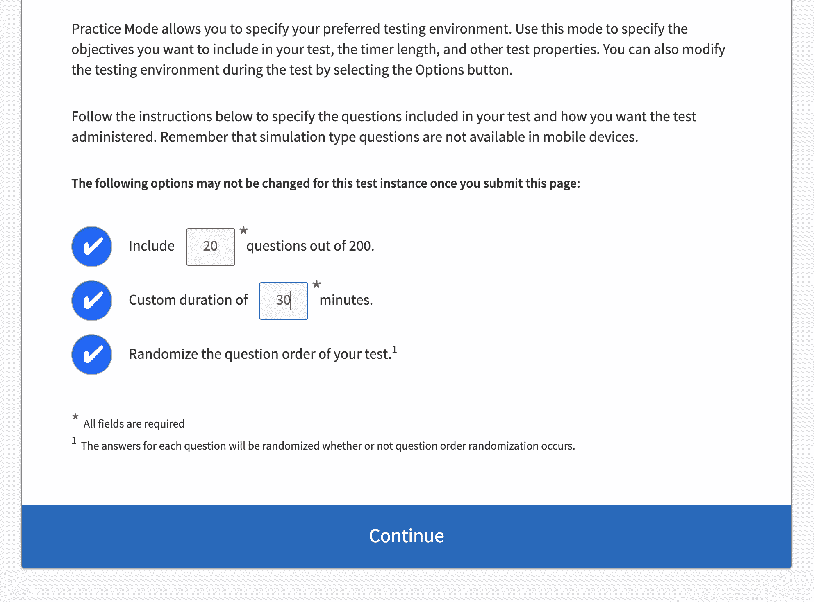

# 如何通过微软的 Azure 数据工程师认证——DP-203 考试指南

> 原文：<https://www.freecodecamp.org/news/how-to-pass-microsoft-azure-data-engineer-certification-dp-203/>

数据工程工作处于[高需求状态](https://insights.dice.com/2019/06/04/data-engineer-remains-top-demand-job/)。获得该科目的证书是学习、深化和证明你技能的好方法。

每个云提供商都提供专门针对其数据工程服务的认证。它们有重量，但不容易通过。

Azure DP-203 是一个很难通过的认证。我花了大约 20 个小时在网上课程上，5 个小时在模拟考试上，大约 5 个小时在阅读上，另外几个小时弄清楚该用什么工具，如何注册，等等。

我的目标是快速传球，我认为我可以比我做得更快。这里有一些关于尽快获得微软 Azure 数据工程师认证的提示。

# 先决条件

我有数据工程的背景，但我不认为这是必需的。如果你没有这方面的背景，那么我建议你看一本关于关键数据工程概念的[入门书](https://www.xplenty.com/blog/etl-data-warehousing-explained-etl-tool-basics/)(OLTP 与 OLAP、数据仓库和数据湖)。

我在上课前也非常熟悉云计算，但对 Azure 的核心服务不是特别熟悉。如果你想要一本关于云计算的入门书，那么微软有一本。

# 如何准备 DP-203 考试

### 在线课程

我用艾伦·罗德里格斯的 Udemy 课程来浏览内容。我喜欢它展示了实际使用的工具，阐明了概念，并包含了考试技巧和练习测试。

来自微软的官方内容看起来也不错。官方的内容是文本和视频的混合，文本的比重更大，而像 Udemy 这样的课程(有很多)大部分是视频。

我建议选择你喜欢的样子，不要过多考虑这个决定。

### 书

我还买了一本书在我的 kindle 上阅读，但我并没有从中获得多少价值，我会说一门课程就足够了。

我建议在选择任何材料之前先检查一下它的最后更新时间，因为课程内容确实会随着时间的推移而变化，而且书籍很快就会过时。我确实发现有阅读材料来补充课程很有帮助，我想这次我只是没有选对书。

### 动手实践

微软在他们的网站上指出了一个教师指导培训的选项，但我没有这样做。在我所学的课程中，我也没有做任何实践实验。

[其他人确实建议](https://dhyanintech.medium.com/how-to-prepare-for-the-azure-data-engineer-associate-certification-4cf122f1937f)亲自动手。我怀疑这取决于你有多少背景知识，以及你是否有信心仅仅通过观看教学内容就掌握了材料。

有些人在看视频时做笔记，以帮助整理思路，确保他们理解。我也没有记笔记，尽管我以前的课程记过。

# 如何为考试练习

我的最高提示是使用[官方实践考试工具](https://uk.mindhub.com/dp-203-data-engineering-on-microsoft-azure-microsoft-official-practice-test/p/MU-DP-203?utm_source=microsoft&utm_medium=certpage&utm_campaign=msofficialpractice)。这是值得的。

我在 Udemy 上使用了模拟测试，它们很有帮助。但是对于这些测试，你只有在完成测试后才能得到反馈。

学习的时候，我喜欢马上找出我错在哪里。如果我直到考试结束才找到答案，那么我必须记住问题的上下文，这需要更多的努力。我还想确保我头脑中的答案是正确的，而不是错误的。为此，最好尽快纠正。

### 官方模拟考试的特点

官方的模拟测试让你选择测试长度，无论你在那个时刻要练习多长时间。你可以配置它是直接告诉你答案还是在最后告诉你答案。

问题的格式与考试相匹配，而这并不是所有的模拟考试网站都有的。考试有一些多部分链接的问题，很多网站不能做到这一点。

### 正式模拟考试入门

购买和登录模拟测试的流程有点混乱。你从微软网站点击进入，从第三方厂商购买([在英国，我所在的地方，这是 mindhub](https://uk.mindhub.com/dp-203-data-engineering-on-microsoft-azure-microsoft-official-practice-test/p/MU-DP-203?utm_source=microsoft&utm_medium=certpage&utm_campaign=msofficialpractice) )。但是你不需要登录，如果你创建了一个，你不能用它来登录测试。

相反，你可以用你的微软或 GitHub 身份登录到[marketplace.measureup.com](https://marketplace.measureup.com/login)并注册一个购买的密钥。

### 练习测试书

我还用了一本练习问答的书。这样我就可以不用笔记本电脑准备考试了。

外面有几本这样的书，我怀疑它们非常相似。它们在质量上不如模拟测试。我发现了一些错误，比如一个回答部分跟在一个不同的问题后面，而不是它所属的问题(可能是 kindle 的东西)。解释也不是很详细，但仍然是有帮助的。

我用的是在一页上有问题和选项的格式，然后在下一页上有答案。我会推荐用这样的书。

### 我瞄准的主题

有一些话题值得弄清楚，因为在我看来，它们出现得很多，而且问题的形式也大多相似。对我来说最突出的是:

*   存储层。如果你知道热，冷，存档，你会得到一些分数。
*   星形模式。
*   渐变维度类型。维基百科对此解释得很好。
*   Synapse 专用表的分发。预计会被问到一个带有大事实表和小维度表的问题。维度表将需要复制分布，而大事实表将通过在连接中使用的一些外键类型列上的散列进行散列分布。
*   Synapse(添加了一些处理功能的仓库)、流分析(实时处理)、数据湖(大规模非结构化存储)、数据工厂(ETL)和 Databricks(托管 Spark plus 笔记本、ML 和 delta lake)之间的区别。
*   何时使用拼花、Avro、Json 和 CSV 格式。(答案几乎总是 parquet 最适合大规模查询数据，但他们也想确保您知道 avro 适合带时间戳的数据。)
*   使用 Spark 写入文件或流的语法。

对我来说，这些是我觉得可以依靠的话题。在练习之后，我对其他的主题很有信心，但是对于一些主题，有很多不同的方法可以解决问题。对于这些，我觉得我可以看到模式，它们是相当可预测的。有些问题你可以凭记忆做，而不必想太多，这令人放心。

### 学会分析问题

学习如何阅读和分析问题是一种技能。这些问题通常包含一些与场景相关的细节(例如，它是一家食品杂货公司)和一些指向答案的线索(例如，他们的销售事务表的大小)。

我不总是能从第一次阅读中识别出问题的方向，所以我发现快速浏览答案很有用。然而，这很危险，因为这样你可能会发现一些你认识的东西，并把它和一条线索匹配起来，然后抓住它。但是这些问题可能需要收集多种线索。

如果可以的话，你想消除错误的答案(如果你想快速完成，这是很棘手的)。有时也有多个正确答案可供选择，当有两个正确答案时，如果你只选择一个，你会错过分数(问题确实会告诉你什么时候应该选择多个，但如果你匆忙或疲劳，很容易错过)。

这就是我推荐官方模拟考试工具的原因——它对学习问题的格式和阅读技巧很有帮助。

# 何时着手解决真正的问题

### 我能全部学会吗？

考试的范围太广了，很难真正做到面面俱到。你甚至会偶尔遇到一些通配符问题，这些问题引入了与数据无关的 Azure 服务。

当这种情况发生时，如果你不知道这些服务，只要你对数据服务足够清楚，你通常可以猜出来。

Cosmos DB 是 Azure 数据栈的一个新部分。这不是现在教学大纲的明确部分，但考试范围很广，它确实在蔓延。了解一点这方面的知识是值得的，但不要沉迷于学习它的所有细节。

如果你真的尝试学习所有可能出现的东西，那么你会有很多东西要学。

Databricks 本身就很庞大。你不需要知道任何数据块机器学习的东西。你基本上只需要知道如何设置集群，使用 Spark 在 Azure 存储中处理文件，认证以及 Databricks 和其他 Azure 服务之间的差异，这些服务恰好具有 Spark 的特色(Synapse 和 HDInsights)。

### 我什么时候准备好了？

如果你在模拟考试中一直表现很好，你已经掌握了猜测的诀窍，并且可以很快做出猜测，那么你就可以试一试了。

但是这也是关于你的舒适程度——在你感觉准备好之前，不要让我(或任何人)催促你去做。

# 如何应对考试

### 结构和时间

每个问题你没有太多时间。对我来说，这是 100 分钟 65 个问题。考试总时间超过 100 分钟，但 100 分钟是你回答问题的时间。

有些问题在答案中每个选项有不止一个分数，所以你得到的问题数量可能会有所不同(我相信可用分数保持不变)。

基本上期望每 90 秒左右回答大致一个问题。但是第一次练习的时候不要担心时间。通过练习你会变得更快。

我实际上没有完成所有的问题。我以为 60 题左右就做完了，开始复习答案。然后我意识到我必须点击进入一个单独的案例研究部分。这发生在最后，虽然有指导，但我并不觉得它非常清楚。虽然它不是一个很大的部分，但我并没有错过很多分数。

### 在线监考 vs 考试中心

传统上，这种认证考试是在考试中心的监督下进行的。现在网上监考的版本很流行。这是我第一次在线监考。

当我第一次看到在线监考的指导时，我觉得它听起来很复杂。我知道在考试中心，房间里会一直有人，他们会监视着，以防有人偷偷带笔记进来。我一直在想，你怎么能在网上监考的考试中复制这一点呢？

在线监考考试有一些关于保持房间整洁和显示你没有任何笔记的说明。这些让我很困惑，有一段时间我认为我需要再买一个网络摄像头来显示我的房间是干净的，并且我在任何时候都没有任何笔记。

但其实简单多了。我只需要在开始时拍摄房间的照片(使用发送的链接)并保持在我的主网络摄像头上(内置摄像头就足够了)。所以一开始只是检查一下房间，然后你只需要保持在网络摄像头上。

## 祝你好运！

希望这个建议对你有帮助，祝你好运！欢迎通过 Twitter 向我提问[。](https://twitter.com/ryandawsongb)