# 启发你的 15 个网站开发者作品集

> 原文：<https://www.freecodecamp.org/news/15-web-developer-portfolios-to-inspire-you-137fb1743cae/>

作为一名新开发人员，最难做的事情之一是组织一个网上作品集。

*   我该说什么？
*   我应该包括什么？
*   我应该遗漏什么？

但是事情并不一定是那样的。

如果你陷入了困境，看看这 15 个网页开发者作品集的样本，从中寻找灵感。(如果你想要更多关于建立投资组合的指导，[看这里](https://portfoliodojo.com/)。)

### 1.马特·法利

#### 马特弗利

**他做什么** : UX/UI 和前端开发

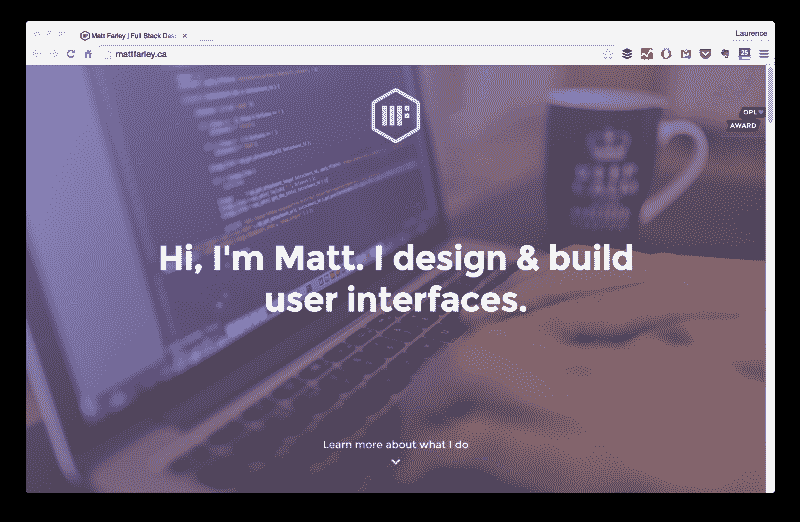

### 2.德扬·马尔科维奇

#### [德扬作品](https://www.dejan.works/)

**他做什么:** UX 和 UI 设计

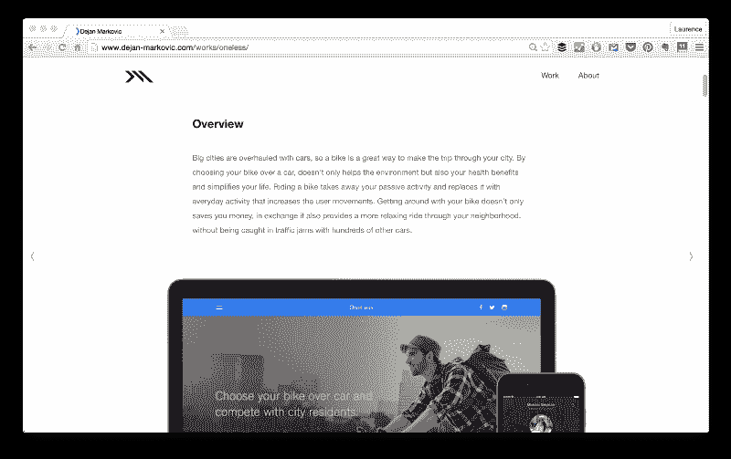

### 3\. Rafael **Caferati**

#### [caferati.me](https://caferati.me/)

**他做什么:**前端、后端和 UX

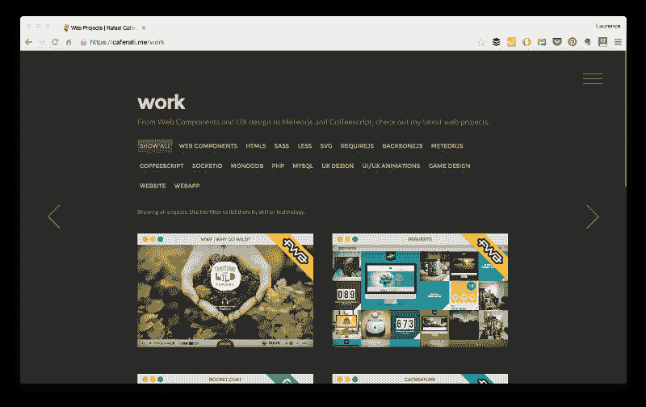

### 4.艾米莉·里奇

#### [www.emilyridge.ie](http://www.emilyridge.ie/)

她的职业: WordPress 开发者和设计师

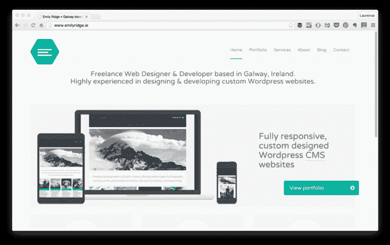

### 5.伊恩·伦恩

#### [ianlunn.co.uk](http://ianlunn.co.uk/)

**他做什么:**网页设计和前端开发

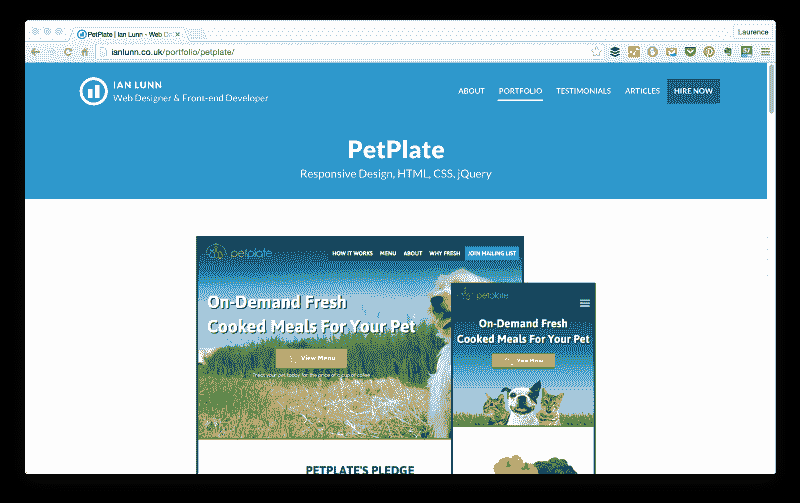

### 6.皮埃尔·内尔

#### [皮埃尔。我](http://pierre.io/)

**他做什么:**设计、前端、后端等等

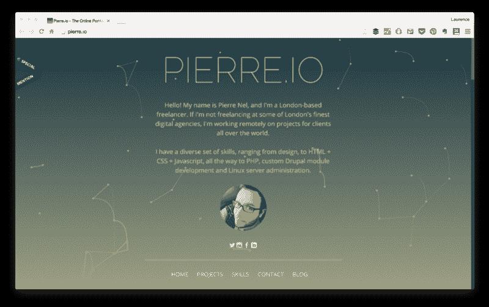

### 7.Timmy **O'Mahony**

#### [timmyomahony.com](http://timmyomahony.com/)

**他做什么:** Django 开发者

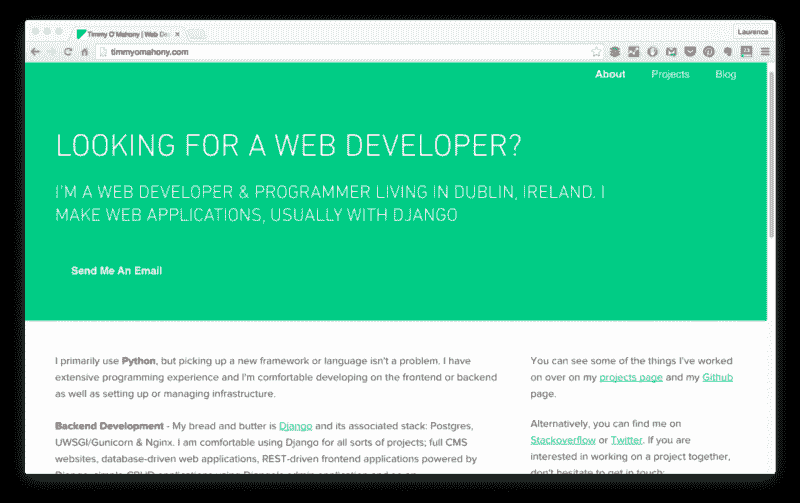

### 8.丹尼斯·钱德勒

#### [www.denisechandler.com](http://www.denisechandler.com/)

她的职业:网页设计、开发等

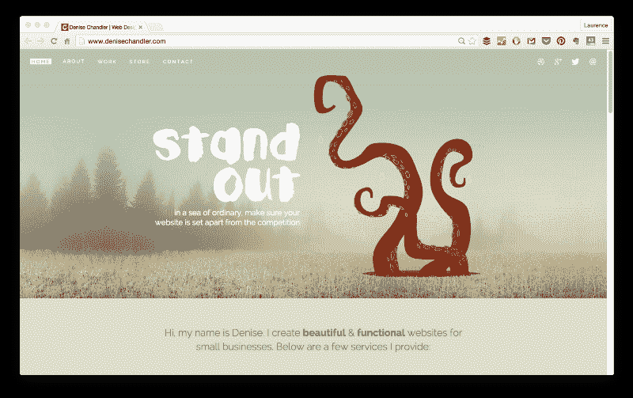

### 9.我是亚当

#### [benadam.me](http://benadam.me/)

**他做什么:** UX/UI 设计和前端开发

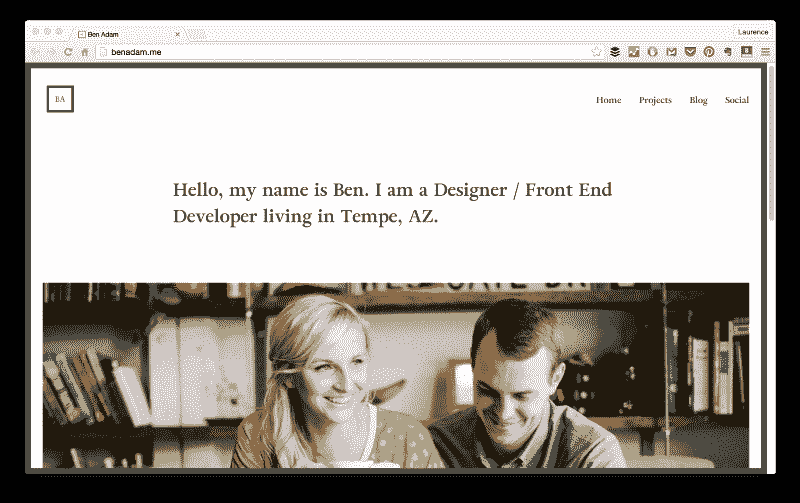

### 10.丹尼尔·费舍尔

#### www . danielphish . com

**他做什么:**前端、后端(Ruby on Rails)等等

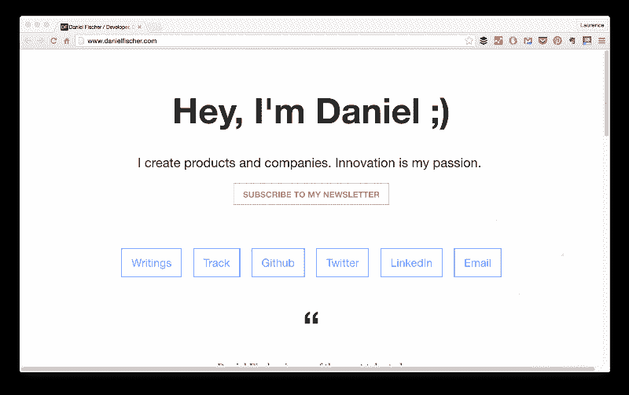

### 11.塞布·凯

#### [sekay . com](http://sebkay.com/)

他做什么:网页设计和 WordPress 开发

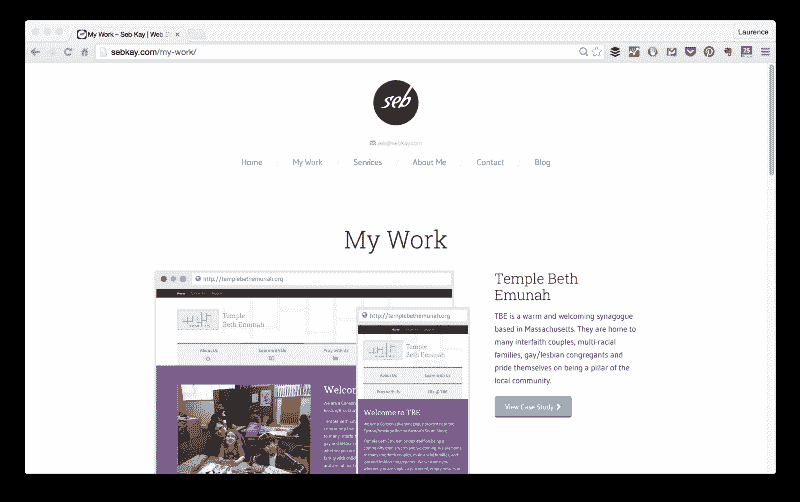

### 12.乔尼·马奇亨

#### [www.jonny.me](http://www.jonny.me/)

**他做什么:**前端开发

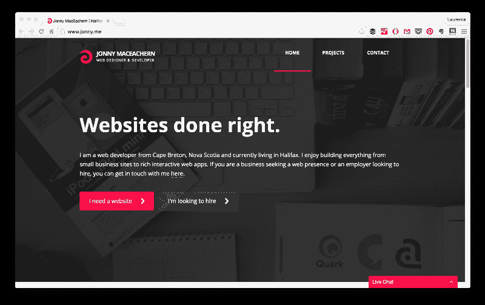

### 13.凯瑟琳·麦克林托克

#### [www.kathrynmcclintock.com](http://www.kathrynmcclintock.com/)

她的职业: Drupal 开发人员

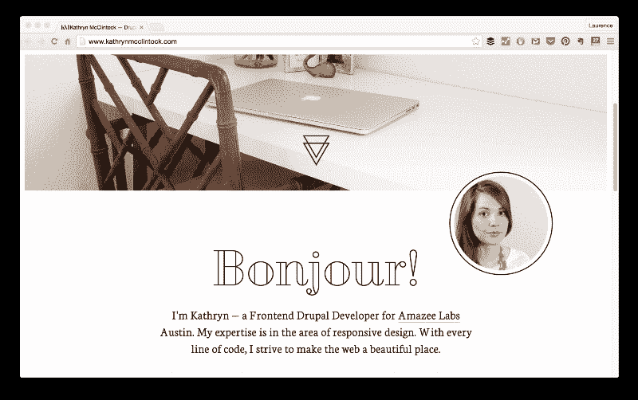

### 14.杰克·杰兹纳赫

#### [jacekjeznach.com](http://jacekjeznach.com/)

**他做什么:**前端和 WordPress 开发

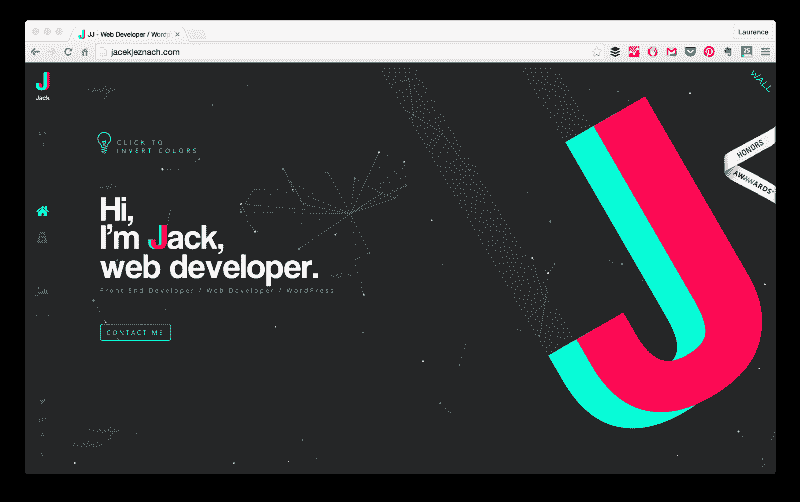

### 15.哪些开发者做出了你喜爱的作品集？

到处都有灵感——希望这篇文章能帮助你找到你的灵感！

想知道如何创建一流的投资组合吗？点击这里获取我的免费 7 步小抄，打造一份出色的投资组合。