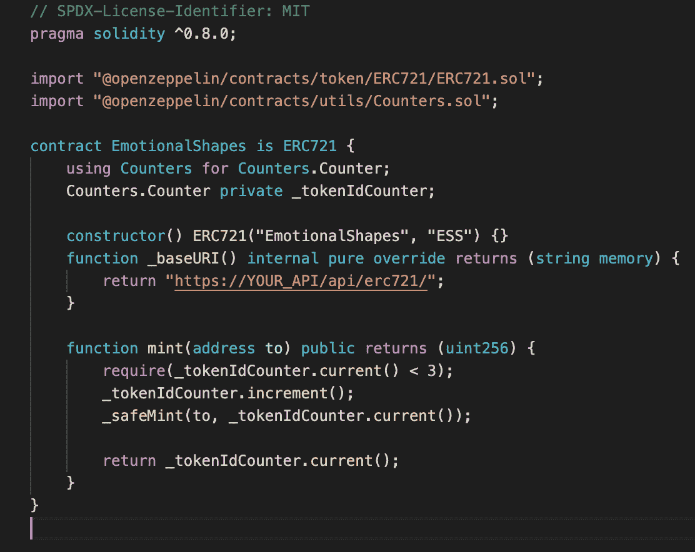
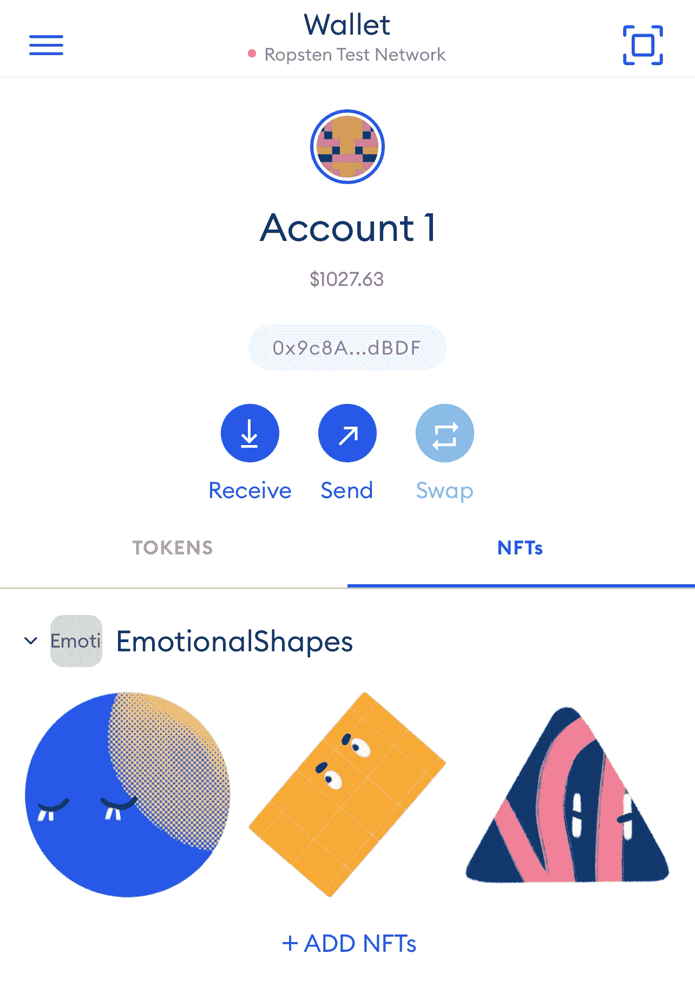
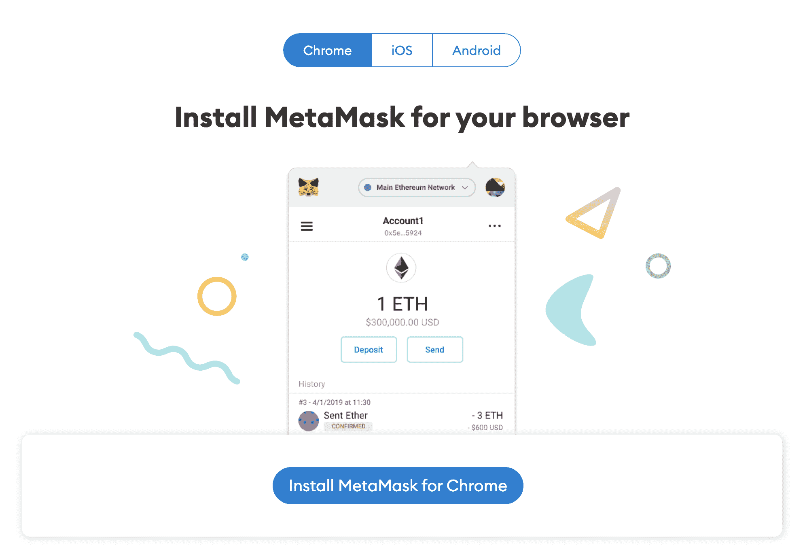
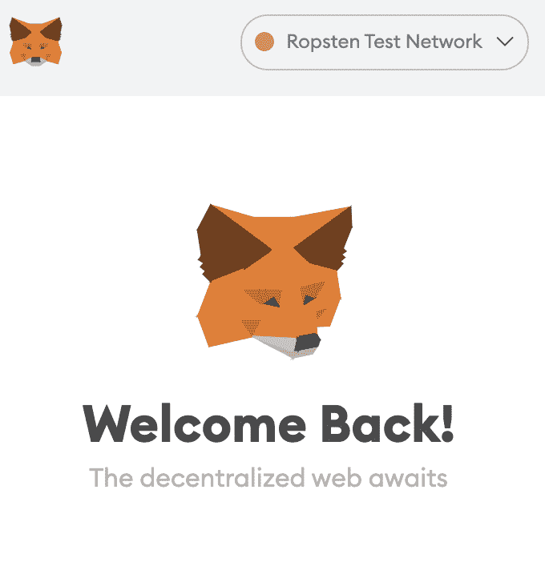
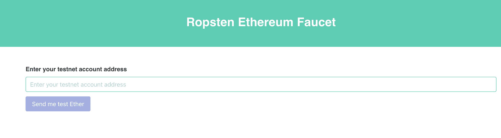
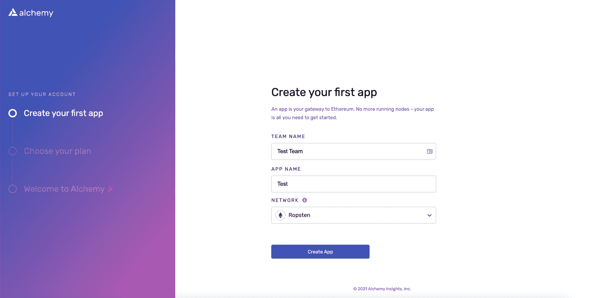
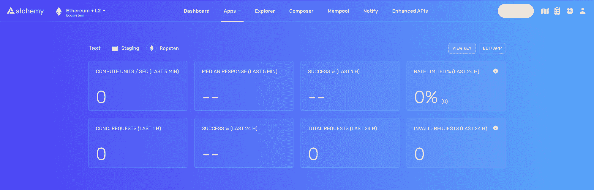
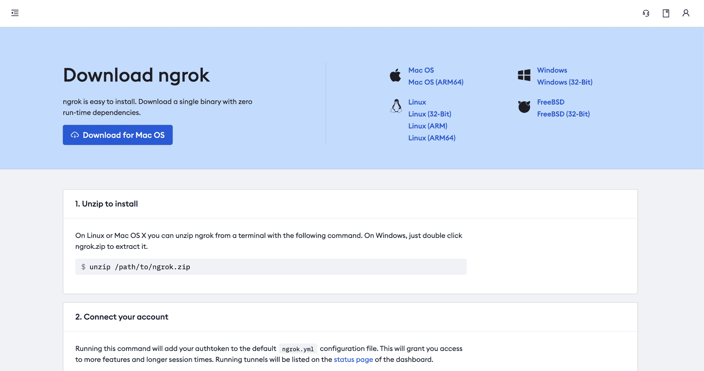
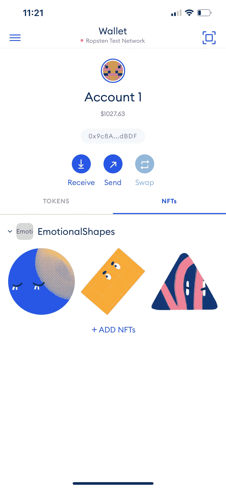

# 如何用 14 行代码制作一个 NFT

> 原文：<https://www.freecodecamp.org/news/how-to-make-an-nft/>

如果你是一名对区块链开发感兴趣的开发人员，你应该了解一些关于 NFTs 或不可替代令牌的知识。因此，在本文中，我们将了解它们背后的工程，以便您可以开始构建自己的产品。

在项目结束时，你将拥有自己的以太坊钱包，里面有一个新的 NFT。本教程是初学者友好的，不需要任何以太坊网络或智能合约的知识。



The NFT contract has only 14 lines of code

## 什么是 NFT？

NFT 代表不可替代的令牌。ethereum.org 的这句话很好地解释了这一点:

> NFT 是我们可以用来表示唯一项目所有权的令牌。他们让我们将艺术品、收藏品、甚至房地产等事物符号化。它们在同一时间只能有一个官方所有者，并且由以太坊区块链保护——没有人可以修改所有权记录或者复制/粘贴一个新的 NFT。

## 什么是 NFT 标准或 ERC-721？

ERC-721 是最常见的 NFT 标准。如果您的智能合约实现了某些标准化的 API 方法，它可以被称为 ERC-721 不可替换令牌合约。

这些方法在 [EIP-721](https://eips.ethereum.org/EIPS/eip-721) 中有详细说明。像 OpenZeppelin 这样的开源项目通过将最常见的 ERC 标准实现为可重用的库，简化了开发过程。

## 什么是铸造 NFT？

通过铸造 NFT，你在区块链上发布了一个独特的令牌。这个令牌是您的智能合约的一个实例。

每个令牌都有一个惟一的 tokenURI，它包含符合特定模式的 JSON 文件中资产的元数据。元数据是存储 NFT 信息的地方，例如名称、影像、描述和其他属性。

“ERC721 元数据模式”的 JSON 文件示例如下:

```
{
	"attributes": [
		{
			"trait_type": "Shape",
			"value": "Circle"
		},
		{
			"trait_type": "Mood",
			"value": "Sad"
		}
	],
	"description": "A sad circle.",
	"image": "https://i.imgur.com/Qkw9N0A.jpeg",
	"name": "Sad Circle"
}
```

## 如何存储我的 NFT 的元数据？

存储 NFT 元数据有三种主要方式。

首先，你可以存储链上的信息。换句话说，您可以扩展您的 ERC-721 并将元数据存储在区块链上，这可能会很昂贵。

第二种方法是使用 [IPFS](https://docs.ipfs.io/concepts/what-is-ipfs/) 。第三种方法是让 API 返回 JSON 文件。

第一种和第二种方法通常是首选，因为您不能调节底层 JSON 文件。对于这个项目的范围，我们将选择第三种方法。

要获得一个关于在 IPFS 中使用 NFTs 的好教程，请阅读 Alchemy 团队的这篇文章。

## 我们将会建造什么



在本教程中，我们将创建和铸造我们自己的 NFT。它是初学者友好的，不需要任何以太坊网络或智能合同的知识。不过，很好地掌握这些概念将有助于您理解幕后发生的事情。

在接下来的教程中，我们将构建一个全功能的 React web 应用程序，您可以在其中展示和销售您的 NFT。

如果你刚刚开始 dApp 开发，先通读[关键主题](https://ethereum.org/en/developers/docs/intro-to-ethereum/)并观看 Patrick Collins 的这个[惊人课程](https://www.youtube.com/watch?v=M576WGiDBdQ)。

这个项目是有意用容易理解的代码编写的，不适合生产使用。

## 先决条件

### Metamask



我们需要一个以太坊地址来与我们的智能合约交互。我们将使用[元掩码](https://metamask.io/)作为我们的钱包。这是一个免费的虚拟钱包，管理你的以太坊地址。我们将需要它来发送和接收事务(在这里阅读更多关于 T2 的内容)。例如，铸造 NFT 就是一种交易。

下载他们的 Chrome 扩展和移动应用程序。我们需要这两个，因为 Chrome 扩展不显示你的 NFTs。



出于开发目的，请确保将网络更改为“Ropsten 测试网络”。你需要一些 Eth 来支付部署和铸造 NFT 的费用。前往 [Ropsten 以太坊水龙头](https://faucet.ropsten.be/)并输入您的地址。你应该很快会在你的 Metamask 账户中看到一些测试 Eth。



### 魔力

要与以太坊网络交互，您需要连接到以太坊节点。

运行自己的节点和维护基础设施本身就是一个项目。幸运的是，有节点即服务提供商为您托管基础架构。有许多选择，如 Infura、BlockDaemon 和 Moralis。我们将使用 [Alchemy](https://www.alchemy.com/) 作为我们的节点提供商。

访问他们的网站，创建一个帐户，选择以太坊作为你的网络，并创建你的应用程序。选择 Ropsten 作为您的网络。



在您的仪表盘上，点击应用程序上的“查看详细信息”，然后点击“查看密钥”。将您的 http 密钥保存在某个地方，因为我们稍后会用到它。



### NodeJS/NPM

我们将在项目中使用 NodeJS。如果你还没有安装它，[跟随 freeCodeCamp 的这个简单教程](https://www.freecodecamp.org/news/how-to-install-node-in-your-machines-macos-linux-windows/)。

## 初始化项目

在您的终端中，运行以下命令为您的项目创建一个新目录:

```
mkdir nft-project
cd nft-project
```

现在，让我们在`nft-project/`中创建另一个目录`ethereum/`，并用 [Hardhat](https://hardhat.org/getting-started/) 初始化它。Hardhat 是一个开发工具，它使得部署和测试你的以太坊软件变得容易。

```
mkdir ethereum
cd ethereum
npm init 
```

随便你怎么回答问题。然后，运行这些命令来创建一个 Hardhat 项目:

```
npm install --save-dev hardhat
npx hardhat
```

您将看到以下提示:

```
888    888                      888 888               888
888    888                      888 888               888
888    888                      888 888               888
8888888888  8888b.  888d888 .d88888 88888b.   8888b.  888888
888    888     "88b 888P"  d88" 888 888 "88b     "88b 888
888    888 .d888888 888    888  888 888  888 .d888888 888
888    888 888  888 888    Y88b 888 888  888 888  888 Y88b.
888    888 "Y888888 888     "Y88888 888  888 "Y888888  "Y888

Welcome to Hardhat v2.0.8

? What do you want to do? …
  Create a sample project
❯ Create an empty hardhat.config.js
  Quit
```

选择创建一个空的 hardhat.config.js。这将生成一个空的`hardhat.config.js`文件，我们稍后将对其进行更新。

对于 web 应用，我们将使用 [Next.js](https://nextjs.org/docs/getting-started) 来初始化一个全功能的 web 应用。回到根目录`nft-project/`并初始化一个名为 web:

```
cd ..
mkdir web
cd web
npx create-next-app@latest
```

您的项目现在看起来像这样:

```
nft-project/
	ethereum/
	web/
```

厉害！我们已经准备好开始真正的编码了。

## 如何定义我们的？环境变量

还记得我们之前从测试项目中拿到的炼金术钥匙吗？我们将使用它以及元掩码帐户的公钥和私钥与区块链进行交互。

运行以下命令，在您的`ethereum/`目录下创建一个名为`.env`的文件，并安装 [dotenv](https://www.npmjs.com/package/dotenv) 。我们稍后会用到它们。

```
cd ..
cd ethereum
touch .env
npm install dotenv --save
```

对于你的`.env`文件，输入你从 Alchemy 导出的密钥，然后[按照这些指令](https://metamask.zendesk.com/hc/en-us/articles/360015289632-How-to-Export-an-Account-Private-Key)获取你的元蒙版私钥。

这是你的。环境文件:

```
DEV_API_URL = YOUR_ALCHEMY_KEY
PRIVATE_KEY = YOUR_METAMASK_PRIVATE_KEY
PUBLIC_KEY = YOUR_METAMASK_ADDRESS
```

## NFTs 的智能合约

转到`ethereum/`文件夹，再创建两个目录:contracts 和 scripts。一个简单的安全帽项目包含这些文件夹。

*   包含您的合同的源文件
*   包含部署和创建我们的 NFT 的脚本

```
mkdir contracts
mkdir scripts 
```

然后，安装 OpenZeppelin。 [OpenZeppelin Contract](https://docs.openzeppelin.com/contracts/4.x/) 是一个开源库，带有预先测试的可重用代码，使智能合约开发更加容易。

```
npm install @openzeppelin/contracts
```

最后，我们将为我们的 NFT 编写智能合同。导航到您的合同目录并创建一个名为`EmotionalShapes.sol`的文件。你可以给你的 NFT 起任何你认为合适的名字。

`.sol`扩展指的是 Solidity 语言，我们将用它来编写我们的智能契约。我们将只编写 14 行代码，所以如果你以前没看过，不用担心。

从本文开始，了解更多关于智能合同语言的信息。你也可以直接跳到这个包含主要语法的可靠的[备忘单](https://reference.auditless.com/cheatsheet/)。

```
cd contracts
touch EmotionalShapes.sol
```

这是我们的智能合同:

```
// SPDX-License-Identifier: MIT
pragma solidity ^0.8.0;

import "@openzeppelin/contracts/token/ERC721/ERC721.sol";
import "@openzeppelin/contracts/utils/Counters.sol";

contract EmotionalShapes is ERC721 {
    using Counters for Counters.Counter;
    Counters.Counter private _tokenIdCounter;

    constructor() ERC721("EmotionalShapes", "ESS") {}

    function _baseURI() internal pure override returns (string memory) {
        return "YOUR_API_URL/api/erc721/";
    }

    function mint(address to)
        public returns (uint256)
    {
        require(_tokenIdCounter.current() < 3); 
        _tokenIdCounter.increment();
        _safeMint(to, _tokenIdCounter.current());

        return _tokenIdCounter.current();
    }
} 
```

让我们浏览一下代码，了解一下是怎么回事。

1.  在文件的顶部，我们指定了要导入哪个 OpenZeppelin 模块。我们需要 ERC721 合约，因为它是我们智能合约的基础。它已经实现了 [EIP-721](https://eips.ethereum.org/EIPS/eip-721) 中指定的所有方法，所以我们可以安全地使用它。
2.  计数器有助于为我们的 NFT 生成增量 id。我们将这个变量命名为`_tokenIdCounter`
3.  在构造函数中，我们用它的名字和符号初始化了 ERC721。我选择了情感形状和 ESS。
4.  我们通过返回自己的函数来覆盖默认的`_baseURI`函数。我们一会儿就能造出来。总之，URL 将作为“前缀”添加到我们所有的 tokenURIs 中。在上面的例子中，我们的 NFTs 的元数据将在`YOUR_API_URL/[api/erc721/](https://e110-99-121-58-31.ngrok.io/api/erc721/)1`保存在一个 JSON 文件中。
5.  我们实现了“铸币”功能。该函数允许您在区块链上发布此智能合约的实例。我要求`_tokenIdCounter`变量小于 3，因为我将只创建我的 NFT 的三个实例。如果你想多做点，可以把它去掉。
6.  最后，在 mint 函数中，我们将`_tokenIdCounter` 变量递增 1，因此我们的 id 将是 1，接着是 2，接着是 3。然后，我们调用 OpenZeppelin `_safeMint`提供的函数来发布令牌。

如果你感到失落，不要担心。你可以参加由来自 freeCodeCamp 的志愿者领导的研讨会，在那里我们邀请相似技能水平的开发者一起构建东西，包括这个 NFT 项目。

这些活动是免费和远程的，所以你可以直接问任何问题。可以在这里注册[。座位有限，所以您将被邀请参加下一个活动。](https://equia.io)

## 如何为我们的 NFT 构建元数据

如前所述，存储 tokenURI 有三种主要方式。我们将构建一个简单的 API 端点，它将 NFT 的信息解析为 JSON。

我们的 Next.js 项目为我们提供了一种开发 API 路由的简便方法。进入`web/`文件夹，在`pages/`文件夹中找到`api/`文件夹，在`erc721/`文件夹中制作我们的动态`[id].js`路线(点击阅读更多关于路线[):](https://www.freecodecamp.org/news/p/18513919-9e93-4ab3-9f52-2448aafa8835/develop%20API%20routes)

```
// web/pages/api/erc721/[id].js

const metadata = {
  1: {
    attributes: [
      {
        trait_type: "Shape",
        value: "Circle",
      },
      {
        trait_type: "Mood",
        value: "Sad",
      },
    ],
    description: "A sad circle.",
    image: "https://i.imgur.com/Qkw9N0A.jpeg",
    name: "Sad Circle",
  },
  2: {
    attributes: [
      {
        trait_type: "Shape",
        value: "Rectangle",
      },
      {
        trait_type: "Mood",
        value: "Angry",
      },
    ],
    description: "An angry rectangle.",
    image: "https://i.imgur.com/SMneO6k.jpeg",
    name: "Angry Rectangle",
  },
  3: {
    attributes: [
      {
        trait_type: "Shape",
        value: "Triangle",
      },
      {
        trait_type: "Mood",
        value: "Bored",
      },
    ],
    description: "An bored triangle.",
    image: "https://i.imgur.com/hMVRFoJ.jpeg",
    name: "Bored Triangle",
  },
};

export default function handler(req, res) {
  res.status(200).json(metadata[req.query.id] || {});
}
```

为了这个项目，我使代码尽可能容易理解。这绝对不适合生产(请不要为您的 NFT 使用 Imgur url)。确保为您想要创建的所有 NFT 定义元数据。

现在，转到 web 目录，使用以下命令启动 Next.js 应用程序:

```
npm run dev
```

你的应用应该运行在 localhost:3000 上。为了确保我们的端点正常工作，请访问[http://localhost:3000/API/ERC 721/1](http://localhost:3000/api/erc721/1)，它应该会解析出第一个 NFT 元数据的 JSON 对象。

## 如何为我们的 NFT 公开元数据

由于您的应用程序托管在本地，因此其他应用程序无法访问它。使用类似于 [ngrok](https://ngrok.com/) 的工具，我们可以将本地主机暴露给一个可公开访问的 URL。



1.  前往[ngrok.com](https://ngrok.com/)完成注册流程
2.  解压缩下载的包
3.  在您的终端中，确保您将 cd 放入解压缩 ngrok 包的文件夹中
4.  按照仪表盘上的指示跑步

```
./ngrok authtoken YOUR_AUTH_TOKEN
```

5.然后，运行这个命令来创建一个到本地主机 3000 上的 web 应用程序的隧道

```
./ngrok http 3000
```

6.你就快到了！在您的终端上，您应该看到类似这样的内容:

```
ngrok by @inconshreveable                                                                            (Ctrl+C to quit)

Session Status                online                                                                                 
Account                       YOUR_ACCOUNT (Plan: Free)                                                                       
Version                       2.3.40                                                                                 
Region                        United States (us)                                                                     
Web Interface                 http://127.0.0.1:4040                                                                  
Forwarding                    http://YOUR_NGROK_ADDRESS -> http://localhost:3000                             
Forwarding                    https://YOUR_NGROK_ADDRESS -> http://localhost:3000 
```

转到`YOUR_NGROK_ADDRESS/api/erc721/1`以确保您的终端正常工作。

## 如何部署我们的 NFT

现在我们已经完成了所有的基础工作(oof ),让我们回到我们的`ethereum/`文件夹，准备部署我们的 NFT。

改变你的`ethreum/contracts/YOUR_NFT_NAME.sol`文件*中的`_baseURI`函数，返回你的 ngrok 地址。*

```
// ethereum/conrtacts/EmotionalShapes.sol

contract EmotionalShapes is ERC721 {
...
	function _baseURI() internal pure override returns (string memory) {
		return "https://YOUR_NGROK_ADDRESS/api/erc721/";
	}
...
}
```

要部署我们的 NFT，我们首先需要使用 Hardhat 来[编译它。为了使这个过程更容易，我们将安装](https://hardhat.org/guides/compile-contracts.html) [ethers.js](https://docs.ethers.io/v5/) 。

```
npm install @nomiclabs/hardhat-ethers --save-dev
```

让我们更新我们的 hardhat.config.js:

```
require("dotenv").config();
require("@nomiclabs/hardhat-ethers");

module.exports = {
  solidity: "0.8.0",
  defaultNetwork: "ropsten",
  networks: {
    hardhat: {},
    ropsten: {
      url: process.env.DEV_API_URL,
      accounts: [`0x${process.env.PRIVATE_KEY}`],
    },
  },
}; 
```

要了解更多关于 hardhat 配置文件的信息，请看一下他们的[文档](https://hardhat.org/config/)。我们已经用我们的 Alchemy URL 配置了 ropsten 网络，并向它提供了您的元掩码帐户的私钥。

最后，运行:

```
npx hardhat compile
```

这让 hardhat 为每个编译的契约生成两个文件。我们应该会看到一个新创建的`artifacts/`文件夹，其中包含您在`contracts/`文件夹中编译的合同。要了解这是如何工作的更多信息，请阅读安全帽团队的[教程](https://hardhat.org/guides/compile-contracts.html)。

现在，让我们编写一个脚本，最终将我们的 NFT 部署到测试网络中。在您的`scripts/`文件夹中，创建一个名为`deploy.js`的文件。

```
// ethereum/scripts/deploy.js

async function main() {
  const EmotionalShapes = await ethers.getContractFactory("EmotionalShapes");
  const emotionalShapes = await EmotionalShapes.deploy();

  console.log("EmotionalShapes deployed:", emotionalShapes.address);
}

main()
  .then(() => process.exit(0))
  .catch((error) => {
    console.error(error);
    process.exit(1);
  }); 
```

这段代码的灵感来自于[的安全帽部署教程](https://hardhat.org/guides/deploying.html)。

> ethers.js 中的`ContractFactory`是用于部署新智能契约的抽象，所以这里的`EmotionalShapes`是我们令牌契约实例的工厂。在`ContractFactory`上调用`deploy()`将启动部署，并返回解析为`Contract`的`Promise`。这个对象为您的每个智能合约函数提供了一个方法。

### 如何观赏区块链上的 NFT

运行部署脚本:

```
node ./scripts/deploy.js
```

您应该会在您的终端`EmotionalShapes deployed: SOME_ADDRESS`中看到。这是您的智能合约在 ropsten 测试网络上部署的地址。

如果你前往`https://ropsten.etherscan.io/address/SOME_ADDRESS`，你应该会看到你新部署的 NFT。是啊！你做到了！

如果你被困在教程中的某个地方或者感到迷失，你可以[加入我们的现场研讨会](https://equia.io)，在那里我们将一起构建这个项目。

## 如何铸造你的 NFT

既然您已经部署了您的 NFT，是时候为自己铸造它了！在您的脚本/文件夹中创建一个名为`mint.js`的新文件。我们将使用 ethers.js 来帮助我们。

从添加`ethers.js`包开始:

```
npm install --save ethers
```

然后，填充`mint.js`文件:

```
require("dotenv").config();
const { ethers } = require("ethers");

const contract = require("../artifacts/contracts/EmotionalShapes.sol/EmotionalShapes.json");
const contractInterface = contract.abi;

// https://docs.ethers.io/v5/api/providers
const provider = ethers.getDefaultProvider("ropsten", {
  alchemy: process.env.DEV_API_URL,
});

// https://docs.ethers.io/v5/api/signer/#Wallet
const wallet = new ethers.Wallet(process.env.PRIVATE_KEY, provider);

//https://docs.ethers.io/v5/api/contract/contract
const emotionalShapes = new ethers.Contract(
  YOUR_NFT_ADDRESS,
  contractInterface,
  wallet
);

const main = () => {
  emotionalShapes
    .mint(process.env.PUBLIC_KEY)
    .then((transaction) => console.log(transaction))
    .catch((e) => console.log("something went wrong", e));
};

main(); 
```

我在这里留下了评论，你可以找到更多关于不同方法的信息。我们首先抓取契约的接口(ABI)。来自以太坊网站:

> 应用程序二进制接口，或 ABI，是在以太坊生态系统中与[合同](https://ethereum.org/en/glossary/#contract-account)进行交互的标准方式，无论是从区块链外部还是合同到合同的交互。

你的 ABI 定义了其他人如何与你的合同互动。然后，我们用炼金术创建了我们的提供者(记住节点即服务)。最后，我们用我们的私钥初始化我们的钱包。

`main()`函数调用我们刚刚部署的智能契约中的`mint`方法。`mint`方法只有一个参数`to`，它指示令牌的接收者。因为我们是为自己造币，所以我们把 Metamask 帐户的公共地址。

如果一切顺利，您应该会看到终端中记录的事务。抢到`hash`属性，去`https://ropsten.etherscan.io/tx/YOUR_HASH`。你应该看到那里的铸造交易！

## 如何查看 Metamask 钱包中的 NFT

你需要从下载手机版 Metamask 开始。然后，登录您的帐户。

您应该会看到一个 NFTs 选项卡和一个添加 NFT 按钮。点击按钮，并输入您的智能合同地址以及您制作的 id。如果你已经跟随教程，你应该从一个 id`1`开始。



View NFTs in your Metamask wallet

## 结论

恭喜你！你刚刚铸造了你自己的 NFT。在项目的下一部分，我们将构建前端 React 应用程序来与我们的合同进行交互。最终目标是建立一个功能齐全的 web 应用程序，在那里你可以销售你自己的 NFTs。

最后，你可以[与来自 freeCodeCamp 的志愿者一起参加我们的现场研讨会](https://equia.io)，在那里我们将与其他开发者一起构建这个项目。

这些活动对世界各地的所有人都是免费的，邀请函以先到先得的方式发送。如果你想主持研讨会，请在 Twitter 上给我发消息[，我们非常欢迎你的加入！我们还组织其他类型的活动，如招聘会和社交聚会。](https://twitter.com/aly4alyssa)

让我知道你想建立什么。NFT 仍处于起步阶段，新颖的想法非常受欢迎。迫不及待地想看看你有什么疯狂的想法！