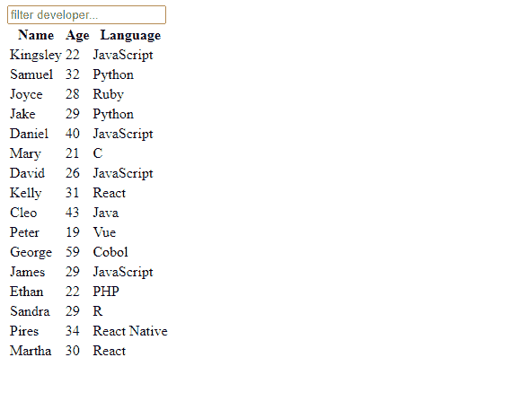
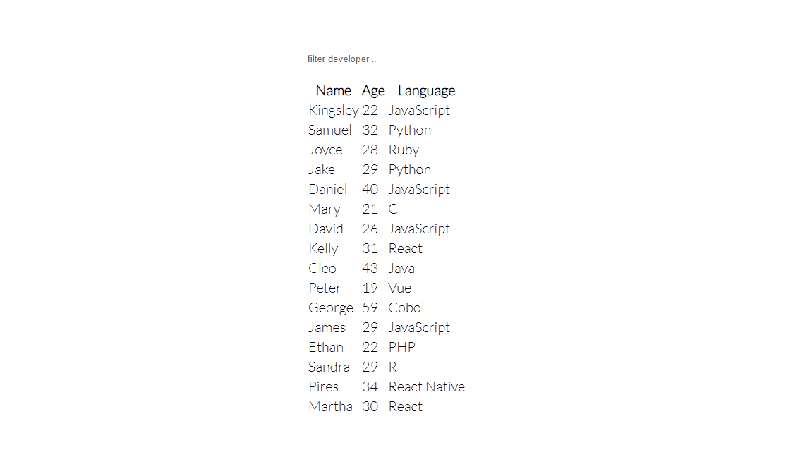
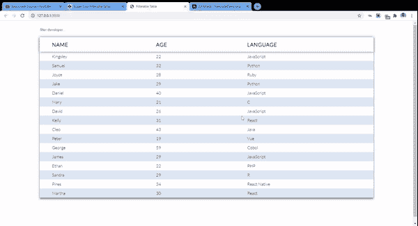

# 如何使用 HTML、CSS 和 JavaScript 构建具有过滤功能的响应式表单

> 原文：<https://www.freecodecamp.org/news/build-a-responsive-filterable-form-with-css-and-javascript/>

大多数在表格中显示数据列表的站点通常都实现了某种筛选功能。这有助于用户根据他们在表单输入中键入的文本过滤相关项目。

在本快速教程中，我们将构建一个如下所示的响应可过滤表:


A responsive table filtered by programming language

该表将包含开发人员列表。每一行都包含姓名、年龄和编程语言。当用户在输入字段中键入内容时，该表将过滤并返回与输入值匹配的行。

在构建过程中，您将了解一些 CSS 属性以及用 JavaScript 进行 DOM 访问/操作。

你可以从 [CodePen](https://codepen.io/ubahthebuilder/pen/RwgdLoj) 中获得示例代码。

## 入门指南

您需要在项目文件夹中创建三个简单的文件。它们是 HTML 标记的`index.html`、样式的`styles.css`和脚本的`index.js`。

```
<!DOCTYPE html>
<html lang="en">
<head>
  <meta charset="UTF-8">
  <meta name="viewport" content="width=device-width, initial-scale=1.0">
  <meta http-equiv="X-UA-Compatible" content="ie=edge">
  <title>Filterable Table</title>
  <link rel="stylesheet" href="styles.css">
</head>
<body>

  <script src="index.js" type="text/javascript"></script>
</body>
</html> 
```

确保像我在上面的 HTML 中所做的那样链接你的样式表和脚本文件。

## 表格的 HTML 标记

在`body`标签中添加以下标记:

```
<div class="app">
    <input type="text" id="searchInput" placeholder="filter developer...">

    <table>
      <thead>
        <tr>
          <th>Name</th>
          <th>Age</th>
          <th>Language</th>
        </tr>
      </thead>
      <tbody id="names">
        <tr>
          <td>Kingsley</td>
          <td>32</td>
          <td>JavaScript</td>
        </tr>
        <tr>
          <td>Samuel</td>
          <td>22</td>
          <td>Python</td>
        </tr>
        <tr>
          <td>Joyce</td>
          <td>28</td>
          <td>Ruby</td>
        </tr>
        <tr>
          <td>Jake</td>
          <td>29</td>
          <td>Python</td>
        </tr>
        <tr>
          <td>Daniel</td>
          <td>40</td>
          <td>JavaScript</td>
        </tr>
        <tr>
          <td>Mary</td>
          <td>21</td>
          <td>C</td>
        </tr>
        <tr>
          <td>David</td>
          <td>26</td>
          <td>JavaScript</td>
        </tr>
        <tr>
          <td>Kelly</td>
          <td>31</td>
          <td>React</td>
        </tr>
        <tr>
          <td>Cleo</td>
          <td>43</td>
          <td>Java</td>
        </tr>
        <tr>
          <td>Peter</td>
          <td>19</td>
          <td>Vue</td>
        </tr>
        <tr>
          <td>George</td>
          <td>59</td>
          <td>Cobol</td>
        </tr>
        <tr>
          <td>James</td>
          <td>29</td>
          <td>JavaScript</td>
        </tr>
        <tr>
          <td>Ethan</td>
          <td>22</td>
          <td>PHP</td>
        </tr>
        <tr>
          <td>Sandra</td>
          <td>29</td>
          <td>R</td>
        </tr>
        <tr>
          <td>Pires</td>
          <td>34</td>
          <td>React Native</td>
        </tr>
        <tr>
          <td>Martha</td>
          <td>30</td>
          <td>React</td>
        </tr>
      </tbody>
    </table>
  </div> 
```

第一个元素是表单输入。我们将使用它从用户那里收集数据。

然后我们有了桌子。表格由标题(`thead`)和正文(`tbody`)组成。头部有单行(`tr`)的数据，就是标题。主体有 16 行数据，每一行都由姓名、年龄和编程语言组成。

我们将这两个元素包装在父标签`div`中。它们将帮助我们对齐，我们将在后面的 CSS 中看到。

保存文件并在 web 浏览器上打开应用程序。



Table HTML

## 如何用 CSS 样式化表格

我们现在将对表格应用一些样式。首先，我们像这样设置基本样式:

```
@import url("https://fonts.googleapis.com/css2?family=Lato:wght@300&display=swap");

/* Set no margin and padding around body. Set height to take up entire screen height. Align everything to the center, both horizontally and vertically */

body {
  margin: 0;
  height: 100vh;
  padding: 0;
  font-family: "lato", sans-seriff;
  display: grid;
  justify-content: center;
  align-items: center;
  font-size: 20px;
}

/* Remove border and outline around input. Set width to take up the entire width of parent and set margin on bottom */

#searchInput {
  border: none;
  outline: none;
  width: 100%;
  margin-bottom: 20px;
}

/* When input gains focus, add a blue border below it */

#searchInput:focus {
  border-bottom: 2px solid #4575b6;
} 
```

桌子会居中对齐。



Center aligned table

为了使表格看起来更好，我们可以使用以下样式规则:

```
 /* Sets width of table container (div) to 80% of browser window's width and the height to 100% of window's height. `vh` and `vw` makes the table responsive because it scales along with screen size. Also set margin of 20px to top and bottom */

.app {
  width: 80vw;
  height: 100vh;
  margin: 20px 0;
}

/* Collapse all borders separating each cell. Table takes up entire width of .app. Set gray shadow around table */
table {
  border-collapse: collapse;
  width: 100%;
  box-shadow: 0 5px 7px gray;
}

/* Set shadow on just the table head */
thead {
  box-shadow: 0px 0px 10px gray;
}

/* Add some space around table heading. Align text to right and transform to uppercase */

th {
  padding: 1rem 3rem;
  text-transform: uppercase;
  letter-spacing: 1px;
  text-align: left;
}

/* Add padding on each cell */
td {
  padding: 0.5rem 3rem;
  font-size: 1rem;
}

/* Create alternating color(blue) across the rows. Set blue on all even ones (2, 4, 6 ...) */

tr:nth-child(even) {
  background-color: #dee8f5;
} 
```

现在，我们的桌子看起来更好了，也更灵敏了。



Table is now responsive

## 如何用 JavaScript 实现过滤器功能

此时，桌子几乎是静止的。使用 JavaScript，我们将实现根据用户在表单域中输入的内容过滤姓名的逻辑。

在您的脚本文件中，定义一个名为`filter`的函数。在前三行中，我们访问用户的输入值，将表体`<tbody>`传递给变量`names`，最后从`<tbody>`内部访问所有的表行`<tr>`。

我们还将该值改为大写，以确保一切都是一致的(用户可能会键入‘J’而不是‘J’)。

```
 /* This function will check for the user's input and based on that will either hide or display a particular row */

  function filter() {
    // Access text value and elements from the DOM 
    let value = document.getElementById("searchInput").value.toUpperCase();
    let names = document.getElementById("names");
    let rows = names.getElementsByTagName("tr");

   // Code continues 
```

接下来，我们遍历每个数组。对于每一行，我们访问最后一列(语言列)并获取其文本内容(实际值)。

```
for (i = 0; i < rows.length; i++) {
    let column = rows[i].getElementsByTagName("td")[2];
    let language = column.textContent;

    rows[i].style.display =
      language.toUpperCase().indexOf(value) > -1 ? "" : "none";
  }
}

document.getElementById("searchInput").addEventListener("keyup", filter); 
```

Looping through the table rows

如果表中的实际字符串值包含用户输入的任何值，我们将显示该行。否则，我们把它藏起来。我们还使用三元运算符来缩短条件语句。

最后，我们在输入端添加一个事件监听器。每次释放该键时，都会调用过滤器。

以下是完整的代码:

```
function filter() {
  let value = document.getElementById("searchInput").value.toUpperCase();
  var names = document.getElementById("names");
  var rows = names.getElementsByTagName("tr");

  for (i = 0; i < rows.length; i++) {
    let column = rows[i].getElementsByTagName("td")[2];
    let language = column.textContent;

    rows[i].style.display =
      language.toUpperCase().indexOf(value) > -1 ? "" : "none";
  }
}

document.getElementById("searchInput").addEventListener("keyup", filter); 
```

您的表最终应该类似于以下内容:


## 包扎

只需 HTML、CSS 和 JavaScript，您就可以创建一些具有高级功能的真正时尚的元素。

我希望你能从中学到一些东西。同样，您可以在 CodePen 上查看代码，并随意调整。

感谢跟随。