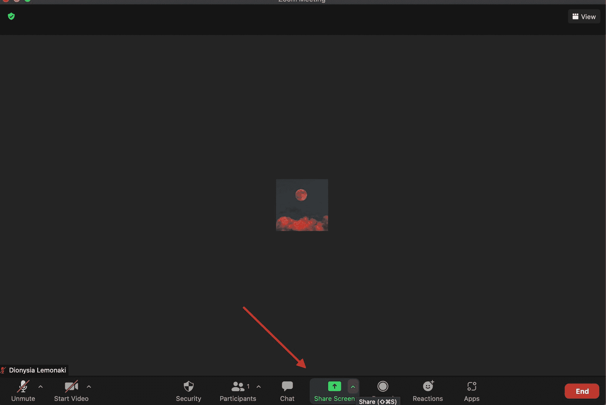
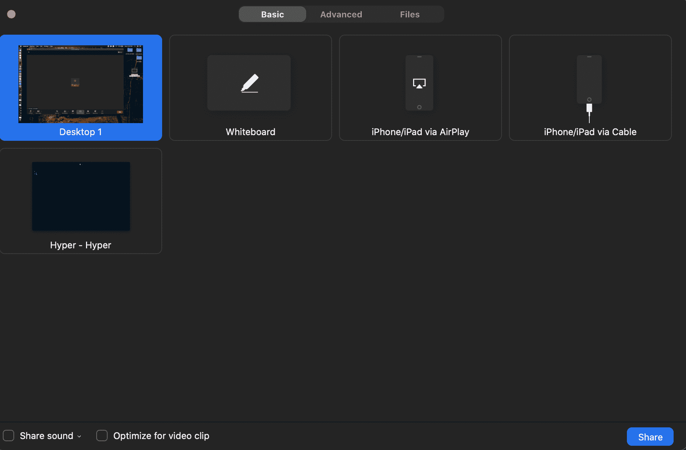
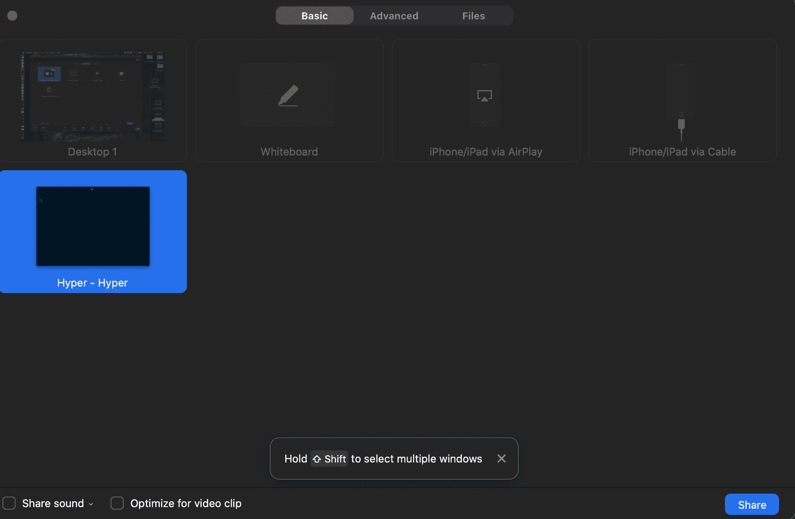
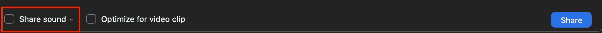
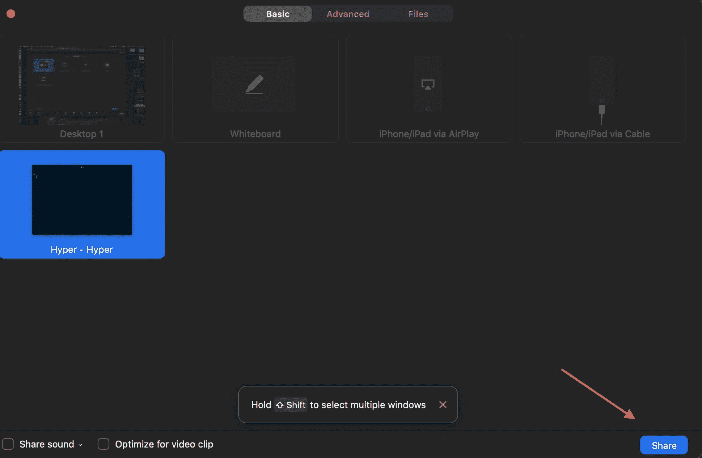
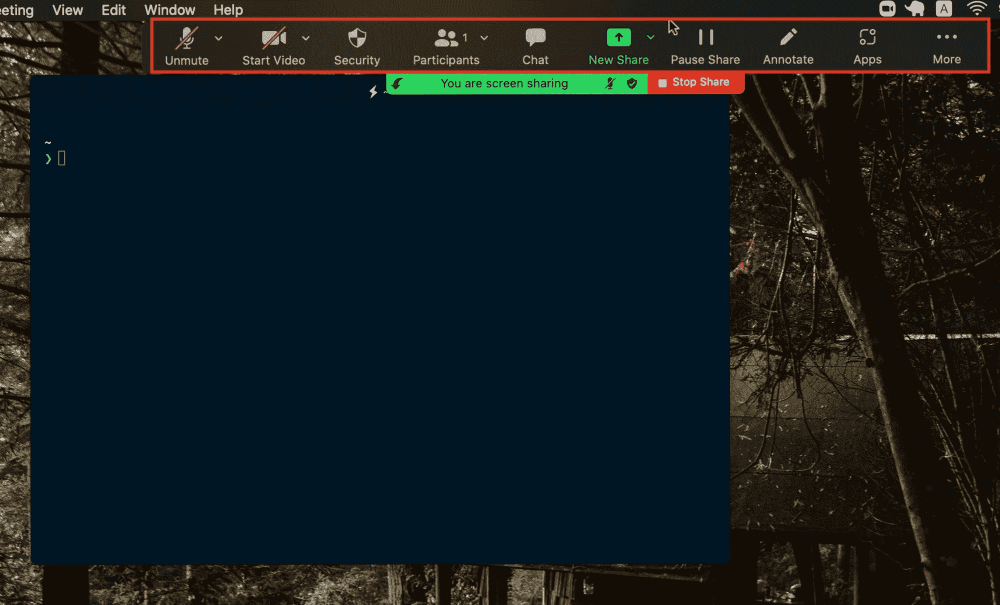
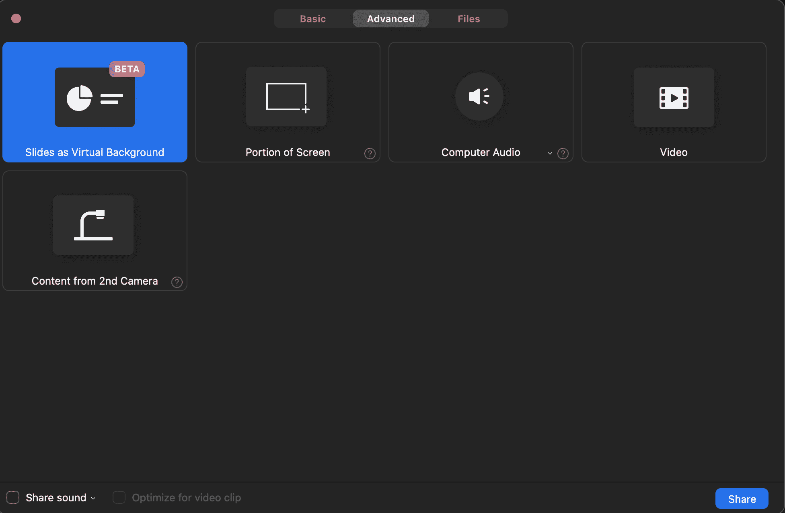
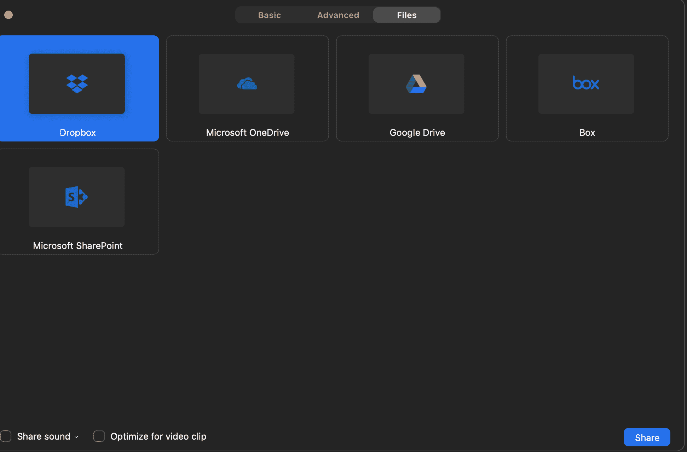
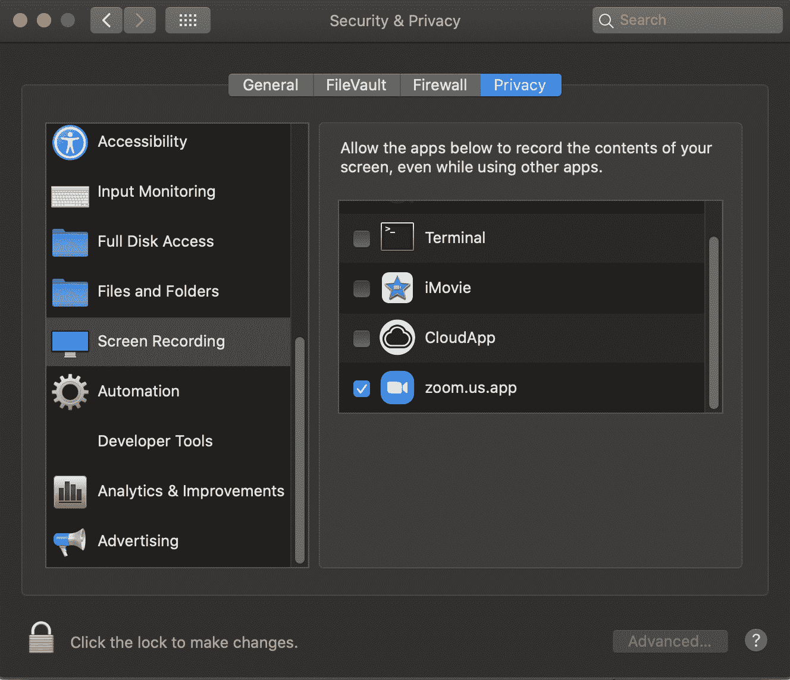

# Zoom 屏幕共享–如何在 Zoom 上共享我的屏幕[已解决]

> 原文：<https://www.freecodecamp.org/news/zoom-screen-sharing-how-to-share-my-screen-on-zoom-solved/>

随着越来越多的人远程工作，像 Zoom 这样的在线会议服务变得越来越流行和广泛使用。

如果你在参加一个缩放会议，你可能需要不时地向你的同事展示你的工作。

缩放提供了许多功能，使共享您的屏幕变得快速而简单。您可以共享整个桌面，只是您的屏幕、某些电脑程序和应用程序、特定文件或其他内容，等等。

在这篇文章中，我将向你展示当你使用台式电脑时，如何在视频通话中分享你的电脑屏幕。

## 如何在缩放时共享您的屏幕——基本步骤

在缩放会议期间，您可以随时共享您的屏幕。但是请记住，默认情况下，只有会议主持人才可以使用屏幕共享功能。

如果您不是会议主持人，主持人必须允许参与者通过缩放中的安全选项共享他们的屏幕:

现在，共享屏幕的第一步是点击会议窗口底部的绿色“共享屏幕”选项。

如果你看不到底部的不同选项栏，将鼠标悬停在窗口底部，它就会出现。

点击“共享屏幕”后，将弹出基本面板窗口:

在这里，您可以选择共享您的整个桌面屏幕、白板、iPhone/iPad 屏幕或您电脑上当前打开的任何其他特定应用程序或程序窗口。

通过点击该选项来选择您想要共享的内容，这将为您选择的窗口/应用程序提供蓝色背景。

如果您正在用声音共享某些内容，并且希望会议中的其他人听到它，请单击窗口底部的“共享声音”选项。

最后，点击右下角的“分享”:

您现在正在广播，其他人可以看到您选择共享的内容。

### 缩放中的屏幕共享选项

共享时，屏幕顶部会显示不同的会议控制选项。

在最基本的层面上，你会看到一个绿色的面板，让你知道你正在共享屏幕，它会显示你是否静音。

在右边，有一个红色的面板，你可以点击它来停止分享。

当您将鼠标悬停在这两个选项上时，您还会在屏幕顶部看到更多会议控件。

您可以将自己设为静音/取消静音，打开或关闭您的摄像头，查看会议的参与者，共享新内容，或者暂停您的共享。

## 如何在缩放时共享您的屏幕–高级选项

点击会议窗口底部的绿色“共享屏幕”后，您可以从弹出的窗口中选择“高级”选项卡。

在那里，您可以选择只共享屏幕的一部分，将幻灯片或 powerpoint 演示文稿作为虚拟背景显示，或者共享视频。

## 如何在缩放时共享您的屏幕-共享文件

您还可以通过选择“文件”选项卡来共享存储在 Dropbox、Google Cloud 或 Microsoft SharePoint 上的文件。

## 使用 MacOS 时如何在 zoom 上共享屏幕

尝试在 MacOS 上共享您的屏幕之前，请导航至“系统偏好设置”，然后导航至“安全性和隐私”。

在左侧的“隐私”选项卡中，选择“屏幕录制”。

在那里，确保选择了“zoom.us.app”。

感谢阅读！现在，您应该能够在缩放会议中共享您的屏幕。