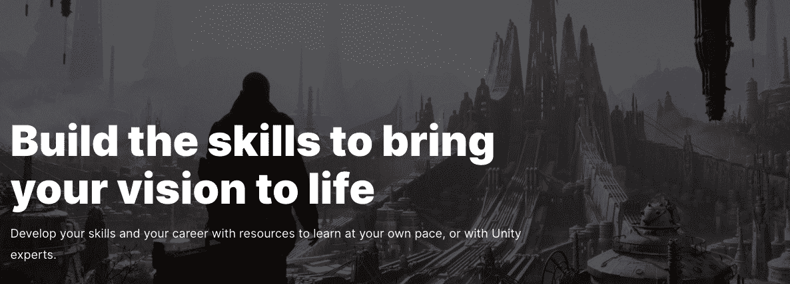
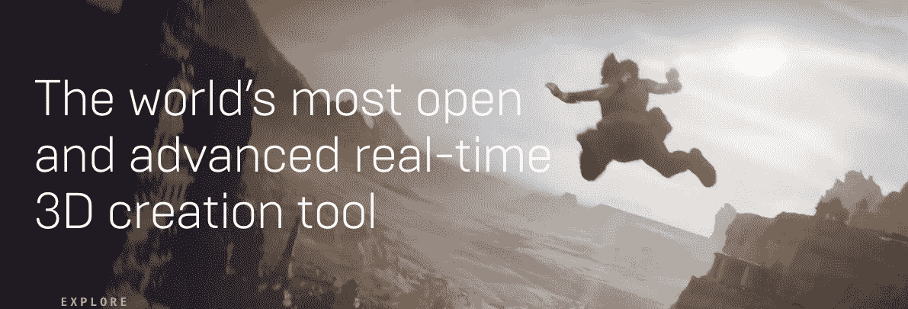
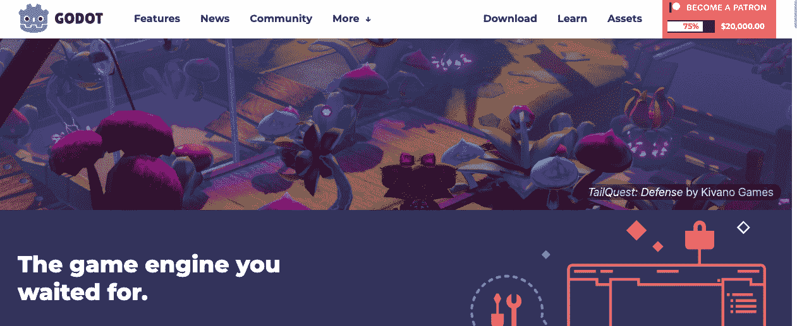
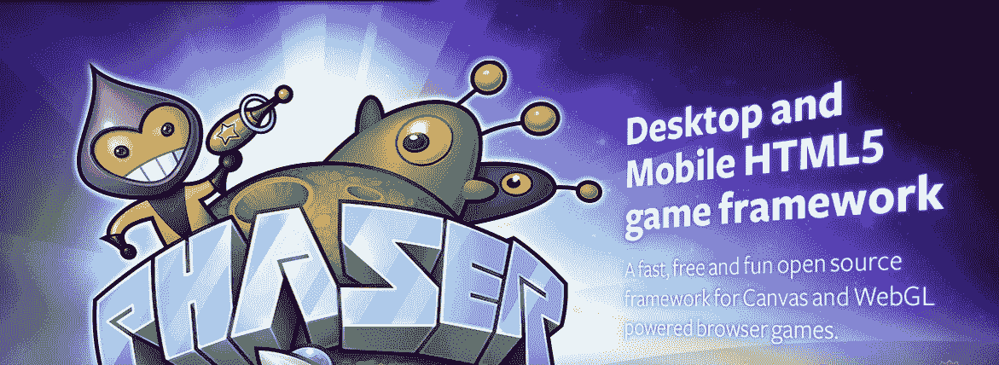
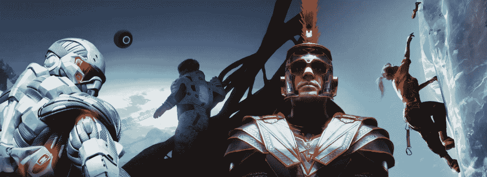
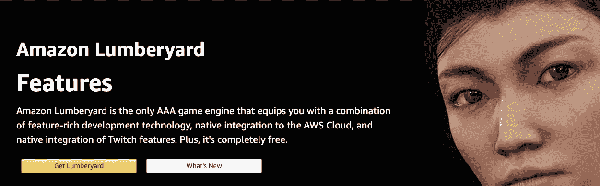
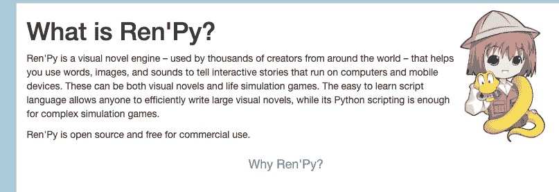
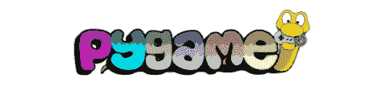
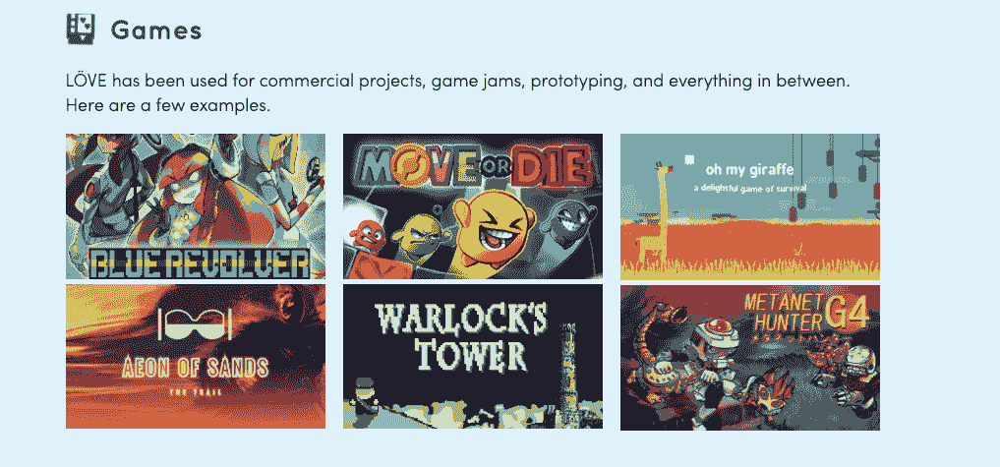
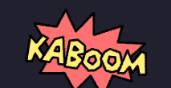

# 如何制作视频游戏——从头开始创建自己的游戏教程

> 原文：<https://www.freecodecamp.org/news/how-to-make-a-video-game-create-your-own-game-from-scratch-tutorial/>

游戏开发是软件行业中的一个热门领域。但是从零开始做游戏需要什么呢？

在这篇文章中，我将谈论不同的游戏引擎和工具，你可以用它们来构建你自己的游戏。我还将为您提供许多资源和教程来帮助您入门。

有许多工具和游戏引擎，但我将涵盖一些流行的。

1.  [统一](#unity)
2.  [虚幻引擎](#unreal)
3.  [戈多](#godot)
4.  相位器
5.  [GameMaker 工作室](#gamemaker-studio)
6.  [低温引擎](#cryengine)
7.  [亚马逊贮木场](#amazon-lumberyard)
8.  [Ren'Py 视觉小说引擎](#ren-py-visual-novel-engine)
9.  [Pygame](#pygame)
10.  [勒夫](#l-ve)
11.  [Kaboom.js](#kaboom-js)

## 一致

这是一个受游戏开发者欢迎的跨平台视频游戏引擎。Unity 支持许多平台，包括 iOS、Android、Windows、Mac、Linux 以及 PlayStation 和 Xbox 等游戏主机。

一些受欢迎的由 Unity 构建的游戏包括:Cuphead、永恒之柱、Ori 和盲林、逃生计划和炉石。

Unity 为您提供了创建自己的 2D 和 3D 游戏的机会。您可以使用 Unity 创建射击游戏、平台游戏、教育游戏等。

Unity 使用的编程语言是 C#。如果你是 C#新手，可以参加[这个免费的 CodeCamp YouTube 课程](https://www.youtube.com/watch?v=GhQdlIFylQ8)。

要开始使用 Unity，您可以在他们的网站上注册一个免费计划。他们为学生和个人提供免费计划。

Unity 还提供数小时的课程、项目教程、现场培训和认证。所有这些教育都可以在他们的网站上找到。

freeCodeCamp 还提供了很多资源来帮助你入门。

*   [面向所有初学者的游戏开发-免费 Unity 课程](https://www.freecodecamp.org/news/game-development-for-beginners-unity-course/)
*   [使用镜像学习 Unity 多人游戏基础知识](https://www.freecodecamp.org/news/learn-unity-multiplayer-basics-with-mirror/)
*   [通过制作数字桌面游戏学习 C#和 Unity](https://www.freecodecamp.org/news/learn-c-and-unity-by-making-digital-tabletop-games/)
*   [Unity 游戏引擎指南:如何开始使用最流行的游戏引擎](https://www.freecodecamp.org/news/unity-game-engine-guide-how-to-get-started-with-the-most-popular-game-engine-out-there/)

## 虚构的

虚幻是一个游戏引擎，你可以在那里建立 3D 游戏。虚幻支持许多平台，包括 iOS、Android、Windows、Mac、Linux 和 PlayStation、Xbox 和任天堂 Switch 等游戏主机。

用虚幻游戏引擎构建的流行游戏包括《堡垒之夜》、《耀西的精雕细琢的世界》、《地狱之刃:塞努阿的牺牲》、《街头霸王 5》和《星球大战绝地:堕落秩序》。

Unreal 使用的编程语言是 C++。如果你是 C++的新手，你可以参加这个免费的 YouTube 课程。

你可以在[他们的网站](https://www.unrealengine.com/en-US/download)上免费下载虚幻游戏引擎。他们还提供 100 小时的免费在线教程。

freeCodeCamp 还提供了很多资源来帮助你入门。

*   [通过编写 3 个游戏学习虚幻引擎 4——一个免费的 5 小时游戏开发视频课程](https://www.freecodecamp.org/news/learn-unreal-engine-by-creating-three-games/)
*   [虚幻引擎课程:创建一个 2D 蛇游戏](https://www.freecodecamp.org/news/unreal-engine-course-create-a-2d-snake-game/)
*   [如何用虚幻引擎构建 2.5D 平台游戏——3 小时免费课程](https://www.freecodecamp.org/news/create-a-2-5d-platformer-game-with-unreal-engine/)

## 戈多

Godot 是一个免费的开源游戏引擎，旨在创建 2D 和 3D 游戏。Godot 支持许多平台，包括 iOS、Android、Windows、Mac 和 Linux。

一些用戈多制作的流行游戏包括《卡罗尔·里德之谜》、《渴望梦想中的渴望指挥官》和《残酷小队》。

Godot 支持一些编程语言，但主要是 GDScript 和 VisualScript。要了解更多关于支持的语言，请访问[文档](https://docs.godotengine.org/en/stable/getting_started/step_by_step/scripting.html)。

要开始使用 Godot，你可以去他们的[下载页面](https://godotengine.org/download)。Godot 在他们的[学习区](https://docs.godotengine.org/en/stable/)提供了许多免费教程。

freeCodeCamp 也在 Godot 上提供了这个 YouTube 教程。

## 相位器

Phaser 是一个免费的开源平台，你可以在这里为移动和桌面构建 HTML 5 游戏。Phaser 支持 iOS，Android，以及像 Apache Cordova 和 phonegap。

Phaser 为您提供了创建自己的射击游戏、平台游戏、教育游戏等的机会。使用的主要语言是 JavaScript 和 TypeScript。

如果你是这两种语言的新手，你可以看看这些 freeCodeCamp 初学者教程。

*   [学习 JavaScript -初学者全教程](https://www.youtube.com/watch?v=PkZNo7MFNFg)
*   [学习 TypeScript -初学者的完整课程](https://www.youtube.com/watch?v=gp5H0Vw39yw)

要开始使用 Phaser，你可以去他们网站上的下载页面。Phaser 提供了几十个[免费教程](https://phaser.io/learn)来帮助你开始创建你的第一个游戏。

如果您有使用 Node、Express、Vue 或 Socket 的经验。IO，那你可以去看看这些教程。

*   [如何用 Vue、Phaser、Node、Express、Socket 搭建多人桌面游戏模拟器？IO](https://www.freecodecamp.org/news/how-to-build-a-multiplayer-tabletop-game-simulator/)
*   如何用 Phaser 3、Express 和 Socket 构建多人卡牌游戏？IO

## GameMaker 工作室

GameMaker Studio 是一个跨平台的视频游戏引擎，您可以在其中创建自己的 2D 游戏。GameMaker 支持许多平台，包括 iOS、Android、Windows、Mac 以及 PlayStation 和 Xbox 等游戏主机。

用 GameMaker Studio 制作的热门游戏包括 Undertale:压倒性正面，铲子骑士:宝藏:压倒性正面和武士刀零:压倒性正面。

GameMaker Studio 使用 GameMaker 语言，您可以通过访问[文档](https://manual.yoyogames.com/#t=GameMaker_Language%2FGameMaker_Language_Index.htm)了解更多信息。

他们还提供几十个教程让你开始制作游戏。Gamemaker 有一个免费选项，你可以[在他们的网站上创建一个账户](https://accounts.yoyogames.com/register)。

## CryEngine

CryEngine 允许您创建交互式 3D 游戏，并支持 Windows、Linux、PlayStation、Xbox 和 Oculus Rift 等平台。你可以用 CryEngine 创建射击游戏、平台游戏、教育游戏等等。

一些流行的游戏已经建立了 CryEngine 包括王国来了:解放，远哭，国家的衰变，和 Ryse:罗马之子。

用于 CryEngine 的编程语言包括 C#、C++和 Lua。如果您不熟悉这些语言，那么您可以查看这些资源。

*   [C#教程-初学者的完整教程](https://www.youtube.com/watch?v=GhQdlIFylQ8)
*   [C++初学者教程-全教程](https://www.youtube.com/watch?v=vLnPwxZdW4Y)
*   [Lua 入门指南](https://www.lua.org/pil/1.html)

CryEngine 有几十个[教程](https://www.cryengine.com/tutorials)来帮助你开始构建游戏，并且[可以在他们的网站上免费下载](https://www.cryengine.com/download)。

## 亚马逊贮木场

亚马逊 Lumberyard 是一个免费的跨平台视频游戏引擎，在这里你可以创建自己的 3D 游戏。亚马逊 Lumberyard 支持包括 iOS、Android、Windows 和 PlayStation、Xbox 等游戏主机在内的众多平台。

一些使用亚马逊伐木场的游戏包括新世界和大旅游游戏。

亚马逊木材场使用的编程语言包括 C++和 Lua。如果您不熟悉这些语言，那么您可以查看这些资源。

*   [C++初学者教程-全教程](https://www.youtube.com/watch?v=vLnPwxZdW4Y)
*   [Lua 入门指南](https://www.lua.org/pil/1.html)

亚马逊伐木场可以免费下载《T1》，还有几十个《T2》教程《T3》可以让你开始制作自己的游戏。

## Ren'Py 视觉小说引擎

Ren'Py 视觉小说引擎是一个免费的引擎，在这里你可以创建交互式的视觉小说和游戏。Ren'Py 支持许多平台，包括 iOS、Android、Windows、Mac 和 Linux。

用 Ren'Py 创作的一些流行游戏和小说包括，Doki Doki 文学俱乐部！，零死亡，还有 UFO 沼泽奥德赛。

Ren'Py 使用的编程语言是 Python。如果你是 Python 新手，你可以参加这个免费的 YouTube 课程。

你可以在他们的网站上免费下载 Ren'Py。他们还提供了一个[快速入门](https://www.renpy.org/doc/html/quickstart.html)指南来创建你的第一个游戏或小说。

freeCodeCamp 也有一个关于如何使用 Ren'Py 制作一个视觉小说游戏的教程。

## Pygame

Pygame 附带了模块、声音和图形，允许您使用 Python 创建视频游戏。Pygame 支持的平台包括 Linux、Mac 和 Windows。

用 Pygame 构建的流行游戏包括 Frets on Fire 和危险的高中女生陷入困境！

Pygame 使用的编程语言是 Python。如果你是 Python 新手，你可以参加这个免费的 YouTube 课程。

要开始使用 Pygame，你可以浏览他们网站上的[入门指南](https://www.pygame.org/wiki/GettingStarted)。freeCodeCamp 也有一个关于 Pygame 入门的 [YouTube 课程](https://www.youtube.com/watch?v=FfWpgLFMI7w)。

## 勒夫

love 是一个免费的游戏引擎，你可以在这里创建 2D 游戏。love 支持许多平台，包括 iOS、Android、Windows、Mac 和 Linux。

用 Move 构建的一些流行游戏包括蓝色左轮手枪、移动或死亡和术士塔。

love 使用的编程语言是 Lua。你可以在网站上的[入门指南](https://www.lua.org/pil/1.html)中了解 Lua。

## Kaboom.js

Kaboom.js 是一个允许你使用 JavaScript 构建电脑游戏的库。如果你对 JavaScript 不熟悉，那么你可以参加这个 [freeCodeCamp YouTube 课程](https://www.youtube.com/watch?v=PkZNo7MFNFg)。

要设置，你可以使用他们的 CDN，NPM 或官方 Replit 模板。所有入门信息都可以在他们的[网站](https://kaboomjs.com/doc/setup)上找到。

Kaboom.js 还提供了构建你的第一个游戏的教程。你可以使用 Kaboom.js 重新创建经典游戏，如马里奥和太空入侵者。

你也可以通过[这个免费代码营 YouTube 课程，](https://www.youtube.com/watch?v=4OaHB0JbJDI)开始构建经典游戏。

我希望你喜欢我列出的流行游戏引擎和工具，开始学习如何构建自己的游戏。

我鼓励你继续探索，找到更多这篇文章中没有提到的游戏选项，这样你就可以继续学习。

祝你游戏开发之旅好运。