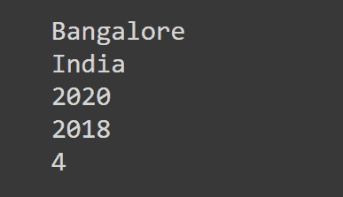

# Python 命名元组示例–如何创建和使用命名元组

> 原文：<https://www.freecodecamp.org/news/python-namedtuple-examples-how-to-create-and-work-with-namedtuples/>

在 Python 中，您可能会使用一个元组来初始化一个不应该在程序的其他地方修改的序列。这是因为元组是*不可变的*。

但是，使用元组可能会降低代码的可读性，因为您无法描述元组中的每一项代表什么。这就是命名元组可以派上用场的地方。

NamedTuple 提供了元组的不变性，同时也使您的代码易于理解和使用。

在本教程中，您将学习如何有效地创建和使用命名元组。

## Python 元组——快速回顾

在进入命名元组之前，让我们快速回顾一下 Python 元组。

元组是 Python 中强大的内置数据结构。它们类似于 Python 列表，因为它们可以保存不同类型的项目，并且可以对它们进行切片。

> 然而，元组与列表的不同之处在于它们是不可变的。这意味着您*不能*修改现有的元组，试图这样做将会抛出一个错误。

假设您今天创建了以下元组。元组`house`包含描述房子的五个项目，即城市、国家、建造年份、面积。制成，以及它拥有的房间数量。这显示在下面的代码片段中:

```
house = ("Bangalore","India",2020,2018,4)
```

*   这个`house`位于印度的班加罗尔市。
*   它建于`2020`年。
*   它有`4`个房间，总面积为`2018`平方。制成

假设您的朋友阅读了这一行代码，或者您一周后回来再次阅读您的代码。假设您没有添加任何关于元组中的值代表什么的注释，那么肯定存在可读性问题。

例如，你可能不得不最终猜测它是否是一所面积为 2018 平方英尺的房子。制成建造于 2020 年，或者是一栋 2020 平方英尺的房子。制成建于 2018 年。🤔

你可能会建议使用字典——你可以指定*不同的值代表什么*作为字典的*键*，而*实际值*作为字典的*值*。

进入下一节，快速回顾一下 Python 字典。

## Python 词典——快速回顾

出于提高代码可读性的动机，让我们考虑改用 Python 字典。

字典是内置的数据结构，将值存储在*键-值对*中。您可以进入字典，并使用键来访问它的值。

因此，您可以将前面的元组重写为字典，如下所示:

```
house = {"city":"Bangalore","country":"India","year":2020,"area":2018,"num_rooms":4}
```

在上面的代码片段中:

*   `"city"`、`"country"`、`"year"`、`"area"`、`"num_rooms"`为关键。
*   并且来自元组、`"Bangalore"`、`"India"`、`2020`、`2018`和`4`的值被用作与键相对应的值。
*   您可以使用键来访问这些值:`house["city"]`获得`"Bangalore"`，`house["area"]`获得`2018`，以此类推。

如您所见，使用字典提高了代码的可读性。但是，与元组不同，您总是可以修改字典中的值。

> 您需要做的就是将相应的键设置为不同的值。

在上面的例子中，你可以使用`house["city"] = "Delhi"`来改变你的房子所在的城市。显然，这是不允许的，因为您不希望在程序的其他地方修改这些值。

如果您需要存储许多这样的房子的描述，您将不得不创建与房子数量一样多的字典，每次都要重复关键字的名称。这也让你的代码重复，不那么有趣！

> 使用 Python 的 NamedTuples，您可以同时拥有元组的不变性和字典的可读性。

进入下一部分，了解`NamedTuple` s。

## Python 命名元组语法

要使用`NamedTuple`，您需要从 Python 的内置集合模块中导入它，如下所示:

```
from collections import namedtuple
```

创建命名元组的一般语法如下:

```
namedtuple(<Name>,<[Names of Values]>)
```

*   `<Name>`是一个占位符，代表您希望命名的夫妇，以及
*   `<[Names of Values]>`是包含不同值或属性的*名称*的列表的占位符。

既然您已经熟悉了创建命名元组的语法，那么让我们以我们的`house`示例为基础，尝试创建一个命名元组。

## Python 命名的双重示例

前面说过，第一步是导入`namedtuple`。

```
from collections import namedtuple 
```

现在，您可以使用上一节中讨论的语法创建命名元组:

```
House = namedtuple("House",["city","country","year","area","num_rooms"])
```

在这个例子中，

*   您选择调用命名的元组`House`，并且
*   在一个列表中提到值的名称，`"city"`、`"country"`、`"year"`、`"area"`和`"num_rooms"`。

✅，你创造了你的第一对名字。

现在，您可以使用`House`创建一个具有所需规格的房子`house_1`，如下所示:

```
house_1 = House("Bangalore","India",2020,2018,4)
```

您只需要传入您的`<[Names of Values]>`中的名称或属性应该采用的实际值。

要创建另一个房子，比如说`house_2`，你需要做的就是使用它的值创建一个新的`House`。

```
house_2 = House("Chennai","India",2018,2050,3)
```

> 请注意如何使用`House`作为模板来创建尽可能多的房子，而不必在每次创建新房子时都键入属性的名称。

## 如何使用`dot`符号访问命名元组的值

一旦创建了命名元组对象`house_1`和`house_2`，就可以使用`dot`符号来访问它们的值。语法如下所示:

```
<namedtuple_object>.<value_name>
```

*   这里，`<namedtuple_object>`表示创建的命名元组对象。在这个例子中，`house_1`和`house_2`。
*   `<value_name>`表示创建命名元组时使用的任何有效名称。在本例中，`"city"`、`"country"`、`"year"`、`"area"`和`"num_rooms"`是`<value_name>`的有效选择。

下面的代码片段说明了这一点:

```
print(house_1.city)
print(house_1.country)
print(house_1.year)
print(house_1.area)
print(house_1.num_rooms)
```



类似地，您可以使用`house_2.city`、`house_2.country`等等来访问对应于命名元组`house_2`的值。

## 📋你自己试试！命名的双重示例

在本节中，您将创建一个`ProblemSet` NamedTuple。

请随意在您选择的任何 IDE 中尝试这个示例。

`ProblemSet` NamedTuple 应采用以下值:

*   `num_questions`:表示特定问题集中问题数量的整数，
*   `difficulty`:表示问题集的难度的字符串
*   `topic`:习题集涵盖的题目，比如说`"Arrays"`、`"Strings"`、`"Graphs"`等等。

这个过程与我们之前创建`House` NamedTuple 的例子非常相似。

1️⃣从`collections`模块导入`namedtuple`。

```
from collections import namedtuple
```

2️⃣创建了一个命名元组，并将其命名为`ProblemSet`。

```
ProblemSet = namedtuple("ProblemSet",["num_questions","difficulty","topic"])
```

3️⃣现在你已经创建了`ProblemSet`，你可以使用`ProblemSet`作为模板创建任意数量的问题集。

*   在这里，`problem_set1`包含了关于`Strings`的 5 个简单问题。

```
problem_set1 = ProblemSet(5,"Easy","Strings")
```

*   而`problem_set2`包含了`Bit Manipulation`上的 3 道难题。

```
problem_set2 = ProblemSet(3,"Hard","Bit Manipulation")
```

4️⃣和前面的例子一样，你可以使用`dot`符号来访问上面创建的两个问题集的值。

```
print(problem_set1.topic)

# Output
Strings
```

```
print(problem_set2.difficulty)

# Output
Hard
```

我希望你能够完成这个练习。🎉

## 结论

在本教程中，您已经学习了:

*   命名元组如何帮助您结合元组和字典的优点，
*   如何创建命名元组，以及
*   如何使用`dot`符号访问命名元组的值？

如果您熟悉 Python 中的 OOP，您可能会发现这与 Python 类的工作方式类似。一个带有属性的类可以作为一个模板，从这个模板中你可以创建尽可能多的对象或实例——每个对象或实例都有自己的属性值。

然而，仅仅为了提高代码的可读性而创建一个类并定义所需的属性通常是多余的，相反，创建 NamedTuples 要容易得多。

下节课再见。在那之前，编码快乐！